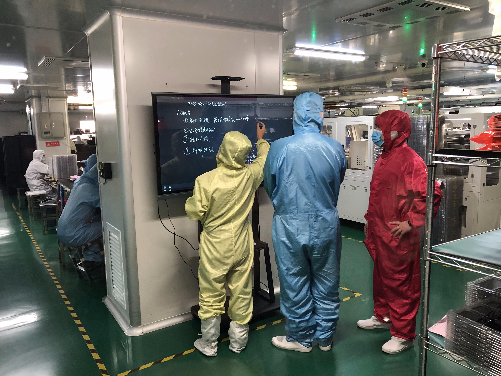

# Research at Scale 2024 - My Adventures in Shenzhen
**By Andres Rico**

Cities are a good place to look towards to understand some of our world's most pressing challenges.

My research is focused on understanding the ways in which we can build sensor systems that can allow us to understand crucial socio-environmental aspects of cities. Industry has greatly advanced the development of sensor systems for strcutured environments such as factories. We are able to count pieces, monitor quality, check the health of machines so as to produce more product, with more efficiency and at higher quality.

BUT, we cannot look at sensing for cities in the same way that we have looked at it for industry. Cities are complex, non structured entities that require much more flexible sensor implementations.

A key challenge in building sensor systems for cities is the ability to scale. We need to be able to build systems that can be deployed at scale, and that can be maintained at scale. This was my main motivator in spending a month in Shenzhen, the electronics capital of the world. During the month, I had the opportunity to visit many of the factories in the Shenzhen ecosystem, the biggest electornics market in the world, Seeed's manufacturing facilities, Seeed's Makerspace, among many other places. The following is an semi-technical anechdotal of what transpired during my time in Shenzhen.

## Scalable HCI Symposium

The scalable HCI symposium allowed us to get to know some of the great projects that are being done at SUSTech School of Design as well as to engage with Seeed's latest producs and Shenzhen's technology ecosystem.

You can find more information and a short video about the Symposium [here](https://scalablehci.com/). We had a nice poster session, great speeakers, factory visits, and a bucnh of interesting conversations.

### Factory Visits
- LCD Screen Manufacturing
- PCB Manufacturing
- Flexible PCB Manufacturing
- Mold Manufacturing
- Injection Molding

Visitng these shops allowed us to see the details of how electronics and different components are manufactured at scale. I was also able to establish good relationships with potential future collaborators and suppliers.

### Electronics Market

We visited the biggest electronics Market in the world at Huaqiangbei. This is a great place to see the magic of Shenzhen at work. It is possible to see almost every component imaginable to an electronics engineer. This market is a statement of the rapid prototype capabilities of Shenzhen. It is very easy for students, universities, and companies to get their hands on the latest components and to prototype their ideas.

## Art, art and more art!
One of the things that surpised me the most about Shenzhen was its vibrant art scene. You can find everything from traditional painters to world class digital artists. The mixture between the traditional and technological gives the pieces a very unique taste.

As an engineer, I believe that the artist's way of processing and communicating the complexities of our society can drastically inform the way that we design technology and that, in turn, technology can be an oustanding medium for expression and also for societal change.

The more time I spend engaging with brilliant artists and technologists, the more I see how the two worlds should have never been discretized. On that note, I see that Shenzhen as a city, is a place that does not care about those boundries and just seems to nurture and foster them as undiscernible creative expression. This, to me, is pure gold!

And with this, I sign out. Thanks so much for reading if you made it all the way down here. Hope this is useful for you. Make sure to contact me if you have any questions or if you want to collaborate on any of the projects that I've mentioned.
Cheers!

**Andres Rico - aricom@mit.edu**
