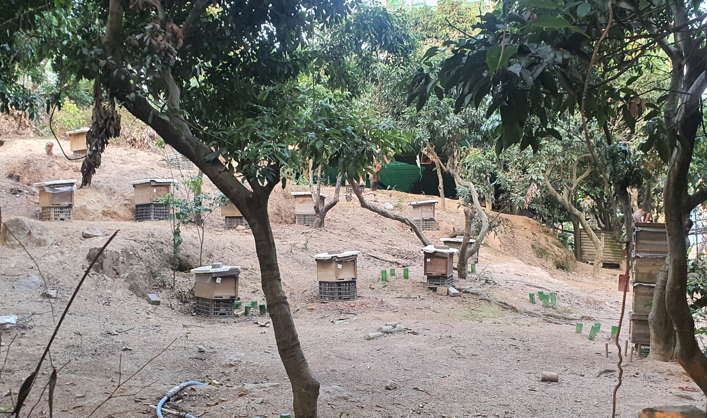

From Factories To Art Spaces!
=============================
***Scaling Open Hardware Designs In Shenzhen, And Discovering Its Exploding Art Scene***

_By [Cedric Honnet](https://honnet.eu) - Feb 2024_

---

     
_A show with 1000 drones celebrating the new dragon year, and showing a phoenix, which is a great symbol for the rebirth of Shenzhen._

---

**TABLE OF CONTENT**

**[INTRODUCTION: 10 YEARS OF SHENZHEN EXPLORATIONS](#introduction-10-years-of-shenzhen-explorations)**

&nbsp; 1) [My Context](#1-my-context)

&nbsp; 2) [Manufacturing In China: Advantages, Risks, and Solutions](#2-manufacturing-in-china-advantages-risks-and-solutions)

**[A) TECHNICAL EXPLORATION: SCALING RESEARCH](#a-technical-exploration-scaling-research)**

&nbsp; 1) [Manufacturing My Work In Shenzhen](#1-manufacturing-my-work-in-shenzhen)

&nbsp; 2) [Explorations: Factory visits & Electronic Markets](#2-explorations-factory-visits--electronic-markets)

**[B) OUR OWN SYMPOSIUM TO AMPLIFY IMPACT SCALABILITY](#b-our-own-symposium-to-amplify-impact-scalability)**

&nbsp; 1) [Ideas Exchanges](#1-ideas-exchanges)

&nbsp; 2) [Hands On Time](#2-hands-on-time)

**[C) CULTURAL EXPEDITIONS](#c-cultural-expeditions)**

&nbsp; 1) [Outdoors: from Food Trips to Mountain Trips](#1-outdoors-from-food-trips-to-mountain-trips)

&nbsp; 2) [The Art Scene Explosion](#2-the-art-scene-explosion)

---

# Introduction: 10 Years Of Shenzhen Explorations

## 1) My Context

Before my PhD, I was an embedded systems engineer for a decade, designing various interactive systems and wearables.
I’ve been going to Shenzhen (SZ) at least once a year for 10 years to make these systems affordable, mostly with friends from [Noisebridge](https://www.noisebridge.net/wiki/HTTC2019) (San Francisco Hackerspace), thanks to Mitch Altman who used to lead yearly trips. We would visit hackerspaces, fablabs, universities, factories, and attend conferences. One of the specificities of Shenzhen is its electronic market (HuaQiangBei or HQB), and the Noisebridge trips were an amazing introduction for all of us, but the now famous youtuber [Scottie Allen](https://www.youtube.com/@StrangeParts) took it to the next step: He showed the world the power of this magic ecosystem by documenting how he made his own iPhone from “black market” parts (among other adventures).
Meanwhile, MIT was also sending students every year to SZ for 10 years. These trips overlapped a few times, with people such as [Bunnie Huang](https://www.media.mit.edu/events/mltalks-bunnie-huang/) who started the MIT version, or [Nadya Peek](https://www.hcde.washington.edu/peek), who joined both tours (see picture below).

  
_A visit to Seeed’s factory in 2014, with its CEO [Eric Pan](https://www.chaihuo.org/maker/maker?id=58597) (2nd from left), Noisebridge co-founder Mitch Altman (1st from left), Nadya Peek visiting from MIT (1st from right), and [myself](https://honnet.eu) with the hat._

## 2) Manufacturing In China: Advantages, Risks, and Solutions

**Affordability?**

Of course, China is famous for its mass manufacturing power enabling costs necessary to scale products.
Some of the MIT-trip-to-Shenzhen participants ended up building open hardware companies, such as [Chibitronics](https://chibitronics.com/) by [Jie Qi](https://technolojie.com/) (being open is practical here, see discussion below).
Understanding the supply chain and manufacturing ecosystems is necessary for hardware companies, but SZ’s affordability super power can also benefit independents, hackers, and academics!

**Cloning, and “Implicit Open Hardware”.**

Some could see China as a risky option for manufacturing, and even if the cloning problem is not as common as one might think, its flexible mentality enables surprising side effects.
During one of my Seeed factory visits, I met some of their engineers who were analyzing the clone of a product that they manufacture ([bitcraze](https://bitcraze.io)). They discovered interesting cost improvement techniques, which inspired the design team for their next revisions:

  
_Crazyflie (left) as an "implicit open hardware" example (clone on the right)_

As a good old tech hippie, the “Open Hardware” concept is almost a tautology to me:
- It’s never useful to close-source hardware as it can almost always be reverse engineered. The cheapest and most reliable way to be sure that a design can’t be stolen is to make it free/open.
- The main motivation for most hardware nerds is not the money potential, it’s the design beauty, so sharing it is a pleasure.

**The Open Hardware Solution, And Amplifying Scalability.**

SZ changed a lot in the last 10 years, mostly on good aspects, but COVID was brutal.
This write-up summarizes a few recent SZ observations, starting with my work on making my research affordable with scalable manufacturing, and how I try to amplify my impact by sharing this scalability exploration through a research residency and a new symposium.
But China is home to one of the richest cultural heritages of humanity, from its culinary traditions to its art scene, and our explorations were not devoid of surprises.
This document also unveils some cultural discoveries that challenge most preconceptions about China.

---

# A) Technical Exploration: Scaling Research

## 1) Manufacturing My Work In Shenzhen
Over the last decade I designed a few open hardware devices to be made in SZ, such as a wireless motion sensor ([Twiz](https://hackaday.io/project/7121-twiz)) or a miniature 3d position tracker ([HiveTracker](https://hackaday.io/project/160182-hivetracker)), but I also explored eTextile sensor fabrication ([PolySense](https://hackaday.io/project/168380-polysense)), with less success at the time.

### i) High Density Flex PCBs

Recently, I’ve been merging these eTextiles and wearable explorations by miniaturizing electronic circuits so that they can fit inside "fibers".
This involves using the smallest ICs available in the market and precision challenges that PCB manufacturers don’t like too much. This particular design uses the thinnest ARM MCU (1.4mm), which has 12 pins underneath, with 150um pads and 150um spaces, so the (im)precision guaranteed by the manufacturers start to be visible at this scale:

     
_Zoom on a panel: the STM32 (MCU) is 1.4mm, and its pads measure 0.15mm_

Problems always happen in manufacturing, so being in the factory has a huge advantage: we can analyze them with them, fix the problems, and discuss options to avoid them in the future.
In the case below, an MCU wasn’t detected by the probe, and I found a short circuit with a multimeter. To understand where the short could be, I injected 3V with a low (increasing) current to see where the heat stopped using a thermal camera. High density electronics increase problems, and I suspected bad soldering under the MCU, which was fixed by one of the factory magicians using her hot air gun:

        
_Using a thermal camera to detect a short circuit, analyzing its potential source and observing it with a microscope_

The main PCBs also have 1.1mm accelerometers and 0.9mm magnetometers, so similar problems happened. They also manufactured a flex PCB with LEDs only, and after a bit of time, most of the problems were solved:

     
_Factory tests of my flex PCBs with motion sensors (left) and LED arrays (right)_

### ii) 24 Hour PCB Fab!?

My design originally used “software defined capacitive sensing” but the trace to the electrode was too long, which introduced too much noise sensitivity. Luckily, a cheap 1mm capacitive sensing IC was available in the market. SZ being home of many PCB manufacturers, I got one made with a 24 hours service. This PCB actually arrived on a Sunday at noon!

        
_The 1mm capacitive sensing IC, and my nasty solder paste job…_

This test PCB uses a capacitor to tune the sensitivity, which allowed me to test the best option for my wearable application:

  
_...and it works! (capacitive sensing chip allowing on body touch detection)_

Flex PCBs are more expensive than rigid ones, so if we need a lot for a wearable, it’s almost mandatory to get them manufactured in China (about 10x cheaper than in the Western world).
With this test PCB, fast iteration is also an advantage, and the market can also be leveraged for even more manufacturing hacks:

## 2) Explorations: Factory Visits & Electronic Markets

### i) Laser Factories Visits

I visit dozens of factories everytime I’m in Shenzhen so I will only discuss two here, but the rest of the group did a beautiful job at documenting their visits:
[seeed-studio.github.io/MakerCamp/2024-01-MIT](https://seeed-studio.github.io/MakerCamp/2024-01-MIT)

One of my latest challenges was to find _affordable_ laser cutters that can handle metal to engrave custom PCBs. During the COVID lockdown I started doing it using fiber lasers ([publication](https://www.raframakers.net/wiki/uploads/Main/Research/diyPCbs.pdf) / [hackaday](https://hackaday.com/2021/01/11/laser-blasts-out-high-quality-pcbs/)).
At MIT, I have been using a Trotec [Speedy 100 Flexx](https://cba.mit.edu/tools/#Trotec_Speedy_100_Flex_Laser_Cutter) (20W green) and a [JPT MOPA M7](https://lasersonly.com/products/flmzjpt60m7) (60W infrared) which is almost an order of magnitude cheaper. The blue laser options are getting even cheaper, which motivated trendy brands such as Creality to diversify from their 3d printing focus.
During the [China High Tech Fair](https://www.chtf.com/english/) (a “Chinese CES” but much cooler), I got to test another model by [Algo Laser](https://algolaser.com/) and went to visit them for more tests with a Noisebridge friend (AKA Parkview). They connected us with their laser module manufacturer ([XingHang](https://www.xinghanlaser.com)), and we also went to visit them:

  
_One room in one of the 14 floors of the XingHang laser factory_

They manufacture several kinds of lasers, but I will focus on 2 here:

(a) Fiber lasers:

        
_Left: fiber laser by XingHang, a comparison of their result (middle-left) vs the JPT MOPA (middle-right), and a video of the PCB being lased by the JPT MOPA (right)_

Fiber lasers usually have an external power source as big as a desk computer (not a laptop), but this one integrates everything in one block!
Their specialty is that despite a (tiny) 10W power supply, they generate 150KW pulses that can easily “evaporate” copper (even though [IR is suboptimal](https://www.mdpi.com/metals/metals-11-01831/article_deploy/html/images/metals-11-01831-g001.png) vs green).

(b) Blue (diode) lasers:

These lasers are less powerful in general, so the manufacturers combined multiple together. In the following example, 4 lasers of 6W are used to make a 22W module (the 2W loss comes from the combining mirror system). These lasers are not pulsed (continuous), and they tend to "cook" the copper layer when engraving PCBs, which inflates them, and makes it less accurate. The laser dot is also not as small (around 150 um), so it can't be used for the accurate PCBs that I need for my work (50um dot is really the max).

        
_Left: illustration of the combining system. Middle: lasing copper. Right: result analysis._

The manufacturer gave us a laser module sample, but it's a metal box so we had to open it. Taking an X-ray before destroying it seemed useful as it wasn't clear how to open it, or what to expect. Luckily, we found one in another CES equivalent ([Greater Bay Area Industry Expo](https://www.dmpshow.com/en/)), and did some preliminary measures:

        
_Left: the [manufacturer](http://www.elt-group.cn/) letting us do our test. Middle: scanning the module. Right: 3d reconstruction._

Once we understood the content a bit better, the deconstruction offered a pleasant surprise:

        
_Left: deconstruction in progress. Middle: analysis challenge by Bunnie. Right: it still works!_

Bunnie stopped by the lab randomly and found all sorts of interesting tricks that he documented on his website: [bunniestudios.com/blog/?p=6907](https://www.bunniestudios.com/blog/?p=6907) \
He also challenged his network to analyze it, and the comments are also very insightful: [bunniestudios.com/blog/?p=6896](https://www.bunniestudios.com/blog/?p=6896)

### ii) The Electronic Market, AKA HuaQiangBei (HQB)

In the last decade, I have literally accumulated thousands of pictures from my hundreds of visits to HQB, and every single time, there are new things to discover. This place deserves UNESCO cultural heritage protection…

Most locals use Taobao now (an Aliexpress equivalent), but HQB is faster, and it allows us to discover our “unknown unknown”: for example, a new type of actuator (such as a [micro piezo pump](http://vito-fluid.com/en/Product/info/1)), some random [Shanzhai](https://www.bunniestudios.com/blog/?tag=shanzhai) gadgets, or recycled parts that still works perfectly for 1% of the cost!

     
_Left: a functional miniature phone (with 2 SIM cards!) for about 6 USD - Right: recycled phone cameras for about 1 USD_

⚠️ MANUFACTURING HACK ⚠️
There are hundreds of shops with engineering experts who are there to fix or improve phones and laptops. They can change your GPU or your memory for example, and when they are not too busy you can ask them to assemble boards for you:

     
_One of the shops that fixes phones and laptops_

⚠️ MANUFACTURING HACK TO EXPERIMENT ⚠️
As mentioned above, laser etching a PCB is still faster than the 24h service, but it’s not always possible to find these fiber lasers. Luckily, HQB has many shops that use them to engrave serial numbers, brands, etc. One of the hacks that could be good to test, would be to teach them to engrave PCBs (see left photo below), and offer to contract them for fast PCB prototyping.

     
_Left: a shop that offers laser engraving services - Right: a shop that does PCB reverse engineering._

In the market, we can also find all sorts of developpement boards without documentation. They are usually made to test a component, but they rarely come with schematics or layout docs.
Another hack in my TODO list is to use the service of companies that do PCB reverse engineering, to give them these obscure dev boards and ask them to design boards for us.

💡 To summarize, in HQB we can reverse a PCB, use it for a custom design, find parts in the market, laser engrave PCBs in minutes (or get them made in 24 hours), and get an expert to solder them in a few hours. This would take a couple of days total, instead of weeks normally!

---

# B) Our Own Symposium to Amplify Impact Scalability

_"Give people some fish and you feed them for a day; teach them to fish and you feed them for a lifetime"_

  
_About hundred people joined our [Scalable HCI Symposium](http://ScalableHCI.com)._

Even if my research can be made affordable and replicable, its impact is limited within the vacuum of academic publications. So, I’ve been working hard to make it scalable using design techniques for manufacturability. But I’ve realized that my research impact can be amplified even more by teaching others how to make their work scalable. Restarting the MIT [research residency](https://www.media.mit.edu/posts/research-at-scale-2024/) with the [Maker Camp](https://www.seeedstudio.com/blog/2024/01/15/introducing-maker-camp-in-shenzhen/) was a perfect option, Shenzhen is basically the manufacturing epicenter of the world.
    With [Seungwoo Je](https://www.seungwooje.com/) and a real dream team, we worked on multiplying this research residency impact even more, and we created the Scalable HCI Symposium: [ScalableHCI.com](https://scalablehci.com).
Over a hundred participants from MIT, Harvard, Berkeley, Cornell, Parsons, CMU, NYU, KAIST and local institutions joined us. After the electronic markets and factories visits, the symposium included a workshop and hackathon focused on “Open Tech for Good,” hoping to empower global innovation by democratizing scalable manufacturing, and bridging continents.

## 1) Ideas Exchanges

### i) Posters & Demos

All the participants presented their work during the poster & demo session:

     
_Jack Forman (MIT) demonstrating his muscle fibers, and Ishraki Kazi (MIT) presenting his art._

     
_Andres Rico (MIT) presenting his work to Peter from Seeed, and Kelly Heaton (NYU) showing her PCB art._

     
_Late demo of the [Combine Reality](https://combinereality.com/) AR headset by Noah Zerkin (+ Seeed's Eric Pan trying it!)_

### ii) Keynotes and Residents Presentations

**Industry presentation by Richard Zhang from Seeed**

The Chief Strategy Officer of Seeed Studio introduced his analysis of the hardware x AI ecosystem, and concluded by officially launching the Seeed MakerCamp:
[seeedstudio.com/blog/2024/01/15/introducing-maker-camp-in-shenzhen](https://www.seeedstudio.com/blog/2024/01/15/introducing-maker-camp-in-shenzhen/)

**Academic Keynote by Eric Paulos from UC Berkeley**

Best known for his early work on internet robotic teleoperation and is considered a founder of the field of Urban Computing, Eric shared various research strategies, and other provocative ideas at the intersection of art and science:

   

**Residents presentations**

Most of the symposium happened in SUSTech, but the research residency presentations were at the Chaihuo Makerspace. We all came with different background, but these 3 scales can summarize our work:
  - Micro scale: digital fab + machining
  - Human scale: tangibles + wearables
  - City scale: sensor networks

The presentations were recorded, and can be watched here:
[mp.weixin.qq.com/s/LhUjs5r-LL84ENuAAk5tnw](https://mp.weixin.qq.com/s/LhUjs5r-LL84ENuAAk5tnw)

## 2) Hands On Time

**Factories and HQB again!?**

Of course, we went to see factories and the market with all symposium participants. That's probably the most interesting a symposium could offer, who cares about research papers?

     
_A trip to a factory, with a Karaoke bus performance by Jack (left) and a factory fashion show (right)._

     
_40 people joined the HQB tour (left) so we had to make groups and assemble a serious avenger team to guide everyone (right)._

In the past, Seeed made a [Maker Map](https://www.seeedstudio.com/document/pdf/Shenzhen%20Map%20for%20Makers.pdf), but the market evolved so we did a meticulous inventory and our dear Parkview documented the updates in this new map: [ScalableHCI.com/HQB-map](https://scalablehci.com/HQB-map)

  
_An updated map of HQB - by the world famous Parkview._

### i) Workshop: TinyML!
Seeed cooked an amazing session for us, with computer vision in a wireless MCU!
An intro is available here:
[https://wiki.seeedstudio.com/tinyml_workshop_course_new/](https://wiki.seeedstudio.com/tinyml_workshop_course_new/)

…but we had a custom version, documented here:
[https://linrayleigh.notion.site/Deploying-a-target-detection-model-on-the-XIAO-ESP32S3](https://linrayleigh.notion.site/Deploying-a-target-detection-model-on-the-XIAO-ESP32S3-261d13a8bbb7412c835ed295402a8411)

     
_Seungwoo introducing the workshop, and a Seeed engineer helping a group_

### ii) Hackathon: “Open Tech for Good”
Once equipped with our new skill, the Hackathon theme was presented by Alison from the Chaihuo makerspace, we then got an intro to the tools available, then we all dived in our brainstorming to jump into an intense 24 hours of tinkering!

        
_Presentation of the hackathon theme by Alison, visit of the shop by its manager (Leon), and a Xiao already being hacked for a wearable by a participant (Joey)_

     
_The hackathon winning projects: "HandSight" (left) and "Pedestrian Tail Light" (right)_

     
_Another group presenting, and the Seeed jury laughing at their jokes with with Ellie_

Here are the hackathon winners, selected by Seeed:

🏆 “HandSight”: Interactive Digital Gloves that Capture and Augment Colors through Touch. By Derrek Chow, Ganit Goldstein, Hila Mor & Yue Yang.

🏆 “Pedestrian Tail Light”: A Wearable Safety Device for Pedestrians and Cyclists in Urban Environments. By Mingzhu Heseri & Joey Verbeke.

---

# C) Cultural Expeditions

## 1) Outdoors: from Food Trips to Mountain Trips

China is one of the countries that take food extremely seriously, and we were not disappointed.

     
_Left: the Dongmen food court / Right: a Lamian artisan, making noodles by hand_

And Shenzhen has mountains!

     
_A hike in the Tanglang mountain, with a bee hives discovery_

## 2) The Art Scene Explosion

     
_Left: a part of the AIRSpace exhibition / Right: an installation in the "Shenzhen Art Museum"._

     
_An exhibition by Rhizomatiks at the Sea World._

We had the opportunity to visit amazing museums, art spaces and even an art village ([Dafen](https://www.artsy.net/article/artsy-editorial-art-obsessed-february)). From traditional painting to art-tech installations, this city is really full of surprises
Here are some of our discoveries:

- AIRSpace: The deduction of the question:
[https://airs.cuhk.edu.cn/article/998](https://airs.cuhk.edu.cn/article/998)

- the *SeeD* project:
[https://mp.weixin.qq.com/s/iPpPimL4HWsF-NjPthE9TQ](https://mp.weixin.qq.com/s/iPpPimL4HWsF-NjPthE9TQ)

- Shen Shaomin's exhibition:
[https://mp.weixin.qq.com/s/tonFTNzBFdLYubywOnOtiw](https://mp.weixin.qq.com/s/tonFTNzBFdLYubywOnOtiw)

- Rhizomatiks:
[https://events.nowshenzhen.com/calendar/rhizomatiks-sea-world-culture-and-arts-center-nanshan/2023-12-17](https://events.nowshenzhen.com/calendar/rhizomatiks-sea-world-culture-and-arts-center-nanshan/2023-12-17)

- The Soul Trembles:
[https://mp.weixin.qq.com/s/28AThbWX8jI8X62lWON2Vg](https://mp.weixin.qq.com/s/28AThbWX8jI8X62lWON2Vg)

- Shenzhen Art Museum:
[https://mp.weixin.qq.com/s/dl8EhC3SQ-oSMNUQeNksVQ](https://mp.weixin.qq.com/s/dl8EhC3SQ-oSMNUQeNksVQ)

The SZ art scene is still young, but it is growing rapidly, despite the pandemic impact. With continued support from the government, the private sector, and the public, it has the potential to become one of the most important art scenes in China and the world.

     
_The civic center and its synchronized light show on 43 buildings - only possible in China?_

