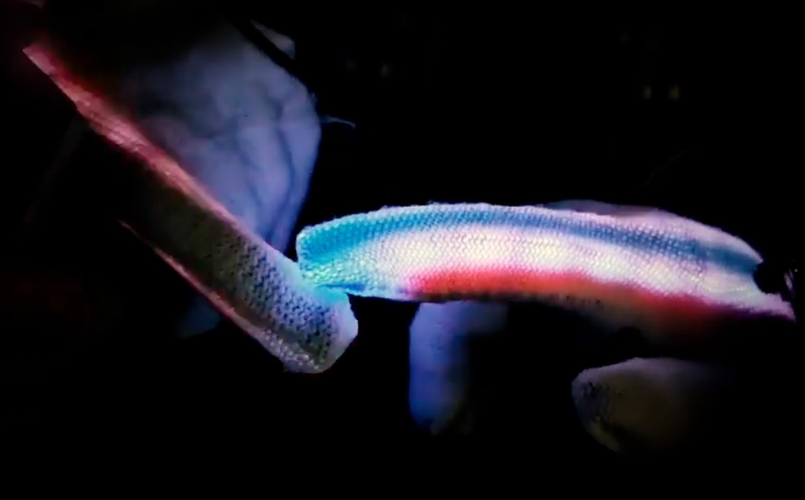

## ‘Research at Scale’ Journey - Shenzhen 2024

The Journey in Shenzhen for me revealed an intersection between design and  technology by being introduced to large scale manufacturing, fabrication techniques, art museums, technology developments, and unique cultural exchange. As a Fashion designer and Textile Researcher specializing in e-textile and smart textile systems for wearables, witnessing insights from both the electronics and textile industries was a meaningful and eye-opening experience. 

In this documentation I will introduce my own insights in participation in the HCI Symposium and Seeed Hackathon, along with interesting visits to various manufacturing sites such as electronic and fabric markets, PCB and textile factories and additionally, I will highlight the art and cultural experiences that enriched our stay.

## HCI Symposium and SUSTech visit 

The HCI Symposium includes multiple activities, including a poster & demo exchange, hackathon, lectures and sharing knowledge between students and industry partners. We had a chance to introduce each person’s research and explore other researchers from multiple universities. This experience was a great part of the journey in Shenzhen, as we got to know the partners, the technology and the people who work in related fields. 

Held by the Southern University of Science and Technology, school of design - we were introduced to multiple departments and facilities around the university.
We visited a few departments across the school, and enjoyed seeing multiple projects that used advanced technologies in robotics,3D printing and HCI. 

## Seeed Hackathon & Presentations 

 Our collaboration with Seeed divided into several experiences. The first was a hackathon in which we were introduced to the Seeed’s XIAO-ESP32S3 and developed an ML integrated system and learned powerful techniques to use the board. After this session, we formed groups for the hackathon: Tech for good. 

My group uses wearable devices to detect color change through glove interaction. The project uses LEDs that connected to Xiao and can capture color change through imaging captured by the embedded camera. The project won the hackathon innovation award and was a very fun experience to work together on this wearable device.  

“HandSight” developed to present an interactive digital Gloves that Capture and Augment Colors through Touch.
Group memebers: Derrek Chow, Ganit Goldstein, Hila Mor & Yue Yang.

