# Inaugural SEEED Maker Camp
> Leo McElroy
> 
> January 2024

My trip to Shenzhen began with a 16.5 hour flight from NYC. Apparently it's one of the longest commercial flights one can take at the moment. I thought I may read or work on something on the plane but ended up doing nothing. Didn't even stand up or watch a movie. Just sat quietly. Around hour 14 I began to get slightly restless but not enough to do anything else. And then I arrived.

After landing in the airport I decided to take the ferry to Shekou.

That was the easy part of the journey. I had visited Shenzhen about 5 years prior and recalled having some difficulty using WeChat pay, though the primary inconvenience this brought was turning on the laundry machine in the hotel where I stayed. This time was different. I figured I would take the subway and went to purchase a ticket or a metro pass, which I seem to recall acquiring fairly easily the last time. I realized pretty soon I probably should have brought my old metro pass because this time I wasn't able to buy anything with my credit card or link it to one of the mobile payment systems. It took me a while to actually find someone with a metro card that they could sell me. Unfortunately I was unable to buy it, or a cab. I ended up wandering around for a bit till I could find an ATM, which miraculously worked without much hassle. I didn't realize what a feat this was at the time but it was the only time an ATM would work the entire stay in Shenzhen. With some cash in hand I found my way back to another metro station which didn't have cards though I was able to buy a single ride token and make my way to the hotel. It's worth mentioning that I had purchased an AsiaLink eSim through Airalo before arriving which was working well so I did have access to communication and maps.

The first day I refamiliarized myself with Shenzhen and ended up grabbing dinner with the gang at a Formlabs function.

This was appropriately foreshadowing of the month to come that would entail many unexpected events with a variety of fascinating people.

The following day Ganit, Hila, Jack and I checked out the Shenzhen Art Museum.

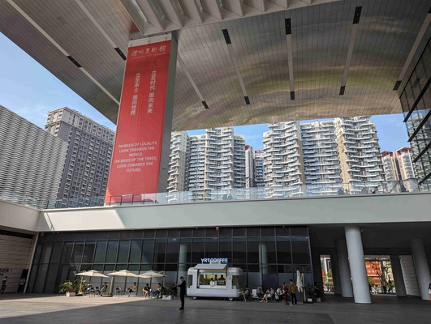

As you can see it gave a strong impression upon first sight, and the inside was filled with some fantastic things too. Our first challenge was actually getting inside though. Once again we were supposed to use some digital system to purchase a ticket, which may have been sold out for the day but I was unable to access the form for it anyway. Fortunately the museum staff were quite nice and ushered us in despite the challenges. 

The first piece I admired was the wonderful map of science and technology which spanned from floor to ceiling and perhaps 40ft wide. It also was a sort of "Where's Waldo" for finding familiar names and projects.

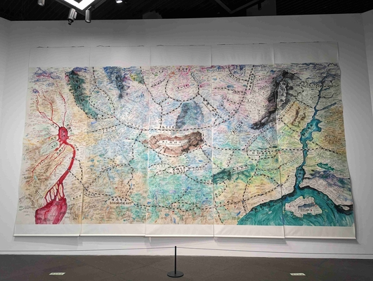

One of the highlights was Chiharu Shiota's work.

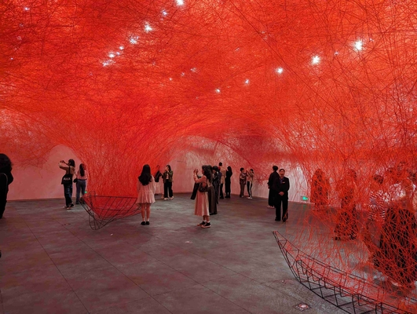

And this "oil" painting

The museum had a wide variety of pieces and the whole experience was delightful and set the stage for the motif of discovering delightful art spaces around Shenzhen.

Another recurring theme for the trip would be excellent (and affordable!) food. One thing which will become readily apparent after spending some time in the cities is that malls are a major focal point of social life. In many ways they are similar to American malls but visitors should disregard any negative biases this might bring along, especially with regard to food. Shenzhen's malls have some excellent restaurants. Like the one we ate in the night when our Chinese friends from MIT (Lingdong, Yunyi, and Cathy) arrived from Shanghai.

The malls also often have interesting public art.

This particular mall in Futian was located near the bay so we took a walk along the water after dinner and were joined by another friend from Cambridge (Kai) who is actually a Shenzhen local.

After the walk the group broke up and Lingdong, Kai, and I grabbed some chinese barbecue (great cumin rub) before calling it a night.

## Scalable HCI Conference at SUSTech

The conference marked the first planned day of events. We started with a tour of SUSTech's campus which was across the street from the design school where we were based.

We also got to see a variety of interesting labs working on things like microfluidics and 3D printing. One particularly charismatic presenter shared a collection of impressive robotics projects like this dancing robot.

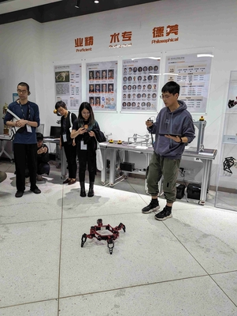

The afternoon consisted of our poster presentations. Which ultimately was actually one of the highlights of the whole trip for me because it was one of the best opportunities to meet and chat with a wide collection of interesting people. I had a number of nice conversations with people like Ming, Joey, Derrek, and Kelly (among many more).

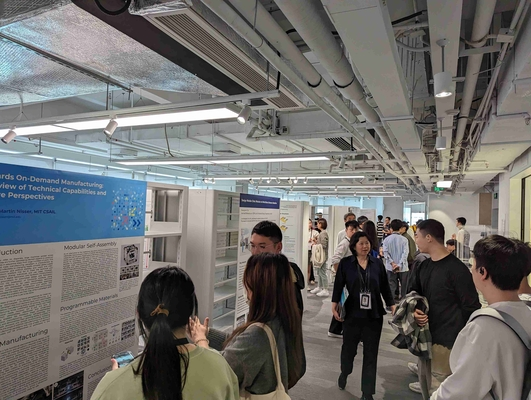

Among the most striking show and tell was Kelly Heaton's PCB art works. Later when we got a chance to chat and I shared my interest in making PCB design tools she very enthusiastically suggested a collaboration which is a thread I'm looking forward to following up on.

In the evening we went to a nearby restaurant in the mall and had some more delicious pickle fish soup along with some exotic items like frog's legs and skewered organs. It was a good meal. Lingdong and I got a kick out of this adornment of the restaurant.

Though I was even more entertained by Lingdong inadvertently replicating the characters posture while studying the writing in the piece.

The following day we headed over to Hua Qiang Bei which is the area I stayed five years before on my first trip to Shenzhen. I was lamenting the fact that I had lost access to my WeChat account and all the contacts I made then. Among these contacts was Noah Zerkin who was very generous to allow me to tag along on some Project Northstar factory visits. Low and behold who showed up to give my group our tour of Hua Qiang Bei.

It was Noah!

I'm not sure I have much to add to the many blogs that have been written on Hua Qiang Bei. The place is a delight to explore and for any tech minded visitor to Shenzhen you shouldn't miss it. 

My favorite part perhaps is the underground section near the subway where you can occasionally catch a glimpse of vendors recycling parts from old phones. I also got a kick out of the security where you can survey all different types of surveillance cameras.

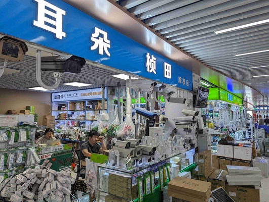

We briefly checked out the Hua Qiang Bei Museum and then headed to a mall in Futian for dinner. I was enticed by rumors of a TeamLabs exhibit in the mall. Who's branding made my Media Lab companions feel right at home.

One of the key developers of the entire mall ended up meeting us for dinner at a restaurant he suggested which he had specially made to bring some food from his hometown to Shenzhen.

After dinner he showed us some of the public art that had been installed in the mall, including the TeamLabs' staircase.

Which was quite stunning. And an interactive waterfall, which provided one of my favorite shots of the trip of this custodian mopping up digital water.

Afterwards we admired one of Shenzhen's striking examples of old and new fusion (which I don't believe are numerous).

Before heading home for sleep.

The following day we commenced one of the activities I was most looking forward to. Our factory tours. And conveniently at a facility that was directly relevant to my own interests and aspirations for the trip. One of SEEED's very on facilities.

The highlight of this tour was seeing the xiao production line (or at least one of them).  

I frequently carry a few xiaos with me and now was no exception. I found the idea of inadvertently bringing this device back to where it was made pretty entertaining.

The pick and place line was similar to lines I had seen before (and would see more of during this trip) but the process which I hadn't been able to observe with my own eyes that I got to see was wave soldering.

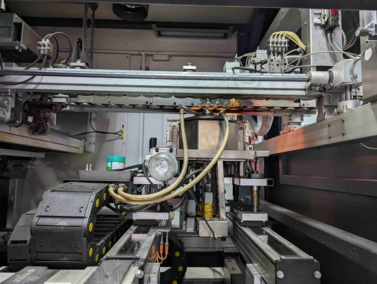

It's how through-hole components get soldered on automatically and basically involves sweeping a fountain of molten solder along the bottom of the board. It was interesting to note there was some clean up afterwards done manually.

After that we visited a flex PCB facility.

And after that I saw some heavier machinery in an EDM mold making facility.

Copper positives were CNC milled and then placed on these machines which would repeatedly press them into the mold being made while removing a small amount of material each time.

Final molds were then assembled by hand.

Our tour guide Sam Hu was quite friendly and informative.

We wrapped up the day visiting another art space, where the curator Zing showed us around. One of my favorite pieces was a line of hammers sporadically banging on nails.

Attached was a robotics research center which we also got to explore.

And we ended the evening with a hot pot dinner.

The next day we had our conference Hackathon. Dave, Lingdong, and I teamed up to make a tool which would allow you to automatically generate code for parsing data frames after you define how you want to structure your data in a graphical interface.

I've worked with Lingdong a number of times before and also knew Dave from back in Boston, so knew we would have fun building the tool. Which we all did. It serves a very particular technical function but I think it's a pretty common problem among people writing communication systems between microcontrollers. 

A live version of the site can be [found here](https://leomcelroy.com/autoproto/) and the [source can be found here](https://github.com/leomcelroy/autoproto).

Lingdong and I were in immediate agreement that the entire project should be one HTML file. Which makes it very easy to deploy.

The next day Eric Paulos wrapped up the conference with an interesting keynote about how uninhibited exploration driven by artistic interests can drive technology development. After another hot pot lunch with friends we headed over to the fabric markets where Dave and Ganit had the wonderful idea to have Dave's upcoming wedding suit made here. Here they are picking out some possible fabrics.

We explored the textiles for a few hours before heading to Dongmen food market, which was another highlight of the trip. 

I got to try a number of delicious things (and also accidently bought ten times as much stinky tofu as intended) but my favorite item was this pork floss cream puff from Bao's pastry.

Afterwards we took a walk through a night market near Hua Qiang Bei.

The following day we checked out the delightful Dafen Art village. One notable change from last year was there seemed to be more emphasis on offering activities to visitors. Specifically these painting classes which had easels set up all over the streets.

I also returned to this very nice cafe and art gallery which had a piano I decided to play for a few minutes. 

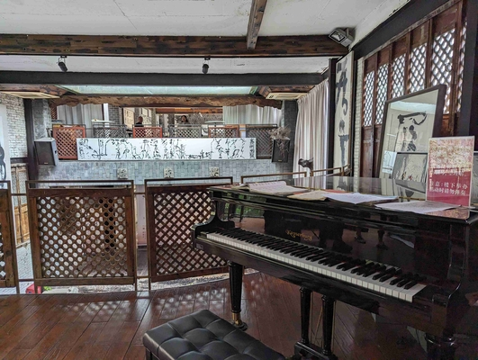

After playing Andres and Dave informed me a woman who worked there had come and asked them if their friend (me) had been there before because he seemed familiar. They confidently said it was our first time. Upon hearing this and later bumping into this woman again I informed her I had in fact visited 5 years prior. She seemed quite confident to recall me coming in so we decided to take a picture this time to be certain when I return 5 years later.

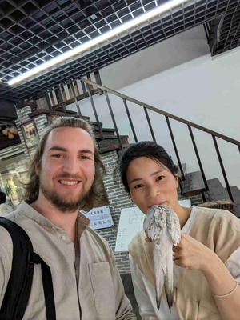

After the village we visited another art space where the curator and a European artist currently based in Hong Kong who had some pieces exhibited showed us around. Coincidently his collaborator Marek used to work in a makerspace I ultimately managed at CIC in Boston. He is a sound artist and this is one of the pieces he worked on.

After returning to SUSTech on the walk back to the hotel I caught this excellent shot of a bicycle hoard.

These rental bikes were available throughout the city but I never managed to get the rental apps to work on my phone.

Earlier this week Jack discovered a bar he raved about right behind our hotel. I'm not much of a drinker but appreciate craftsmanship and hanging out with friends so decided to join the gang for a few drinks. This place was amazing and we quickly befriended the warm owner Jeffrey. Here is one of their signature drinks.

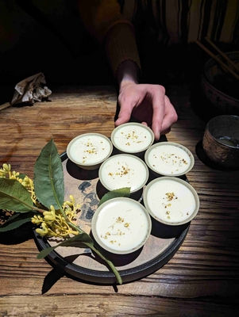

Jeffrey brought us a few shots of Pu'er tea wine which was absolutely delightful. Upon seeing how much we enjoyed it he gave us a jar.

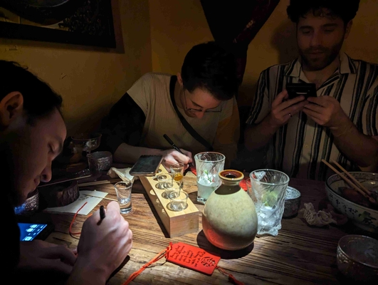

It was the first night of many which I would visit Jeffrey's establishment.

### Post-Conference Recovery and Tours

With the mad business of the conference over I took the next few days to do some laundry and walk around a bit.
There was a delightful river walk near the hotel.

The malls in Shenzhen also frequently have arcades in them. I didn't play any games myself but Jack was incredibly enthusiastic about them.

With the new week we visited SEEED's headquarters and Chaihuo makerspace. 

I had a nice time chatting with Peter who showed off his local LLM home assistant project.

It was fun to return to Chaihuo which was another space I visited last time.

During the last visit the Vanke design park was surrounded by construction which was finished this time.

The park is perhaps one of my favorite parts of the city actually.

Returning home (to the hotel) that evening I took a moment to appreciate our own local mall illuminated by its LED facade.

In the next few days we visited Tencent headquarters and a screen factory.

They were extremely open about explaining how everything worked.

And on the way out we checked out the injection molding facility on the ground floor. We had no arrangements with them but after walking in and asking to look around the manager welcomed us.

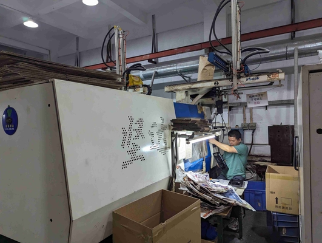

After the screen factory tour we headed over to the Design Society to check out a Rhizomatiks exhibit (once again guided by the curator).

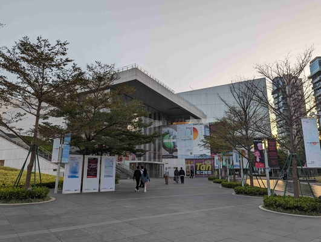

The whole exhibit was amazing. A particularly magic room for me was a darkened room with occasional flashes of light and sound emanating from this large contraption on the far side.

The piece was essentially a giant rolling ball sculpture somewhat like this model I pulled off google images.

As the balls would roll down lasers mounted on walls around the room would shoot them and the light patterns were used to generate sound (as I understood).

To wrap up the evening we dipped into a SZDIY gathering, but unfortunately I could only stay a few minutes because I had a work call with some folks back in the states.

I was pleased to remind a number of people in the room that I had met them 5 years earlier doing something very similar at another SZDIY meeting depicted in the following photo.

## Getting to Work

There were two main projects I was looking to investigate while in Shenzhen. The primary one is to find someone to help us make the education kits we develop in our "You Ship, We Ship" projects at Hack Club. The secondary task was further exploring ways to make prototyping with embedded devices more interactive. With the conference over and recovered from it was time to focus on these two tasks. Ultimately I ended up prioritizing the former as I felt the R&D work could be pursued back home and my time in Shenzhen was best spent meeting contract manufacturers.

Of course to work well you have to be fed so the following day I joined Dave and Andres as a restaurant between SUSTech and our hotel which would become one of our favorites.

In the afternoon Andres and I met up with Stefan (a project manager) and Estella (communications) from SEEED. We had a good chat and shared the work we both do and how we could work together with SEEED. One of my main interests in Shenzhen is figuring out how to get someone to put together the educational construction kits I'm developing at Hack Club. 

The first one is a handheld game console called [Sprig](https://sprig.hackclub.com/). Students around the world can write games in our custom online editor. When they share those games publically as PRs to the project we send them materials to build consoles which can play the games they (and everyone else made). Sprig is fairly simple mechanically but the next project, [Blot](https://blot.hackclub.dev/), is a CNC drawing machine with many more parts and which motivates finding someone to help us "manufacture" them. I put manufacture in quotes because we aren't looking to have the whole machine assembled, just all the parts packed together in ready to go boxes. The Blot machine is depicted below.

The other project I discussed with Stefan was [Modular Things](https://github.com/modular-things/modular-things) and some extensions I was working on in Shenzhen.

We had developed Modular Things to make it easier to interactively develop embedded systems projects without having to reconfigure firmware. You can plug all the devices into your computer and then prototype by writing JavaScript in a web IDE.

The newer generation of devices all use xiaos which Stefan found intriguing. 

One problem I was looking into were that plugging every device into your computer through USB can be quite cumbersome. We've wanted to develop a connector to connect the devices to each other (perhaps on a bus) but hadn't settled on anything yet. Microsoft has been working on a similar project called [Jacdac](https://microsoft.github.io/jacdac-docs/) which is quite nice. The portion of it which I found particularly inspiring though was the simple 3 wire edge connector. I wanted to connect some modular things style boards with xiaos with these connectors.

The other problem that I wanted to address from our Modular Things work is making it easy to make new devices/making sure firmware is modifiable. An avenue I wanted to explore for this was putting an interpreter on each device so that you can modify "firmwares" on the fly and always know what version you're running on a device because you can just inspect it. Earlier in the year I made a web editor for micropython which I called [Codebra](https://github.com/leomcelroy/codebra). I'd like to be able to connect a bunch of devices running micropython over a single wire UART (through the Jacdac connector) and have them all pop in the editor. Whenever I click a device I can modify what scripts it's running and I can include a library which will allow me to automatically connect to other devices over the bus.

I ended up designing Jacdac connectors for xiaos in both SVG-PCB and KiCad. Here is one of the boards.

After meeting with Stefan and Estella, Andres and I went to Chaihuo to give our talks. The room was packed and as is a theme in this account it reminded me of a visit I had made to Chaihuo 5 years earlier. At that point I attended a talk with Noah Zerkin on AR/VR headsets. It gave me some satisfaction to return and give a talk myself.

After the talks Eric Pan took us out for some food from his hometown at a restaurant that specializes in pig brain. I'm an adventurous eater but brain is one of the few items I'll sometimes pass up. I still tried it though and it was tasty.

In the following days I met up with Paul Hamilton who recently took a job at SUSTech to help with electronics design work. Paul is a classic maker geek in all the positive ways (curious, friendly, helpful, loves to teach and loves to learn). We discussed ways to simplify and improve the Blot control board. Here is the current design below.

## More factory visits

With the remaining time in Shenzhen Yunyi, Ganit, Hila, Cedric and I visited Unilumen's showroom. Unilumen makes LED signage and the showroom had some of the most impressive screens I've ever seen.

JPT showed us one of their R&D centers where they develop fiber lasers for metal laser cutting.

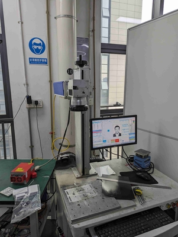

And a facility that makes light up fibers.

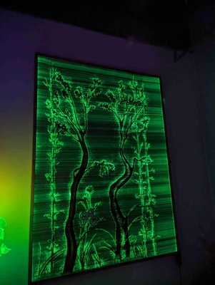

Cedric and I visited the factory producing his flex PCBs again, where he was doing some debugging. I quite liked spending time in the factory, not just on a tour but doing an activity which was representative of what it's like to actually work with one.

For culture visits we met up with Jashy and Susanna (who were also at MIT) in Nantou Ancient City, which seemed to be one of the nicest parts of Shenzhen which I found to hang out in.

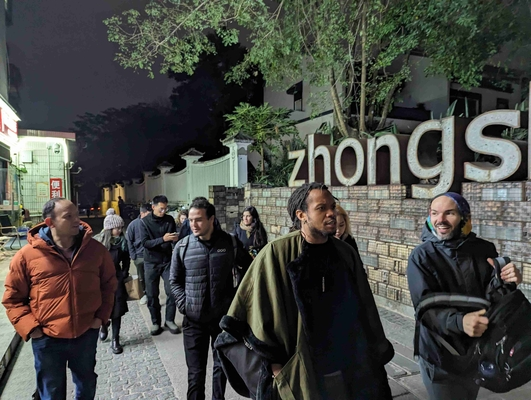

And also had some delicious food in another urban village.

## Final Thoughts

It was not my first time in Shenzhen and I suspect it will not be my last. For a technologist interested in making things it's a singular place. But I would suggest that really anyone interested in how the world works should pay a visit to the Greater Bay Area to see where our material world comes from and how it comes to be.

I'd like to express my gratitude for SEEED, SUSTech, and everyone from MIT who joined on the trip. I'd like to offer special thanks to Cedric Honnet for the Herculean work he did to pull the whole thing together. I feel hugely inspired and am sure the experiences I had in 2024 will have great consequences in my work to come.
