# Research at Scale 2024 - My Adventures in Shenzhen
**By Andres Rico**

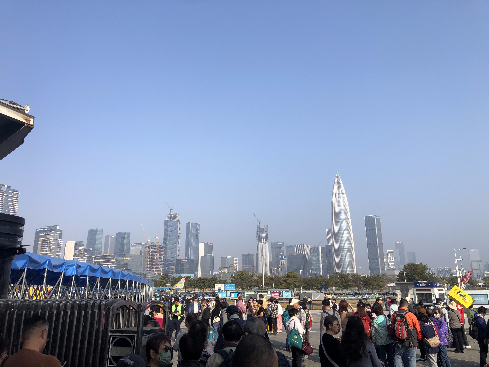

Cities are a good place to look towards to understand some of our world's most pressing challenges.

My research is focused on understanding the ways in which we can build sensor systems that can allow us to understand crucial socio-environmental aspects of cities. Industry has greatly advanced the development of sensor systems for strcutured environments such as factories. We are able to count pieces, monitor quality, check the health of machines so as to produce more product, with more efficiency and at higher quality.

BUT, we cannot look at sensing for cities in the same way that we have looked at it for industry. Cities are complex, non structured entities that require much more flexible sensor implementations.

A key challenge in building sensor systems for cities is the ability to scale. We need to be able to build systems that can be deployed at scale, and that can be maintained at scale. This was my main motivator in spending a month in Shenzhen, the electronics capital of the world. During the month, I had the opportunity to visit many of the factories in the Shenzhen ecosystem, the biggest electornics market in the world, Seeed's manufacturing facilities, Seeed's Makerspace, among many other places. The following is an semi-technical anechdotal of what transpired during my time in Shenzhen.

## Scalable HCI Symposium

The scalable HCI symposium allowed us to get to know some of the great projects that are being done at SUSTech School of Design as well as to engage with Seeed's latest producs and Shenzhen's vibrant technology ecosystem.

You can find more information and a short video about the Symposium [here](https://scalablehci.com/). We had a nice poster session, great speeakers, factory visits, and a bucnh of interesting conversations with regional players and stakeholders.

### Factory Visits
- LCD Screen Manufacturing
- PCB Manufacturing
- Flexible PCB Manufacturing
- Mold Manufacturing
- Injection Molding

Visitng these factories allowed us to see the details of how electronics and different components are manufactured at scale. I was also able to establish good relationships with potential future collaborators and suppliers.

### Electronics Market

We visited the biggest electronics Market in the world at Huaqiangbei. This is a great place to see the magic of Shenzhen at work. It is possible to see almost every component imaginable to an electronics engineer. This market is a statement of the rapid prototype capabilities of Shenzhen. It is very easy for students, universities, and companies to get their hands on the latest components and to prototype their ideas.

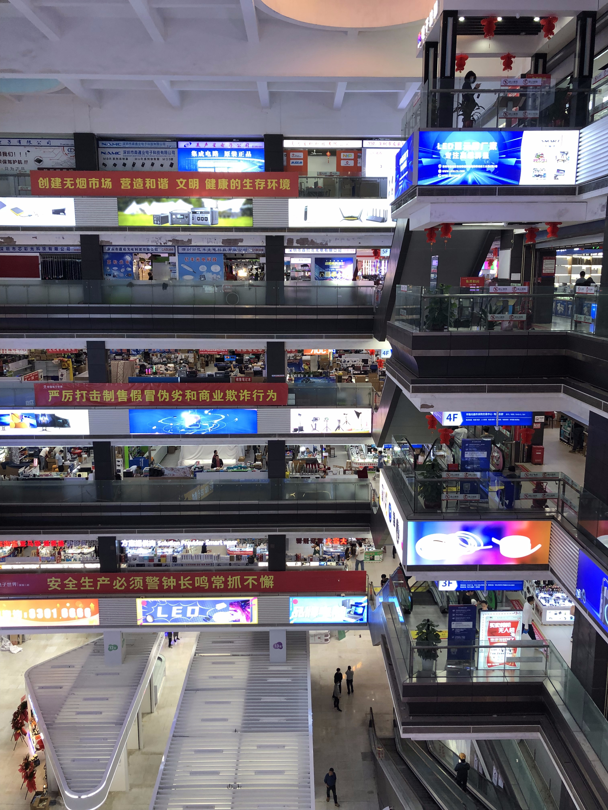

### TinyML Workshop

The future of electronics and AI is at the edge! During this workshop we were able to engage with Seeed's startegic product line being created around EDGE AI.

For this we used the [XIAO-ESP32-S3-Sense](https://www.seeedstudio.com/XIAO-ESP32S3-Sense-p-5639.html). This tiny development board integrates an esp32 and a tiny camera module and it has the capability of running edge ML models for image recognition, speech and many other sensors. What our friends at Seeed have done here is truly remarkable.

These capabilities open up great opportunities for makers all around the world to give their projects AI capabilities without having to connect the to a cloud service. This could have great implications in terms of data security and privacy as well as to access to these types of technologies in remote areas such as forests, mountains or informal settlements. I think that this poster at Seeed's office summarizes the potential of this technology very well.

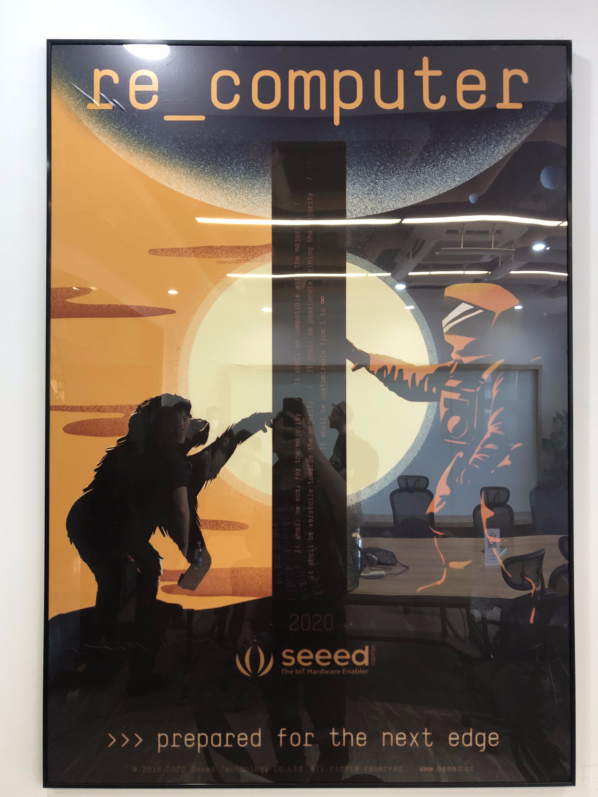

## Seeed

### Hack Day Presentations

We were invited by Seeed to present our projects at their Hacker Space! We had a great time and were able to engage with the amazing maker community in Shenzhen. It was also incredibly interesting to hear all of the amazing work being done by people in the maker space and by my collgues from MIT and UC Berkeley.

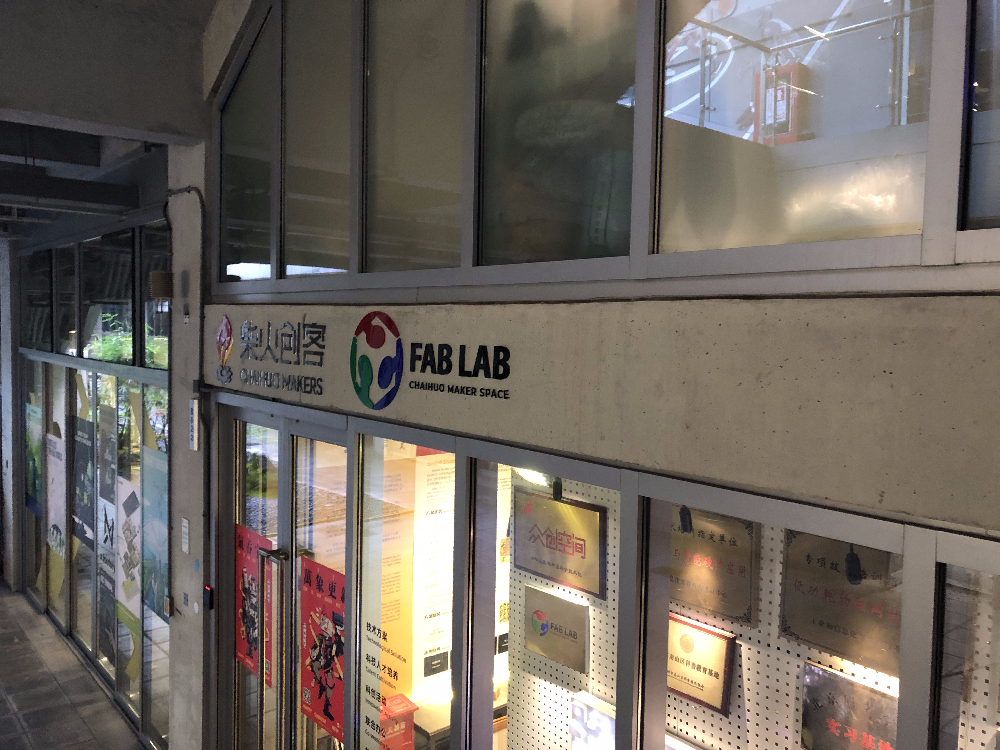
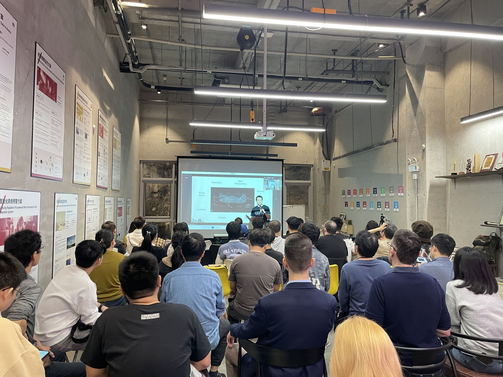

## Seeed Co-Create Program

I've begun talks with Seeed to further develop the [Axol Water Sensors Project](https://github.com/AndresRicoM/axol) through their Co-Create program. I belive that Seeed's manufacturing capabilities, engineering and global recognizion will allow my project to reach the audiences of makers and researchers for whom it is specifically designed for. This partnership will enable for water research, specially within informal settlements, to be more accessible, something that I set as a goal in my [published work](https://www.nature.com/articles/s41598-023-46236-3).

### General Changes to Architecture

As the system will be mass produced. I decided that optimizing it would be a great use of my time in Shenzhen. I aimed to have an architecture that was easy to replicate, manufacture at scale, easy to ship worldwide and cheap. Some of the major changes to the architecture are listed and explained below:

- Microcontroller Selection
    - USB-C Integration
- Battery Selection

**Micro Controller Selection**

The ESP32-C3 XIAO has packed almost all the things that I need for my sensors within a tiny package. I started by analyzing how I could migrate the sensors to be based on the XIAO. One of the biggest variables that I have to optimize the new design for is power consumption. The XIAO is capable of using only 43uA in deep sleep mode. This is outstanding for such a complete development board! I wish I had XIAOS when making my first prototypes.

I ended up analyzing the power requirements of the system, my current architecture and the XIAO's internal architecture (as seen above)(the blue square points to the regulator component which is responsible for most of the XIAO's deep sleep current consumption) and decided that my best bet for this design is to base the new modules on the [ESPRESSIF ESP32 MINI WROOM](chrome-extension://oemmndcbldboiebfnladdacbdfmadadm/https://www.espressif.com/sites/default/files/documentation/esp32-c3-mini-1_datasheet_en.pdf). This module uses the ESP32-C3 chip which has USB peripherals and doe snot have an on-board regulator. This means that I can use the same [RT9080-33GJ5](https://www.digikey.com/en/products/detail/richtek-usa-inc/RT9080-33GJ5/6161634?s=N4IgTCBcDaIEoBUCcAGAHCgtAZmwcQCkBWEAXQF8g) regulator that I used in my first design. This regulator has an extremely low idle current consumption of about 0.1uA! Due to the importance of battery life, I had to sacrifice using the XIAO along with many of the capabilities that it brings such as USBC and charging. I figured that if the sensors would consume such little power, replacing batteries would be more suitable than charging them. I think that a version of the XIAO that uses the [RT9080-33GJ5](https://www.digikey.com/en/products/detail/richtek-usa-inc/RT9080-33GJ5/6161634?s=N4IgTCBcDaIEoBUCcAGAHCgtAZmwcQCkBWEAXQF8g) would be super cool to see! Maybe Seeed will make one soon.

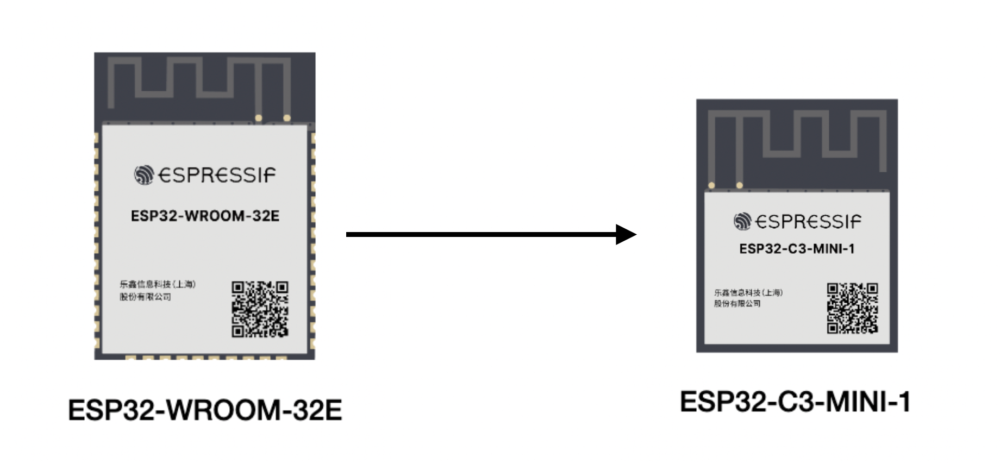

**Battery Selection**

My cureent design uses a 3.7 420mAh LiPo battery. From field testing my current design has been able to last for more than a year, sampling at a rate of two data packets per day. The sensors in the field are still running despite drastic temperature changes. I calculate that the sensors would be able run for almost 3 years with a single battery charge.

The power capacity and charge density of LiPos make them a great choice for this type of project but I worry that they are expensive and hard to find in Mexico. They are certainly not as accessible as AA batteries or coin cells all around the world. Also, shipping them is very difficult as many carriers worry that they might catch fire.

I've played with the idea of using coin cells as they have great charge density. My only worry is that they might not be as capable of delivering my peak currents which happen when the sensor is transfering data over the esp-now wireless protocol. I estimate some of the peaks to be at around 600mA which is a lot for a coin cell. These peaks could [degrade the performance of the cells and make them last less time](https://learn.adafruit.com/all-about-batteries/lithium-batteries-and-coin-cells).

Coin cell batteries can be made up of different chemistries. I'm looking at using the widely available and standard [CR2450](https://www.digikey.com/en/products/detail/panasonic-bsg/CR2450/447508) coin cells. They have 3V and 620mAh of capacity. When bought in bulk, they can cost .9 USD! This is a great improvement over the LiPo batteries which cost around 5-10 USD, depending on capacity.

As the batteries have a voltage of 3V. I will be using two batteries per sensor. The batteries will be connected in series so as to deliver 6V. I estimate that the 6V will be more than enough to power the regulator and to compensate for the voltage drops that the batteries will suffer from the pulsed current peaks. I still have to test this but I'm hopeful that they will be able to solve all of the described trade offs.

Here is the new layout for the sensors with USB-C, the new ESP32 WROOM MINI, and the coin cell holders. I've managed to make all of the sensor boards have the same shape factor so that we can reduce costs for the cases.

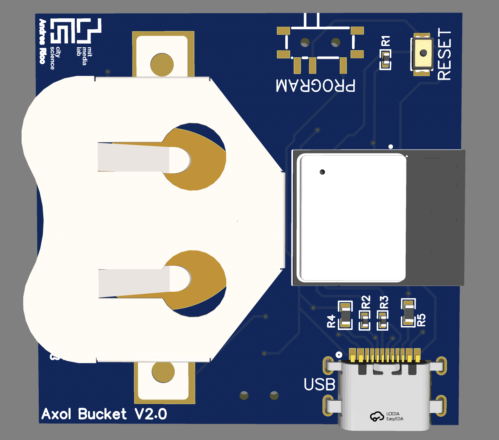

**Form Factor**
After my conversation with Stefan from Seeed. It was clear that the most expensive part to manufacture would be the plastic cases for the sensors. Given this, I've decided to design all the new sensors in a way that they have the same form factor. This will allow me to reduce the costs of the cases and to make the sensors more modular. I think that this will be a great improvement for the project.

### Bucket Sensor
This sensor uses a tilt switch to count the amount of times that a bucket is flipped. This is a very simple way to measure water usage. The new design adds an SMD tilt switch that I think wil make it much easier to manufacture and to produce at scale. This is the most simple of the three sensors for the system. Below is the new schematic for the sensor.

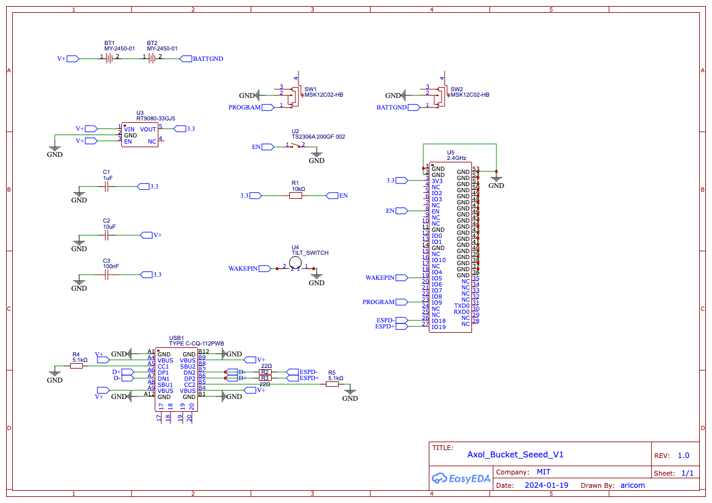

### Tank Sensor
The tank sensor uses and optical ToF sensor to measure the distance between a tank's lid and the water line. It then uses this distance to compute volume of water in the tank. I migrated this sensor to a standalone SMD ToF sensor. This will make it much easier to manufacture and to produce at scale. Below is the new schematic for the sensor. My past version for this sensor had a larger footpront and relied on a breakout board for ther ToF sensor. This increased its price greatly. I'm glad I could integrate the sensor directly on the new board.

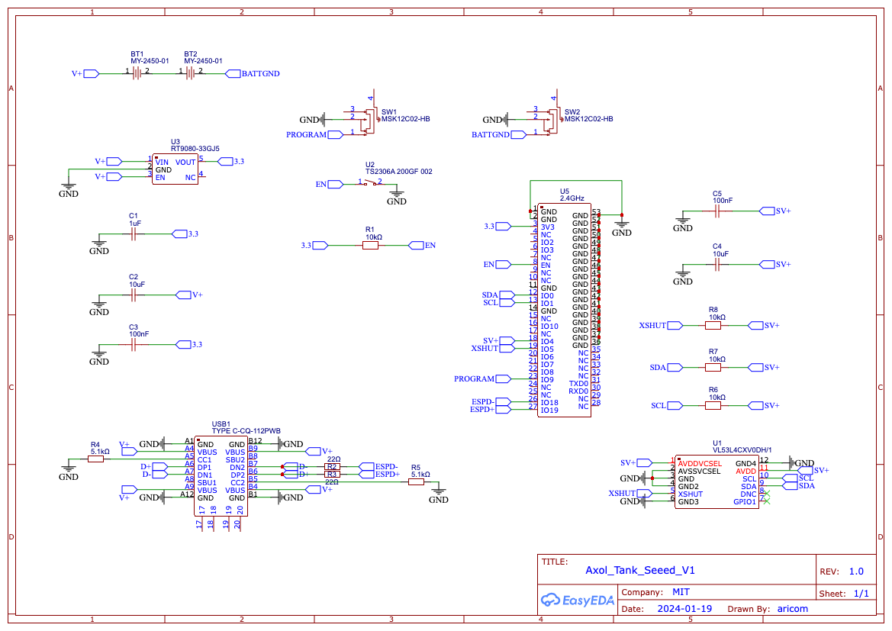

### Quality Sensor
This sensor measures conductivity in water to know TDS (Total Dissolved Solids). TDS is used as a proxy to water quality. The current version of this sensor is cased within a 3D printed buoy. The buoy allows the sensor to always be in touch with the water. While the design is proper for performance, it is not very optimal in terms of costs and waterproofing. During my first trials, I realized that these were the most vulnerable sensors.

The new design will allow the sensor to be placed at the edge of a tank so that it is not in constant contact with water. This will allow for the sensor to be more robust and to be cheaper to manufacture. Below is the new schematic for the sensor.

A second change is that I will be using a nice Grove conector from Seeed so that the device uses the [Grove TDS sensor](https://www.seeedstudio.com/Grove-TDS-Sensor-p-4400.html?queryID=c9b044c1923647ede5d84f3b413e7e5f&objectID=4400&indexName=bazaar_retailer_products)! As Seeed has optimized this design, it will be a great addition to my current design and it will keep costs optimal.

Here is the new schematic!

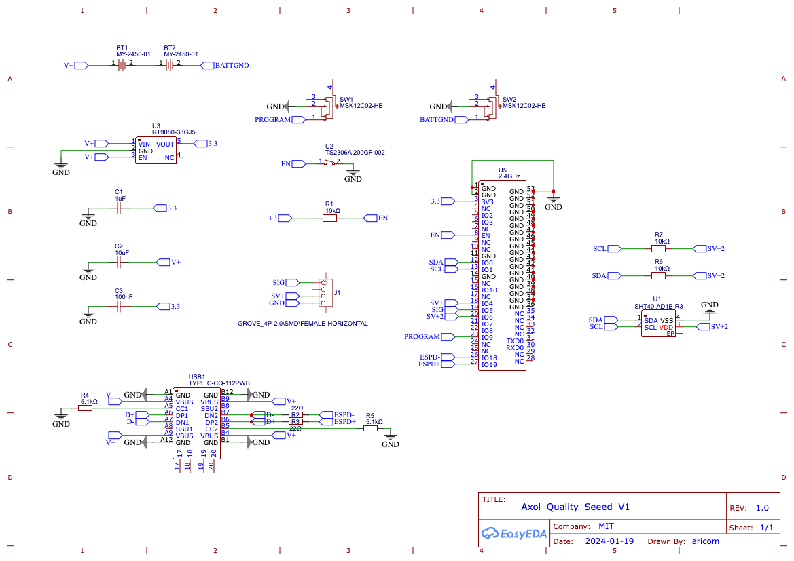

### Next Steps
I will be testing the new designs and working on the new mechanical case designs for the sensors. After I have ran some tests, I'll  be collaborating with Seeed to bring them at scale to the world! Stay tuned for this! This will be a very exciting project!

### One More Thing Seeed...

## Eagle Library for XIAOESP32-C3!

As I realized that the Eagle library file does not have pads for the XIAO's battery, I've created an [Eagle library for the XIAOESP32-C3](https://github.com/AndresRicoM/XIAO_ESP32C3_Battery_EAGLE-) that includes the pads. This would be helpful for people prototyping their pcbs that nee to include battery connectivity to their projects. I hope that this library can be useful for other makers and engineers that are looking to use the XIAO in their designs!

## SUSTech Collaborations Cooking

### Satellite Project Collaboration (Pi)
Pi is a Master's student at SUSTech that is very interested in multiple urban planning aspects. He is currently working a cool project that uses Satellite data to get estiamtes of water availibility in a given geography. I don't have a link to that work as it is not published yet.

But we had some interesting conversations about combining sensor data from my water sensors with his availibility calculation so that we can get proper estimates (supply/demand) of water in informal settlements. I think that this could be a very interesting project to work on.

We will try to kick this off in the next few months. I hope that scaling my sensors with the help of Seeed will allow us to get enough coverage of settlements to make this project a reality.

### New Interfaces Project Collaboration SUSTech (Seungwoo)
I was also very happy to see the great work that Seungwoo is doing with new interfaces. He is currently workiing on creating amazing pin array interfaces. Here is a link to his most recent [published work](https://dl.acm.org/doi/10.1145/3411764.3445454).

## Art, art and more art!
One of the things that surpised me the most about Shenzhen was its vibrant art scene. You can find everything from traditional painters to world class digital artists. The mixture between the traditional and technological gives the pieces a very unique taste.

As an engineer, I believe that the artist's way of processing and communicating the complexities of our society can drastically inform the way that we design technology and that, in turn, technology can be an oustanding medium for expression and also for societal change.

The more time I spend engaging with brilliant artists and technologists, the more I see how the two worlds should have never been discretized. On that note, I see that Shenzhen as a city, is a place that does not care about those boundries and just seems to nurture and foster them as undiscernible creative expression. This, to me, is pure gold!

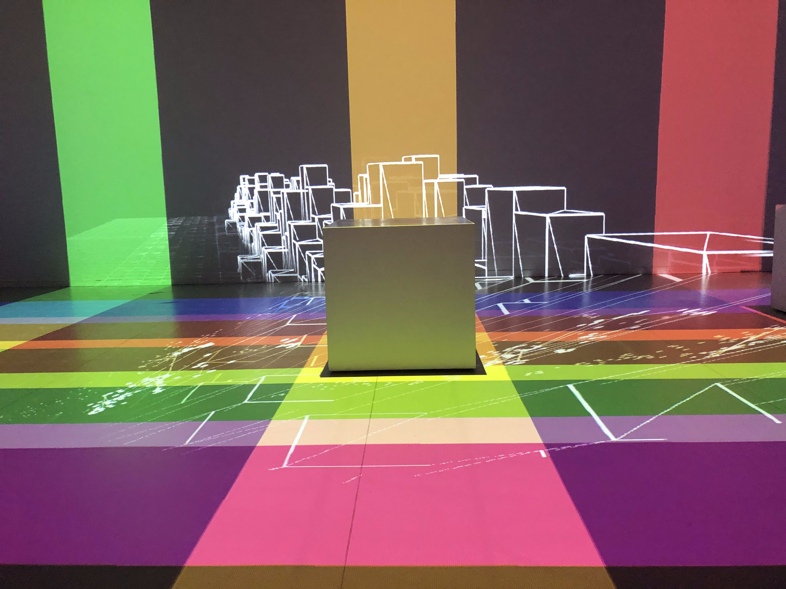

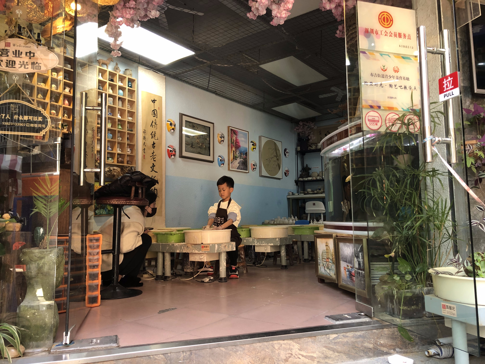

And with this, I sign out. Thanks so much for reading if you made it all the way down here. Hope this is useful for you. Make sure to contact me if you have any questions or if you want to collaborate on any of the projects that I've mentioned.
Cheers!

**Andres Rico - aricom@mit.edu**
