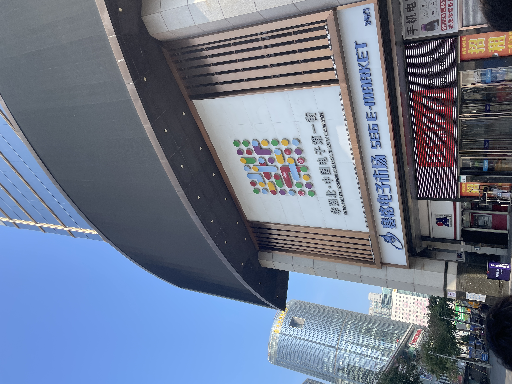
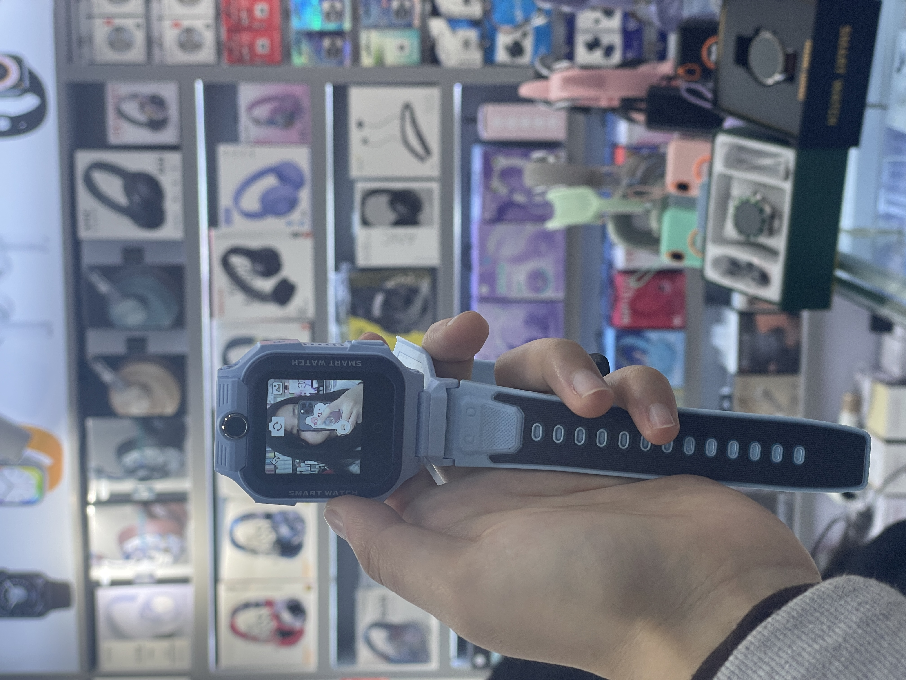
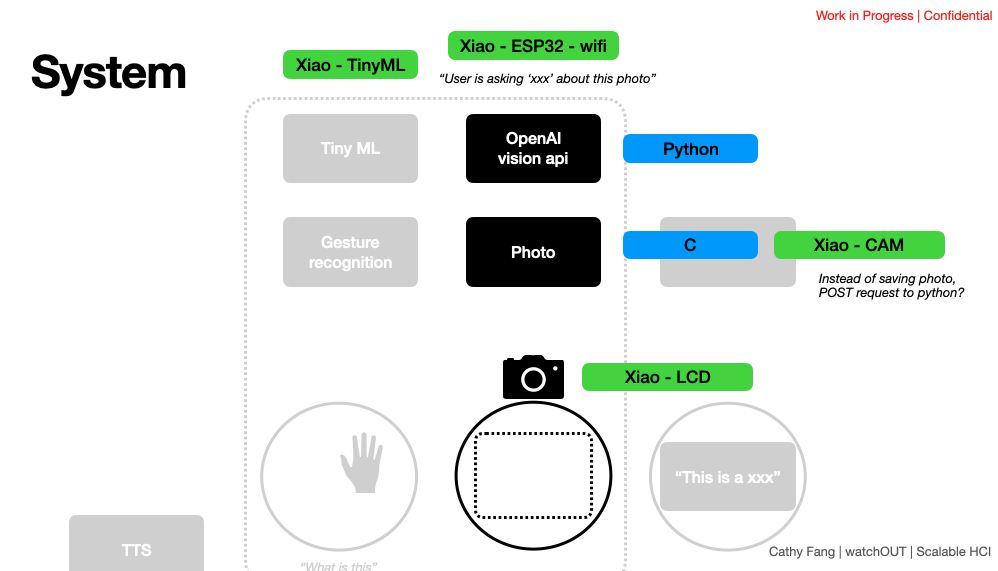
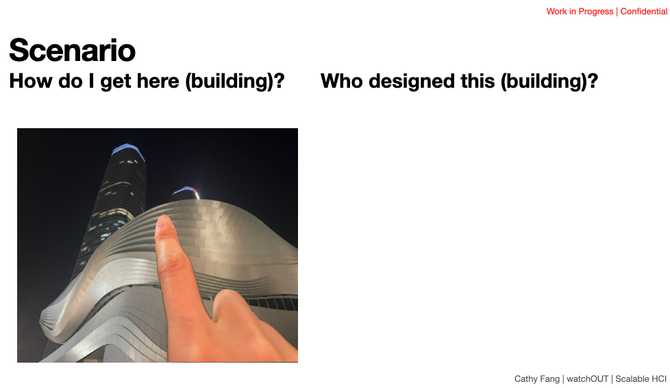
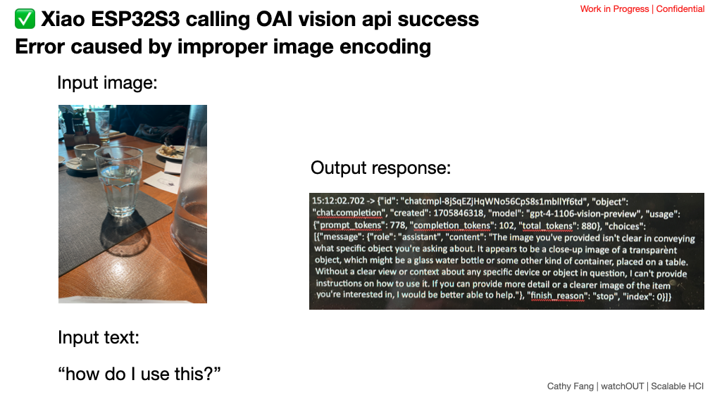
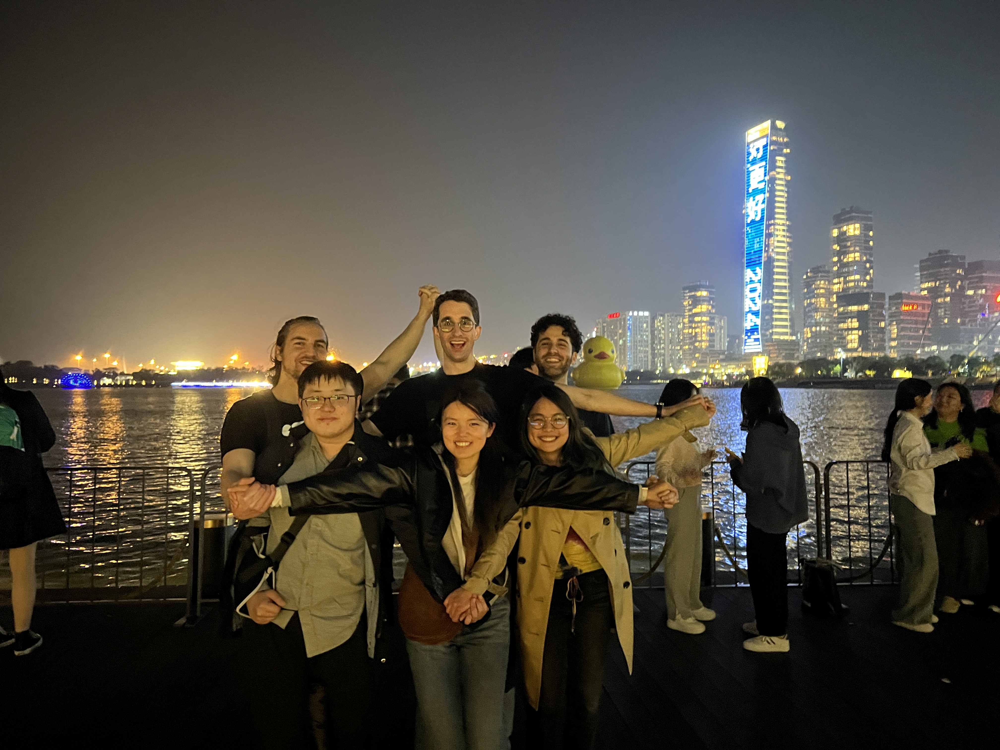
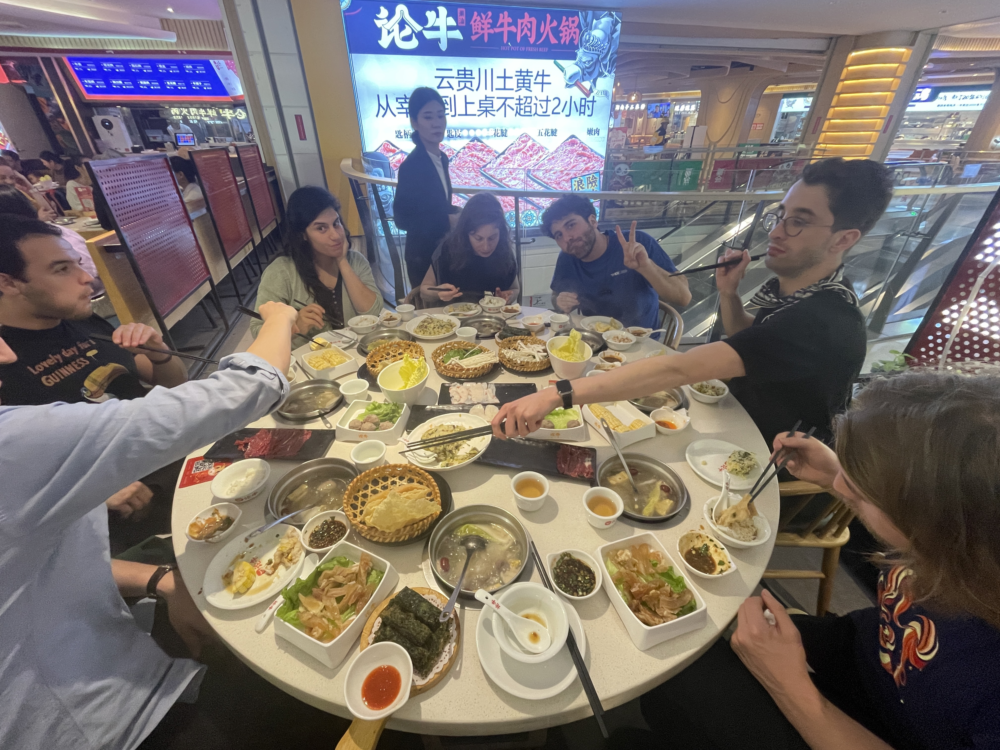

## Home but with a Different View

Born and Raised in Shanghai, I have always heard about Shenzhen being the other city that got super rich and well-invested during the 80s when China first opened herself up to the world. Different from my hometown Shanghai, known more for its financial districts and poshness, Shenzhen just sounded more relaxed and inclusive.
This time around, I had the chance to visit Shenzhen with my colleagues and friends at MIT. I was excited to show them China, the food and the people, the prevalence of QRCode and WeChat, and the spiderweb network of metros. At the same time, I felt like a foreigner too; for the first time, I visited the infamous HQB and circuit manufacturing factories, and I felt like truly a kid in the candy shop.
Without further ado, here's my recount of the short but memorable week in Shenzhen.

### HQB Visit

Being a hacker/engineer/designer, a visit to THE 华强北(HuaQiangBei) is a must; It's like Taobao IRL. The shops are endless, ranging from Shanzhai but functioning products to DIY projects of quaint flip phones to buckets of recycled PCB components from old phones. 

One can easily spend a full day or more shopping around. But I had one mission in mind: kids' smartwatch. I recently visited my family, and my nieces and nephew all were wearing the smartwatch. The smartwatch itself is not a new thing, but I didn't realize the latest generations have dual cameras (front and back) and have full-functioning components like being able to connect to the Internet for using WeChat, payment, and music playing. What might seem like a toy to some, but if you just take these features and put them in the modern-day (circa 2024, post-ChatGPT era) context, what you are looking at is a "wearable AI" - buzzword hot enough to get you million-dollar investments from the silicon valley VCs. And that's exactly what I wanted to hack during this trip.
And HQB does not disappoint. I was able to quickly pick up a cheap version of the kids' smartwatch.

### Hackathon with Seeed
Part of the SZ trip was a hackathon with Seeed Studio. We were provided with a quick tutorial on running TinyML on Seeed's XIAO board. This tutorial was very helpful and I was able to quickly get things running.
But back to my mission. That smartwatch did not live long in the hands of a hacker. I immediately took it apart to see how everything was put together. I had hoped I could put everything back together, but unfortunately, two speaker cables sacrificed themselves for this mission. 

I then realized it's harder to hack the watch than to borrow the concept and make a version of my own. Coincidentally, the hackathon provided everything I needed: a very small microcontroller with wifi, some super compact camera modules, and a round display. I got started with hacking.

NOTE: everything is actively being developed towards a publication. Please do not scoop me and only share within Seeed! :)

The concept of this project is to allow users to wear the watch and to be able to point at anything and ask questions. For example, one can point at a building and ask "Who designed this" or "How do I get there", with the context of the user's view (from the camera), the object the user's referring to (via pointing), and GPS location, text, etc

As a proof of concept, I was able to directly call OpenAI's vision API from the XIAO and get a response. [I had some issue with the round display, so I was only able to get printouts from the microcontroller.]

### Factory Visit
Besides the HQB visit, we were also shown a few flex PCB factories, and oh boy that was very eye-opening. It's quite shocking to see how much automation there was within the factory lines. People were mostly left with the task of verifying the PCBs and fixing some errors. It is not hard to imagine that many of the manual tasks might be replaced by robots. I was also very concerned by the environmental impact of the manufacturing process. We didn't get to see the upstream manufacturing of the flex PCB before they were already chemically etched, but we were certainly told some horrible stories from small mistakes. I think it was quite important to see how things were made to increase the awareness of the underlying, mostly hidden cost of our privileged, digitally-imbued lives.

### Food, Friends, and Fun

Besides serious businesses, I enjoyed hanging out with my friends, visiting art galleries, and eating many many good food. I'm so sad writing about this because I miss this so much. We can only hope that there will be more opportunities like this in the future! ;)

Thank you, Seeed Studio and SUSTech University, for hosting us!!

