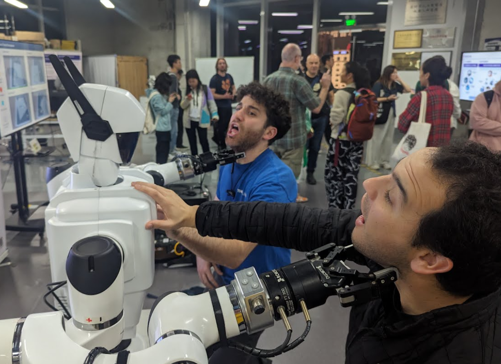

# Research At Scale - 2024

This January I was lucky enough to join a group of talented engineers on a trip to Shenzhen hosted by SUSTech University and Seeed Studio. The trip was organized by Cedric to build on the tradition set by the Research at Scale program, which was paused in 2020 during COVID. I learned a ton about the Shenzhen manufacturing ecosystem, and met some wonderful folks - I hope you enjoy the writeup, and huge thanks to Cedric and all of the organizations involved in making this happen, particularly Seeed!

## Scalable HCI Symposium 

The trip started with the Scalable HCI symposium, which featured several workshops, poster presentations, a SUStech campus tour, and a hackathon, for which I worked with Lingdong and Leo.

For a while I have been wanting to build a simple frontend for designing communication protocols between embedded devices. It's typical for embedded developers to design these protocols from the ground up everytime they need a microcontroller to talk with another microcontroller, and despite it being an incredibly common problem, there aren't a lot of examples or best practices on writing this sort of thing. The landscape of different protocol architectures is huge (UART, I2C, SPI, Bus, Ring, Addressed, etc), but we decided to start with maybe the simplest canonical example, which is a UART Bus with a single head and addressed drops, and then support a packet structure composed of integer bytes that can be subdivided into an arbitrary information structure, where for example an address could be 3 bits long, and be immediately followed by an 11 bit target register and a 5 bit chunk of data, and then everything gets packed and unpacked into a 19 bit UART packet (that for the peripheral's purpose would be 3 bytes long). A data sheet that I've spent a lot of time with is for the TMAG5170, and TI has a very nice representation for how they structure their packets, so we decided to borrow from this for the front end such that as data is added to the packet it becomes visible sequentially with a similar color coding. This addresses a common frustration I have with communication protocols generally, where there are typically a lot of wasted bits conforming to 8 bits of addresses when you only have 4 nodes in your network, and similarly for the data structures.

Fortunately I was able to convince Lingdong and Leo to join the project, who are both in about the 99th percentile for this project (and both shared a curious desire to build the entire project in a single .html file). I wrote a ring example and got it working on a pair of Seeed's RP2040 XIAOs, while they speedran the entire GUI and logic. You can find the final project as we left it hosted here: https://autoproto.glitch.me/. Hopefully this project becomes a useful learning tool for folks getting into embedded development. I am looking forward to using it myself the next time I run into a project requiring a communication network!

Other highlights of the conference were Seeed's tinyML workshop (this was my first time putting a machine learning model on a microcontroller and it was impressively simple), and walking around / presenting during the poster presentations.

## Mini Servo (name pending)

During the trip I wanted to design a small servo driver using the DRV8317 and Seeed's RP2040 Xiao. There are a good number of similar projects out in the wild, but most lack the step/direction interface to be interchangeable with the ubiquitous stepper motor driver, or easily integrated into an Arduino project. The goal of this project is to create a system that can be used as a truly drop-in replacement for most stepper-reliant digital fabrication tools. There's a need for a tradeoff here, where a closed loop servo requires an encoder at the motor, which has a delicate high speed communication protocol (SPI or quadrature encoding), and the requirements for a step/direction interface are similarly delicate. Where open loop stepper motor drivers are typically conglomerated around a central motherboard, for this application a good tradeoff is to prioritize the encoder signal, put the driver at the motor, and then use a differential communication protocol (using UART and a MAX485 for simplicity). Finally what that means for this project is that I have designed an intermediate board that watches for step and direction signals from a motherboard, and sends a tallied position value to the individual mini servo drivers. The catch here is that we introduce a delay on the order of the UART transaction, which may be a dealbreaker for some applications (very high speed 3D printing or high tolerance machining). The alternative would be to introduce a second MAX485 and send a differential step and direction signal, but this simpler version seemed like a good place to start. The boards are soldered up and assembled with a printed bracket and diametrically magnetized magnet for the encoder, but I am still writing firmware to bring everything together.

## Trips / Factory Visits

As a part of the symposium we visited Huaqiangbei where Andres and I spent the full day with a team of Seeed engineers. The market is home to an incredible ecosystem of phone bootlegging/repair/development, that's really hard to capture on camera, but maybe [this video from strange parts](https://www.youtube.com/watch?v=leFuF-zoVzA) does it justice. On a side note this day also featured some of the best Dim Sum of the trip, so thanks Dan and co for your time and generosity!

<video width="320" height="240" controls>
  <source src="images/sinker_edm.mp4" type="video/mp4">
</video>
