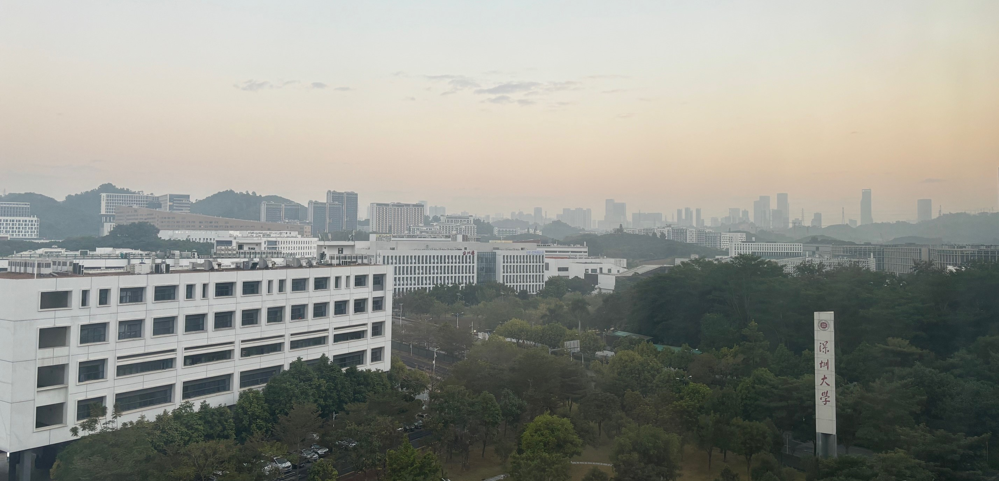

# Research at Scale
Martin Nisser

## Introduction

I'm a final year PhD student at MIT CSAIL, where I work on computational fabrication - particularly as it relates to robotics. In the research communities I'm a part of, we do a lot of work with 3D printers and laser cutters, trying to come up with new ways that people might build interesting devices like robots in the future. However, a question that's loomed over my head for a while is that the community, or at least I personally, have had very little interaction with people who are building an scaling up prototypes for use in the real world. The Research at Scale conference presented presented an opportunity that addressed exactly that need, and it was an incredible experience to get to learn from and see the wide-ranging manufacturing initiatives taking place in the Shenzhen manufacturing ecosystem.  