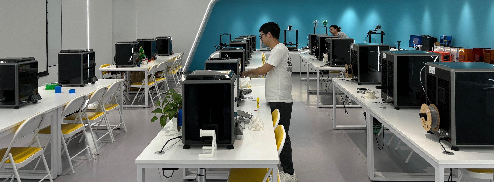
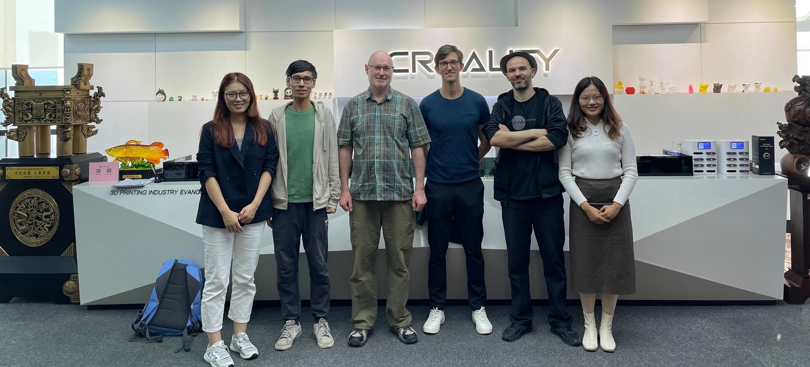
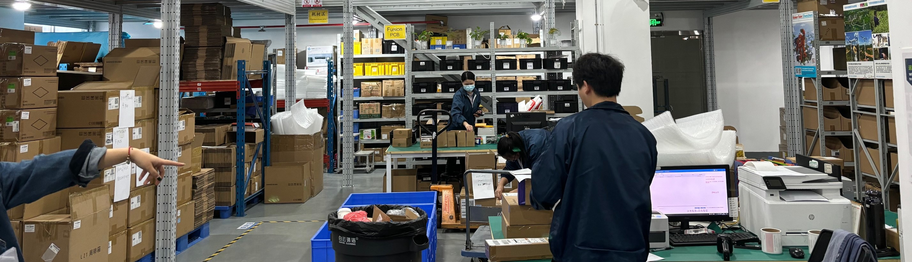
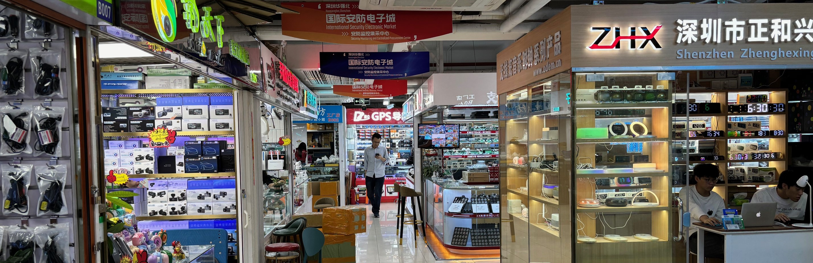

# Research at Scale
Martin Nisser

## Introduction

I'm a final year PhD student at MIT CSAIL, where I work on computational fabrication - particularly as it relates to robotics. In the research communities I'm a part of, we do a lot of work with 3D printers and laser cutters, trying to come up with new ways that people might build interesting devices like robots in the future. However, a question that's loomed over my head for a while is that the community, or at least I personally, have had very little interaction with people who are building an scaling up prototypes for use in the real world. The Research at Scale conference presented presented an opportunity that addressed exactly that need, and it was an incredible experience to get to learn from and see the wide-ranging manufacturing initiatives taking place in the Shenzhen manufacturing ecosystem.  

Because of some travel conflicts, I was able to spend about two weeks in Shenzhen; one week during the conference, and one week immediately prior. I saw this as an opportunity to explore the ecosystem and plan for a future visit - and am no confident that I will definitely have to return in the future. Below are some take-aways and notes that I hope will be helpful for future international travelers.

## Visits

I had the chance to visit a few manufacturing-related companies my first week, and describe them a little below. First, I want to point out that in my experience, companies were incredibly open and welcoming for visitors. A short email about who you are and what you're interested in was typically sufficient to arranging a visit with just a few days notice! 

One of the companies I visited with a few others was Creality. They are a powerhouse manufacturer for 3D printers in particular, and are the producers for one of the most popular platforms ever sold, the Ender-3. They have an incredibly polished display of a range of their products, and even showed us a little space where they run 3D printing bootcamps for school-age children in the area.  

Other companies I had the chance to visit included a robotics company doing the manufacturing and assembly of a variety of robot arms. We got to see one their R&D spaces, where they were working on integrated, custom robot solutions for a variety of clients, and it was fascinating to see under the hood how quickly they were able to put together new hardware systems on rapid timescales. 

We also visited a few places doing PCB assembly I do a fair amount of PCB design and fabrication in my research, often getting boards spun out by overseas manufacturers, so it was fantastic to see how they tackle this process - not just to understand the processes involved in the manufacturing itself, but also some of the decisions and cost processes in place to decide which PCBs would require hand assembly vs which would be manufactured in batch.  

A visit to Seeed Studios was another highlight of the trip. One unique part of this trip was seeing beyond the manufacturing itself, to how they handle incoming materials and shipping as well. I think for anyone with an entrepreneurial spirit interested in potentially building things on a larger scale, it's the openness with details in processes like these that made this trip such a unique experience.

Another big highlight was a group visit to Huaqiangbei, essentially a massive shopping complex for everything and anything related to electronics. From resistors, to plugs, to screens and LEDs, there is a huge assortment of parts that can be found here to quickly and cheaply get your hands on key components for a lot of hardware you're planning to build. 

During the visit, I also had the chance to interact with researchers from both SUSTech and Tsinghua, who have a campus very close by. This was another unexpected highlight, and seeing both their stunning campuses and the research they're working on was a tremendous opportunity I'd strongly recommend to any others visiting the area. 

## Getting to Shenzhen last-minute

I wanted to touch on one point for any international travelers worried about the logistics in getting to Shenzhen from afar. I had a lot of scheduling conflicts during the time I was trying to plan my visit. As an international in Boston, my choices seemed to be to travel to the nearest embassy in New York and wait for the 4-day processing time there, or to fly to Hong Kong visa-free and get a visa processed there. I was short on time both before traveling and during my visit, so I wanted to briefly highlight a third option that worked for me.

This third option is the Shenzhen on-arrival visa, which many international travelers will also qualify for. After arriving in Hong Kong, you can take the East Rail line (around 5 USD or so) directly to Lo Wu part and apply for a port visa directly at the border. Unlike the relatively long form required for the embassy route, the paperwork here is a one-page form to fill in, and in my case, the total processing time was about 1.5 hours after which you can walk across the border. Note that this visa is only valid for the Shenzhen area. Since it's a 5 day visa, I stayed Monday-Friday, returned to Hong Kong for the weekend, and repeated the same process again for the next week. The cost of the visa was about 20 USD each time, but varies for different nationalities. It has some risk associated with it since you're not guaranteed to get a visa, but this was an incredibly fast and efficient way to visit Shenzhen on short notice for me. 

## Concluding remarks

I'd heard from many people over the years about why Shenzhen is such a hotbed of resources for anyone interested in manufacturing, and everything they said is true. From the electronics market at Huaqiangbei, the startups working on scaling up their prototypes, the fully-fledged manufacturers developing state-of-the-art hardware, to the many universities populating the landscape, I think Shenzhen is a must-visit for anyone thinking about fabrication and how they can make things to have impact at scale. 
