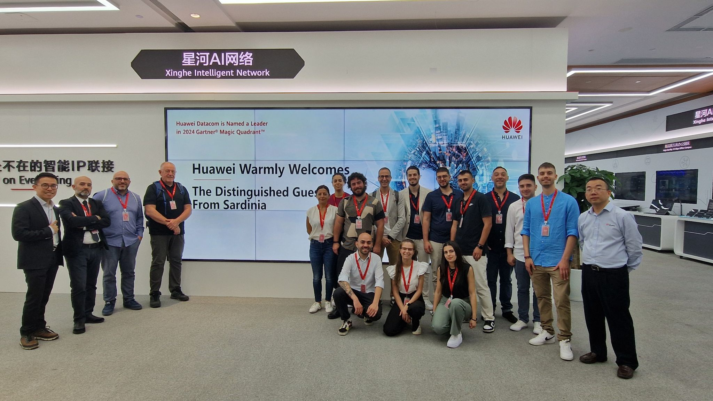
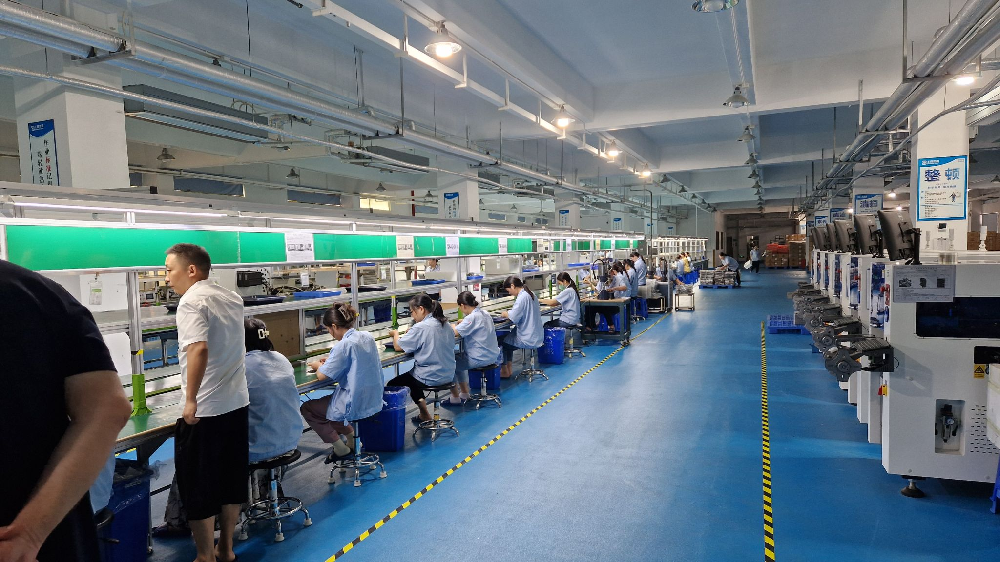
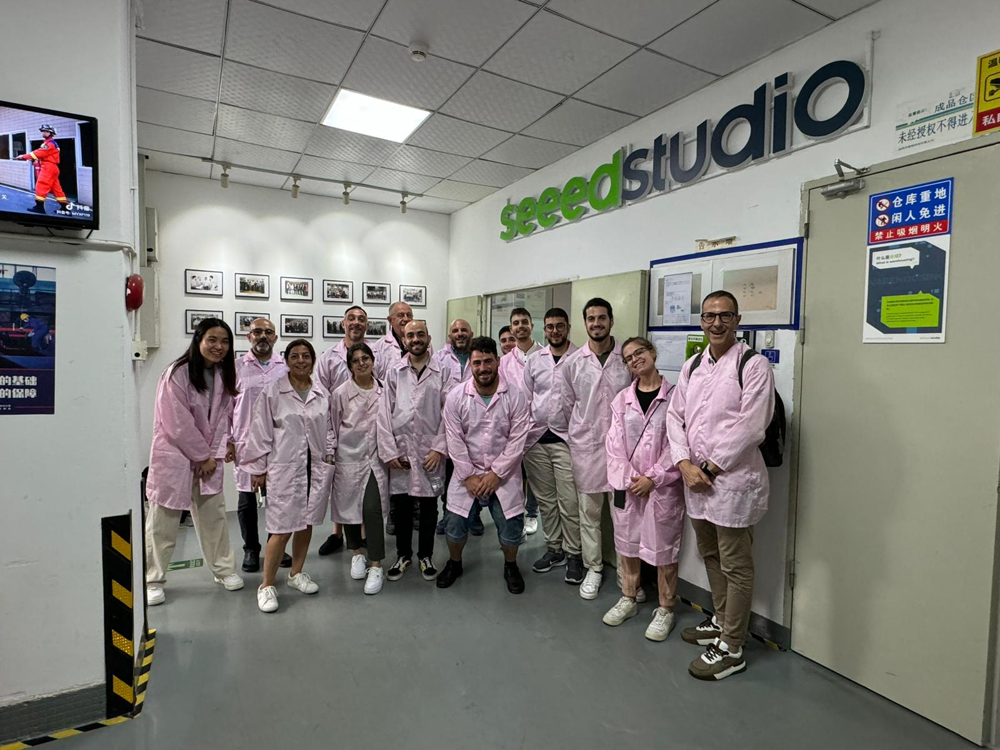
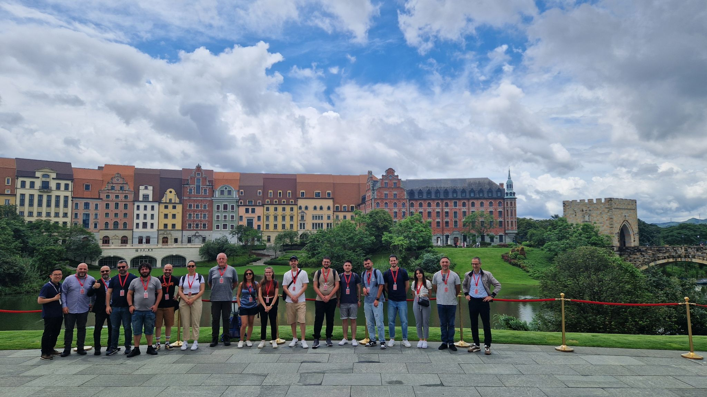
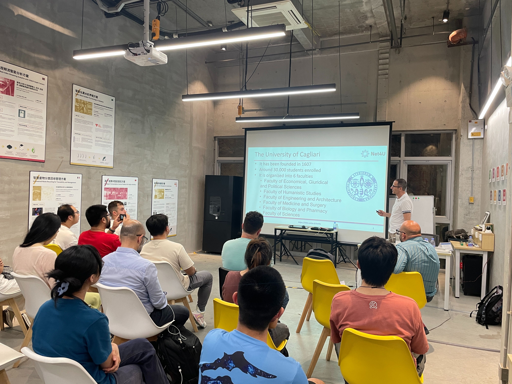

## 🌏✨ Trip to China - June 2024 ✈️🎓

The students of the Department of Electrical and Electronic Engineering (DIEE) have concluded an unforgettable trip to Shenzhen, Macau and Hong Kong. During the trip, the group explored the technological innovations of one of the most advanced technological hubs in the world.

The program included visits to universities in Hong Kong, Macau and Shenzhen, where the group discovered cutting-edge research centers. In Shenzhen, they had the opportunity to enter Huawei's headquarters and visit their smart city in Dongguan. The Seeed Studio and Famoco factories were also visited. The visit program also included other companies that have collaborative relationships with both Sardinian companies and the DIEE.

This trip offered students, teachers and professionals a unique opportunity to engage with international excellence and acquire an extraordinary knowledge and experience. 🚀📚

## 🌏✨ Viaggio in Cina - Giugno 2024 ✈️🎓

Gli studenti del Dipartimento di Ingegneria Elettrica ed Elettronica (DIEE) hanno appena concluso un viaggio indimenticabile nella regione di Hong Kong, uno dei poli tecnologici più avanzati al mondo. Durante il viaggio, il gruppo ha esplorato le innovazioni tecnologiche di Shenzhen, Macao e Hong Kong.

Il programma ha incluso visite alle università di Hong Kong, Macau e Shenzhen, dove il gruppo ha scoperto centri di ricerca all'avanguardia. A Shenzhen, hanno avuto l'opportunità di entrare nel quartier generale di Huawei e di visitare la loro smart city a Dongguan. Sono stati anche visitati gli stabilimenti di Seeed Studio e Famoco. Il programma delle visite ha incluso anche altre aziende che hanno rapporti di collaborazione sia con aziende sarde che con il DIEE.

Questo viaggio ha offerto agli studenti, ai docenti e ai professionisti l'opportunità unica di confrontarsi con le eccellenze internazionali e di acquisire un bagaglio di conoscenze ed esperienze straordinarie. 🚀📚

