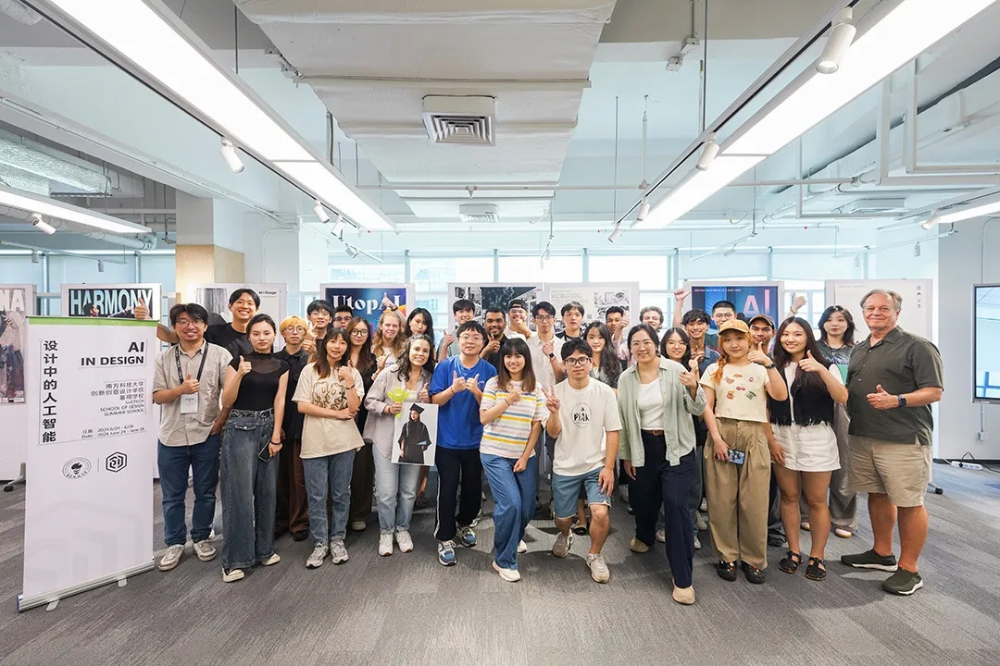
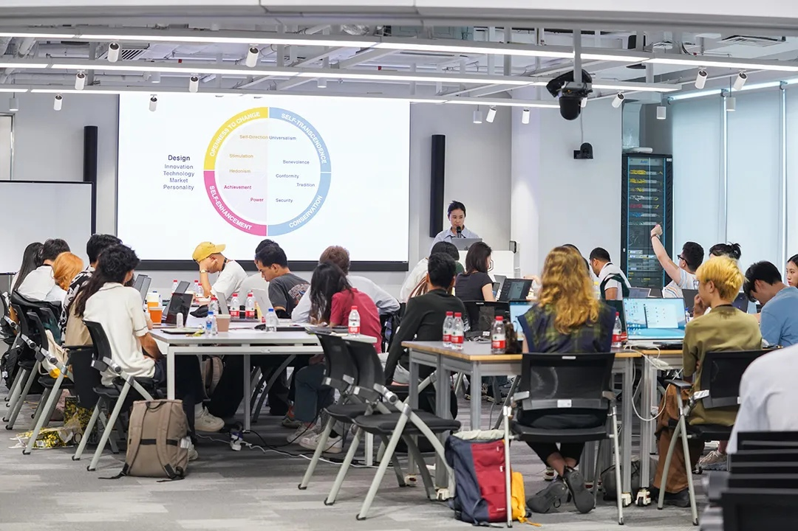
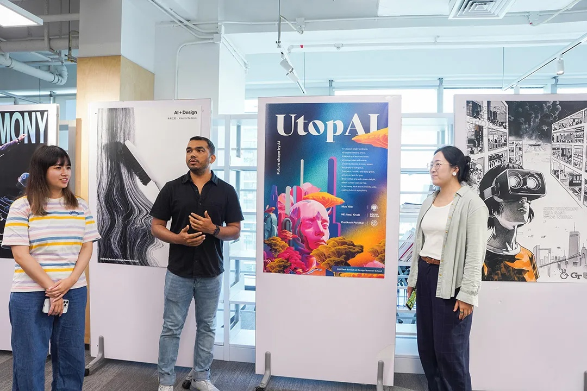

From June 24-28, 2024, SUSTech School of Design host the "AI in Design" Summer School. The program features lectures, workshops, project showcases, industry field trips, and cultural tours in Shenzhen, welcoming undergraduate and early graduate students with a background or interest in design, from prestigious institutions such as Georgia Institute of Technology, Rhode Island School of Design, The Hong Kong University of Science and Technology, The Hong Kong Polytechnic University, and Shenzhen technology University, etc. 

Participants' work:

