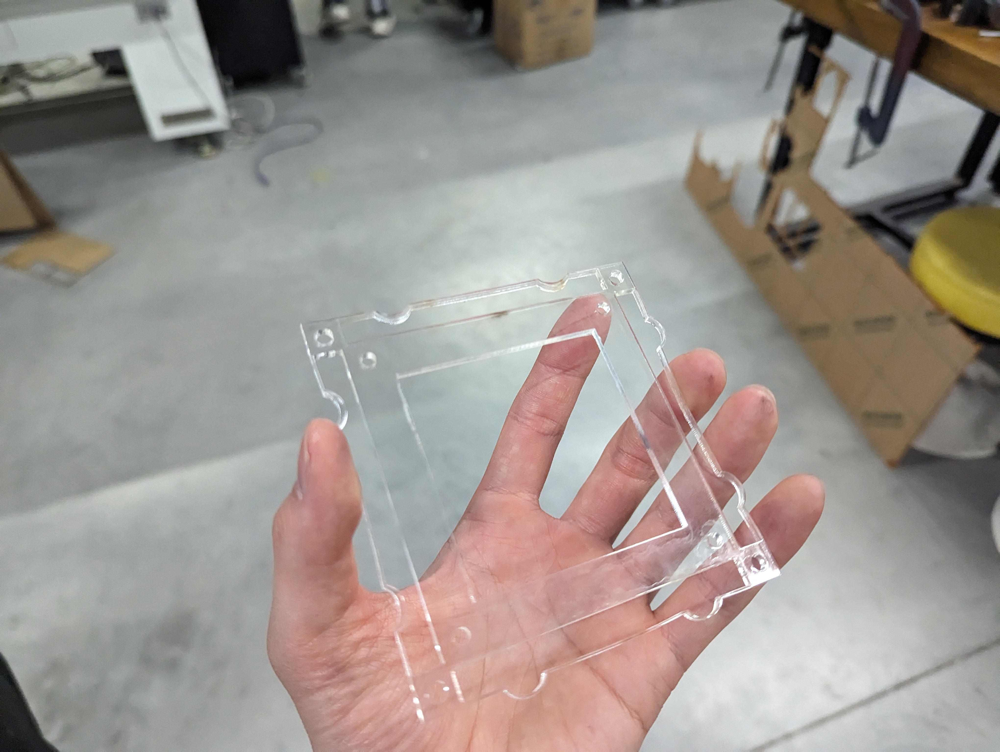
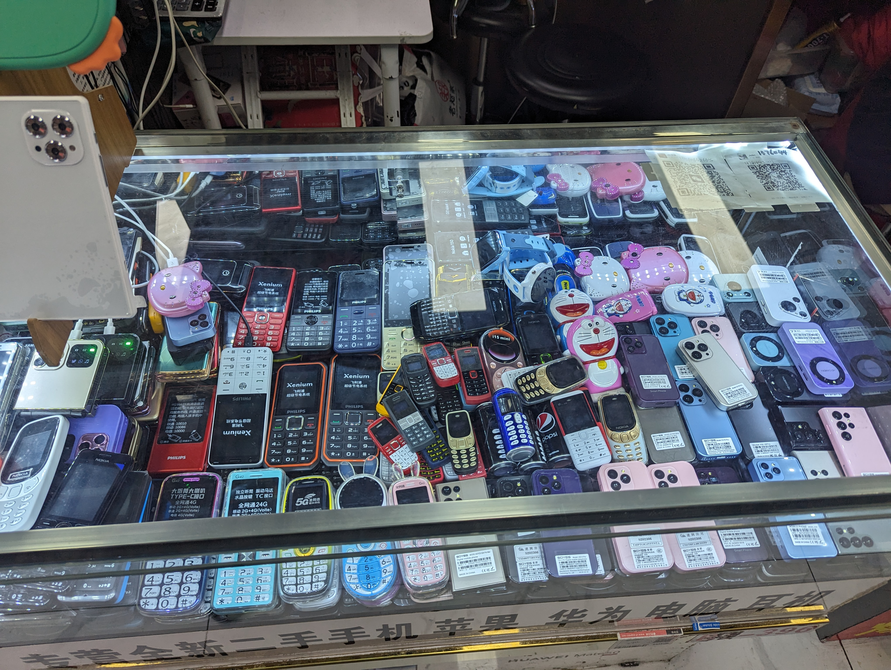

# Meta

This was my first time visiting Shenzhen. I used to visit China annually to see family when I was younger, but the last time I visited China was 6 years ago.

Thanks for making this happen, Cedric! We owe a lot to you for handling the logistics and making this happen for us, and I think everyone involved got a lot out of it.

# Travel

It's been a while since I've been on this long of a flight. The ferry was cool!

# HCI Symposium

We started our trip off with a busy week of HCI symposium. Among cool talks and projects (including introduction of this repo and its mission), some highlights were the HQB visit/tour, factory visits, Dafen art village, and the hackathon that finished the week off.

## Hackathon

I spent time with my friend Sami Kamkar hacking on a modular wall (discrete surface tiling) system for replacing drywall with functionality. Sami had mentioned that he was looking to remodel his place, and we both talked about how drywall was a pain. Crossing these pain points with my lab's work on discrete assembly, we played around with these ideas purely in the context of 2D surfaces rather than 3D.

We started out with rigid 2.5D geometry lined with conductors on the rims as an initial prototype, then moved to a 2D sandwich approach involving flexures. It was a tight race to finish by the deadline, but we made it work and had a functioning 2x2 example to demo.

Thoughts:
- Thanks to Seeed and Chaihuo Fablab for space and fab resources!
- Happy I got to hack with Sami!
- HQB being so close by was a valuable resource; it would be difficult to pull off something similar starting from scratch elsewhere.
- Discrete 2D is a very interesting space; I'm hoping to dig deeper when time allows.
- HQB has everything, so the real challenge is searching/finding what you're looking for. Unlike Digikey, there's no effective way to search for specific booths except by word of mouth and knowing someone.
    - A possible interesting intersection project for the Maker Camp repo/open manufacturing in Shenzhen would be to start a searchable index for resources in HQB.
    - There was some enthusiasm about coming back next year with Google Streetview-esque backpacks for documenting interesting components and their locations.
    - Another solution would be to increase time allocated for HQB exploration (giving it 3 days instead of 1, with at least one day being free play and allocating enough time to see a place, deliberate, and then return to buy from the same vendor).
- In general, hardware hackathons with a wide scope are difficult to plan for and execute.
    - This is amplified when the target crowd is interdisciplinary.
    - Better fab resource scheduling is necessary (similar to server task scheduling, LLM tokens, etc.). I've noticed this is a recurring issue in all hardware hackathons I've helped run or participated in so far.
    - Hackathons are great for novel ideas, but signal-to-noise ratio is hard to maintain—a really interesting opportunity for solutions that I'm curious to tackle more in the future.
- Despite these challenges, Seeed did a great job running the hackathon!

# HQB

My favorite brick and mortar stores in the States are:
- REI
- Microcenter
- Home Depot

HQB is like if a couple of city blocks were reconfigured into Digikey and Microcenters, so I was in candy land!

Some highlights:
- New soldering equipment and precision tools
- Portable electronics equipment
- Mini walkie talkies
- Cheap high-lumen LEDs
- Flex LED displays
- Specialty solder paste alloys for phone repair (advanced packaging)
- Specialty batteries
- Cool switches
- And of course, mini phones

Each vendor sets their own hours within HQB, but most tend to be open until 6-8pm.

Something very interesting I found was that many of the items sold at HQB were available on Taobao/AliExpress for price comparison, but at the same time, many items (like components) were also not necessarily available on platforms like LCSC or Digikey.

For certain types of components (such as electromechanical switches), HQB may have a larger variety than online vendors. It really makes sense why building out initial product runs might benefit from being situated near HQB; certain types of design explorations aren't possible elsewhere.

# Factories

I've visited a few factories in the States before, from both relatively low volume to very high volume, but I really appreciated the factory visits from this trip for several reasons:
- In my previous life as an R&D engineer, I spent time working to scale up prototypes using relatively established manufacturing flows. As a grad student designing my own manufacturing flows for new ways of electronics packaging, thinking about rearranging process steps at various scales to solve novel problems opens up many solutions.
- These factory visits allowed us to take pictures, so I took many (much better than my crude doodles from previous visits).
- I've been very interested in forms of material handling automation, which feels like one of the next steps for the fab community, and seeing many examples was inspiring.

Some other takeaways:
- Most factories (that I saw) were not fully automated, but instead typically featured semi-automated setups that required people for loading feedstock or making manual adjustments as part of the automated process.
- Rate matching is really important in industrial engineering, to the point that entire setups need to be replaced when upgrades are made (rather than piecemeal replacements).
- The environment feels very similar to American manufacturing environments; from the manufacturing facilities, to the cubicles, to the people. Shenzhen has a hardworking, experienced workforce, and I really appreciate learning about their perspectives.

## FPC
- The role of stiffeners for rigidity for PnP targets
- Neat tape carousel for semi-automated efficiency
- Neat tray loading queue for PnP process
 
## PCB Assembly
- Organization of projects was interesting; different solutions for different steps, each maximized for space efficiency

## MicroLED Display
- An impressive feat observed in the manufacturing ecosystem was the level of abstraction implemented to make the system sustainable.
- I expected to see microLED packaging at the microLED display factory, but they actually source the LEDs separately and only handle final assembly.
    - They have an impressive 3 in 1,000,000 LED assembly defect rate.
- They have specialized PnP machines that handle microLEDs, which supposedly have a 90,000 CPH PnP rate.
- They intend to start breaking into the smartphone display market at some point.

## Motors
- We visited the motor factory where they discussed plans to break into the robot joints market, apparently an important upcoming segment.
- One of my favorite souvenirs was from a pile of progressive stamping and drawing reels.

# Leadframe Designs

One great takeaway from this trip was increased familiarity with the digital Shenzhen manufacturing space, such as Alibaba.com.
I developed a new type of tile for discrete assembly.

# CNY

- Everything shuts down.
- Light show was impressive.
- Unfortunately, I missed the drone show by a day, so I'll be back!

# Can't Wait to Come Back!

