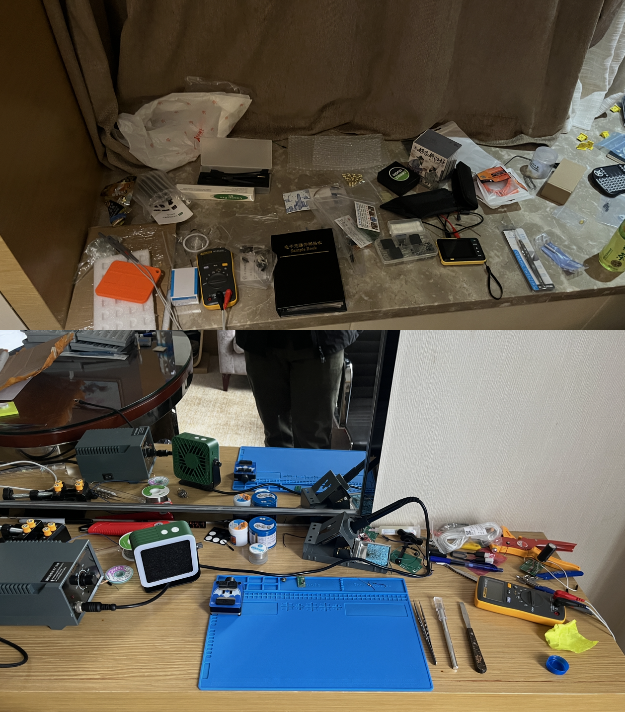

Hello everyone! 

Last November I learned that [Cedric Honnet](https://honnet.eu/) would host a cohort of 10 MIT researchers in Shenzhen for a month as part of the [Scalable HCI Summit](https://scalablehci.com/2025/program/). There were factory tours, browsing the electronics malls, and plenty of free time to catch up on research. To be supported in prototyping, in the best possble location for electronics development, with a group of similarly-inclined peers — this felt hand-made for me. I signed up immediately. 

When I got accepted, I felt both excited and nervous. This is the dream of every engineer; how can we make the most of it? I decided worrying over such a question was useless. We would simply go, and see, and do. What follows is an account of the happenings.

## Shopping
I love shopping, and especially for engineering things. The electronics markets mainly cater towards smartphone repair, but the ICs are so small that some of the best soldering people in the world are likely to be just a repairmen in the markets.

After one day in the markets, I had purchased a full set of soldering tools and consumables and set up in my hotel so I could begin prototyping. I initially worried that they would complain about this, but the hotel staff were very chill. I took this as a sign to go further, and over time I filled up both desks and my windowsill with cool parts or tools. 

## Sourcing
I did not expect certain parts to be so easy to find in Shenzhen, because I had assumed that the US had the best access to electronic components. As it turns out, Taobao can stock a ton of niche electronic components since each factory runs its own delivery. Here are 5x5mm and 10x10mm solar panels that I needed for my solar harvester. I couldn't find these for affordable (<20$) prices in the US, but here they came in 2 days for 3$ each. Incredible luck! Also, I found a battery vendor who could do ring batteries. This was the real test, because ring batteries in the US are sold only by 1-2 companies, most of which involve a few video calls with a technical team member before they'll sell you some. Here I was able to buy 100, no problems.

## Electronics development
I thought that having JLCPCB near the hotel would be essential for the development; but as it turns out, my main bottlenecked turned out to be testing. There were always so many fun things to do that I had trouble finding time to work on my research! Nevertheless, I ordered approximately a board every 4 days while in China. 

I didn't notice a large decrease in iteratino speed as far as the PCB goes. I think the shipping time was similar whether it was Shenzhen Express or DHL, which is kind of strange. Either way, I was able to make my boards as soon as I got there, and towards the end they started working! I'm building energy-harvesting sensors currently, and this is a working solar harvester.

## Food
Who would I be if I didn't mention the food? It was delicious, nutritious, varied, and cheap. I feel bad for Chinese tourists leaving the country, because they don't know how bad other countries are at cooking in comparison. 

# Shoutout to Cedric
The Scalable HCI Summit was a masterclass in research community building, and [Cedric Honnet](http://honnet.eu/)'s leadership was totally responsible. He created a comfortable environment where cutting-edge ideas could be made and new friends were all around. Beyond the flawless logistics of coordinating multiple factory tours and gatherings, Cedric showed a great talent for bringing together the perfect mix of researchers. His thoughtful choice of participants sparked countless collaborations and meaningful connections that will likely shape the future of HCI research. And it all comes down to trust; researchers love to do whatever they want, and by baking in some of this time in the schedule, Cedric kept the conversations flowing and the attendees excited. He is a rare catch to have been able to coordinate this. 

# Conclusion
Anyway, I had a very productive month in China. Feel free to check out [my website](andykong.org) for more updates!

