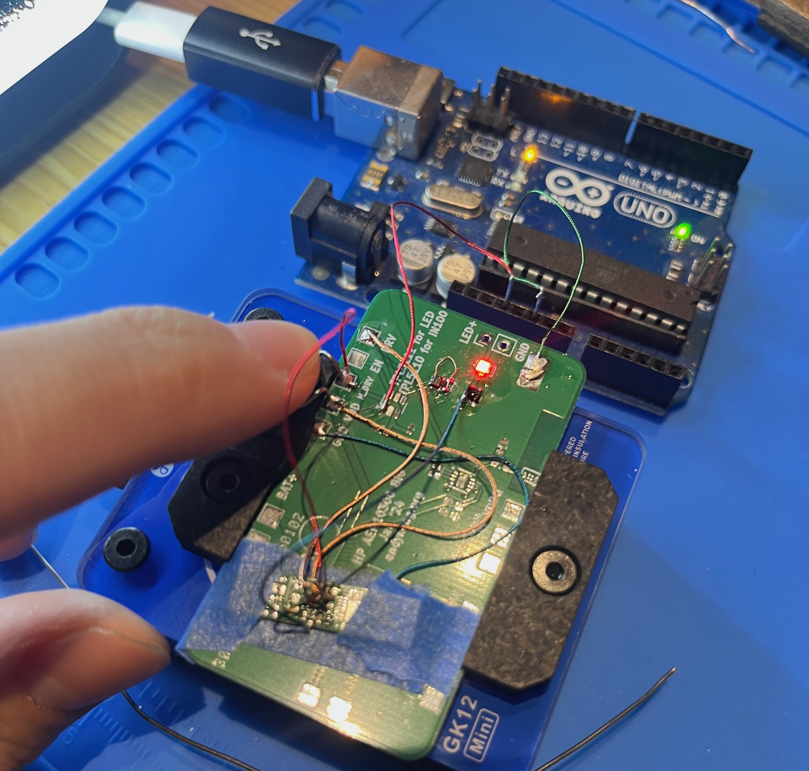

Hello everyone! 

Last November I learned that [Cedric Honnet](https://honnet.eu/) would host a cohort of 10 MIT researchers in Shenzhen for a month as part of the [Scalable HCI Summit](https://scalablehci.com/2025/program/). There were factory tours, browsing the electronics malls, and plenty of free time to catch up on research. To be supported in prototyping, in the best possble location for electronics development, with a group of similarly-inclined peers — this felt hand-made for me. I signed up immediately. 

When I got accepted, I felt both excited and nervous. This is the dream of every engineer; how can we make the most of it? I decided worrying over such a question was useless. We would simply go, and see, and do. What follows is an account of the happenings.

## Shopping
I love shopping, and especially for engineering equipment. Huaqiang Bei (HQB) is the main electronics mall, and its full of stalls selling capacitors, or sensors, or just different types of cables. Finding a particular specialized stall felt surreal; there was a capacitor stall where the sales guy told me about custom-cutting a metal casing for a specialty hi-fi audio capacitor, or a magnet stall which had both the biggest and smallest magnets I've ever seen. Incredible to just go out and see what's possible. 

- Every D-Sub connector

Besides parts, there are also tool vendors which cater towards smartphone repair businesses. Because the ICs have gotten so small and they have to do so much rework, some of the best solderers in the world are probably just repairmen working in HQB fixing phone screens and motherboards.

After one day in the markets, I had purchased a full soldering set which I set up in my hotel room so I could begin prototyping. I initially worried that they would complain about this, but the hotel staff were very chill. I took this as a sign to go further, and over time I filled up both desks and my windowsill with cool parts and tools. 

## Sourcing
Shopping is fun, but when it gets serious it's called sourcing. In the markets, you know it's possible to source anything, but you might not know which stall to go to. With the advent of online markets, a lot of HQB stalls have simply moved out and onto Taobao or Alibaba, where it's cheaper and easier and faster to do business. This is part of the reason why Shenzhen hipsters like to complain that HQB is dying, but I was still able to find everything I looked for. 

For instance, I was able to find ring-shaped batteries in-person, where negotiation is very quick and transparent. If you wanted to buy these in the US, you'd have to email someone, wait for an exorbitant quote, and wait for them to ship it to you. In China, I walked up to the stall, asked for 20, and went back to my hotel room. I almost couldn't believe it. 

On the right, I was also able to find some tiny solar panels for my solar sensor. These are sold for 15-25$ each in the US, but in China I was able to buy them on Taobao for 3$ apiece.

Sourcing here is surprisingly easy — I've gotten used to believing that buying the most advanced components would only be possible in the US, but it turns out those companies sell their parts widely.

## Overall electronics development
In the US, ordering a custom PCB takes ~7 days, half of which is shipping time. So I believed that having JLCPCB beside the hotel would be essential for development. As it turns out, my main bottleneck turned out to be testing — there were always so many fun things to do that I had trouble finding time to work on my research! 

Nevertheless, I ordered a board every 4 days during my trip. I didn't notice a large decrease in my iteration speed, mainly because the shipping time was 1-2 day with no option for rush (kuaidi) delivery. I thought this was weird because I had heard myths of a 1-day turnaround PCB from certain vendors. This is something I'd love to see, and would be glad to pay for next time I go.

Anyway, I was able to do 3-4 rounds of testing on my solar harvesting board, and towards the end they started working! Here is my current working solar harvester:

## Factories
Eric from Seeed was extraordinarily generous with his time and staff, and we were able to see many different kinds of factories in little groups. I am forever grateful to Ellie and the other Seeed sourcing people who were able to arrange meetings with factories matching our interests.

To me, the most interesting tours were with factories that started from raw materials and ended up with finished products. For instance, I visited a facotory making CR2032 and AA batteries — the first floor had machines punching out the cases from steel panels, and those went through various processes all the way until the top floor where the completed batteries were kept for a month to stabilize their electrolyte. 

We also visited several factories which turned half-finished goods into finished goods, for instance this luxury smart ring factory which took the same smart-ring internal and potted it into a gold outer shell. Less fun to watch though.

## Robotic future
The Chinese are ready for robots. Already there is drone delivery of food, and when you order you don't get to pick the method (person or drone), meaning it's already cost-competitive with human labor. The institute that hosted our workspace (Shenzhen AiRS) was centered on a "robotic development zone", a center where they hope to start casually introducing wheeled and legged delivery robots into the society and debugging problems early on. I found this quite exciting and future-minded, but I find it hard to imagine a world where a sophisticated humanoid robot is competitive with a random Chinese person's labor. Maybe as China gets richer, this will resolve itself. 

## Food
Who would I be if I didn't mention the food? It was delicious, nutritious, varied, and cheap. I feel bad for Chinese people leaving the country to be tourists because they don't know how bad other countries can be at cooking. 

## Funny
I was visiting this Buddhist temple near AiRS and saw this funny method for selling turtles. I asked the guy how old they were and he said they had each just turned 100. Luckily I have no idea how to take care of turtles so I didn't buy them, but I liked looking at them flying. 

# Shoutout to Cedric
The Scalable HCI Summit was a masterclass in research community building, and [Cedric Honnet](http://honnet.eu/)'s leadership was totally responsible. He created a comfortable environment where cutting-edge ideas could be made and new friends were all around. Beyond the flawless logistics of coordinating multiple factory tours and gatherings, Cedric showed a great talent for bringing together the perfect mix of researchers. His thoughtful choice of participants sparked countless collaborations and meaningful connections that will likely shape the future of HCI research. And it all comes down to trust; researchers love to do whatever they want, and by baking in some of this time in the schedule, Cedric kept the conversations flowing and the attendees excited. He is a rare catch to have been able to coordinate this. 

# Conclusion
Anyway, I had a very productive month in China. Feel free to check out [my website](andykong.org) for future updates!
