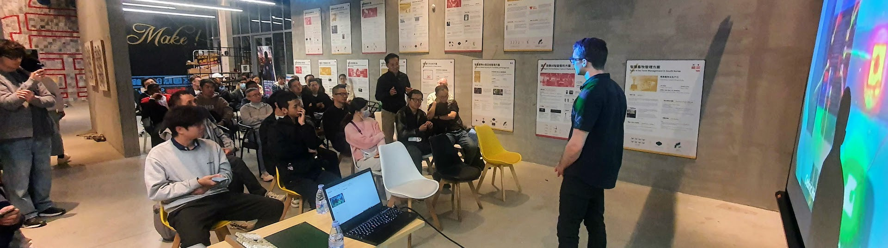
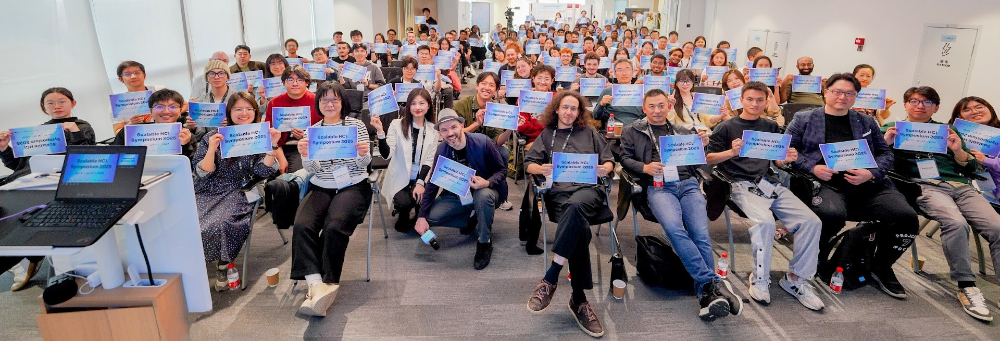
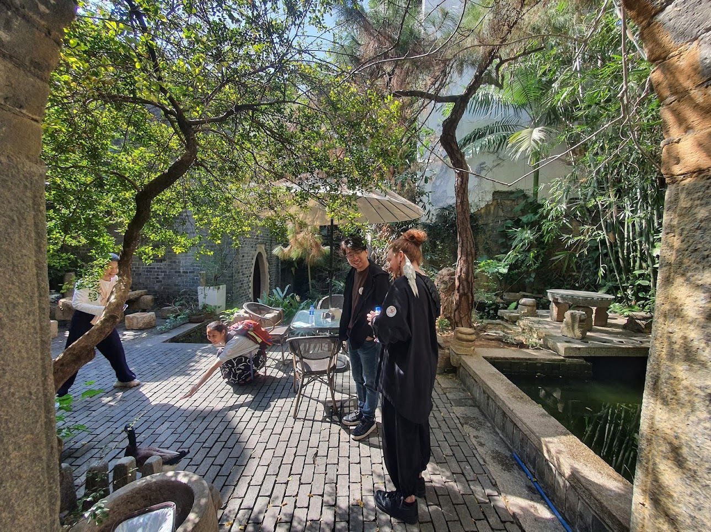
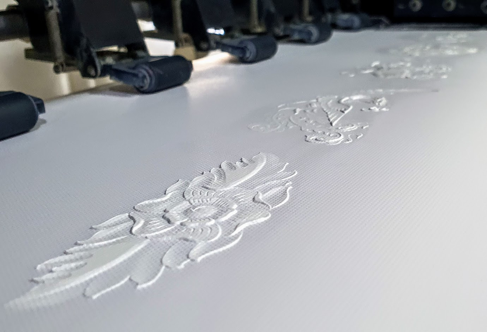
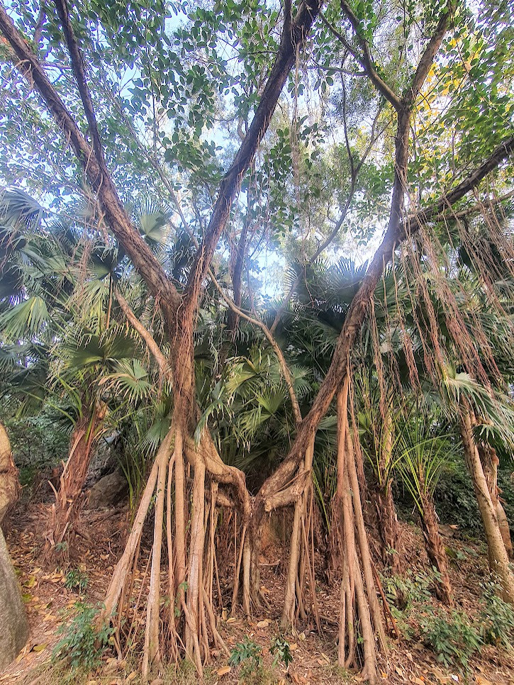

# _From Made-In-Shenzhen To Researched-In-Shenzhen_

  _By [Cedric Honnet](https://honnet.eu) ~January 2025_

---

  
  
   
  <em>Drone show for the 45th anniversary of Shenzhen</em>

---

- [1) Explorations](#1-explorations)
  - [🚀 Warmup and preparations](#-warmup-and-preparations)
  - [🎓 Scalable HCI Symposium](#-scalable-hci-symposium)
  - [🏭 Research Residency](#-research-residency)
  - [🇯🇵 Japanese visits](#-japanese-visits)
- [2) Observations](#2-observations)
  - [🔎 Some New Themes in 2025](#-some-new-themes-in-2025)
  - [🏭 From Prototyping to Manufacturing](#-from-prototyping-to-manufacturing)
  - [🎨 Fusion of Art, Culture, and Technology](#-fusion-of-art-culture-and-technology)
  - [🔮 Emergence of New Tools and Visions](#-emergence-of-new-tools-and-visions)
- [Acknowledgement](#acknowledgement)

---

About 15 years ago, [hackers](https://www.noisebridge.net/wiki/ChinaTrip) and makers started flocking to “**make in Shenzhen**” for speed and cost ([example](https://www.bunniestudios.com/blog/2007/made-in-china-dedication/)). A few years later, “**design in Shenzhen**” became an obvious evolution following the local ecosystem’s needs ([example](https://medium.com/szoil/shenzhen-white-label-electronics-b4fe4322d589)). Today, “**research in Shenzhen**” seems to be the next step, inviting us to co-create scientific knowledge, at _Shenzhen speed_!

Organizing a new implementation of the month-long [Research-at-Scale](https://www.media.mit.edu/posts/research-at-scale/) with MIT colleagues, the new residency is now amplified by a yearly [symposium](http://scalablehci.com/) for everyone, welcoming hundreds of artists, hackers, academic/industry researchers, entrepreneurs, factory workers, and engineers from everywhere.

**=> What happens when this cyberpunk city becomes a living laboratory?**

- **Speed is multiplied**: The HuaQiangBei market (HQB) can also empower academics or artists with uniquely fast prototype iterations (down to one-hour circuits fab + assembly).
- **Scaling becomes affordable**: local factories make customization and replication cheaper, amplifying impact beyond the publication.

This report lists some discoveries, explorations, tips, and observations:

# 1) Explorations

## 🚀 Warmup and preparations

To prepare the plans for the symposium and residency, I usually go to Shenzhen a few weeks in advance. It gives time to document the evolution of the electronic market, visit manufacturers, and attend some events.

This trip started with explorations with Paul Hamilton (AKA [ParkView](https://gitlab.com/parkview)), an old SZ _partner in crime_ since the [Noisebridge trips](https://www.noisebridge.net/wiki/NoisebridgeChinaTrip4) era. He also [organizes a trip](https://hackers-trip-to-shenzhen.blogspot.com) around the [SZ Maker Faire](https://www.shenzhenmakerfaire.com/) period (way too many awesome events - absolutely worth it), so we regularly exchange tips, or go discover together.

One of the notable visits was to an AliExpress “office”, where the seller specializes in iPad [screen driver boards](https://archive.is/0cQaS). These drivers allow using the LCD panel of an iPad and making an HDMI / USB-C screen. Being there allows getting a custom or recent firmware, and testing the visual differences with various versions of the hardware (difficult to see online).

  
 
<em>Left: the AliExpress office. Middle: the seller updating a board. Right: The iPad screen shop (HQB).</em>
 

Another SZ _partner in crime_ and ex-labmate, [Cayden Pierce](https://caydenpierce.com/), has built an international community focused on (smart) wearables and we gave presentations at the [Chaihuo](https://www.seeedstudio.com/chaihuo-makerspace): [https://mp.weixin.qq.com/s/QwoC7k2k9tg-HWNg1lntHQ](https://mp.weixin.qq.com/s/QwoC7k2k9tg-HWNg1lntHQ)

Cayden presented his open source smart glass research, which gave birth to a company: [Mentra](https://mentra.glass/) (and I presented a [textile sensor](https://hackaday.io/project/168380-polysense) project).

As for many symposiums, we organized a little informal event to welcome those who arrived earlier: [https://mp.weixin.qq.com/s/YpQZDmnSYy8kU1WAwqt5PQ](https://mp.weixin.qq.com/s/YpQZDmnSYy8kU1WAwqt5PQ)

Before the legendary BBQ, the 10 MIT residents presented their work, and [Eric Pan](https://www.chaihuo.org/maker/maker?id%3D58597) (Seeed + Chaihuo founder) introduced ideas for the symposium hackathon:

This event attracted people from all over the world, including Max Lobovsky ([Formlabs](https://formlabs.com/) founder), who was apparently satisfied with the BBQ, and generously donated a 3d printer to the makerspace:
[https://mp.weixin.qq.com/s/OSQsoeB9zWWizjmVTNXWGA](https://mp.weixin.qq.com/s/OSQsoeB9zWWizjmVTNXWGA)

## 🎓 Scalable HCI Symposium

### Keynotes

The month-long Research-at-Scale residency starts with an open gathering that welcomes about a hundred of academic/industry researchers, hackers, artists, entrepreneurs, factory workers, and engineers, from everywhere:
[http://scalablehci.com](http://scalablehci.com)

We had amazing opening keynotes from [Pedro Lopes](https://lab.plopes.org/) (uChicago) about Human Computer _Integration_, and by [Eric Pan](https://www.seeedstudio.com/about-us/) (Seeed Studio) about “How to make almost anything in Shenzhen”.

 

### Market and Factories

We obviously went to HQB to observe the evolution of the ecosystem. On the factory visit day, we started with [Seeed Studio](https://www.seeedstudio.com/fusion.html), then went to [iSource Asia](http://isource-asia.com), a PCB contract manufacturer, mostly notable for their Flex PCB capabilities. They’ve been helping many amazing **Open Hardware** projects, and when we visited they were working on a [Tiny Tapeout](https://tinytapeout.com/) batch, here is Sam Hu showing it:

 

On that day, we also went to visit injection molding factories and a 3D printing farm, but we went to visit many more after the symposium…

### Art village

Dafen is a historical neighborhood with hundreds of painting studios. It started with a focus on commission painting, but now they have many studios with extremely creative or provocative ideas, though traditional places are still very present…

  

On the technical side, a novelty of that visit was the discovery of 2.5D printers that can replicate the volume of acrylic paint (left is real paint, middle and right pictures are printed):

  

### AIRS: between Arts and Robotics

Our dear host [AIRS](https://airs.cuhk.edu.cn/article/998) / [SciArt Colab](https://sciartcolab.cn/) welcomed us for a full day of visits and talks, starting with the robotics labs, and the arts space visits:

 

The introduction by our host was followed by the [10 MIT residents](https://seeed-studio.github.io/MakerCamp/2025-01-MIT/) presentations, then the closing keynotes by [David Ramsay](https://www.media.mit.edu/people/dramsay/overview/) and [Pedro De Oliveira](https://tisch.nyu.edu/about/directory/itp/637028675.html):

 

### Hackathon

Our dear host [Chaihuo](https://www.chaihuo.org/) welcomed us again for a wild weekend of hacking and building, Seeed wrote a [detailed documentation](https://mp.weixin.qq.com/s/YNP__3Mc8gBYEphW1VyMmg), but here is an overview of the sparkling atmosphere:

 

## 🏭 Research Residency

### More manufacturers

This year, a few of us started with visits to micro camera factories. Some make 0.8mm sensors that can fit inside veins, or inside textile fibers!

 

Another notable visit was this smart ring factory that started as a jewelry company, and eventually integrated technology when it became the right time. They didn’t let us go take photos of their assembly lines but seeing the internal flex circuit of the rings was still instructive (for example, their choice of nRF52 was surprising as it’s not exactly the cheapest), and we got to see the traditional jewelry-making process.

 

Our dear host [Seeed](https://seeed.cc/) also welcomed us for a visit, and it was good to see their environment sensor network system being tested outside over the years (comparing plastic resistance to UV, enclosure's resilience to humidity or wind, etc). Their indoor climbing wall was also a big hit.

 

### My research

Academia limits my ability to share my work in progress, but I’ve been exploring scalable electronics miniaturization for more conformability in wearables and being in Asia is extremely powerful to understand the possibilities (or even push them). Using bare dies can be a way to save space on PCBs and they are generally assembled with wire bonding machines or flip chip processes, and the most affordable options can usually be found in toy factories. Below are photos of my visit to the manufacturer who also helped the TinyTapeout project, and Stuart shared great stories about it here: [youtu.be/XJmWoBJjvlI](https://youtu.be/XJmWoBJjvlI)

### More city exploration!

There is so much to see in Shenzhen, it would need multiple reports just for the arts, for the food, for the architecture, etc. Of course, it’s fairly obvious that it’s one of the most modern cities in the world (getting ready for their flying cars), but it also has “urban villages” older than most European cities (Nantou here):

 

Continuing on this opposition, the city is also full of new media art installations in the streets or parks, but it keeps its secular traditions such as the new year flower market, which is also full of delicious specialties from the region - you will have to visit to understand.

 

### More nature!

Last but not least, there are **mountains in the middle of Shenzhen**, with real tropical exotism that westerners love so much, but also jokes like this pair of alligators hanging out without any supervision:

 

## 🇯🇵 Japanese visits

MIT has a great alumni community in Japan, and sponsors too. We presented our work at the “[Media Lab Immersion Session Tokyo](https://www.media.mit.edu/events/media-lab-immersion-session-tokyo/)” and also went to Kyoto to visit [Murata Facilities](https://www.media.mit.edu/posts/media-lab-immersion-session-murata-facility-visit/) (factories and R&D labs):

Most EEs know them for their capacitors, but this is a gigantic corporation (70k people) and they do almost everything in electronics. We didn’t get to take pictures inside, except the ones below:

 

With my research about electronics miniaturization, it was good to see some of the samples of the smallest components available in the market (008004 = 0.25 x 0.125 mm). We also presented our work to some of the factory workers, and it was great to see their interest in the [FiberCircuits](https://media.mit.edu/projects/fibercircuits) demos at the end:

 

Of course, it was impossible to go to Tokyo without visiting [Akihabara](https://en.wikipedia.org/wiki/Akihabara) or [Rhizomatiks](https://rhizomatiks.com/en/) (showing their next secret project in progress):

 

---

# 2) Observations

🌍 **Interdisciplinary and Global Reach**: Research At Scale significantly grew its reach by starting with the **Scalable HCI Symposium**, with over 100 participants from more than 20 top institutions worldwide (MIT, Harvard, CMU, NYU, Stanford, University of Chicago, etc.). This marked the program’s evolution from a primarily MIT-driven initiative into a truly **international, cross-disciplinary hub** for hardware and HCI research ([Seeed Studio blog](https://seeedstudio.com/blog/2025/02/08/maker-camp-in-shenzhen-2501/)).

Partnerships deepened with **AIRS / CUHK, Chaihuo / Seeed**, expanding the program’s ecosystem of **academia, art-tech, and industry**. Moreover, we invited participants from outside MIT: the new **Affiliate Cohort** included startup founders, independent artists, and industry researchers. This added perspectives far beyond the original academic universe (see [reports](https://seeed-studio.github.io/MakerCamp/2025-01-MIT/affiliates)).

## 🔎 Some New Themes in 2025

- **Wildlife Tech at Scale** – Patrick’s _CollarID_ wearable for lions and dogs added a conservation-focused track, distinct from the more urban sensing projects of earlier years ([Patrick’s report](https://seeed-studio.github.io/MakerCamp/2025-01-MIT/Patrick)).
- **Biomedical Electronics** – Jason developed ultrasound driver boards, EEG microneedles, and leveraged low-cost components from Shenzhen markets—opening a biomedical hardware pathway not present before ([Jason’s report](https://seeed-studio.github.io/MakerCamp/2025-01-MIT/Jason)).
- **Self-Reproducing Robotics** – Yuhan and Lingdong’s _CellBot_ project introduced bio-inspired self-assembly and replication, with modules copying a shared “DNA.” This represents a conceptual leap from modular devices to self-reproducing robotic systems ([Yuhan’s report](https://seeed-studio.github.io/MakerCamp/2025-01-MIT/Yuhan), [Lingdong’s report](https://seeed-studio.github.io/MakerCamp/2025-01-MIT/Lingdong)).
- **Open Source Smart Glasses** – Cayden documented their creation from scratch, enabled by Shenzhen’s ecosystem ([LinkedIn](https://www.linkedin.com/posts/cayden-pierce_building-the-smart-glasses-os-from-1000-activity-7282832837454528512-EgRw)), and eventually giving birth to a company (Mentra) accelerated by Y Combinator.

## 🏭 From Prototyping to Manufacturing

Participants emphasized that Shenzhen is no longer just about iteration speed but also about **process mastery and supply chain agility**.

- **Human–Machine Mix** – Alan observed semi-automated lines where people guide, adjust, and optimize production—underscoring Shenzhen’s hybrid approach to efficiency ([Alan’s report](https://seeed-studio.github.io/MakerCamp/2025-01-MIT/Alan)).
- **Custom Batteries in Minutes** – Patrick sourced $1 custom-fit cells almost instantly, a striking example of how local manufacturing adapts to highly specific needs ([Patrick’s report](https://seeed-studio.github.io/MakerCamp/2025-01-MIT/Patrick)).
- **Tools as Treasures** – Vineet highlighted HQB not only for parts but as a _toolmaker’s paradise_—from lab-grade microscopes to oversized novelty screwdrivers, reframing Shenzhen as a place where the tools themselves inspire ([Vineet’s report](https://seeed-studio.github.io/MakerCamp/2025-01-MIT/Vineet)).

## 🎨 Fusion of Art, Culture, and Technology

- **Ethnic Music Meets Digital Instruments** – Lingdong created a digital nose-flute and sampled Hainan folk instruments, blending cultural heritage with digital sound design ([Lingdong’s report](https://seeed-studio.github.io/MakerCamp/2025-01-MIT/Lingdong)).
- **Cross-Cultural Tech-Art** – Joey explored alternative Shenzhen art scenes ([Joey’s report](https://seeed-studio.github.io/MakerCamp/2025-01-MIT/affiliates/Joey)), while Vineet jammed with AIRS artists, and Koi shared reflections on tech-art immersion ([link](http://xhslink.com/a/RigXOF3URD54)).
- **Critical Humor** – Vineet’s hackathon project _“YOU ARE A CHICKEN”_ satirized digital dopamine loops, injecting playful critique into tech culture ([Vineet’s report](https://seeed-studio.github.io/MakerCamp/2025-01-MIT/Vineet)).

## 🔮 Emergence of New Tools and Visions

Beyond prototypes, 2025 marked forward-looking system-level thinking:

- **Shanzhai Reframed** – not as copying but as **openness**, with public reference designs (_gongban_) enabling remix innovation (more [here](https://seeed-studio.github.io/MakerCamp/2025-01-MIT/affiliates/Oliver)).
- **ShenzhenGPT** – Introduced by Seeed, positioning Shenzhen as an AI-enhanced innovation ecosystem ([Seeed blog](https://seeedstudio.com/blog/2025/02/08/maker-camp-in-shenzhen-2501/)).
- **Open Manufacturing Whitepaper** – Seeed released strategic guidelines on design-for-manufacturing, supplier relations, and IP protection—formalizing Shenzhen’s tacit know-how into shared knowledge ([Seeed Studio blog](https://seeedstudio.com/blog/2025/02/08/maker-camp-in-shenzhen-2501/)).

# Acknowledgement

Huge thanks to those who made this possible:

- [Seeed Studio](https://www.seeed.cc/) / [Chaihuo](https://www.chaihuo.org/): Thank you so much Ellie and Eric for flying us all the way from Boston to Shenzhen, welcoming us in the factories, sharing so many tips, contacts, and the makerspace\!
- [SciArt CoLab](https://sciartcolab.cn/) / [AIRS](https://airs.cuhk.edu.cn/article/998): Thank you so much Zinn and Shaomin for hosting us so well, showing us the art scene in Shenzhen, and welcoming us in your space for the residency and the symposium…
- [Immersive Design Group](https://immersivedesignresearch.com/) / [SUSTech](https://designschool.sustech.edu.cn/): Thank you so much Seungwoo for being present since the beginning, co-creating this unique symposium, with the amazing [organizing team](https://scalablehci.com/2025/organizers/)\!

