# Research at Scale – Shenzhen, January 2025 Francisco Ramirez Serrano

---

## Summary of this amazing experience!!!

  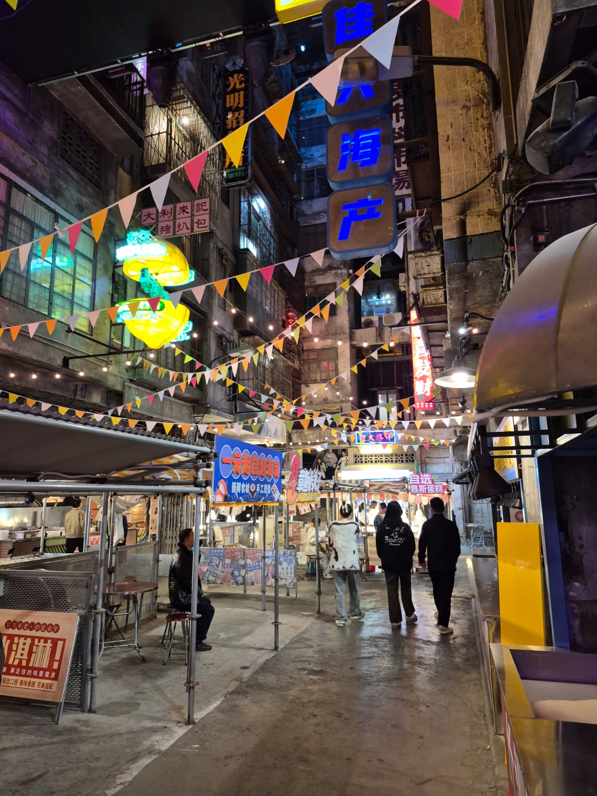

<em>Wonderful lighting atmosphere of Shenzhen</em>

This trip was the highlight of my semester and, honestly, my time at MIT so far. I’m 27 years old, and I can confidently say this was a once-in-a-lifetime experience.  

First, **Shenzhen is an incredibly technologically advanced city**—from drones delivering packages to insanely efficient manufacturing processes, cutting-edge robotics, and the super apps that handle everything from payments to transportation. The city's infrastructure and services are on another level.

Second, **the people I met were some of the most driven individuals I've ever encountered**. Everyone seemed to have a strong sense of purpose, and being around them was inspiring.

Third, **the variety of activities I took part in—factory visits, a hackathon, and the HCI symposium—were invaluable**. As a first-year PhD student, these experiences have already shaped my professional path in meaningful ways.

### A Huge Thanks to Cédric Honnet

I want to give a big thanks to Cédric Honnet for all the effort he put into making this trip run smoothly. He took care of the logistics, helped set up important meetings, and always had great advice on how to get the most out of each factory and lab visit. He also solved last-minute issues—from hotel reservations to connecting with local contacts—and offered thoughtful ideas on how to apply what we learned to our MIT projects. Without his help, I don’t think this trip would have been nearly as productive. His dedication and willingness to support others really show how valuable he is as a colleague and mentor in research.

---

## ✈️ The Flights & Getting Set Up

I flew over from Geneva as I had spent Christmas in Europe, with a layover in Paris. For the return, I flew directly from Hong Kong to Boston. This was the longest flight I’ve ever taken at **15 hours**. Flying into Hong Kong was easy.

### Tips for Travelers

  

<em>Using Google Translate to communicate was key! Make sure to download the offline version!</em>

- **Get a CSL prepaid SIM card** at 7-Eleven in Hong Kong for about **$10 USD**. It works in **China, Hong Kong, and Macau**.  
- **Currency confusion?** The Hong Kong dollar (HKD) is worth **0.13 USD per 1 HKD**, so don’t panic if things seem expensive at the airport!  
- **Ferry to Shenzhen:** I took the ferry to and from Shenzhen and the Hong Kong airport, followed by an additional **50-minute Didi ride**.  
- **Beware of unofficial taxis** at the Shenzhen terminal. Dodgy individuals may approach you for a ride. **Stick to Didi** for safety and convenience.  
- **Didi is prepaid**, so you don’t need to worry about payment issues while setting up your account.  
- **International payment options:** My **Revolut** card and **Swiss Visa** worked fine with both **Alipay and WeChat Pay**.  
- **Ferry ticket tip:** As soon as you land, **go straight to the ferry ticket booth**—they need time to process your luggage. While waiting, you can buy and set up your **7-Eleven SIM card**, but don’t do it the other way around like I did!

---

## 🌆 The City, Accommodation & Communication

We stayed at the **City Hotel**, a fantastic location that was extremely central to all relevant trip activities. The receptionists were very helpful and assisted me in placing orders directly to the hotel. Additionally, there was a temple nearby, as well as gym facilities that provided a great way to unwind after long days.

To communicate with drivers, restaurant workers, and when negotiating, I highly recommend downloading the **Google Translate** app, as well as an Android app called **Instant Translate**, which allows you to translate anything on screen with a single tap. However, most service industry workers were prepared to translate using their own phones, so I didn’t encounter many difficulties.

### Tips for Travelers
- **Google Translate & Instant Translate** – Essential for seamless communication.
- **Most service workers will help** – Don't hesitate to show text translations on your phone.
- **City Hotel’s location was perfect** – Great access to key areas and helpful staff.

---

## 🔬 Seeed Studio Visit

We visited **Seeed Studio**, founded by CEO **Eric Pan** in 2008. We were delighted to learn about their latest sensor expansions, including their new weather sensors. Additionally, we had the opportunity to observe their wind tunnels in action, which was particularly exciting for me, as I previously worked with wind tunnels in a publication on **insect-inspired self-righting mechanisms for fixed-wing drones**. You can read more about that research [here](https://ieeexplore.ieee.org/document/9479684).

At MIT, we frequently use **Seeed Xiao** modules in our projects. The Xiao is a compact microcontroller that offers powerful performance in a small form factor, making it ideal for various applications.

  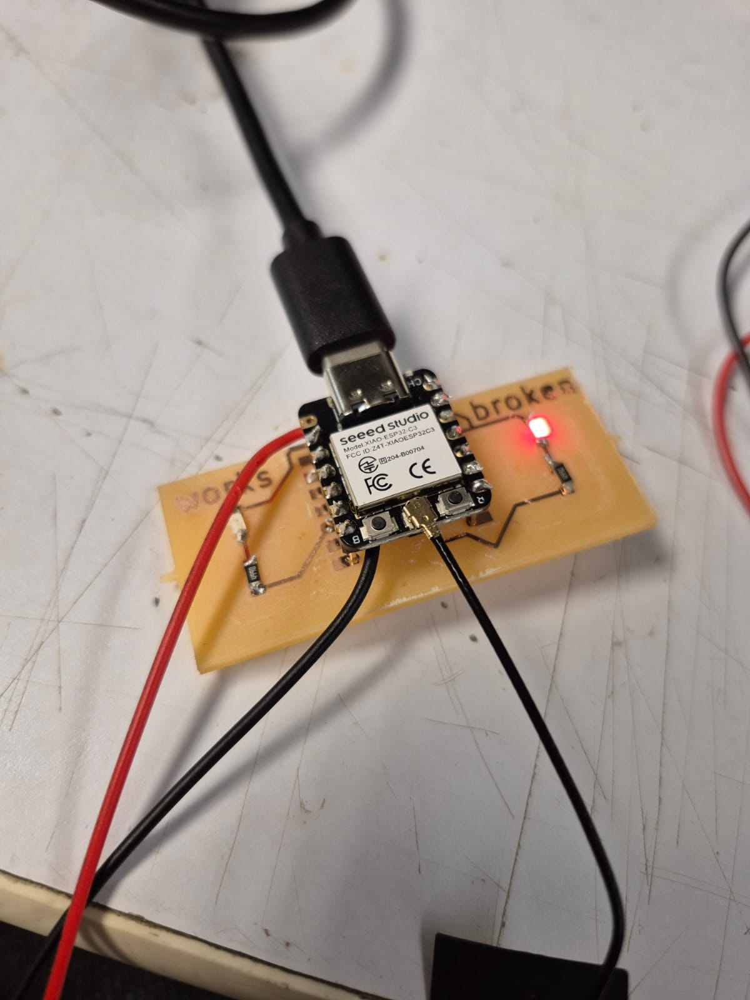

<em>We often use Seeed Xiao microcontrollers at MIT for compact, powerful prototypes</em>

  <table>
    <tr>
      <td>
        

          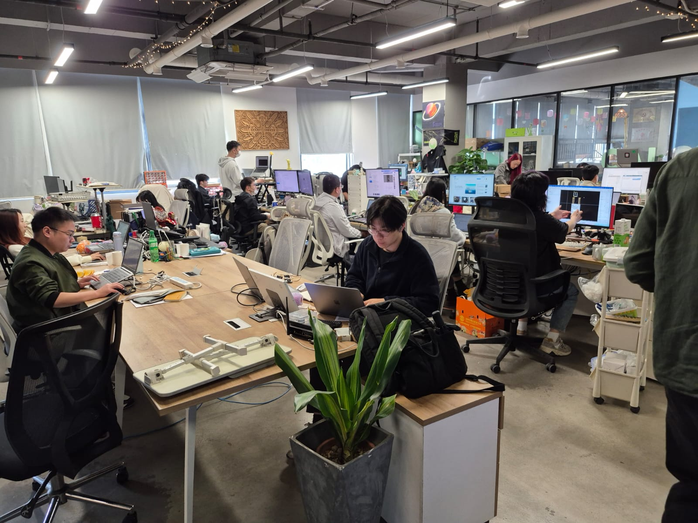
        

        
<em>Hardworking Seeed Studio employees</em>

      </td>
      <td>
        

          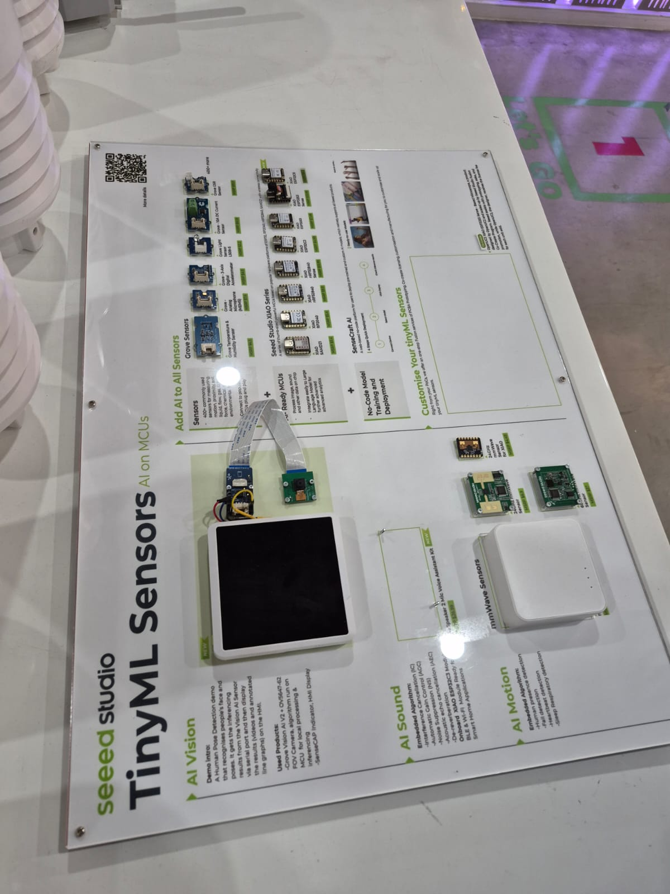
        

        
<em>Seeed Studio’s wide array of products for ML applications</em>

      </td>
    </tr>
  </table>

Eric Pan, the CEO of Seeed Studio, is incredibly kind and, to my surprise, a surfer! As a fellow enthusiast, I really appreciated our conversation and hope to meet him again in the future. A huge thank you to Seeed Studio for sponsoring this trip!

---

## 💻 Hackathon
Our team participated in the **Smart Space Hackathon**, co-hosted by Chaihuo, Seeed, and Anker, where over 30 participants from academia, industry, and the local maker community collaborated to build innovative smart environment solutions. We developed **origami-based adaptive structures** that dynamically responded to their surroundings, utilizing fabrication techniques inspired by my research on **pop-up MEMS devices** ([read more here](https://advanced.onlinelibrary.wiley.com/doi/abs/10.1002/admt.202301940)).

The project demonstrated how **rapid manufacturing methods** can be applied to deploy self-transforming structures, pushing the limits of **miniaturization and adaptive design**. This approach significantly shortened prototyping cycles while preserving functional integrity. The entire team worked tirelessly, iterating on multiple design variations in a short timeframe. Our dedication paid off—we were honored to win a **hackathon prize** [read more here]([https://advanced.onlinelibrary.wiley.com/doi/abs/10.1002/admt.202301940](https://scalablehci.com/2025/program/)) for our innovative concept and execution! Huge thanks to my team Lin Kekun, Zhang Keliang, Norman, Fang Zihao, Gu Jiaqi.

  <table>
    <tr>
      <td>
        

          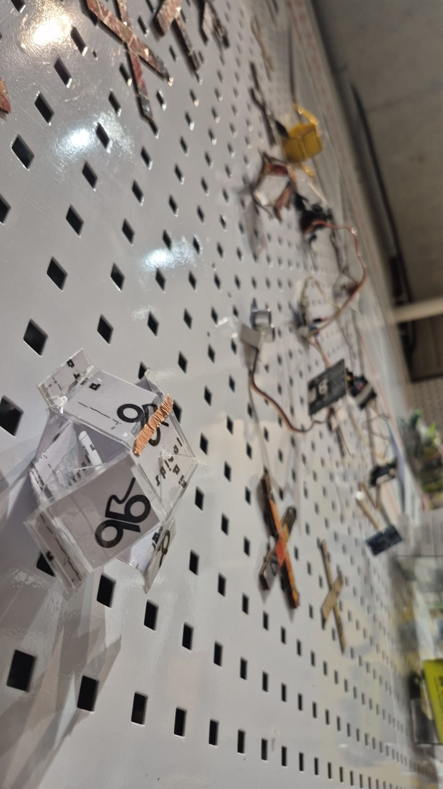
        

        
<em>Hackathon Final Wall View 1</em>

      </td>
      <td>
        

          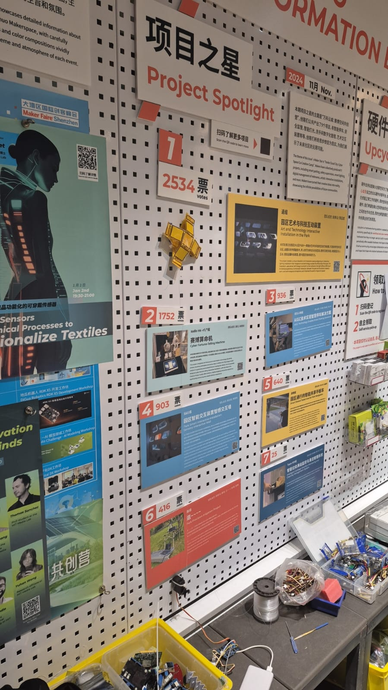
        

        
<em>View 2</em>

      </td>
      <td>
        

          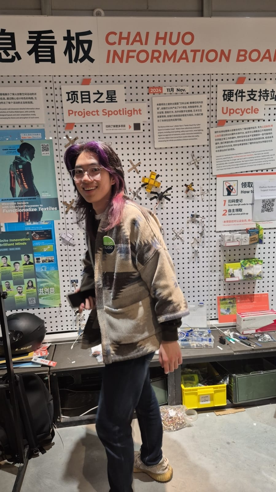
        

        
<em>View 3</em>

      </td>
    </tr>
  </table>

  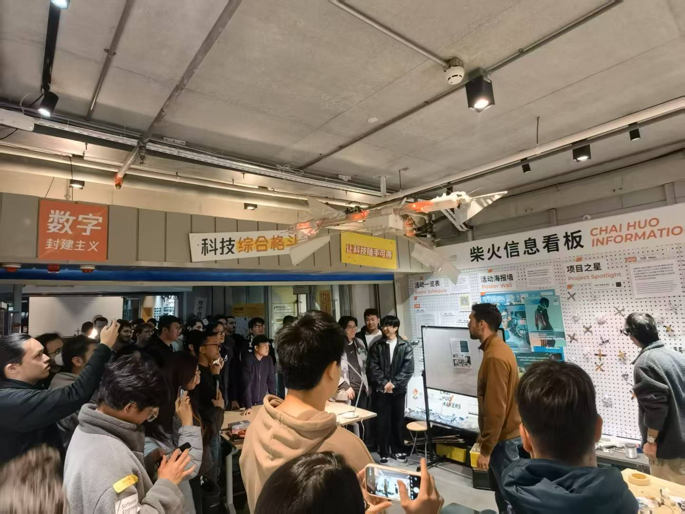

<em>Hackathon Final Presentation</em>

## 🏦 Academic University Visits

During my recent travels across Shenzhen and Hong Kong, I had the chance to visit several universities renowned for their cutting-edge research in robotics, AI, and micro-engineering. I was excited to meet faculty members, tour their facilities, and learn about ongoing projects involving miniature and bio-inspired robots.

 

  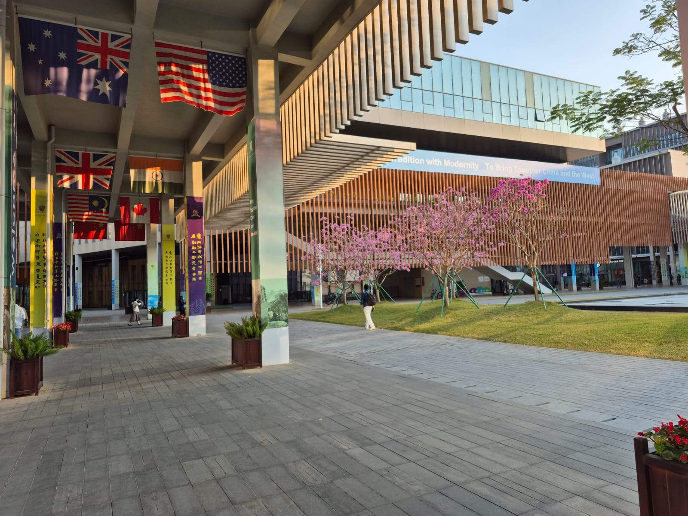
  
<em>An Inviting Campus Entrance</em>

I found each campus to have its own unique environment—some emphasized collaborative design spaces, while others fostered close-knit research teams. Regardless, the emphasis on innovation was consistent across all the schools I visited.

 

  <table>
    <tr>
      <td align="center">
        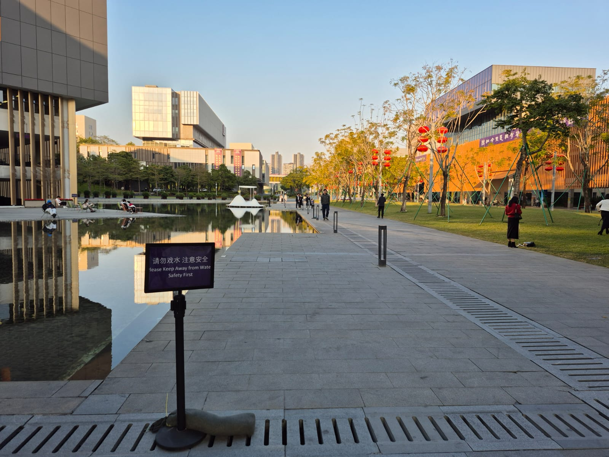
        
<em>An impressive blend of buildings and nature</em>

      </td>
      <td align="center">
        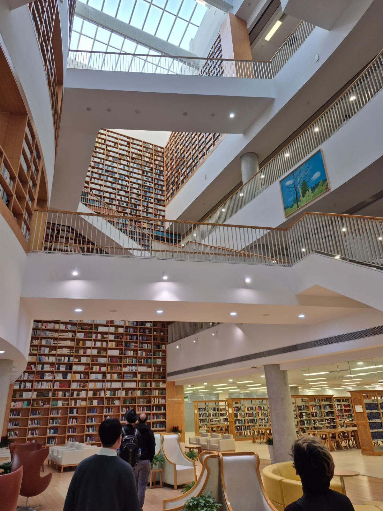
        
<em>Library</em>

      </td>
    </tr>
    <tr>
      <td align="center">
        
        
<em>Miniature of the University</em>

      </td>
      <td align="center">
        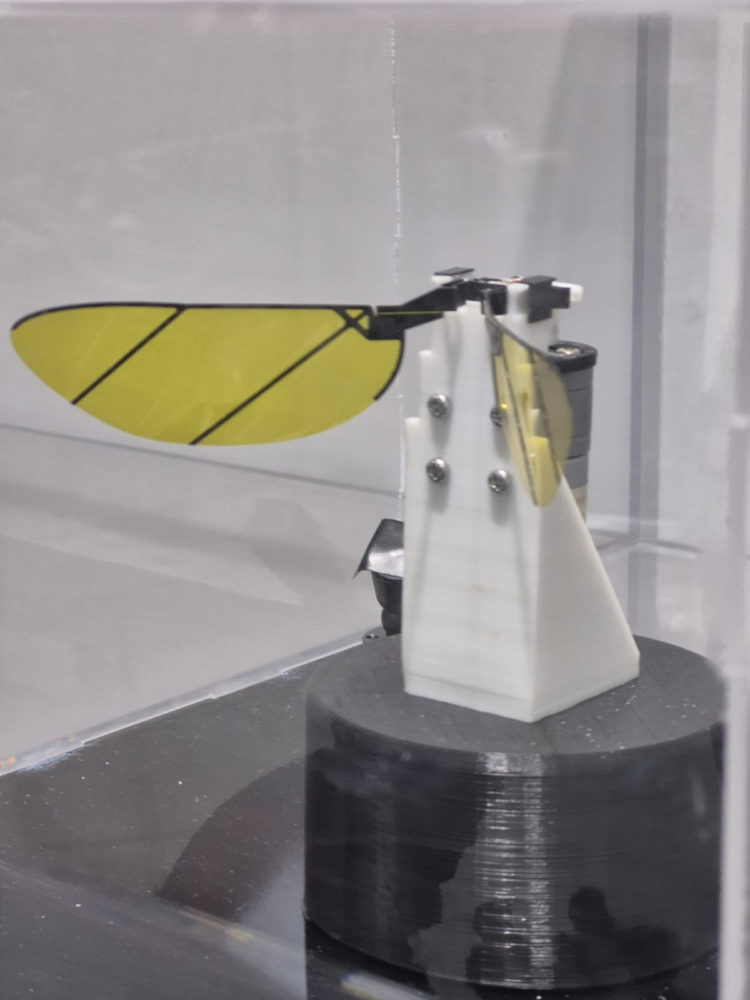
        
<em>Origami Robotic Insect Wing Exhibit</em>

      </td>
    </tr>
  </table>

 

### My Impressions of Shenzhen and Hong Kong Universities

- **Southern University of Science and Technology (SUSTech), Shenzhen**  
  I was impressed by their hands-on approach to robotics, microfabrication, and materials science. They have modern research facilities and ongoing partnerships with international institutions—this helps in pushing the boundaries of micro-scale robotics and advanced manufacturing techniques.

- **Shenzhen Institute of Artificial Intelligence and Robotics for Society (AIRS)**  
  AIRS stands out for its focus on AI-driven solutions in robotics. I learned about their autonomous systems and microrobotics projects, which often involve knowledge exchange with global research labs.

- **The Hong Kong University of Science and Technology (HKUST)**  
  Their robotics and automation labs are incredible. I saw demonstrations of micro aerial vehicles and small, agile robots that can be deployed in various industrial settings.

 

### Up Close with the Origami Robotic Insect Wing

One of the most fascinating demonstrations I saw was the **origami robotic insect wing**. This tiny marvel is constructed using ultra-thin materials that can fold and unfold with high precision. The lightweight and flexible nature of origami-inspired wings allows for efficient flapping motions, closely mimicking the flight of real insects. Researchers at these universities, in tandem with labs at Harvard, are pushing the limits of what’s possible in terms of size, power consumption, and agility.

I left these universities inspired and full of ideas. The innovation on display in Shenzhen and Hong Kong truly showcases the future of robotics—where technology becomes smaller, smarter, and more interconnected by the day.

---

## 🏭 Factory Visits

During my time in Shenzhen and Dongguan, I decided to hop on a few local buses to explore the region’s vibrant manufacturing ecosystem. These trips often took around an hour, winding through industrial areas and bustling city streets—an experience in itself. I was eager to see how some of the world’s most efficient production lines operate behind the scenes.

 

  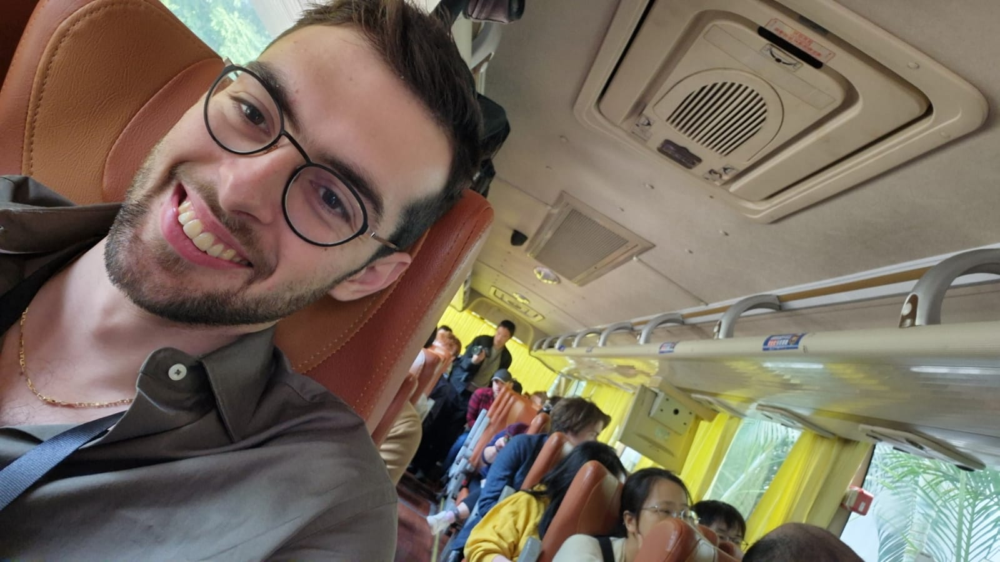
  
<em>Bus rides typically last around an hour, giving me time to prep for the upcoming factory tours.</em>

 

### Behind the Scenes of Cutting-Edge Manufacturing

Each factory I visited had its own specialty, whether it was precision assembly, automated systems, or testing and quality control. I was amazed to witness how these facilities leverage advanced machinery to speed up production while maintaining strict quality standards.

  <table>
    <tr>
      <td align="center">
        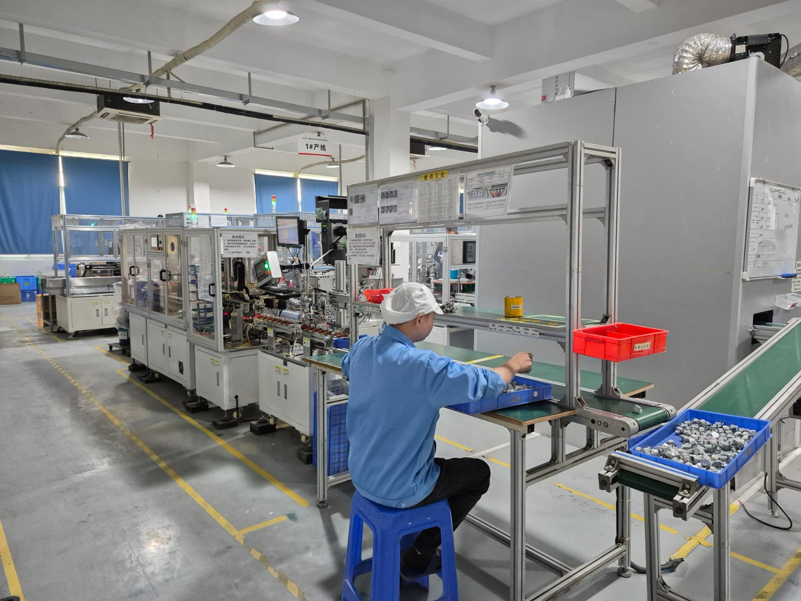
        
<em>Advanced Factory Machinery</em>

      </td>
      <td align="center">
        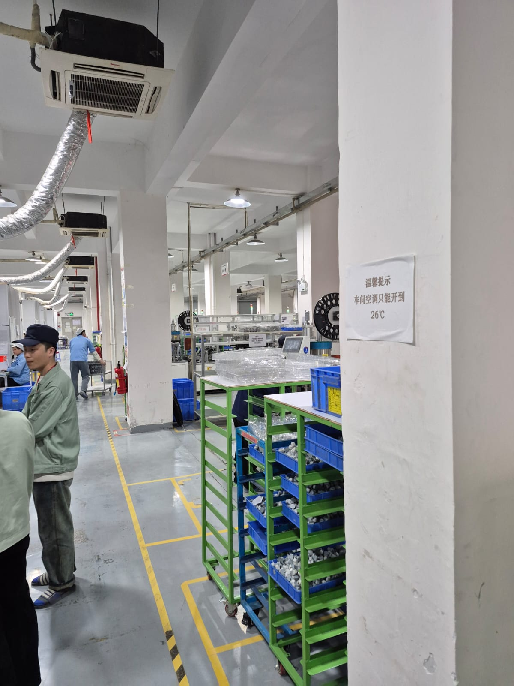
        
<em>Production Line</em>

      </td>
      <td align="center">
        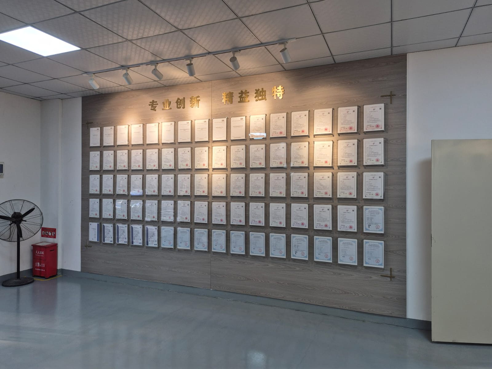
        
<em>Certificates</em>

      </td>
    </tr>
    <tr>
      <td align="center">
        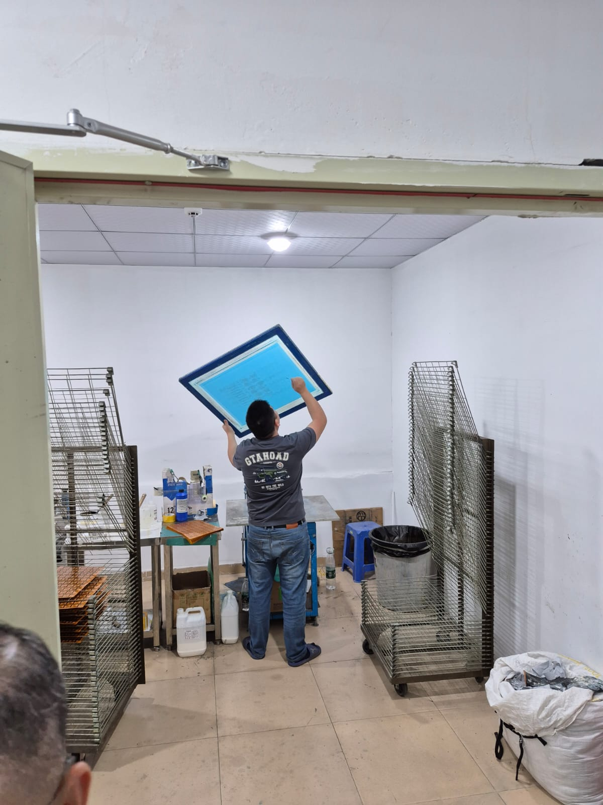
        
<em>Precision Assembly</em>

      </td>
      <td align="center">
        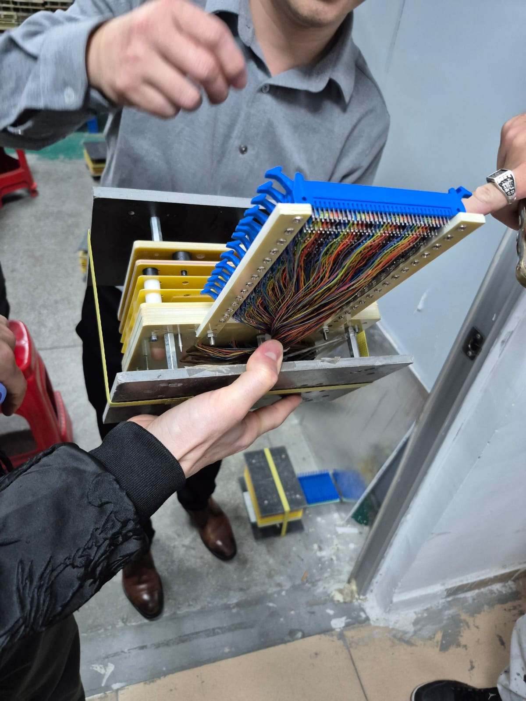
        
<em>Testing Equipment</em>

      </td>
      <td align="center">
        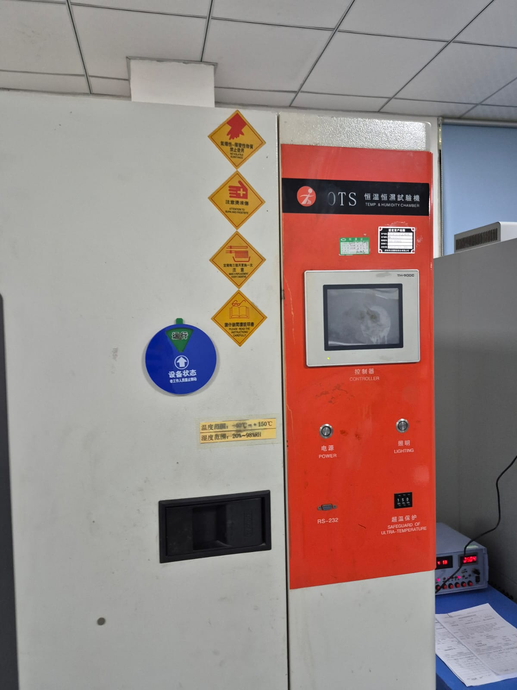
        
<em>Quality Control Station</em>

      </td>
    </tr>
  </table>

 

I was particularly impressed by the automation technology in place—from robotic arms to conveyor systems that seamlessly move products down the line. Most factories I toured also included rigorous testing procedures and quality assurance labs, ensuring that every final product meets international standards.

 
 

### Specific Factory Highlights

Along the way, I scheduled visits with a few companies that stood out:

1. **Colofoo Technology Co., Ltd**  
   - **Date & Time:** January 17, 14:00 (about 25 minutes)  
   - **Location:** Office in Bantian, Shenzhen; Factory in Jihua, Shenzhen  
   - **Product Focus:** Smart Rings  
   - **Website:** [www.colofoo.com](http://www.colofoo.com)  
   It was fascinating to see how they integrate electronics into such compact wearable devices. I got to observe the delicate assembly process and the testing methods they use to ensure durability and functionality.

2. **SZ Maintex Intelligent Control**  
   - **Date & Time:** January 17, 16:00 (about 40 minutes)  
   - **Location:** Longgang, Shenzhen  
   - **Product Focus:** Stepper Motors  
   - **Website:** [http://www.maintexpt.com/en/](http://www.maintexpt.com/en/)  
   I’ve always been interested in stepper motor design, and this visit did not disappoint. Their factory floor was highly automated, with rows of machines precisely winding motor coils. The highlight for me was seeing the real-time quality checks on each motor before packaging.

3. **Guangdong Greendisplay**  
   - **Date & Time:** January 16, 14:30 (about 55 minutes)  
   - **Location:** Dongguan City, Guangdong Province  
   - **Product Focus:** E-Paper Displays  
   - **Website:** [http://www.greendisplay.cn](http://www.greendisplay.cn)  
   E-paper technology has always intrigued me—lightweight, power-efficient, and easy on the eyes. At Greendisplay, I learned about the layering process of e-paper films and how they’re integrated into various consumer devices. It’s a meticulous operation, but the end products are incredibly versatile.

 

  <table>
    <tr>
      <td align="center">
        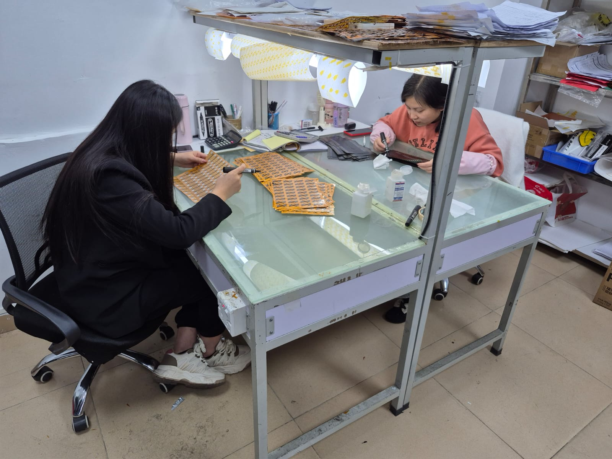
        
<em>Exploring the assembly lines on foot</em>

      </td>
    </tr>
    <tr>
      <td align="center">
        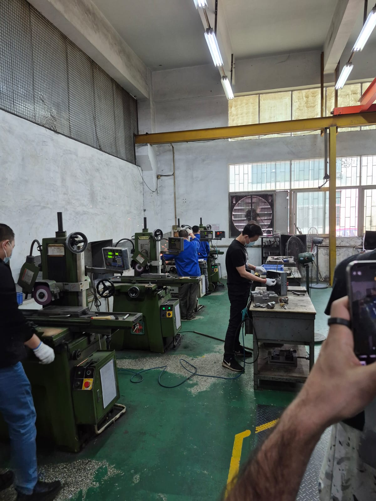
        
<em>Inspecting the final stages of production</em>

      </td>
    </tr>
  </table>

 

Overall, these factory visits deepened my appreciation for the level of precision and speed at which Shenzhen and Dongguan’s manufacturers operate. It’s one thing to hear about China’s manufacturing prowess, but witnessing it firsthand—walking the production lines, chatting with engineers, and seeing the final products roll off the line—was truly eye-opening.

## 🎨 Artistic Visits

While exploring Shenzhen’s vibrant art scene, I realized just how beautifully this city fuses creativity with cutting-edge technology. From interactive installations to mechanized sculptures, these galleries and studios offer a fresh take on how art can evolve in a tech-forward environment.

 

### Where Art Meets Innovation

Shenzhen’s transformation into a major global tech hub hasn’t overshadowed its cultural side. In fact, many local artists incorporate robotics, AI, and mixed media into their work, producing captivating experiences that bridge the gap between art and science.

  <table>
    <tr>
      <td align="center">
        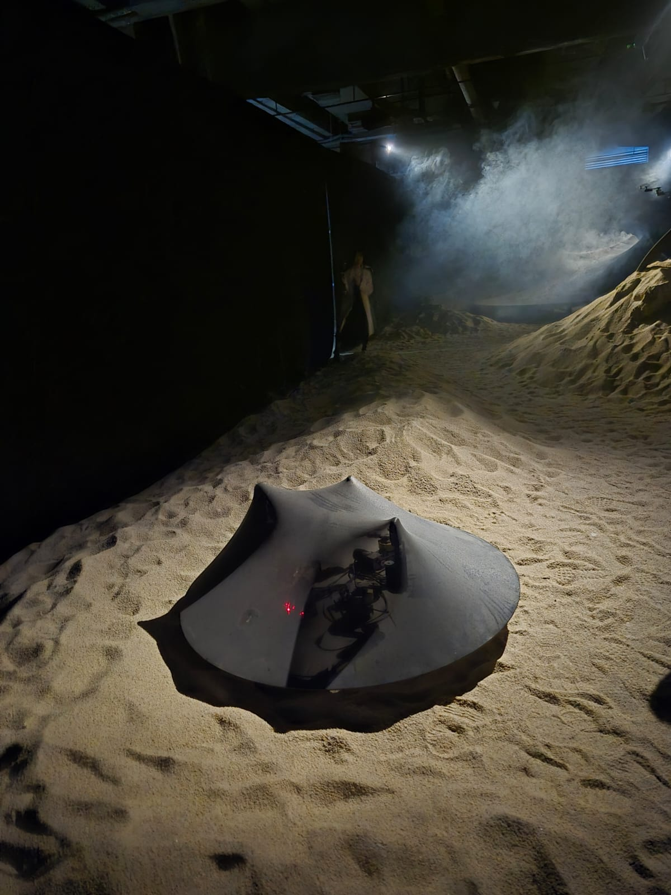
        
<em>Futuristic Sand Robot</em>

      </td>
      <td align="center">
        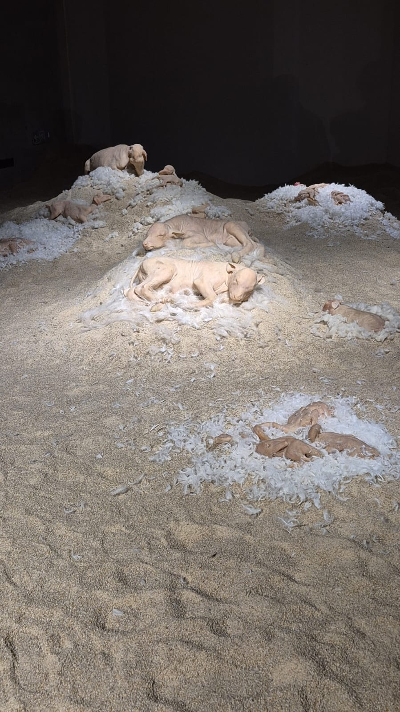
        
<em>Animatronic Animal Souls</em>

      </td>
    </tr>
  </table>

 

### Visiting Dafen Art Village

One of the standout locations I visited was **Dafen Art Village**, nestled in the Longgang District of Shenzhen. Historically, Dafen gained fame in the late 1980s as a major hub for mass-producing oil paintings—particularly replicas of Western masterpieces. Over time, it has evolved into a creative enclave where hundreds of galleries, studios, and local artists showcase everything from traditional calligraphy to contemporary art experiments.

  <table>
    <tr>
      <td align="center">
        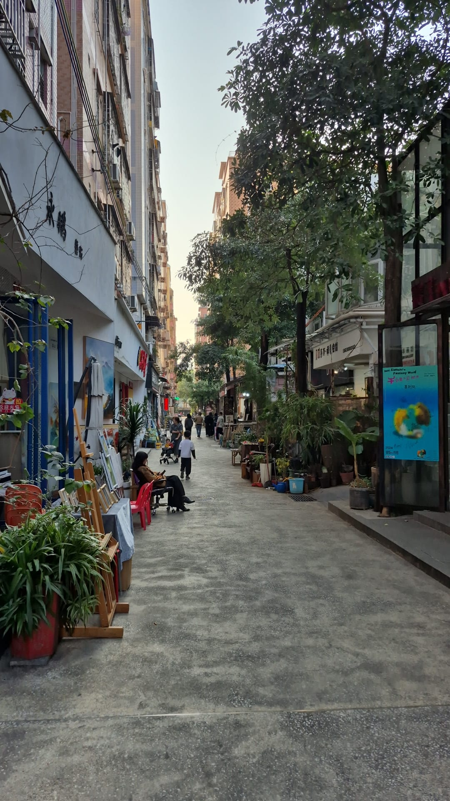
      </td>
      <td align="center">
        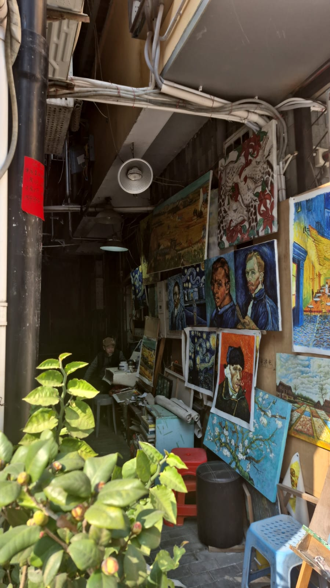
      </td>
    </tr>
    <tr>
      <td colspan="2" align="center"><em>Dafen Art Village Scenes</em></td>
    </tr>
  </table>

Walking through its winding alleys, I could see how Dafen balances its reputation for producing affordable art at scale with a growing community of innovative painters and sculptors. Many studios still specialize in hand-painted reproductions—think Van Gogh or Monet—while newer spots experiment with digital painting techniques, 3D printing, and augmented reality (AR) installations.

 

  <table>
    <tr>
      <td align="center">
        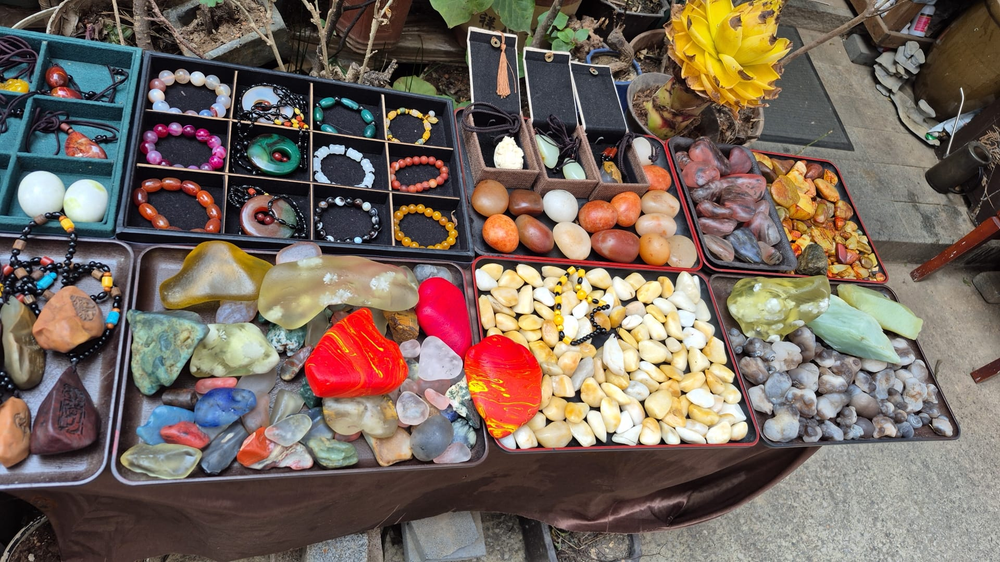
      </td>
    </tr>
    <tr>
      <td align="center">
        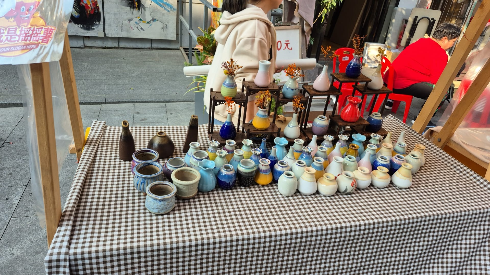
      </td>
    </tr>
    <tr>
      <td align="center"><em>Immerse yourself in Dafen’s vibrant atmosphere</em></td>
    </tr>
  </table>

 

Beyond the paintings, I found small cafés and open-air art fairs where you can meet emerging artists and discuss their craft. It’s evident that Dafen is evolving: no longer just a village of reproductions, it has become a genuine platform for creativity, where tradition and modernity coexist. It’s a must-visit if you want a taste of how Shenzhen seamlessly merges the old and the new under one buzzing artistic roof.

---
## Establishing Contacts

Throughout my journey in Shenzhen, I quickly realized that **knowing someone who knows someone** can make all the difference when trying to launch a hardware venture. China’s manufacturing hub thrives on relationships—introductions, referrals, and even casual meetups at a local tea house or café can open doors to key suppliers, engineers, and distributors.

 

  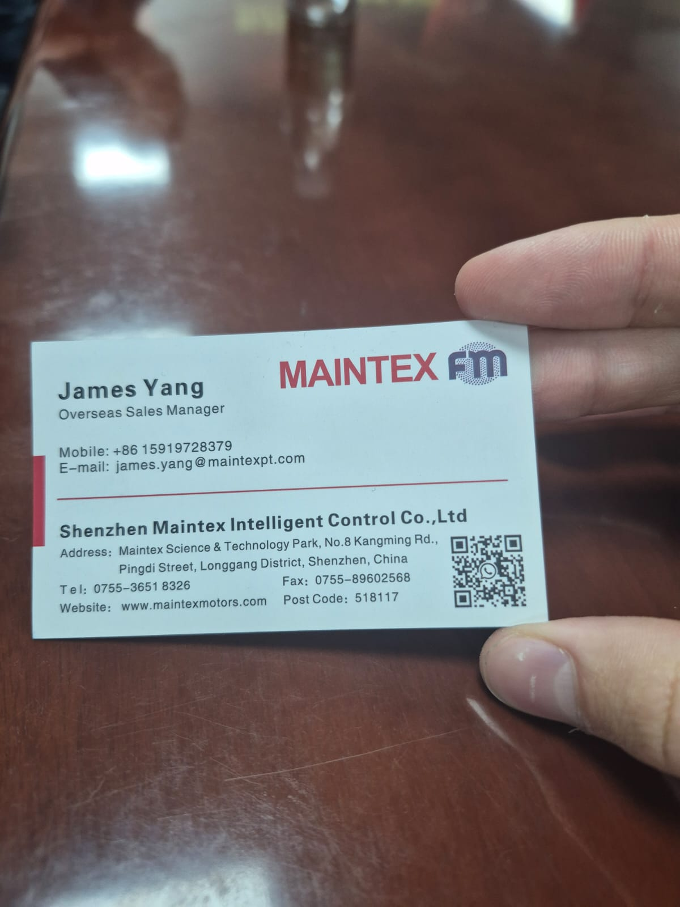
  
<em>Sample business card exchanged on the trip</em>

### Why Connections Matter in Hardware

Shenzhen’s ecosystem operates at lightning speed, but it’s also surprisingly close-knit. When I discussed potential product ideas with local contacts, they almost always knew someone who could supply a specific component, offer guidance on design-for-manufacturing, or expedite prototyping. This personal network can expedite business development far more efficiently than cold emails or online searches alone.

### Building a Robotics Company: The Supply Chain Factor

If I were to create a robotics startup here, I’d rely on a network of:

- **Component Suppliers**  
  From microcontrollers and sensors to motors and actuators, Shenzhen’s markets and industrial parks house nearly everything a robotics startup needs.  
- **Prototyping Services**  
  Rapid prototyping shops are abundant. CNC machining, 3D printing, and PCB assembly often happen under one roof, enabling quick iteration cycles.  
- **Assembly & Manufacturing Facilities**  
  Many factories offer end-to-end solutions, from initial design to final packaging. Having someone introduce me to trusted factory owners or managers would streamline this process and help avoid pitfalls.  
- **Logistics & Distribution**  
  Once the product is ready, an established logistics chain can ship it anywhere in the world. Again, personal recommendations on reliable freight forwarders and couriers can be crucial.

By forging meaningful relationships, I can better navigate language barriers, negotiate favorable terms, and ensure product quality. That’s why exchanging these business cards and spending time in face-to-face meetings have been some of the most impactful moments of my trip. It’s not just about who you know, but **who trusts you** and believes in your product’s potential.

---

## 🛋️ HQB (Huaqiangbei) Visits

Huaqiangbei (often abbreviated as **HQB**) is arguably the **largest electronics marketplace in the world**, nestled in the heart of Shenzhen. It’s a vast maze of shopping complexes, component stalls, and back-alley shops where you can find everything from microchips and phone parts to ready-made gadgets. I was fortunate to have amazing local guides who helped me navigate these bustling corridors—**thank you all** for your instructive messages and insider tips!

 

  <table>
    <tr>
      <td align="center">
        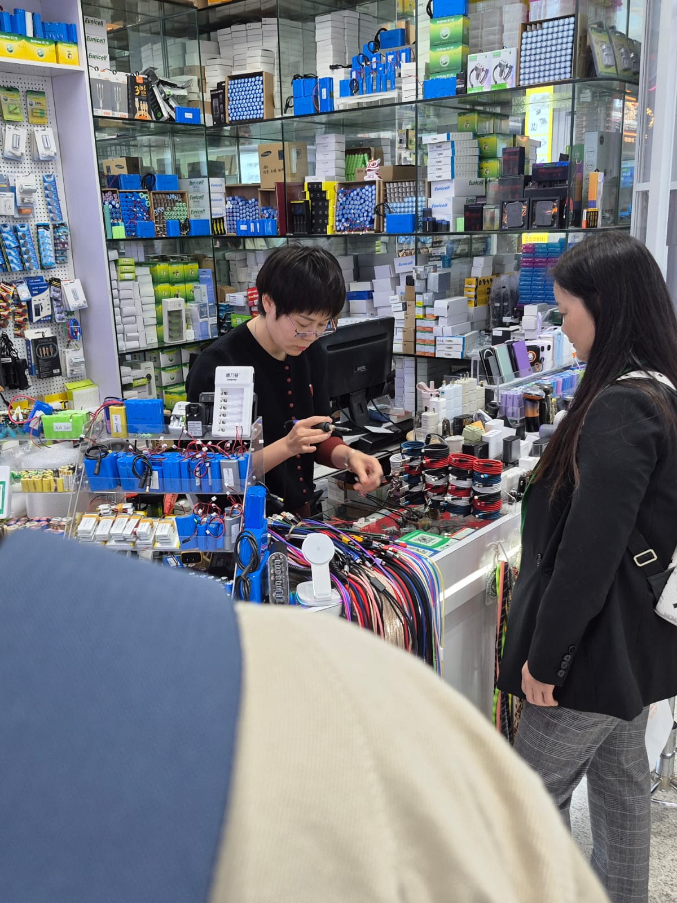
        
<em>Huaqiangbei Market Overview</em>

      </td>
      <td align="center">
        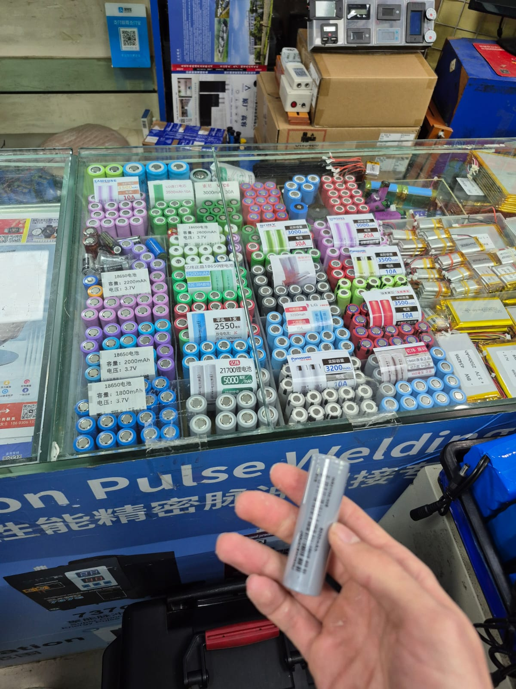
        
<em>Electronics Shopping at HQB</em>

      </td>
    </tr>
  </table>

 

### A Hardware Lover’s Paradise (With a Few Grey Areas)

Walking through HQB was like stepping into a dream for anyone who loves tinkering, building, or engineering hardware projects. Thousands of stalls brim with circuit boards, LEDs, lithium batteries, and everything in between. I noticed that the lithium batteries sold here were **significantly cheaper** than similar ones I’d purchased back in the United States—a testament to the region’s capacity for mass production and streamlined supply chains.

However, the market also has a **grey-area side**, where I came across shops selling questionable phone parts—think unbranded Apple camera modules, complete iPhone housing kits, and other possibly salvaged or “repurposed” components. These stalls coexist alongside perfectly legitimate businesses, which can be both thrilling and overwhelming to sort through.

 

  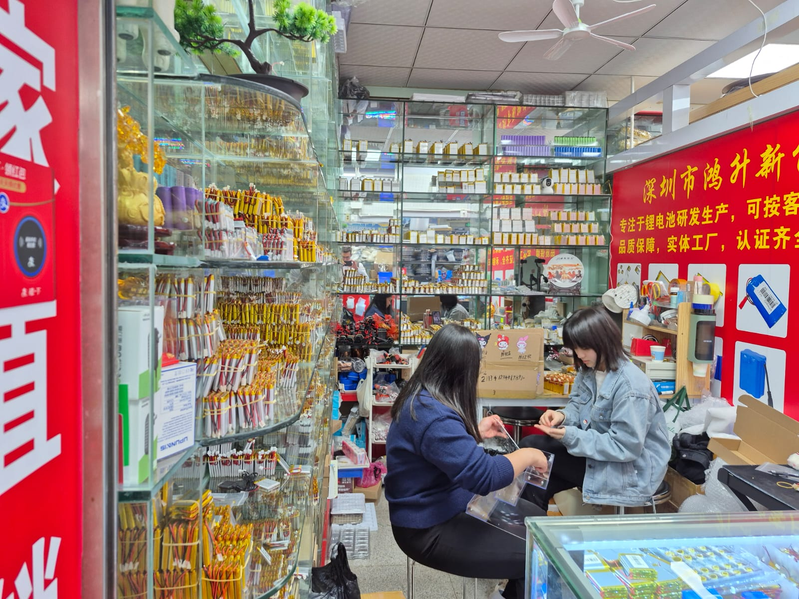
  
<em>Specialized Components in HQB</em>

 

### Shenzhen’s EV Boom

Spending time here also made me appreciate Shenzhen’s forward-thinking spirit beyond electronics. **Shenzhen, a city of over 17 million people**, is often hailed for its rapid adoption of electric vehicles. It boasts **one of the world’s first 100% electric bus fleets**, with over 16,000 e-buses zipping through the streets. Taxis are increasingly electric as well, highlighting a broader city-wide push toward sustainability and clean energy.

 

Overall, my visits to HQB were a crash course in how Shenzhen’s **massive hardware infrastructure** powers innovation at every level. Whether you’re a casual hobbyist, a startup founder, or part of a multinational team, there’s something undeniably captivating about having such unfettered access to the entire electronics supply chain right at your fingertips.

  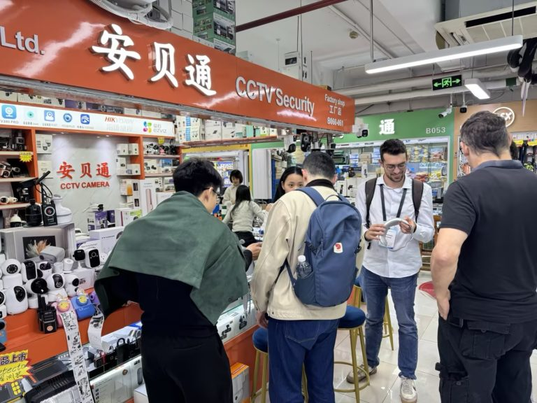
  
<em>Me at HQB</em>

Here are the HQB experts that I'd like to thank:
HQB Experts
Atommann (SZDIY Hackerspace)
Bunnie Huang (Bunnie Studios)
David Cranor (Plus Ultra, Inc)
Jose Angel Torres (Source Parts, Inc)
Matthew Yu (Seeed Studio)
Paul Hamilton (SUSTech, Immersive Design Group)
Ryan Liang (SZDIY Hackerspace)
Terry Given (Tymphany, Ltd)
---

## 🖥️ Scalable HCI Symposium

I had the opportunity to attend the **Scalable HCI Symposium**, a gathering designed to showcase how Shenzhen’s manufacturing ecosystem can supercharge research and innovation in Human-Computer Interaction (HCI). Bringing together academics, industry experts, and open hardware advocates, this event offered a deep dive into the nexus between cutting-edge tech and real-world product development—a perfect fit for my PhD interests.

 

  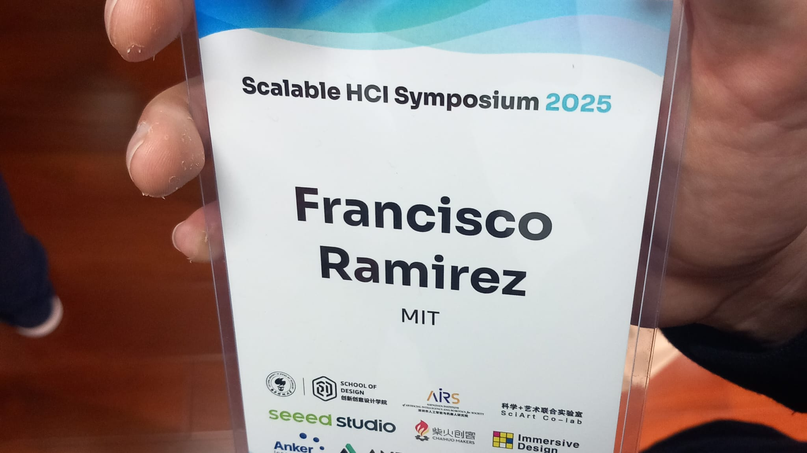
  
<em>Scalable HCI Symposium event card</em>

  
  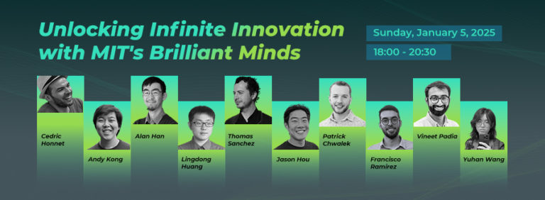
  
<em>Scalable HCI Symposium MIT team</em>

 

### Topics Covered

During the symposium, various sessions explored:

- **Democratizing Hardware Access:** How open hardware movements and Shenzhen’s extensive manufacturing capabilities can bring down barriers—helpful for innovators in both well-resourced and developing regions.  
- **Rapid Prototyping & Iteration:** Lessons on shortening product development cycles by leveraging Shenzhen’s supply chain.  
- **Open Source & Collaboration:** Workshops highlighting best practices for sharing designs, resources, and research findings freely.

Several influential names—those who champion open hardware and hackerspaces—provided their insights, emphasizing the critical role **Shenzhen** plays in quickly turning concepts into functional prototypes.

 

  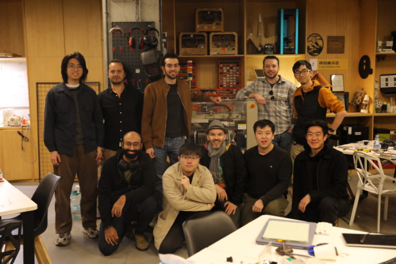
  
<em>Another team photo at the event</em>

  
  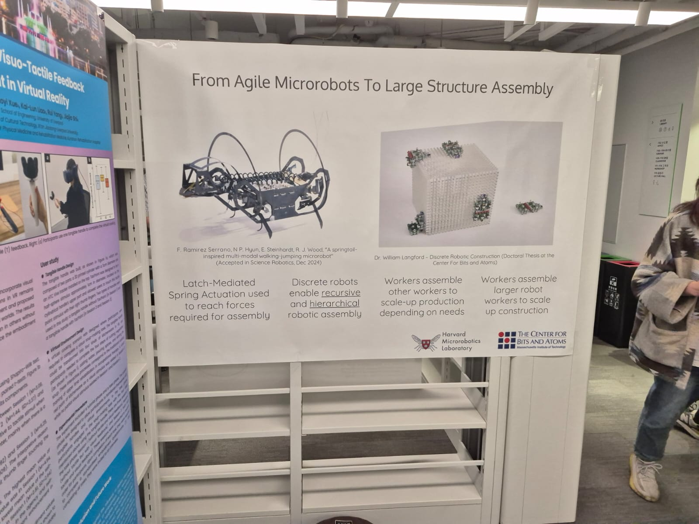
  
<em>Presenting my poster on scalable interfaces</em>

 

### What I Learned and How It Ties Into My PhD Research

I’m focusing on **scalable HCI** and how user-centric design can be adapted to different contexts and devices. Attending this symposium gave me:

1. **Direct Access to Industry Expertise:** Discussions on rapid prototyping and hardware design validated many of my research assumptions.  
2. **Real-World Application Insights:** I gleaned valuable tips on how to maintain cost-effectiveness without sacrificing quality—vital for large-scale or long-term research projects.  
3. **Networking Opportunities:** Connecting with open hardware enthusiasts and academics provided new collaborators who share a passion for iterative, inclusive design.

 

  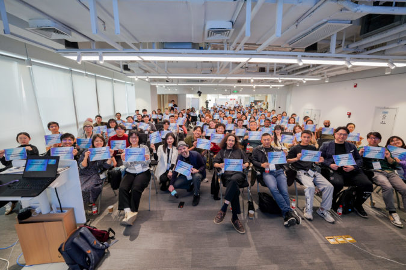
  
<em>The symposium in full swing—where theory meets practice</em>

 

Overall, the **Scalable HCI Symposium** underscored the importance of Shenzhen’s unique blend of production capability and collaborative culture. By merging academic theory with the pragmatism of local manufacturing, the event offered a blueprint for how emerging technologies can be transformed into tangible solutions at scale—reinforcing exactly what I hope to achieve in my PhD.

---

## 🍜 Food & Leisure

Shenzhen’s culinary scene is incredibly diverse, thanks to its vibrant mix of people from all over China. During my stay, I got to sample a broad range of flavors, from spicy hotpots reminiscent of **Sichuan** cuisine to milder, comforting soups inspired by **Cantonese** traditions—especially the fresh wontons that originate from Guangdong province. It felt like every street corner had a hidden gem, whether it was a classic noodle stall or a modern fusion restaurant.

 

I was especially intrigued by the different spice levels. Some dishes packed the heat typical of **Hunan** cuisine, while others showcased the fragrant peppers and bold seasonings of Sichuan. And then there were delicate, subtle soups and dumplings from Guangdong’s tradition that offered a refreshing contrast. It seemed like I could travel through a dozen provinces’ specialties without ever leaving the city.

 

Beyond the dining experiences, I also tried out a few local leisure activities. I got an **ear cleaning massage** and a **traditional Chinese massage**—though honestly, neither was particularly life-changing for me, so I wouldn’t go out of my way to recommend them. Still, they did offer a glimpse into local wellness culture, which is always worth experiencing at least once.

 

  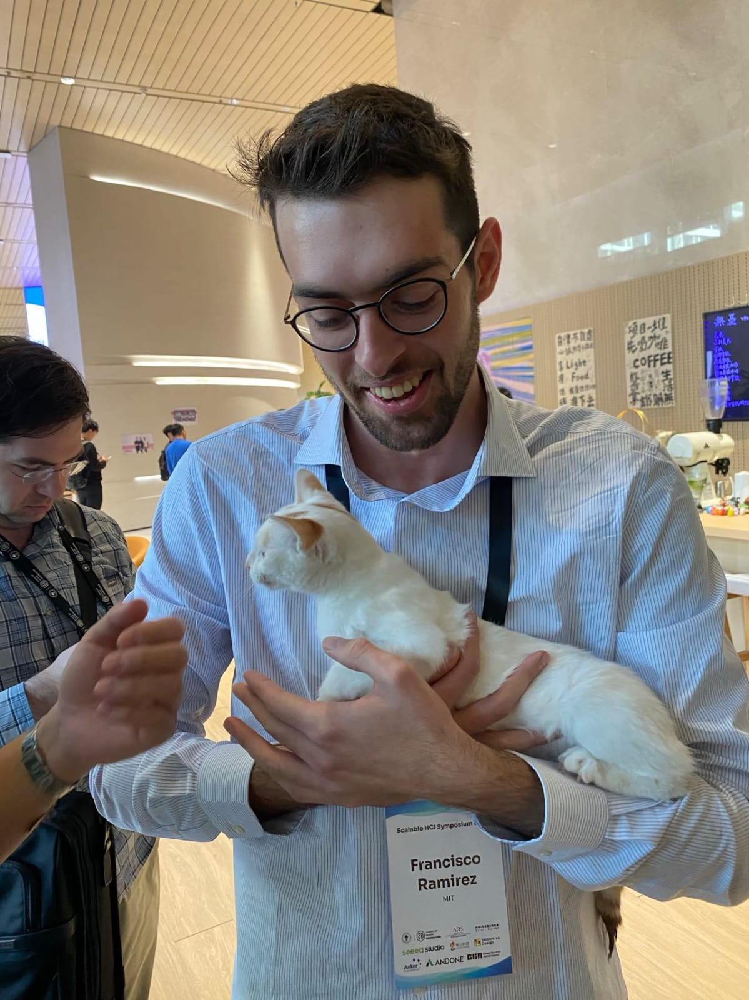
  
<em>A cute cat I came across while exploring the city</em>

 

### Culinary Highlights

  <table>
    <tr>
      <td align="center">
        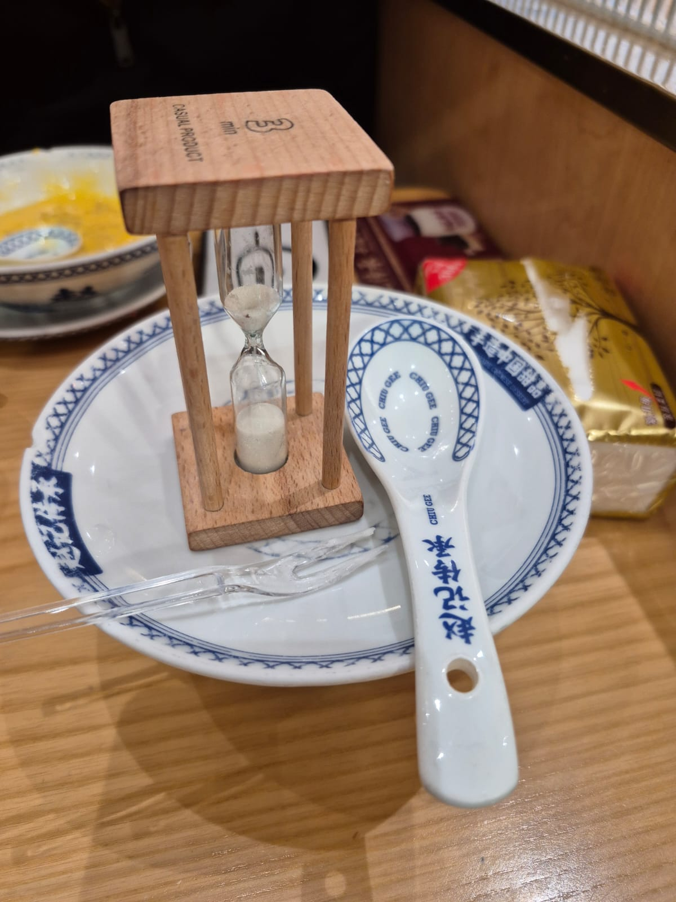
        
<em>Delicious Tea—timed with a small hourglass for perfect steeping</em>

      </td>
      <td align="center">
        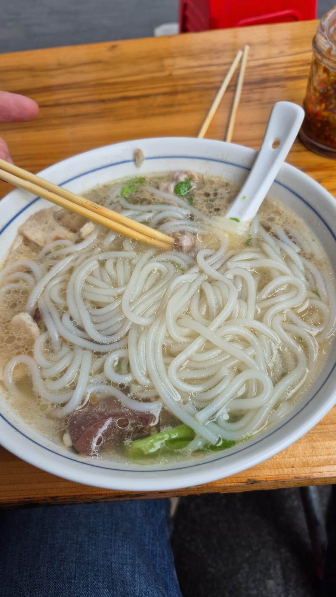
        
<em>A comforting bowl of soup bursting with flavor</em>

      </td>
      <td align="center">
        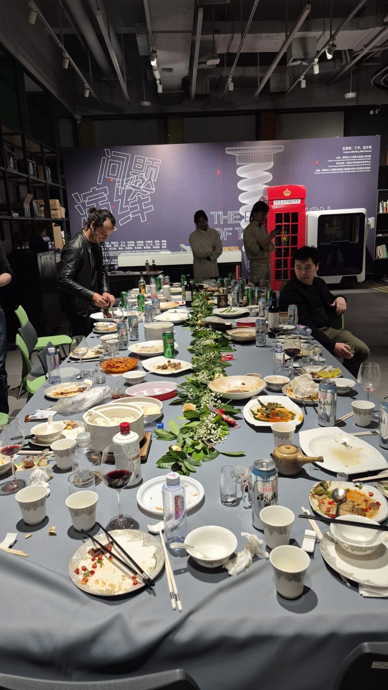
        
<em>A fine dining experience, courtesy of AIRS</em>

      </td>
    </tr>
  </table>

From street stalls to elegant teahouses, Shenzhen has a way of catering to every palate. One of my favorite finds was a local spot that served a delicate tea and provided a **sand timer** so you could get the steeping just right. These small details—like perfectly timed tea—are what made exploring the city’s dining scene so memorable.

 

While the massages weren’t a standout for me, the food definitely was. If you ever find yourself in Shenzhen, taking a culinary tour of the different provincial cuisines is a must—you’ll never run out of new flavors to explore!

---

## 🏥 Health

During my stay in Shenzhen, I experienced unexpected breathing difficulties that required immediate medical attention. Friends recommended the **Hong Kong University Hospital**, but given my location and urgency, I opted for the **Southern University Hospital** instead. I’m glad I did, because the entire experience—despite the stress—turned out to be impressively smooth.

 

  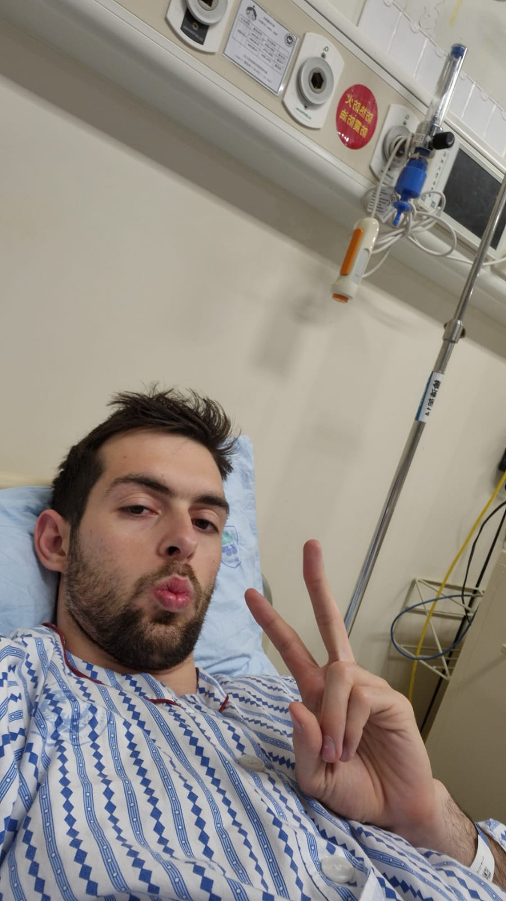
  
<em>Healthcare Facilities in Shenzhen</em>

 

### A Fast and Supportive Experience

From the moment I arrived at the hospital, the staff moved quickly to diagnose my condition, and I was scheduled for surgery within just a few days. The **nurses were incredibly helpful**, guiding me through every step of the process. Despite being in a foreign hospital, I felt reassured by their organization and attention to detail.

### Surgery and Recovery

The surgery itself went smoothly. I spent a short time recovering in the hospital before heading back to my accommodation in Shenzhen. Before I knew it, I was on a flight returning to **Boston**. Upon arriving home, I scheduled an **ENT check-up** to ensure everything had healed properly—and fortunately, the doctor confirmed that my recovery was on track.

 

I feel **lucky** that I happened to be in Shenzhen, a city with excellent healthcare facilities, at a time when I needed them most. While it was certainly stressful to undergo an unplanned medical procedure abroad, the professionalism and speed of the healthcare team made a world of difference in helping me get back on my feet.

## Conclusion

Reflecting on this trip, I can honestly say it has been a **transformative experience**, both personally and academically. Shenzhen’s **unparalleled speed and breadth of innovation** gave me fresh perspectives on how to **scale research** effectively—particularly relevant to my PhD work at MIT. 

I was able to learn from some of the brightest minds in **hardware engineering, open-source development, and HCI research**. From the bustling streets of Huaqiangbei to the cutting-edge robotics labs at SUSTech and AIRS, each conversation and hands-on demonstration nudged me to think bigger and move faster. Getting a behind-the-scenes look at factory operations and seeing how quickly product ideas can go from concept to reality further highlighted **why Shenzhen is truly the world’s hardware capital**.

### How It Will Shape My MIT Journey

My research focuses on **scalable HCI**, and witnessing the **rapid prototyping ecosystem** in Shenzhen showed me the importance of iterating swiftly without sacrificing quality. The synergy between **academic insights** and **real-world manufacturing** I experienced firsthand is something I’m eager to bring back to MIT and incorporate into my lab work. I plan to pilot new collaborative projects that leverage the resources and networks I discovered—projects that, I hope, will **push the boundaries of what’s possible** in robotics and interactive systems.

### Looking Ahead: Collaboration & Gratitude

Beyond the research breakthroughs, this trip underscored the value of **building genuine relationships**—with peers, mentors, faculty, and industry experts. I’m 27 now, and it’s humbling to realize how this unique moment in Shenzhen’s evolution can dovetail with my own growth as a scholar and innovator. I’m thankful for everyone who welcomed me, guided me, shared their expertise, and made this journey unforgettable.

- **To the local guides and HQB experts**: Your knowledge of Shenzhen’s hidden gems and insider tips made all the difference.  
- **To the faculty and university researchers**: Thank you for opening your labs and minds to discuss potential collaborations.  
- **To the factory managers and staff**: You brought theories to life, showing me that a strong supply chain and a culture of rapid iteration can launch ideas into the marketplace quicker than I ever imagined.  
- **To Seeed Studio** (and especially Eric Pan) for the heartfelt hospitality and for continually championing open-source solutions.  

I can’t wait to extend these conversations into future collaborations—**if you’re interested in joining forces**, whether that’s on HCI, microrobotics, or open hardware, please reach out! This trip proved that innovation thrives where trust and shared vision exist, and I’m looking forward to seeing where those bridges might take us next.

---

### In Closing

Shenzhen has shown me that **research doesn’t have to stay confined within academic walls**—with the right partnerships and infrastructure, it can rapidly transform into real products that reach people everywhere. I feel immensely **grateful** to have experienced this city’s energy and to have witnessed how seamlessly it integrates technology, culture, and creativity. 

Now back in Boston, I’m more motivated than ever to **merge these insights into my ongoing projects at MIT**. To everyone who helped along the way—**thank you**. I look forward to keeping these connections alive and exploring what we can build **together**.

### Disclaimer
*This write-up was co-written with AI.*

