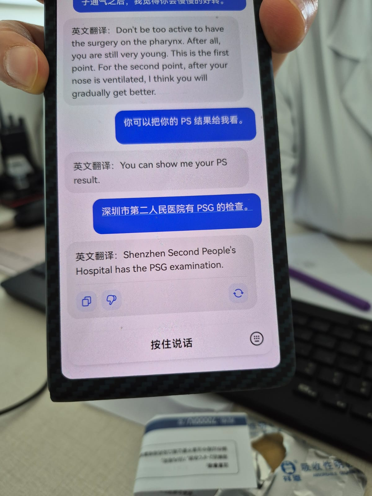

# Research at Scale – Shenzhen, January 2025

---

## Summary

  

<em>Wonderful lighting atmosphere of Shenzhen</em>

This trip was the highlight of my semester and, honestly, my time at MIT so far. I’m 27 years old, and I can confidently say this was a once-in-a-lifetime experience.  

First, **Shenzhen is an incredibly technologically advanced city**—from drones delivering packages to insanely efficient manufacturing processes, cutting-edge robotics, and the super apps that handle everything from payments to transportation. The city's infrastructure and services are on another level.

Second, **the people I met were some of the most driven individuals I've ever encountered**. Everyone seemed to have a strong sense of purpose, and being around them was inspiring.

Third, **the variety of activities I took part in—factory visits, a hackathon, and the HCI symposium—were invaluable**. As a first-year PhD student, these experiences have already shaped my professional path in meaningful ways.

---

## ✈️ The Flights & Getting Set Up

I flew over from Geneva as I had spent Christmas in Europe, with a layover in Paris. For the return, I flew directly from Hong Kong to Boston. This was the longest flight I’ve ever taken at **15 hours**. Flying into Hong Kong was easy.

### Tips for Travelers

  

<em>Using Google Translate to communicate was key! Make sure to download the offline version!</em>

- **Get a CSL prepaid SIM card** at 7-Eleven in Hong Kong for about **$10 USD**. It works in **China, Hong Kong, and Macau**.  
- **Currency confusion?** The Hong Kong dollar (HKD) is worth **0.13 USD per 1 HKD**, so don’t panic if things seem expensive at the airport!  
- **Ferry to Shenzhen:** I took the ferry to and from Shenzhen and the Hong Kong airport, followed by an additional **50-minute Didi ride**.  
- **Beware of unofficial taxis** at the Shenzhen terminal. Dodgy individuals may approach you for a ride. **Stick to Didi** for safety and convenience.  
- **Didi is prepaid**, so you don’t need to worry about payment issues while setting up your account.  
- **International payment options:** My **Revolut** card and **Swiss Visa** worked fine with both **Alipay and WeChat Pay**.  
- **Ferry ticket tip:** As soon as you land, **go straight to the ferry ticket booth**—they need time to process your luggage. While waiting, you can buy and set up your **7-Eleven SIM card**, but don’t do it the other way around like I did!

---

## 🌆 The City, Accommodation & Communication

We stayed at the **City Hotel**, a fantastic location that was extremely central to all relevant trip activities. The receptionists were very helpful and assisted me in placing orders directly to the hotel. Additionally, there was a temple nearby, as well as gym facilities that provided a great way to unwind after long days.

To communicate with drivers, restaurant workers, and when negotiating, I highly recommend downloading the **Google Translate** app, as well as an Android app called **Instant Translate**, which allows you to translate anything on screen with a single tap. However, most service industry workers were prepared to translate using their own phones, so I didn’t encounter many difficulties.

### Tips for Travelers
- **Google Translate & Instant Translate** – Essential for seamless communication.
- **Most service workers will help** – Don't hesitate to show text translations on your phone.
- **City Hotel’s location was perfect** – Great access to key areas and helpful staff.

---

## 🔬 Seeed Studio Visit

We visited **Seeed Studio**, founded by CEO **Eric Pan** in 2008. We were delighted to learn about their latest sensor expansions, including their new weather sensors. Additionally, we had the opportunity to observe their wind tunnels in action, which was particularly exciting for me, as I previously worked with wind tunnels in a publication on **insect-inspired self-righting mechanisms for fixed-wing drones**. You can read more about that research [here](https://ieeexplore.ieee.org/document/9479684).

At MIT, we frequently use **Seeed Xiao** modules in our projects. The Xiao is a compact microcontroller that offers powerful performance in a small form factor, making it ideal for various applications.

  

<em>We often use Seeed Xiao microcontrollers at MIT for compact, powerful prototypes</em>

  <table>
    <tr>
      <td>
        

          
        

        
<em>Hardworking Seeed Studio employees</em>

      </td>
      <td>
        

          
        

        
<em>Seeed Studio’s wide array of products for ML applications</em>

      </td>
    </tr>
  </table>

Eric Pan, the CEO of Seeed Studio, is incredibly kind and, to my surprise, a surfer! As a fellow enthusiast, I really appreciated our conversation and hope to meet him again in the future. A huge thank you to Seeed Studio for sponsoring this trip!

---

## 💻 Hackathon
Our team participated in the **Smart Space Hackathon**, co-hosted by Chaihuo, Seeed, and Anker, where over 30 participants from academia, industry, and the local maker community collaborated to build innovative smart environment solutions. We developed **origami-based adaptive structures** that dynamically responded to their surroundings, utilizing fabrication techniques inspired by my research on **pop-up MEMS devices** ([read more here](https://advanced.onlinelibrary.wiley.com/doi/abs/10.1002/admt.202301940)).

The project demonstrated how **rapid manufacturing methods** can be applied to deploy self-transforming structures, pushing the limits of **miniaturization and adaptive design**. This approach significantly shortened prototyping cycles while preserving functional integrity. The entire team worked tirelessly, iterating on multiple design variations in a short timeframe. Our dedication paid off—we were honored to win a **hackathon prize** [read more here]([https://advanced.onlinelibrary.wiley.com/doi/abs/10.1002/admt.202301940](https://scalablehci.com/2025/program/)) for our innovative concept and execution! Huge thanks to my team Lin Kekun, Zhang Keliang, Norman, Fang Zihao, Gu Jiaqi.

  <table>
    <tr>
      <td>
        

          
        

        
<em>Hackathon Final Wall View 1</em>

      </td>
      <td>
        

          
        

        
<em>View 2</em>

      </td>
      <td>
        

          
        

        
<em>View 3</em>

      </td>
    </tr>
  </table>

  

<em>Hackathon Final Presentation</em>

## 🏦 Academic University Visits

During my recent travels across Shenzhen and Hong Kong, I had the chance to visit several universities renowned for their cutting-edge research in robotics, AI, and micro-engineering. I was excited to meet faculty members, tour their facilities, and learn about ongoing projects involving miniature and bio-inspired robots.

 

  
  
<em>An Inviting Campus Entrance</em>

I found each campus to have its own unique environment—some emphasized collaborative design spaces, while others fostered close-knit research teams. Regardless, the emphasis on innovation was consistent across all the schools I visited.

 

  <table>
    <tr>
      <td align="center">
        
        
<em>An impressive blend of buildings and nature</em>

      </td>
      <td align="center">
        
        
<em>Library</em>

      </td>
    </tr>
    <tr>
      <td align="center">
        
        
<em>Miniature of the University</em>

      </td>
      <td align="center">
        
        
<em>Origami Robotic Insect Wing Exhibit</em>

      </td>
    </tr>
  </table>

 

### My Impressions of Shenzhen and Hong Kong Universities

- **Southern University of Science and Technology (SUSTech), Shenzhen**  
  I was impressed by their hands-on approach to robotics, microfabrication, and materials science. They have modern research facilities and ongoing partnerships with international institutions—this helps in pushing the boundaries of micro-scale robotics and advanced manufacturing techniques.

- **Shenzhen Institute of Artificial Intelligence and Robotics for Society (AIRS)**  
  AIRS stands out for its focus on AI-driven solutions in robotics. I learned about their autonomous systems and microrobotics projects, which often involve knowledge exchange with global research labs.

- **The Hong Kong University of Science and Technology (HKUST)**  
  Their robotics and automation labs are incredible. I saw demonstrations of micro aerial vehicles and small, agile robots that can be deployed in various industrial settings.

 

### Up Close with the Origami Robotic Insect Wing

One of the most fascinating demonstrations I saw was the **origami robotic insect wing**. This tiny marvel is constructed using ultra-thin materials that can fold and unfold with high precision. The lightweight and flexible nature of origami-inspired wings allows for efficient flapping motions, closely mimicking the flight of real insects. Researchers at these universities, in tandem with labs at Harvard, are pushing the limits of what’s possible in terms of size, power consumption, and agility.

I left these universities inspired and full of ideas. The innovation on display in Shenzhen and Hong Kong truly showcases the future of robotics—where technology becomes smaller, smarter, and more interconnected by the day.

---

## 🏭 Factory Visits

During my time in Shenzhen and Dongguan, I decided to hop on a few local buses to explore the region’s vibrant manufacturing ecosystem. These trips often took around an hour, winding through industrial areas and bustling city streets—an experience in itself. I was eager to see how some of the world’s most efficient production lines operate behind the scenes.

 

  
  
<em>Bus rides typically last around an hour, giving me time to prep for the upcoming factory tours.</em>

 

### Behind the Scenes of Cutting-Edge Manufacturing

Each factory I visited had its own specialty, whether it was precision assembly, automated systems, or testing and quality control. I was amazed to witness how these facilities leverage advanced machinery to speed up production while maintaining strict quality standards.

  <table>
    <tr>
      <td align="center">
        
        
<em>Advanced Factory Machinery</em>

      </td>
      <td align="center">
        
        
<em>Production Line</em>

      </td>
      <td align="center">
        
        
<em>Automated Manufacturing</em>

      </td>
    </tr>
    <tr>
      <td align="center">
        
        
<em>Precision Assembly</em>

      </td>
      <td align="center">
        
        
<em>Testing Equipment</em>

      </td>
      <td align="center">
        
        
<em>Quality Control Station</em>

      </td>
    </tr>
  </table>

 

I was particularly impressed by the automation technology in place—from robotic arms to conveyor systems that seamlessly move products down the line. Most factories I toured also included rigorous testing procedures and quality assurance labs, ensuring that every final product meets international standards.

 

  
  
<em>Another shot of the long rides—often a good time to reflect on the day’s visits.</em>

 

### Specific Factory Highlights

Along the way, I scheduled visits with a few companies that stood out:

1. **Colofoo Technology Co., Ltd**  
   - **Date & Time:** January 17, 14:00 (about 25 minutes)  
   - **Location:** Office in Bantian, Shenzhen; Factory in Jihua, Shenzhen  
   - **Product Focus:** Smart Rings  
   - **Website:** [www.colofoo.com](http://www.colofoo.com)  
   It was fascinating to see how they integrate electronics into such compact wearable devices. I got to observe the delicate assembly process and the testing methods they use to ensure durability and functionality.

2. **SZ Maintex Intelligent Control**  
   - **Date & Time:** January 17, 16:00 (about 40 minutes)  
   - **Location:** Longgang, Shenzhen  
   - **Product Focus:** Stepper Motors  
   - **Website:** [http://www.maintexpt.com/en/](http://www.maintexpt.com/en/)  
   I’ve always been interested in stepper motor design, and this visit did not disappoint. Their factory floor was highly automated, with rows of machines precisely winding motor coils. The highlight for me was seeing the real-time quality checks on each motor before packaging.

3. **Guangdong Greendisplay**  
   - **Date & Time:** January 16, 14:30 (about 55 minutes)  
   - **Location:** Dongguan City, Guangdong Province  
   - **Product Focus:** E-Paper Displays  
   - **Website:** [http://www.greendisplay.cn](http://www.greendisplay.cn)  
   E-paper technology has always intrigued me—lightweight, power-efficient, and easy on the eyes. At Greendisplay, I learned about the layering process of e-paper films and how they’re integrated into various consumer devices. It’s a meticulous operation, but the end products are incredibly versatile.

 

  <table>
    <tr>
      <td align="center">
        
        
<em>Exploring the assembly lines on foot</em>

      </td>
    </tr>
    <tr>
      <td align="center">
        
        
<em>Inspecting the final stages of production</em>

      </td>
    </tr>
  </table>

 

Overall, these factory visits deepened my appreciation for the level of precision and speed at which Shenzhen and Dongguan’s manufacturers operate. It’s one thing to hear about China’s manufacturing prowess, but witnessing it firsthand—walking the production lines, chatting with engineers, and seeing the final products roll off the line—was truly eye-opening.

## 🎨 Artistic Visits

- How art and technology merge in Shenzhen.  
- Galleries, installations, or cultural experiences that stood out.

  <table>
    <tr>
      <td>
        

          
        

        
<em>Futuristic Sand Robot</em>

      </td>
      <td>
        

          
        

        
<em>Animatronic Animal Souls</em>

      </td>
    </tr>
  </table>

  <table>
    <tr>
      <td>
        

          
        

      </td>
      <td>
        

          
        

      </td>
    </tr>
    <tr>
      <td colspan="2" align="center"><em>Dafen Art Village</em></td>
    </tr>
  </table>

  <table>
    <tr>
      <td>
        

          
        

      </td>
    </tr>
    <tr>
      <td>
        

          
        

      </td>
    </tr>
    <tr>
      <td align="center"><em>Dafen Art Village</em></td>
    </tr>
  </table>

---

## Establishing Contacts

  

<em>Sample business card exchanged on the trip</em>

---

## 🛋️ HQB (Huaqiangbei) Visits

  <table>
    <tr>
      <td>
        

          
        

        
<em>Huaqiangbei Market Overview</em>

      </td>
      <td>
        

          
        

        
<em>Electronics Shopping at HQB</em>

      </td>
    </tr>
  </table>

  

<em>Specialized Components in HQB</em>

- Walking through the world’s largest electronics market.  
- The crazy variety of components and hardware.

---

## 🖥️ Scalable HCI Symposium

  

<em>Scalable HCI Symposium event</em>

- Topics covered.  
- What I learned and how it ties into my PhD research.

---

## 🍜 Food & Leisure

  

<em>A cute cat found on the way</em>

  <table>
    <tr>
      <td>
        

          
        

        
<em>Delicious Food</em>

      </td>
      <td>
        

          
        

        
<em>Street Food Delights</em>

      </td>
      <td>
        

          
        

        
<em>Fine Dining Experience</em>

      </td>
    </tr>
  </table>

---

## 🏥 Health

  

<em>Healthcare Facilities in Shenzhen</em>

  

<em>A cute cat found on the way</em>

  <table>
    <tr>
      <td>
        

          
        

        
<em>Delicious Food</em>

      </td>
      <td>
        

          
        

        
<em>Delicious Food</em>

      </td>
      <td>
        

          
        

        
<em>Delicious Food</em>

      </td>
    </tr>
  </table>

- Best meals I had.  
- Fun activities outside of research.  
- How I stayed healthy while traveling.

---

## Conclusion

I had an incredible time in Shenzhen and **hope to be back soon!**
