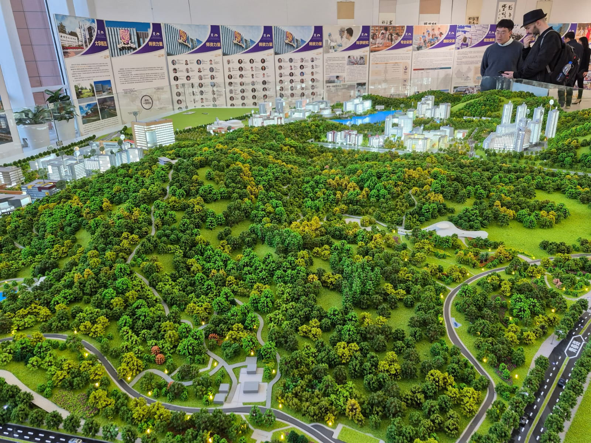

# Research at Scale – Shenzhen, January 2025

---

## Summary

  

<em>Wonderful lighting atmosphere of Shenzhen</em>

This trip was the highlight of my semester and, honestly, my time at MIT so far. I’m 27 years old, and I can confidently say this was a once-in-a-lifetime experience.  

First, **Shenzhen is an incredibly technologically advanced city**—from drones delivering packages to insanely efficient manufacturing processes, cutting-edge robotics, and the super apps that handle everything from payments to transportation. The city's infrastructure and services are on another level.

Second, **the people I met were some of the most driven individuals I've ever encountered**. Everyone seemed to have a strong sense of purpose, and being around them was inspiring.

Third, **the variety of activities I took part in—factory visits, a hackathon, and the HCI symposium—were invaluable**. As a first-year PhD student, these experiences have already shaped my professional path in meaningful ways.

---

## ✈️ The Flights & Getting Set Up

I flew over from Geneva as I had spent Christmas in Europe, with a layover in Paris. For the return, I flew directly from Hong Kong to Boston. This was the longest flight I’ve ever taken at **15 hours**. Flying into Hong Kong was easy.

### Tips for Travelers

  

<em>Using Google Translate to communicate was key! Make sure to download the offline version!</em>

- **Get a CSL prepaid SIM card** at 7-Eleven in Hong Kong for about **$10 USD**. It works in **China, Hong Kong, and Macau**.  
- **Currency confusion?** The Hong Kong dollar (HKD) is worth **0.13 USD per 1 HKD**, so don’t panic if things seem expensive at the airport!  
- **Ferry to Shenzhen:** I took the ferry to and from Shenzhen and the Hong Kong airport, followed by an additional **50-minute Didi ride**.  
- **Beware of unofficial taxis** at the Shenzhen terminal. Dodgy individuals may approach you for a ride. **Stick to Didi** for safety and convenience.  
- **Didi is prepaid**, so you don’t need to worry about payment issues while setting up your account.  
- **International payment options:** My **Revolut** card and **Swiss Visa** worked fine with both **Alipay and WeChat Pay**.  
- **Ferry ticket tip:** As soon as you land, **go straight to the ferry ticket booth**—they need time to process your luggage. While waiting, you can buy and set up your **7-Eleven SIM card**, but don’t do it the other way around like I did!

---

## 🌆 The City, Accommodation & Communication

We stayed at the **City Hotel**, a fantastic location that was extremely central to all relevant trip activities. The receptionists were very helpful and assisted me in placing orders directly to the hotel. Additionally, there was a temple nearby, as well as gym facilities that provided a great way to unwind after long days.

To communicate with drivers, restaurant workers, and when negotiating, I highly recommend downloading the **Google Translate** app, as well as an Android app called **Instant Translate**, which allows you to translate anything on screen with a single tap. However, most service industry workers were prepared to translate using their own phones, so I didn’t encounter many difficulties.

### Tips for Travelers
- **Google Translate & Instant Translate** – Essential for seamless communication.
- **Most service workers will help** – Don't hesitate to show text translations on your phone.
- **City Hotel’s location was perfect** – Great access to key areas and helpful staff.

---

## 🔬 Seeed Studio Visit

We visited **Seeed Studio**, founded by CEO **Eric Pan** in 2008. We were delighted to learn about their latest sensor expansions, including their new weather sensors. Additionally, we had the opportunity to observe their wind tunnels in action, which was particularly exciting for me, as I previously worked with wind tunnels in a publication on **insect-inspired self-righting mechanisms for fixed-wing drones**. You can read more about that research [here](https://ieeexplore.ieee.org/document/9479684).

At MIT, we frequently use **Seeed Xiao** modules in our projects. The Xiao is a compact microcontroller that offers powerful performance in a small form factor, making it ideal for various applications.

  

<em>We often use Seeed Xiao microcontrollers at MIT for compact, powerful prototypes</em>

  <table>
    <tr>
      <td>
        

          
        

        
<em>Hardworking Seeed Studio employees</em>

      </td>
      <td>
        

          
        

        
<em>Seeed Studio’s wide array of products for ML applications</em>

      </td>
    </tr>
  </table>

Eric Pan, the CEO of Seeed Studio, is incredibly kind and, to my surprise, a surfer! As a fellow enthusiast, I really appreciated our conversation and hope to meet him again in the future. A huge thank you to Seeed Studio for sponsoring this trip!

---

## 💻 Hackathon
Our team participated in the **Smart Space Hackathon**, co-hosted by Chaihuo, Seeed, and Anker, where over 30 participants from academia, industry, and the local maker community collaborated to build innovative smart environment solutions. We developed **origami-based adaptive structures** that dynamically responded to their surroundings, utilizing fabrication techniques inspired by my research on **pop-up MEMS devices** ([read more here](https://advanced.onlinelibrary.wiley.com/doi/abs/10.1002/admt.202301940)).

The project demonstrated how **rapid manufacturing methods** can be applied to deploy self-transforming structures, pushing the limits of **miniaturization and adaptive design**. This approach significantly shortened prototyping cycles while preserving functional integrity. The entire team worked tirelessly, iterating on multiple design variations in a short timeframe. Our dedication paid off—we were honored to win a **hackathon prize** [read more here]([https://advanced.onlinelibrary.wiley.com/doi/abs/10.1002/admt.202301940](https://scalablehci.com/2025/program/)) for our innovative concept and execution! Huge thanks to my team Lin Kekun, Zhang Keliang, Norman, Fang Zihao, Gu Jiaqi.

  <table>
    <tr>
      <td>
        

          
        

        
<em>Hackathon Final Wall View 1</em>

      </td>
      <td>
        

          
        

        
<em>View 2</em>

      </td>
      <td>
        

          
        

        
<em>View 3</em>

      </td>
    </tr>
  </table>

  

<em>Hackathon Final Presentation</em>

## 🏦 Academic University Visits

  <table>
    <tr>
      <td>
        

          
        

        
<em>University Campus</em>

      </td>
      <td>
        

          
        

        
<em>Lecture Hall Visit</em>

      </td>
    </tr>
    <tr>
      <td>
        

          
        

        
<em>Research Lab Tour</em>

      </td>
      <td>
        

          
        

        
<em>Networking with Faculty</em>

      </td>
    </tr>
  </table>

  

<em>Exclusive University Event</em>

- Universities we visited.  
- Research labs and projects that caught my attention.

---

## 🏭 Factory Visits

  

<em>Bus journeys to the factory last around 1 hour</em>

  <table>
    <tr>
      <td>
        

          
        

        
<em>Advanced Factory Machinery</em>

      </td>
      <td>
        

          
        

        
<em>Production Line</em>

      </td>
      <td>
        

          
        

        
<em>Automated Manufacturing</em>

      </td>
    </tr>
    <tr>
      <td>
        

          
        

        
<em>Precision Assembly</em>

      </td>
      <td>
        

          
        

        
<em>Testing Equipment</em>

      </td>
      <td>
        

          
        

        
<em>Quality Control Station</em>

      </td>
    </tr>
  </table>

  

<em>Another glimpse of the long bus journeys</em>

  <table>
    <tr>
      <td>
        

          
        

        
<em>Factory Visit</em>

      </td>
    </tr>
    <tr>
      <td>
        

          
        

        
<em>Factory Visit</em>

      </td>
    </tr>
  </table>

- How Shenzhen’s manufacturing ecosystem operates.  
- Behind-the-scenes look at some of the most efficient production lines in the world.

---

## 🎨 Artistic Visits

- How art and technology merge in Shenzhen.  
- Galleries, installations, or cultural experiences that stood out.

  <table>
    <tr>
      <td>
        

          
        

        
<em>Futuristic Sand Robot</em>

      </td>
      <td>
        

          
        

        
<em>Animatronic Animal Souls</em>

      </td>
    </tr>
  </table>

  <table>
    <tr>
      <td>
        

          
        

      </td>
      <td>
        

          
        

      </td>
    </tr>
    <tr>
      <td colspan="2" align="center"><em>Dafen Art Village</em></td>
    </tr>
  </table>

  <table>
    <tr>
      <td>
        

          
        

      </td>
    </tr>
    <tr>
      <td>
        

          
        

      </td>
    </tr>
    <tr>
      <td align="center"><em>Dafen Art Village</em></td>
    </tr>
  </table>

---

## Establishing Contacts

  

<em>Sample business card exchanged on the trip</em>

---

## 🛋️ HQB (Huaqiangbei) Visits

  <table>
    <tr>
      <td>
        

          
        

        
<em>Huaqiangbei Market Overview</em>

      </td>
      <td>
        

          
        

        
<em>Electronics Shopping at HQB</em>

      </td>
    </tr>
  </table>

  

<em>Specialized Components in HQB</em>

- Walking through the world’s largest electronics market.  
- The crazy variety of components and hardware.

---

## 🖥️ Scalable HCI Symposium

  

<em>Scalable HCI Symposium event</em>

- Topics covered.  
- What I learned and how it ties into my PhD research.

---

## 🍜 Food & Leisure

  

<em>A cute cat found on the way</em>

  <table>
    <tr>
      <td>
        

          
        

        
<em>Delicious Food</em>

      </td>
      <td>
        

          
        

        
<em>Street Food Delights</em>

      </td>
      <td>
        

          
        

        
<em>Fine Dining Experience</em>

      </td>
    </tr>
  </table>

---

## 🏥 Health

  

<em>Healthcare Facilities in Shenzhen</em>

  

<em>A cute cat found on the way</em>

  <table>
    <tr>
      <td>
        

          
        

        
<em>Delicious Food</em>

      </td>
      <td>
        

          
        

        
<em>Delicious Food</em>

      </td>
      <td>
        

          
        

        
<em>Delicious Food</em>

      </td>
    </tr>
  </table>

- Best meals I had.  
- Fun activities outside of research.  
- How I stayed healthy while traveling.

---

## Conclusion

I had an incredible time in Shenzhen and **hope to be back soon!**
