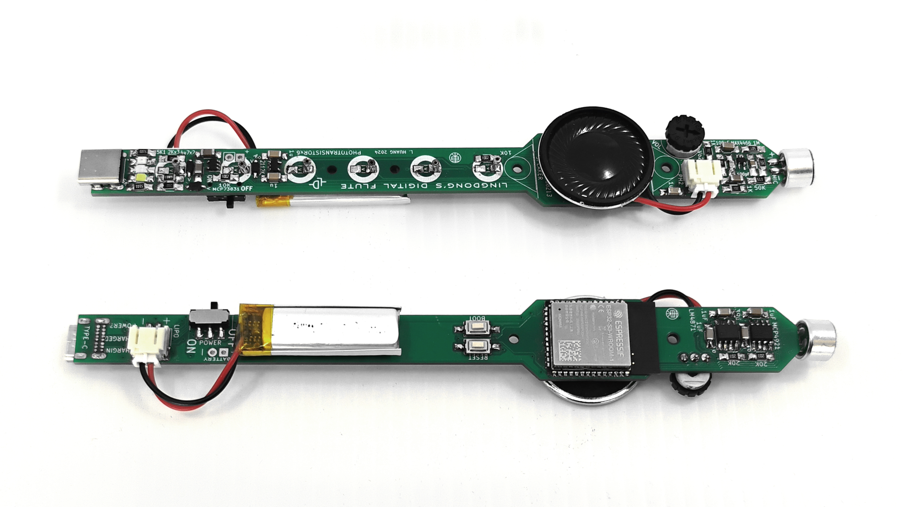
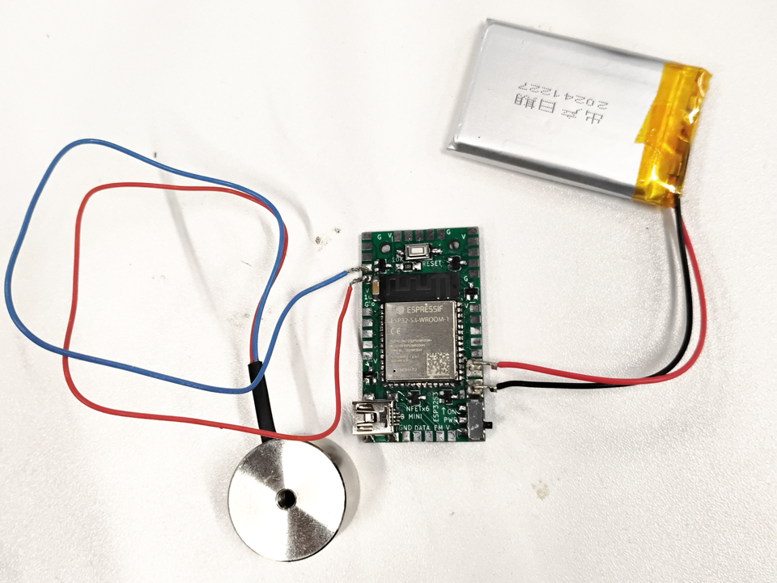
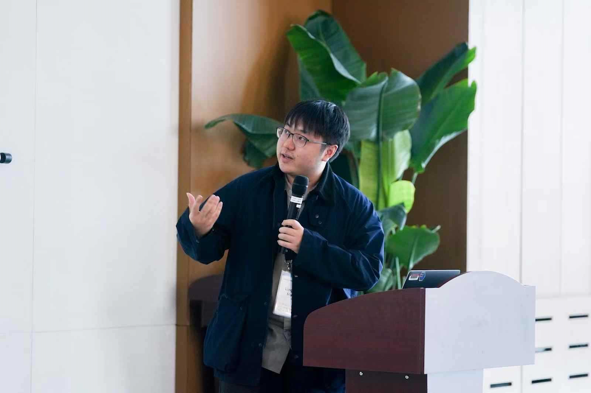
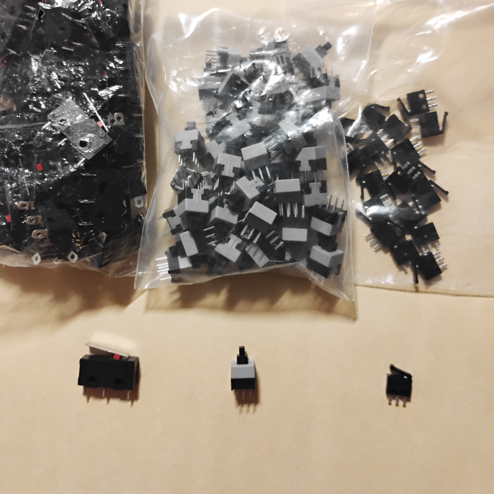
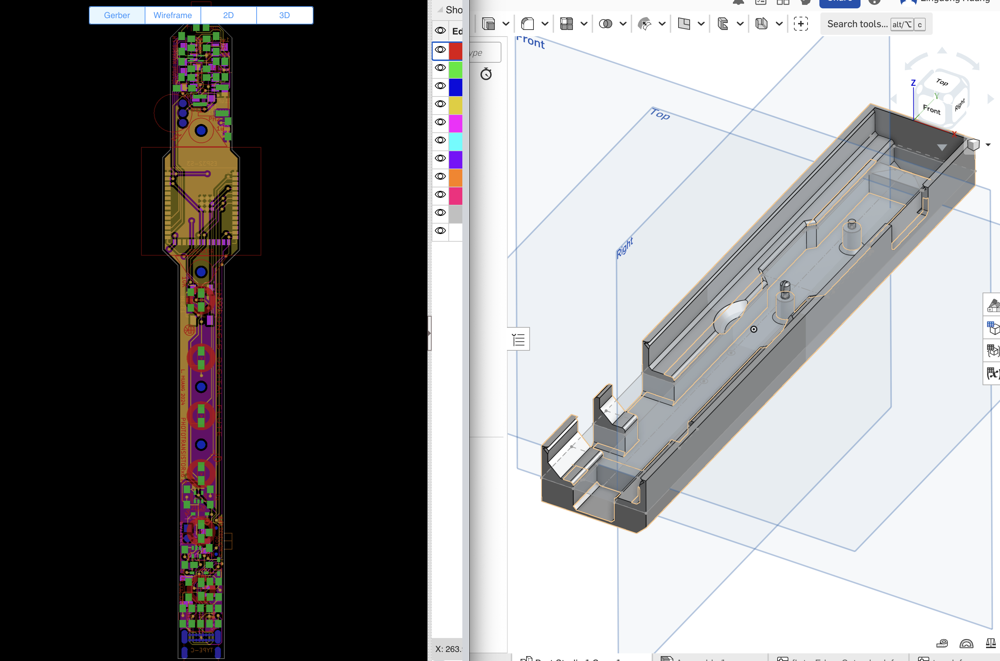
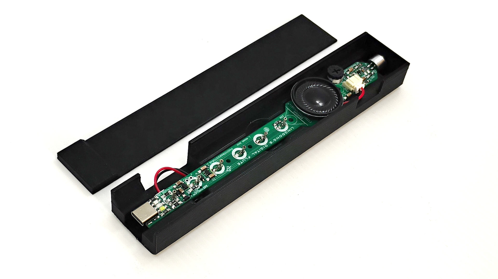
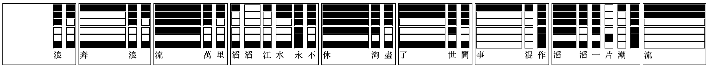
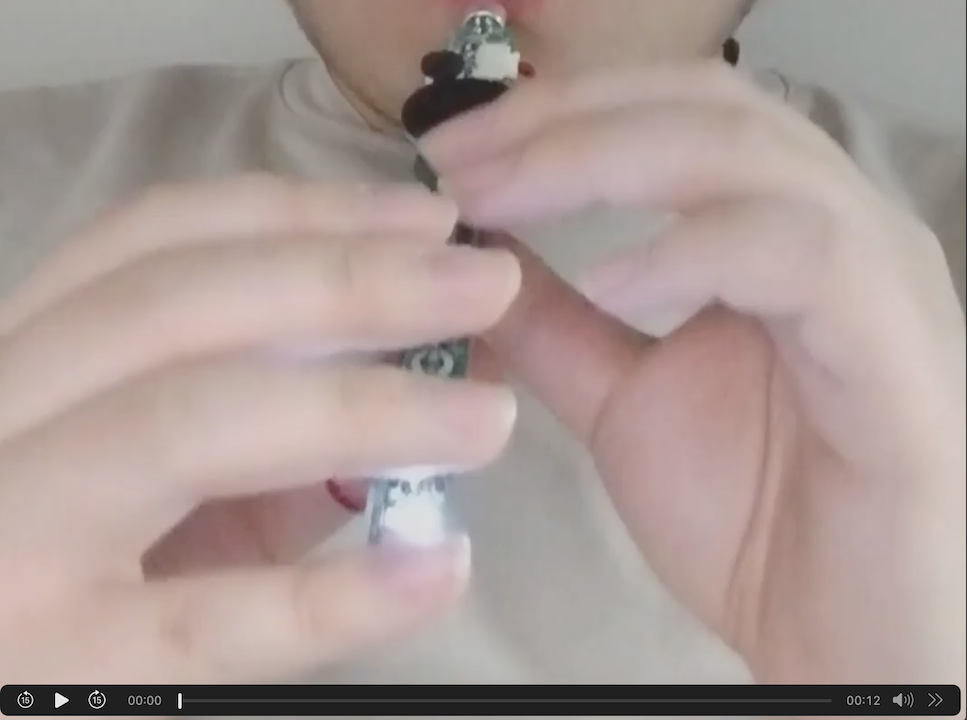
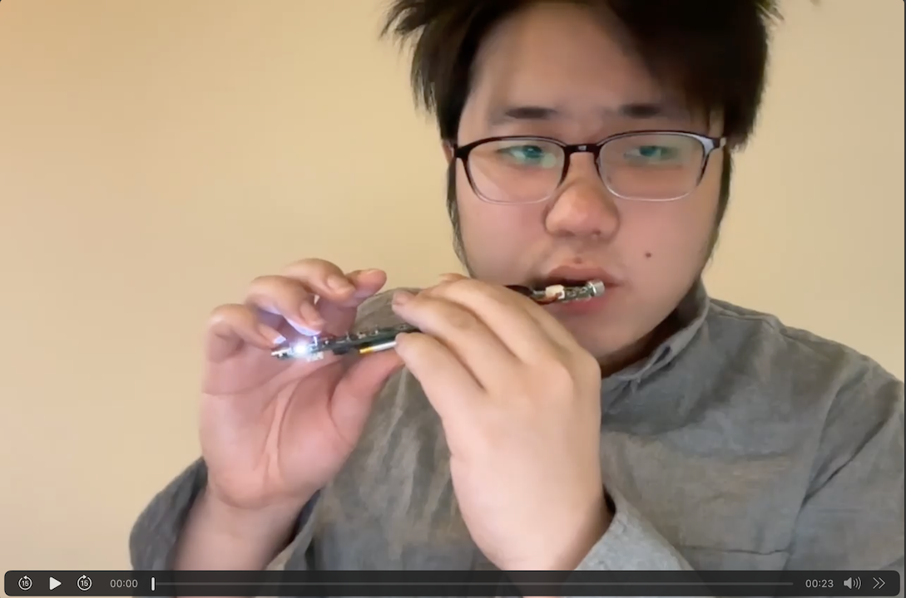

# Lingdong's Story

Lingdong visited Shenzhen again, this time with a few new projects in mind...

He managed make good progess on a few of them...

Here's a picture of his favorite:

This little document documents his little adventure.

## Cell Bot

Lingdong is helping his new buddy [Yuhan](https://yuhanwang.net) build a new type of self assembly robot. The idea pretty cool, you can read more about it on Yuhan's page [here](https://seeed-studio.github.io/MakerCamp/2025-01-MIT/Yuhan/).

Lingdong is designing a PCB for the robot. The PCB needs to be pretty small so it can fit in the little "cells" that will attach onto one another magnetically. The PCB is battery powered and uses mosfets to turn on and off electro magnets. Lingdong drew the board with KiCAD and ordered some bare boards at JLCPCB.

Yuhan and Lingdong went to HQB to get all the components and managed to assemble a prototype that seems to work well (with 1 electro-magnet)! Of course, more units need to be assembled to test the inter-communication and such.

## Talks

Lingdong gave two (nearly identical) talks during the visit. His playing of the new musical instrument ["Lingcordion"](https://www.instagram.com/reel/DD_3eBPRp_H/?utm_source=qr&igsh=MTNpYXVvZWljZ3kzbQ%3D%3D) seemed well liked.

Here's a picture of him giving one. I found the image on some person's social media, whose noble name I have carelessly forgotten. Thanks for the nice picture, some person on social media, and please let me know so I can credit you.

## New Buttons

Lingdong was planning on improving his musical instrument "Lingcordion", and perhaps making some new ones. So he went to HQB to shop for some nice switches.

He bought 3 types of interesting new switches:

- A bigger beefier version of the current limit switches he's been using. He thinks these will suit the big fatty hands of American people better.
- A little push button that looks nice, and that can potentially work well for the other, button accordion (Garmoshka, to be exact) project he's been working on.
- A tiny limit switch! The guy who sells it says it's called "camera shutter switch". Cute, and would be nice for some minuscule instruments.

## Hainan Escapade

Lingdong sneaked away for a few days, for an [artist-in-residency in Hainan](https://www.instagram.com/drgchina/p/DCoweymJ008/?img_index=1) province, China. Hainan is a tropical insular paradise.

He met a ton of awesome people there! He worked on computational embroidery projects with [Margaret Minsky](https://cma.hkust-gz.edu.cn/faculty-adjunct/margaret-minsky/)! (Maybe he'll put a link here later...)

He also helped with sampling ethinical instruments, with [Ajun the musician](https://www.youtube.com/@yaoajunmusic) (cool guy).

They sampled the nose flute (a flute played with your nose!), and various string and wind instruments made from animal bits...

The masters are super skilled (and nice). They were asked to play every playable note on their instruments, in sequence. Here's a picture of Ajun sampling master Guó Chǎn playing the nose flute, while wearing ethnical gear:

Lingdong processed the audio samples, and made a few new "timbres" for his "Lingcordion". He also learned to play a tune the master played!

Unfortunately his laptop did away with itself, not long after Lingdong's return to Boston, causing him to lose everything!! (except his PhD thesis, which he managed to back up in its very last moments). Oh well! Maybe he'll have to pay another visit to HQB next time he's in the country!

## Digital Flute

Before the great disaster, Lingdong designed and ordered a new PCB, which is that of a digital flute, inspired by the nose flute he saw in Hainan.

Unfortutely, some clueless neighbor or thief stole the package when it finally arrived weeks later (due to delays during the Chinese New Year). Have fun with my useless bare PCB's, thief!

Lingdong ordered the boards again, but when it arrived this time, he already lost all his design files with the laptop. Luckily, the silkscreen gives some clue on what he was thinking during the boards conception...

Initially the "holes" were made with phototransistors. The idea is that when the holes are "covered", the ADC will detect the lack of light and adjust the pitch accordingly. This potentially allows for "half-hole" techniques when the phototransistors are partially occulded.

However, Lingdong discovered that the particular phototransistors he has are particularly insenstive to light. He'll need to put a flash light over them for them to read a high value, and only then will occlusion with a finger make any difference in reading.

Therefore he ditched the phototransistors and soldered a bunch of "nails" on where they used to be. The nails function as capacitive touch pads. They're made from female SIL headers, with the plastics removed, pointy end cut off, and the nicer receiving end facing up to be touched by fingers. Kinda hacky, but hey it works very well!

The blowing detection is implemented with an electret microphone and a pre-amp chip. (He did not know air pressure sensors exist). The funny problem with that is that when the flute makes loud sounds, it can sometimes get picked up by the microphone, forming a feedback loop. Lingdong carefully tuned values in his firmware so that this does not happen (as frequently, at least).

Below is a picture of the flute in its special box designed with onshape:

With a traditional six-holed flute, one often needs to blow harder or softer to change the octave. Lingdong found it hard to master the technique. Therefore, since a digital flute is free of constraints of the laws of physics, Lingdong designed his own fingering for the flute, that allows playing a lot more notes just by covering different combination of holes.

In theory, one would be able to play 2^6=64 notes with 6 holes -- more than 5 octaves, chromatic scale. Lingdong tried to learn this binary-encoding-inspired fingering, and found that it presents too much cognitive overhead to learn quickly. Therefore, he introduced a compromise, that augments traditional fingering by assigning notes to normally invalid hole combinations. One hole is dedicated to changing the octave.

He also made a little music "engraving" software that converts scores to diagrams showing how to finger a piece with the new fingering, shown in the image below.

The instrument can be played both horizontally like a flute, or vertically like a recorder.

The sound is from the authentic ethnical nose flute that I helped sample in Hainan!

The instrument can be played with one's nose, but it's a bit hard to master, as one'll need to breathe heavily to get breathing sounds captured by the microphone. If you're good at snoring, maybe you'll be better than me at it.

Here's a video of Lingdong playing it vertically like a recorder:

(Click on the image to watch the video)

And here's a video of Lingdong playing it horizontally like a flute:

(Click on the image to watch the video)

## Thank You

A heartfelt thank you to all the sponsors of this trip! Seeed, AIRS and all the other companies and factories! You guys are awesome! I learned so much!
