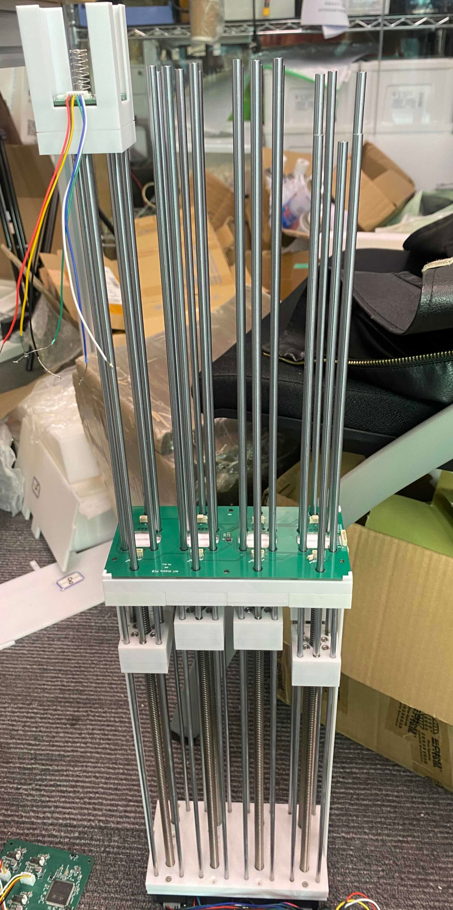

## Roboscope

During the Research at Scale 2025 residency in Shenzhen, I had the extraordinary opportunity to further develop and collaborate on the [RoboScope](https://www.media.mit.edu/projects/roboscope/overview/) project which I have been deeply involved with for the past few years. This residency offered the opportunity to collaborate with SUSTech University in developing a design that could be esily manufactured at scale. Working in Shenzhen’s dynamic hardware and manufacturing  ecosystem allowed me to understand the supply chain process of the region as well to graps the benfits of developoing hardware locally in Shenzhen.

RoboScope is a transformable, tangible-interface developed for the CityScope platform. This interface allows for on-demand, three-dimensional, manipulation and visualization of urban form. Like other CityScope interfaces, RoboScope has been designed to facilitate user understanding of urban data and simulations in a visual and tangible format.
RoboScope  allows for on-demand, three-dimensional, visualization and manipulation of urban form. The interface is composed of an array of 3D pixels organized in a grid used to abstract the urban area under investigation. Each 3D pixel can be controlled volumetrically to represent topography and urban from, as well as represent urban characteristics via  illumination. In addition, interaction through push-pull manipulation allows users to update urban charactirestics in near real time.

The transformable area or zone is compressed by an array of 3D pixels that are used to abstract the massing of urban environments. In addition, each 3D pixel can be used to display information via illumination as well be manipulated through push /pull gestures.

The collaboration started after Seungwoo Je and his research group at SUSTech learned from our work through an introduction from a City Science PhD student visiting Shenzhen. The Group learned that Seungwoo's Lab was working on a similar pin-based display but in a robust, compact, and scalable version. Collaboration began with several online meetings on how our work might complement, intersect, or combine with Seungwoo's Lab. These initial conversations highlighted the shared interest in developing new tools for interacting, simulating and visualizing urban form and systems.

Seungwoo's Lab at SUSTech has an extensive background in physical computing, hardware manufacturing, and design, as well as experience in the design process of manufacturing scalable and robust electronics and physical components. By leveraging SUSTech's location in Shenzhen, the world's manufacturing hub, we aim to collaborate to build a robust and scalable Roboscope platform that can be used to study and visualize urban interventions.

#### Thank you
A huge thanks to Cedric Honnet for organzing and managing the whole residency and trip to Shenzhen. I also want to thank Seed Studio, AIRS and SUSTech University for all the support and the amazing opportunity to learn from the local tech ecosystem.
