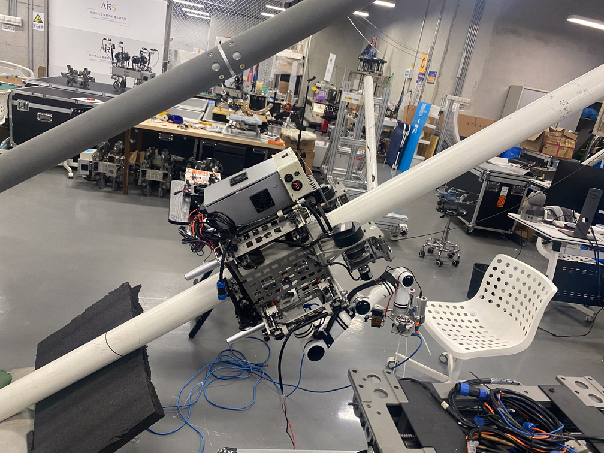
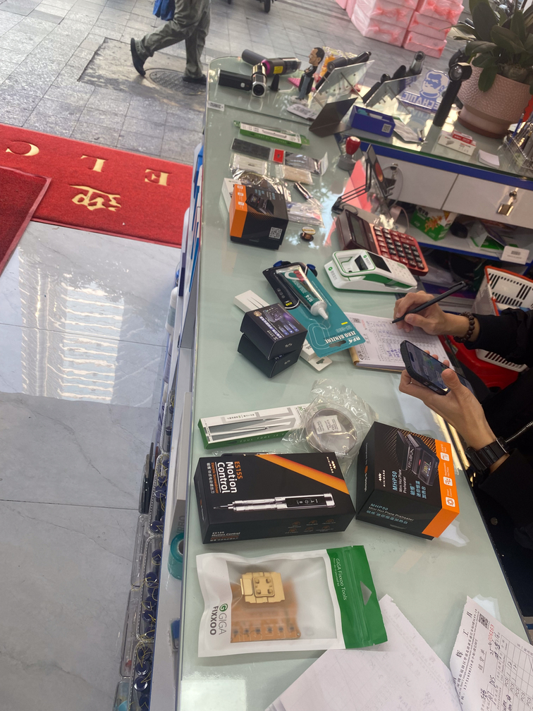

# Highlights from Shenzhen 2025

My recent trip to Shenzhen was nothing short of an adventure. Here are some standout moments and insights from my visit.

## Scalable HCI Research Symposium

At the Human-Computer Interaction (HCI) Symposium, I presented our lab's latest work on compliant twisted + winching tendon actuators, aimed at creating lightweight exoskeletons for assistive robotics. Eric Pan from Seeed Studio also gave an insightful talk highlighting that product quality should align closely with user expectations—a sweet spot that requires continuous engagement and feedback from customers.

  

## Art + Robots at AIRS

The robotics showcase at the Shenzhen Institute of Artificial Intelligence and Robotics for Society (AIRS) featured some impressive climbing robots that immediately grabbed my attention. Their elegant combination of design aesthetics and functional engineering reminded me of similar work by my friends at MIT, prompting ideas for future collaborations. Nearby, a package pickup station seamlessly integrated drone and human deliveries.

  

  

  

## Inside the Shenzhen InnoX Incubator

Exploring the InnoX incubator was fascinating—it offered a look at innovative products transitioning from concept to market. An electronic guitar gaining local popularity caught my eye, and I snapped a picture of my friend Samy giving it a try. The incubator's atmosphere, complete with a relaxing cat café, fostered creativity and inspiration, making it a delightful place to innovate.

  

  

## Factory Visits

Touring electronics manufacturing facilities was eye-opening. I witnessed advanced pick-and-place systems, large-scale injection molding operations, and massive carbon fiber layups that dwarfed our campus equipment. As a tool enthusiast, I was fascinated by unfamiliar yet impressive brands. Highlights included factories specializing in servo motors (common in RC cars), microLED displays, and even luxurious smart watches and rings, some featuring genuine gold components.

  

  

  

  

  

  

  

  

  

  

  

  

## Huaqiangbei (HQB): Tool Paradise Found

As a self-proclaimed tool enthusiast, HQB was essentially paradise. I picked up several specialized electronics tools, including a remarkable set of precision tweezers. Alan humorously posed with a giant screwdriver, and I spent time admiring a beautifully decaled microscope, which made me reconsider the equipment in my MIT lab.

  

  

  

  

## Magnetic Circuits: Project in Progress

I'm currently developing reconfigurable electronic kits inspired by Lectron, designed specifically for educational use. My prototypes feature 6mm magnets in 3D-printed housings, allowing modular connectivity on clearly labeled PCBs, making circuit concepts visually intuitive. I aim to miniaturize these modules from their current 25mm size down to 15mm, with hopes of eventually sharing an open-source version widely.

  

## Soft Robotics Innovations

My colleague Ryan and I have developed a self-sensing tendon actuator (preprint available, full paper forthcoming at RoboSoft). Conversations with Cedric sparked ideas about enhancing these tendons using carbon nanotubes or conductive polymers. Additionally, I'm exploring compact pneumatic, hydraulic, and combustion actuators for soft robotics—especially inspired by tiny valves found at HQB, ideal for precision tasks like lab automation using standard 96-well plates.

## "YOU ARE A CHICKEN": Hackathon Project

At the SeeedStudio hackathon, I created an interactive installation titled "YOU ARE A CHICKEN," inspired by B.F. Skinner's behavioral experiments. Snowball, a baby chicken, interacted with a sensor triggering a chaotic, social media-like feed and receiving seed rewards. This playful setup highlighted the parallels between animal conditioning and human digital behaviors, offering a humorous yet profound reflection on our constant search for stimulation.

  

  

## Upcoming Project: Mapping HQB

Next visit, I plan to use an Insta360 helmet to create detailed Street View-style footage of HQB, helping others navigate its complexities and fostering new business connections. With additional data analysis, this could become an invaluable resource for the global maker community.

From practical tools to philosophical chickens, Shenzhen filled my notebook with exciting ideas and future possibilities.

## Bonus Highlights:

I encountered an incredible vending-machine library conveniently situated in a local neighborhood—I'd love to see something similar in Boston.

  

I also visited CocoPark, a massive megamall—the original and largest among several around the city.

  

