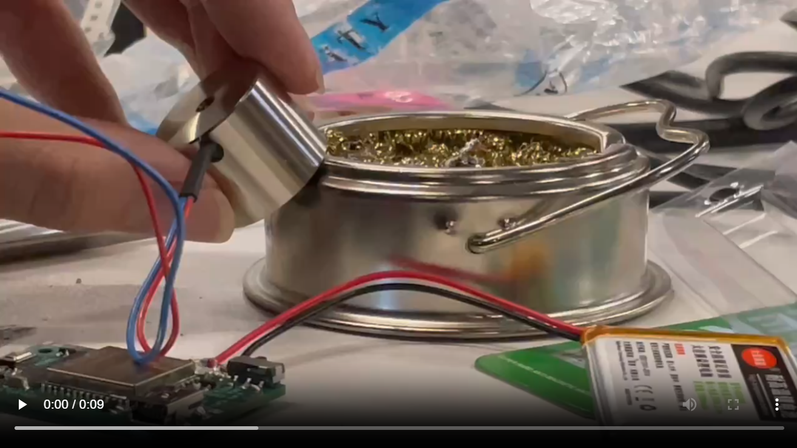

# Yuhan's project

Yuhan has proposed a project in the very primitave state of the trip. This project is about a self-assembly robot that can reproduce itself like the way plant cells make their reproduction through cell devision. 

[Here](https://miro.com/welcomeonboard/Q096MVpCemJVVXhKeUNHWDlnRjlvdlMzY29oaDQzSnZLdmxYVFNvUWhjeUpKNHlsN1Fzc3Q5VEdtcFBtOWZKa1MzTFJXTnFYZnlGLzZOdmJmWXdESjJ5dXljcEVYVkJUcUk3Tlc2TXl1VGpOQ1NKdFJWYjFnQ0JSYy91cnhjYk9NakdSWkpBejJWRjJhRnhhb1UwcS9BPT0hdjE=?share_link_id=806799644284
) is a Miro link, but the key information from this Miro will be embedded into this article.

The key idea of this project is bringing the essential way of reproduction from living creatures to the robotics. For instance, in the cell division process, each cell has the DNA for the whole creature, and the DNA is copied and transferred to all the 
other cells. Yuhan have been exploring the ways self-assembly robotics manage to form larger structures from modular units, and he wish to create a similar process of this cell reproduction through a machinary robotic way. 

Here is a poster that Yuhan made for the project in the exhibition session of the Scalable HCI. It shows a very essential feature of the Cellbot: each robotic units have the "DNA" of the overall shape, and they are able to connect to other units based on this information. After they connect to the other units through magnetic force, they are able to transfer this "DNA" information through the direct contact of the ports on the units. Overall, this is a explosive process of connecting units, from one to two to four and instantly to the amount needed for the whole structure. 

## Initial Iterations

Before the trip to Shenzhen, Yuhan have developed some initial iterations of the robot. He has explored the mechanical ports that ensures the correct connection angles between units, and the ports that embed with mechanical locks to enforce the connection after the initial magnetic connection. Here is some images for these iterations. [Here](https://www.canva.com/design/DAGZHV4IsF0/2jFsM0VfgqeXKrLmhL7k2g/view?utm_content=DAGZHV4IsF0&utm_campaign=designshare&utm_medium=link2&utm_source=uniquelinks&utlId=h9e1d34fbc4) is a presentation that shows more of this initial design.

## At Scalable HCI

During the trip to Shenzhen, Yuhan had a collaboration with Lingdong, who helped greatly with this project. The resource of HQB provided us with great efficiency of prototyping with custom PCB and 3D printing. 

Specifically, Lingdong designed the PCB for each units. This system consists of the battery that power the unit, the microprocessor that process and control the behaviors, on each port there is one electromagnet to connect to the other units, and a data port to transfer the DNA information directly to the other units. Here is a detailed view of the PCB.

(Click on the image to watch the video)

Yuhan then designed a new version of the cell, making it able to transfer data through the port.

The development of this project is still ongoing...

## Related Work & Discussions

During the visit to AIRS Lab, Yuhan identified a self-assembly project that is similar to the form that they are working on. It is a megnatic modular robot that is actuated and can move around to form larger structures. Although the core information is different, Yuhan believe this project is of great value to consider and learn from while developing his project. 

In order to make clear of the narration of the project, Yuhan, Lingdong and Francisco had a discussion over the topic of self-reproduction robot and self-growing robots. It is a very inspiring talk and made the direction of the Cellbot project to be more oriented towards the self-reproduction aspect of it. 

## Other activities

Yuhan presented his work of interactive architecture at the AIRS

Yuhan toured the 人才公园 with Lingdong and another friend, Holden.

