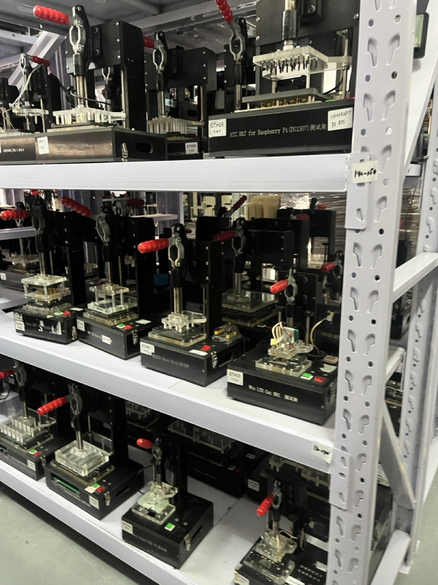
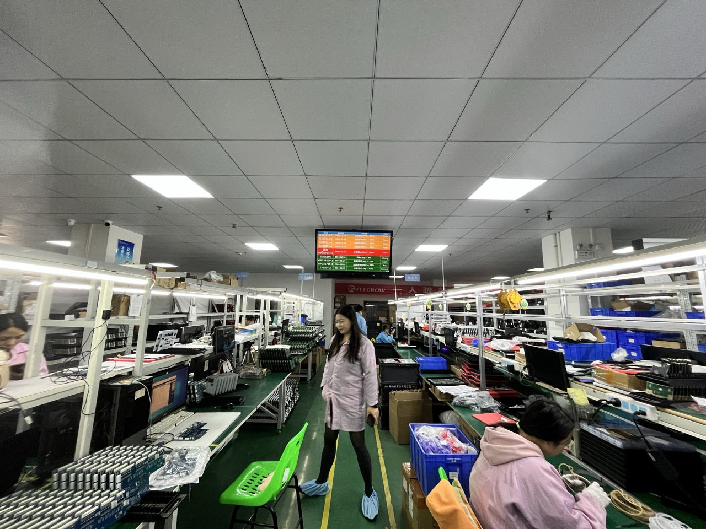
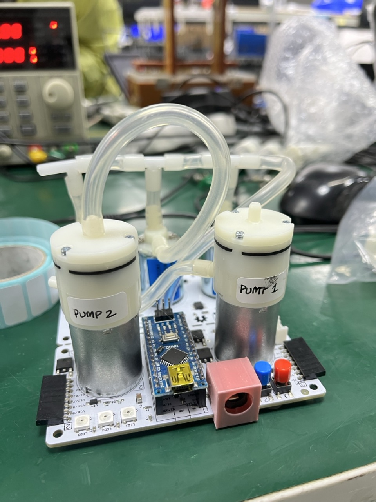
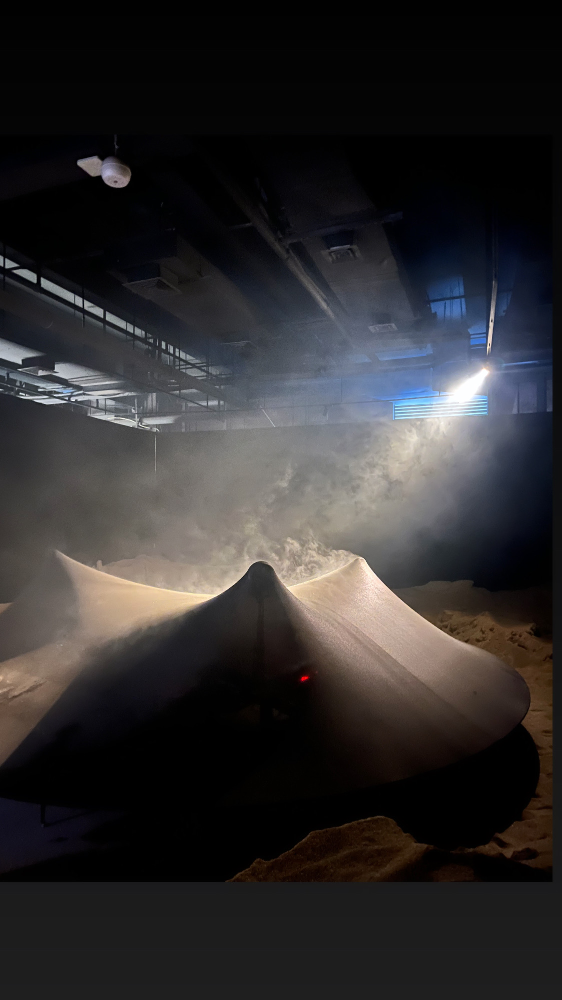

As a hardware maker, Shenzhen has been on my bucket list for well over a decade and I'm so grateful to everyone involved with this residency, especially Cedric for finally getting me there!

Something I love about Shenzehen is the pride the city takes in being the factory of the world, and how the architecture reflects this.
|  |  |   |
|---------------------------|-------------------------------------------------------------|----------------------------------------|

Visiting manufacturing facilities was definitely the best part of the visit. It's seldom that we get to interact with the machines that build the machines we use to make things. Little things like a PCB used as mechanical plate to hold up the PCB assembly line made me smile.
|  | ! | | |
|---------------------------|-------------------------------------------------------------|----------------------------------------|---------------------|

The research projects in the various universities we visited were truly impressive as well. It was really impressive to see students doing work at par with some startups I've worked with in the states.

|  |  |  |  |
|---------------------------|-------------------------------------------------------------|----------------------------------------|---------------------|

I've been manufacturing [Programmable-Air](programmable-air.com) in Shenzhen for more than six years, and finally got a chance to see the factory it's made in. Being able to debug some of the testing issues and working with the assembly technicians in person was really rewarding. 

| | |  |
|---------------------------|-------------------------------------------------------------|----------------------------------------|

The plethra of stores selling everything from funky pogo pin connectors to camping EVs were exciting as well. My favorite shops were the camera repair places.
|  |  | |
|--|--|--|

Getting to see equal parts thought provoking and silly fun art was a great perk.
|| |
|--|--|

The Hackathon was a great reminder that pretty much anything you need can be found in the Shenzhen markets if you know where to look. Thanks Hang, for doing the looking while I was busy building. Can't believe we made a 'holographic' face oscuring mask in 24 hours!
|  | |
|--|--|

Spending time at AIRS, playing with the laser cutter, melting rocks to make glass was so fun! Thanks for letting me get into the guts of the laser cutter to get it working. 

| |  | |
|--|--|--|

One of the art works I saw at AIRS was a black sand floor littered with flashlight bodies with clock faces inside. This inspired a parting gift I engraved.
|  |  | 
|--|--|

Hope to come back to Shenzhen sometime soon to build more art.
