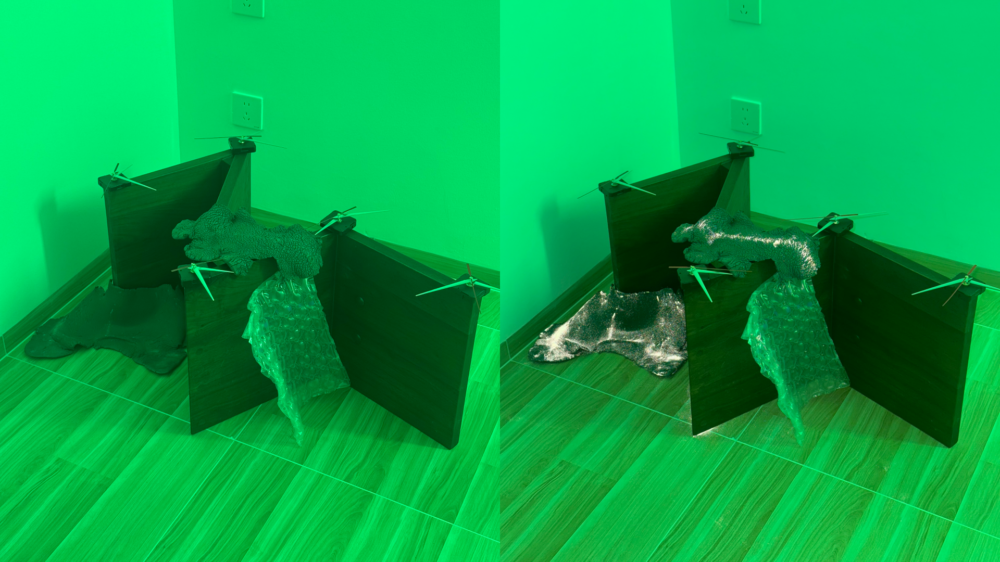

# Shenzhen, Scalable HCI, and Alternative Academic Futures

 

## Why I Came Back to Shenzhen

In the middle of 2024 I decided to quit my job to pursue my research-based art practice full time; six months later I returned to Shenzhen for the Scalable HCI symposium (for the second time!), and this time stayed for the residency to explore a different side of the city.

I am a New Media Artist and ~~Creative~~ Critical Technologist whose practice centers around subverting (un)conscious perceptions. I compose my pieces using a palette of emerging technologies, affording moments of critical curiosity through anomalistic interactions.

I attended this Symposium/Residency at the tail-end of a larger three month, semi-entropic, trip through Asia with my collaborator Koi Ren. After spending time in institutions, I'm currently finding inspiration in nomadic-academic // alternative-academic structures. This trip was part of a divergent phase of our practice, affording us a wealth of diverse inspiration. 

 

## Shenzhen

### Scalable HCI: My Contributions & Collaborations

I was ecstatic to return after such an inspiring time in 2024. This year, I brought "In Vivo / In Vitro - Trial 1.4", a collaborative piece with [Koi Ren](https://www.koi-ren.com/). The piece uses AI to understand the moment of unconsciousness, when a viewer blinks, to ephemerally display generative and evolving embryonic imagery during the moment in which their eyes are closed.

> Koi demoing In Vivo / In Vitro - Trial 1.4 to Patrick 

 

Additionally, in collaboration with other attendees Ming He and Isabelle Pleno (as well as Jacob Brawer who wasn't able to attend), we brought a poster presentation of the current status of [Conscious Tech Collective's](https://www.conscioustechcollective.co/) work on our Healing Room project.

> CTC's poster from 2024 [left] and this year [right]

 

Last year, even though it was not my first time in Shenzhen, the curated exploration through the factories, electronics market, maker's spaces (Seeed!!), and cultural visits truly blew me away. While there was an incredible team behind the planning of this symposium, I would be remiss not to specifically credit Cedric's effort, as it is truly through his eyes that myself, and everyone attending the symposium, get to see such a unique and inspirational glimpse into the backend of the world of electronics.

> //machines

> //abundance

 

## Beyond the Symposium: Shenzhen’s Alternative Art & Tech Worlds

### Art & Alternative Spaces

This year, in addition to reconnecting with the inspirational facets of Shenzhen in a longer form through the residency, my core intention in attending was to explore the city with my current alternative lens, specifically, uncovering art and alternative spaces within the city.

 

On the second floor of a shop in Nantou (南头), I attended Wei Ling's opening, which included a collaboration with Xiao Ruowei's lab from SUSTech. Ruowei's students trained a LoRa on Ling's art and generated + printed a custom postcard for each attendee in real time, through the use of a RFID tag included in the participant's ticket.

> Wei Ling's opening 

 

[Marcel Zaes](https://marcelzaes.com/), another professor from SUSTech (and amazing human), debuted "Flowing Sound", a multimedia installation that presents a digital archive of street-sourced portable media from all around Shenzhen City and makes these media artifacts accessible in a playful way. This exhibition was at Pingshan Art Museum (PAM), which while quite a ways from the heart of Shenzhen, is absolutely worth a visit.

> "Flowing Sound", Marcel Zaes, 2025

 

I attended [Wu Jiaru's](https://www.instagram.com/wwwjjjrrr111/) solo exhibition at the culmination of her residency with Nature Art Centre and MANGROVEGALLERY. The residency took place in Wanxia, an old fishing village within Shenzhen that harkens back to its pre-industrialized era. After speaking with many residents, one nail artist's stories resonated with her enough to fill an apartment (the studio) full of artifacts derived from her emotional tales.

Addionally, I received my first manicure ever during my time here; the middle finger of my right hand, painted blood red with sparkling metal dust. A deliberately provocative, semi-permanent addition to my appearance that functioned as an extension of her work--a form of associative storytelling.

> "Malgré ses blessures", Wu Jiaru, 2025

 

### SciArt & Research Labs

Another major contributing factor for my return to Shenzhen for the symposium was the SciArt Co-lab at the Artificial Intelligence and Robotics for Society (AIRS). In their lab, both artists and researchers coexist, symbiotically inspiring and building off of each other. Last year, we saw their first exhibition "The Deduction of the Question" which explored art as provocation for scientific exploration.

This year, their sophomore exhibition "The Question of the Question" was set to open just after spring festival, but we were luckily able to see a preview. Another space I highly recommend visiting! I won't spoil any of the exhibition, only the gif below.

> Zinn + a beam of light = 

 

Earlier in my trip, at the opening of Shen Shaomin's "Rice: Verses for the Hungry Soul" in Shanghai, I met [Zoe Li](https://li-zoe.com/), a New Media Artist and PhD Candidate in the Computational Media and Arts (CMA) program at the Hong Kong University of Science and Technology (HKUST), Guangzhou. Serendipitously, but unsurprisingly, I had seen her work "A Sigh" at SeeD last year during the symposium.

On the way to visit her lab outside Guangzhou, we stopped to visit Mirrored Gardens, a gallery symbiotically embedded into a natural landscape. A tranquil interlude to an immersion in technology.

> Mirrored Gardens, Photo credit: Zinn

 

At HKUST, Zoe gave me a tour of the CMA labs. Among many interesting projects, I want to highlight two: a wearable synthesizer with oscillators that only function correctly if a hand crank on the side of it is continuously rotated--brilliantly whimsical--and a Hulusi being given a modern update (pictured below).

> The guts of a Hulusi being transformed from analog to electric

 

On our return to Shenzhen, we stopped by Xu Jinlong's solo exhibition at Guangming Art Museum. Xu's show housed an array of impressive kinect installations, such as the one below. He is also part of the SciArt Co-lab!

> "Boundaries that don't exist", Xu Jinlong, 2025

## Reflections: Shenzhen as a Model for Open Innovation & Art-Tech Symbiosis

Unfortunately, I came down with a sickness that consumed a majority my residency, during which I'd intended to explore the theme of frictional technology--systems designed with intentional friction in the interaction to provoke reflection--that had emerged during my trip, through a series of pieces.

However, I hope you enjoyed reading through my report in which I intentionally tried to show an alternative perspective of Shenzhen, hopefully complementary to the other great trip reports :)

I am incredibly inspired every time I visit this city. Reflecting, I truly see Seeed as a blueprint for how to utilize the opportunity this city affords in both the most optimal, and meaningful way. To elaborate, Shenzhen's manufacturing capabilities are obviously what sets it apart on a world-scale, and Seeed's approach of building a brand/company around this, specifically to further the collective vision of open-source hardware, is truly commendable!

The SciArt Co-lab at AIRS is a very unqiue occurence. As someone who has moved fluidly between disciplines, and intentionally positions themselves in the gaps/intersections, the SciArt Co-lab is a special space that stands out through empowering this liminal space between art and science. Moreover, as I continue exploring the question of "Why art?" as the focus for my research, SciArt offers a lens (through both their process and exhibitions) that resonates: to provoke and hypothesize on the critical questions that can only emerge when thinking beyond conventional frameworks.

As the last stop in my larger trip through Asia (besides Spring Festival), the energy of both the people and the environment at the Scalable HCI Symposium, and Shenzhen as a whole, served as a great reminder of the power of interdisciplinary/antidisciplinary collaboration and the importance of embedding creative inquiry within technological ecosystems. The convergence of artists, researchers, and makers here reaffirmed my belief in fostering spaces that challenge conventional boundaries.

Finally, a heartfelt thank you again especially to Cedric, Zinn, and Seungwoo, as well as everyone else who offered their time to plan and make this exceptional trip happen!

Until next time... Now, off to [Mars](https://mars.college) ;)

> Oh, and the food was great: grasshoppers [left] and chicken skeleton [right] yum! [: