# Exploring Electronics Manufacturing in Shenzhen

## How I Got Here
As someone who works as a prototyper and designer of [AI hardware](https://humane.com/), I've always wanted to see how the hardware we design for actually gets made. The program was incredible - meeting incredible researchers and creative makers, visiting factories and seeing how products are made, and diving deep into the electronics markets left me endlessly in awe. What really got me excited the most was exploring how research and industry can work together to build really beautiful technology, especially thinking about the open source community and how we can all collaborate to make a fun and beautiful technological consumer electronics future.

## Fun Devices in Huaqiangbei
Working in consumer electronics, I'm constantly amazed by what products people dream up and bring to life. It takes so many people and so many hours to make anything in hardware, and every single detail is a deliberate decision. Visiting HQB (the main electronics market) was eye opening because you see the vastness of the hardware at the interestion of whats possible, what makes money, and what humans have imagined. HQB is a living, breathing ecosystem that is constantly changing, and you can really visualize the current state of the consumer electronics industry through the products on display. My goal in HQB was to get a broad view of what kinds of devices people are making, especially the fun and weird ones. I ended up collecting a bunch of funky devices that showcase whats possible and whats currently in vogue. Here's some of my favorite finds:

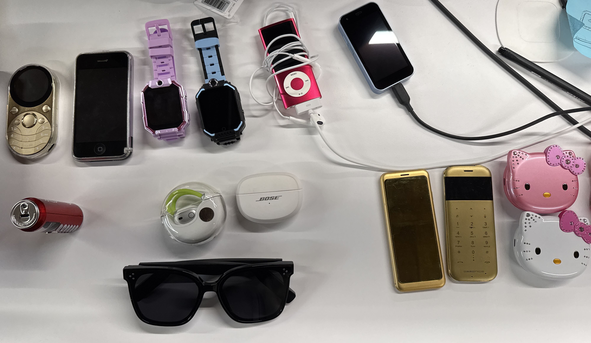

From top left to right:
- round oval smart phone - love the shape + gold finish
- iphone 1 (the original!) - incredibly rare to find in HQB as its not in production and thus not in the market
- LTE kids watches - kids all over china have these, and they come with a SIM card pre-loaded with a bunch of games and apps, including wechat and tiktok
- pink iPod Nano gen 5 with camera - only saw one vendor selling these, comes preloaded with previous owner's songs (mine has mainly japanese pop)
- tiny "iPhone" (aka an android phone) - this is a so called shanzhai phone, or a cheap knockoff of a popular phone. This one is a tiny clone of the iphone 12.
- Coca Colo phone - yup, its a 10 digit phone in the shape of a coke bottle. colo, not cola, for copyright reasons.
- fun earbuds, all for < $10. The bose ones are a knockoff of a pair that goes for $300 in the US.
- Gentle Monster speaker sunglasses - connect via bluetooth to your phone. not bad quality!
- 2 golden space-agey phones - prob from the 90s, funky design
- Hello Kitty phone - my fav find! so so fun, sing a song when they turn on, and the eyes blink at you.

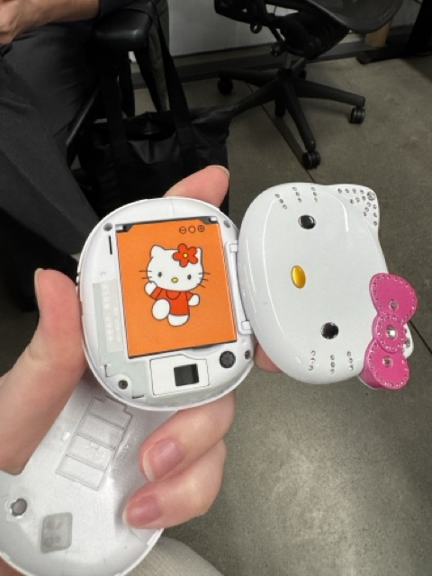
- the Hello Kitty phone also has a fun battery!

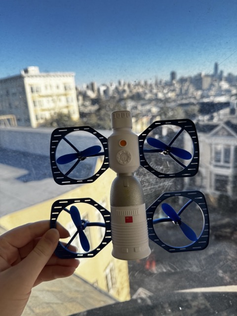 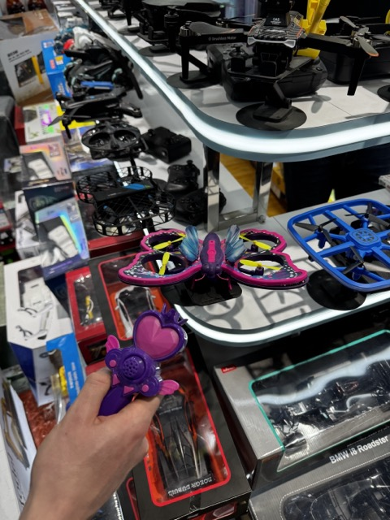
- drones were everywhere! I loved this butterfly and space station one, a creative take on what a drone represents.

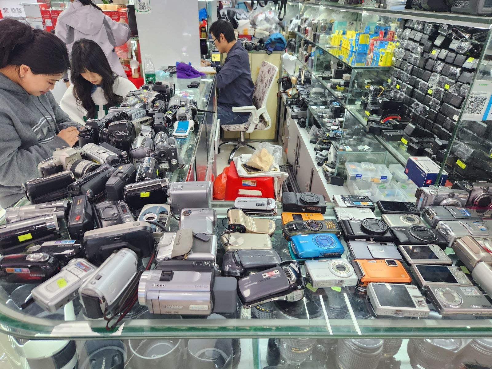
- now that youngsters from all over the world (there were hordes of students searching for cameras in HQB) on the old cameras trend, it seems that vendors have dug up handheld cameras from the 90s and early 2000s. Theres dozens of booths selling them.

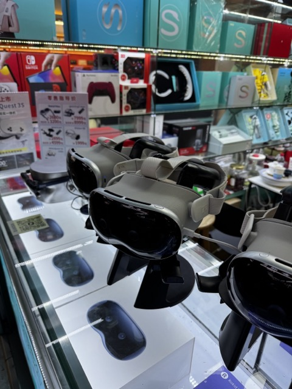
- yup, that is a fake Vision Pro.

## Art, Research, & Industry
Coming from a startup but with a deep love for HCI research (I conducted HCI research in college and am endlessly inspired by the work being done), I've been thinking a lot about how to connect these worlds in a meaningful way. People in the SF startup world often aren't exposed to the amazing work happening in academia that overlaps with their work. How can we create cultures where we all build and think together? 

Two visits during the symposium really inspired me in this regard. The first was to AISR, a robotics lab that works with artists to create beautiful pieces that push ideas in the research forward. Artists and researchers are constantly in conversation with each other, one side pushing the technical capabilities and the other really questions how this technology is used and what ideas it portrays. This model is so unique - it shows an alternative model for co-creation. The second was visiting Seeed Studio, the supplier of essential components for makers and researchers. They figured out how to enable makers and researchers while running a successful business. Their [co-create](https://www.seeedstudio.com/co-create.html) program is genius - makers create custom PCB boards that Seeed then mass produces with the profits split.

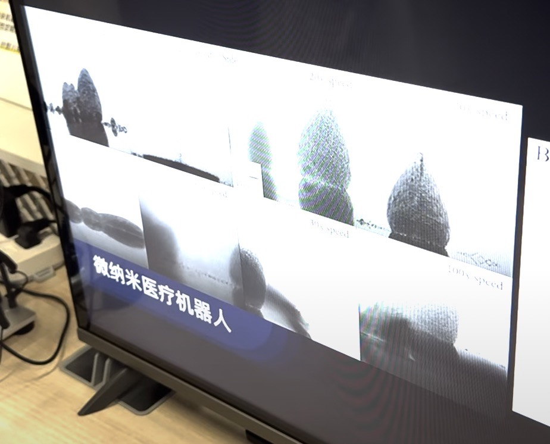

One of the projects at AISR is showing how magnetic particles can be controlled (or in this case, to make art).

## How It's Made - Consumer Electronics Edition
Being in HQB and seeing so many super specific vendors - LEDs, connectors, ICs, etc. - was mind-bending at first. I grew up playing with electronics, but shifted to being mostly focused on the software experience side lately. I realized I had a gap in my knowledge about how everything actually comes together. Visiting factories, talking to talented electrical engineers that were part of our group, and trying to understand what each booth was selling all made me obsessed with creating a full map of how everything is made, from the creation of injection molds and core components (like batteries and ICs) to final assembly.

Visiting Seeed Studio's factory was a breakthrough moment - watching how PCB boards are made and how the assembly line is organized made so much click into place. Other factory visits that showcased how injection molds are made and flex PCBs are assembled added more pieces to the puzzle. All this inspired me to start putting together a [massive guide of learnings](https://elfin-guan-8f7.notion.site/The-Ultimate-Guide-to-Understanding-Consumer-Electronics-and-Making-Things-17ef7fbeb7fd80d5b5f8ea97d5715da5?pvs=4) to map out the entire consumer electronics supply chain, from raw materials to final shipping, including the history of computing devices. Did you know that consumer electronics really only started in Shenzhen in the late 80s? I visited the HQB history museum and was blown away by how much the ecosystem has grown. I want this guide to be a shared resource for everyone who's just starting out. If you want to help out, please reach out!

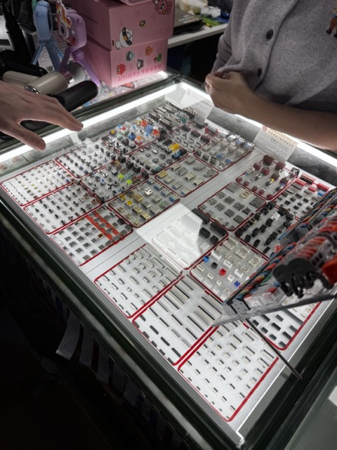 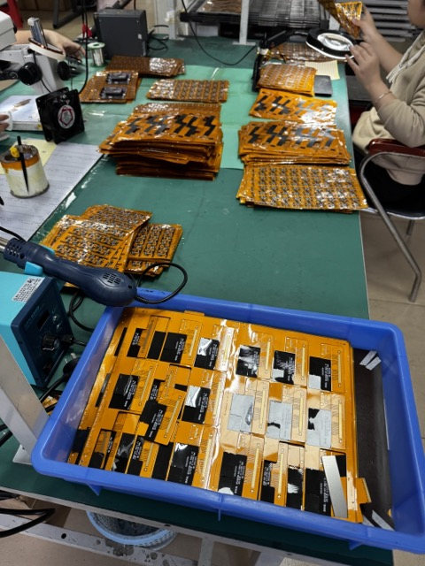 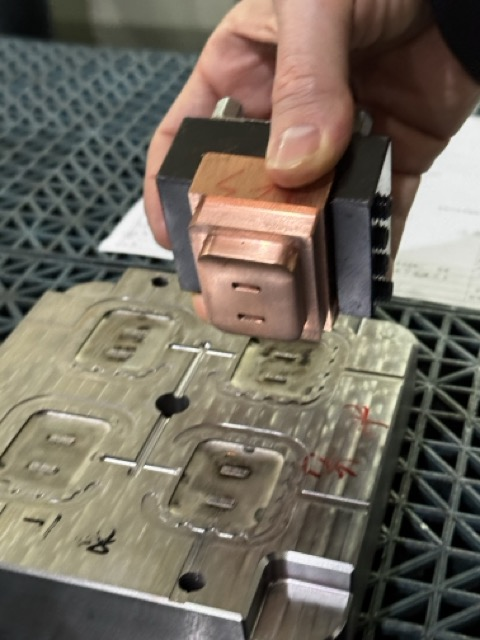
- some of the puzzle pieces that make up modern consumer electronics - connectors, flex PCBs, injection molds (here showing the stamp and resultant mold).

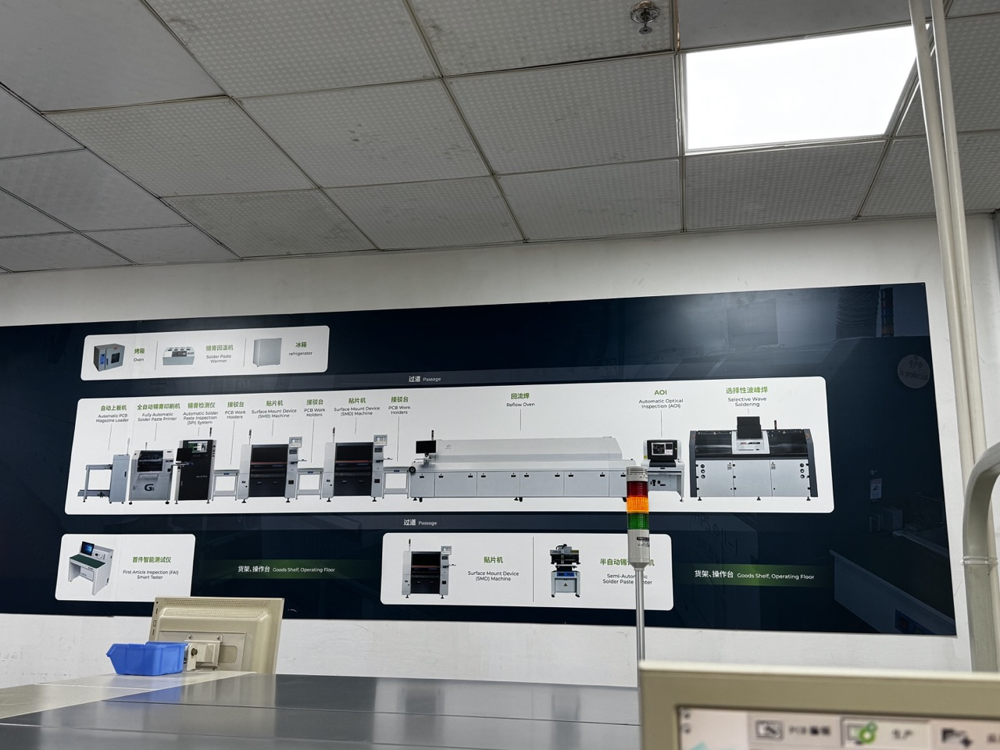 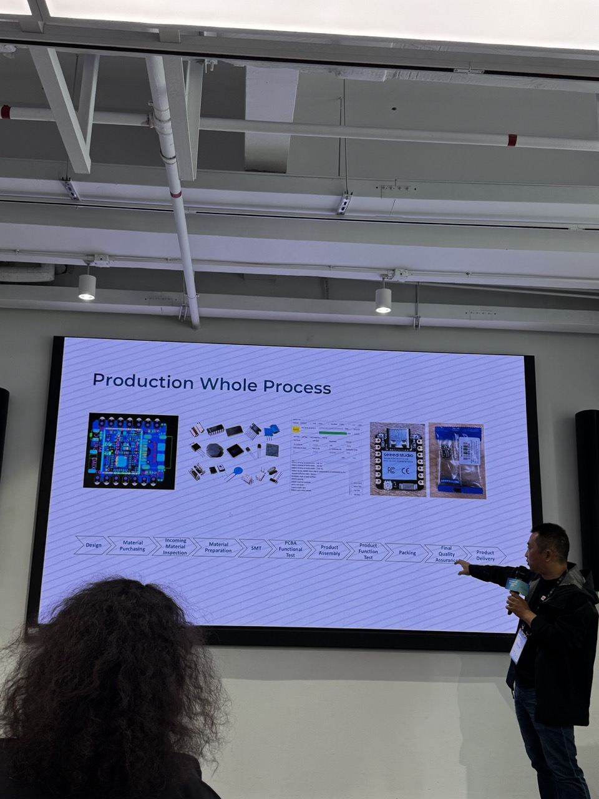 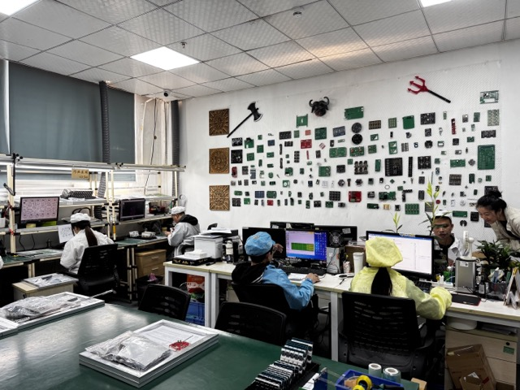
- Seeed Studio really explained the entire production process to us!

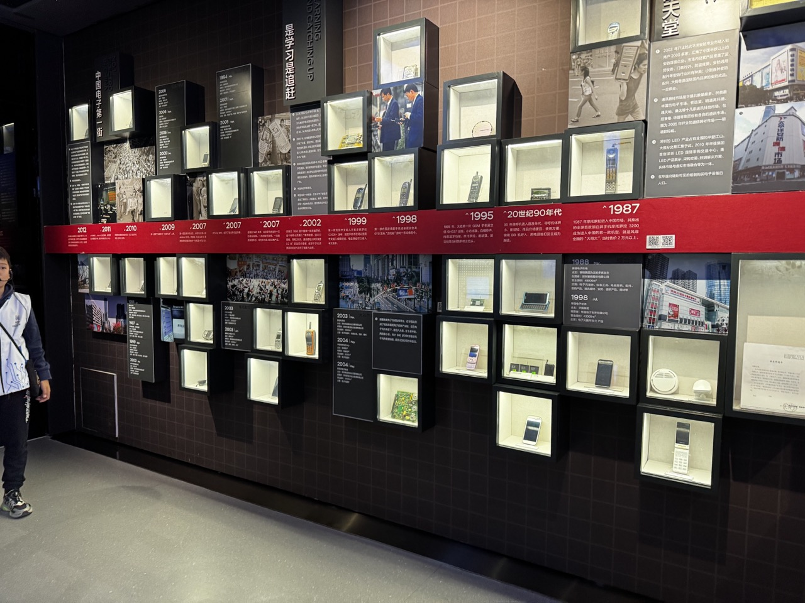

At the HQB history museum, the timeline of iconic devices produced in Shenzhen was shown. In only 30 years, Shenzhen has gone from a small fishing village to the center of the electronics industry.

## Making Dumb Phones Smart
During the symposium hackathon, I found a rare satellite phone in the markets and had this wild idea to AI-ify it. I'm obsessed with the idea oftaking fun old "dumb" phones (phones with actual character, unlike how all modern smartphones look basically the same) and making them smart. I gutted the electronics and discovered that the sat phone was actually a Frankenstein phone using a newer phone board with an original sat phone body (such a shenzhen moment!). I rewired the buttons and battery to a Xiao board with a mic and speaker. While I didn't have time to program it fully, the idea is that if you have access to the phone hardware, you can write novel ai software to control it. The Xiao board can connect to the internet and stream audio and button clicks to an AI backbone, letting the phone do normal things like calling and texting in addition to "smartphone" stuff like browsing the internet and calling a ride share (ai agents galore). I'm super excited about this idea of reuse - can we take our old tech, like flip phones and landlines, and make them useful today? This could add so much more personality and variety to our personal tech ecosystem, letting people express themselves through their choice of devices without giving up modern convenience.

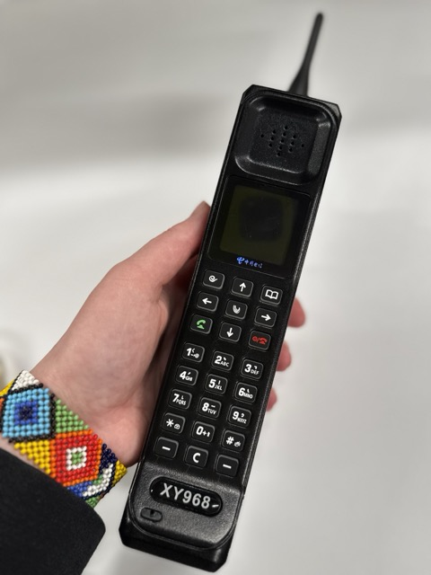 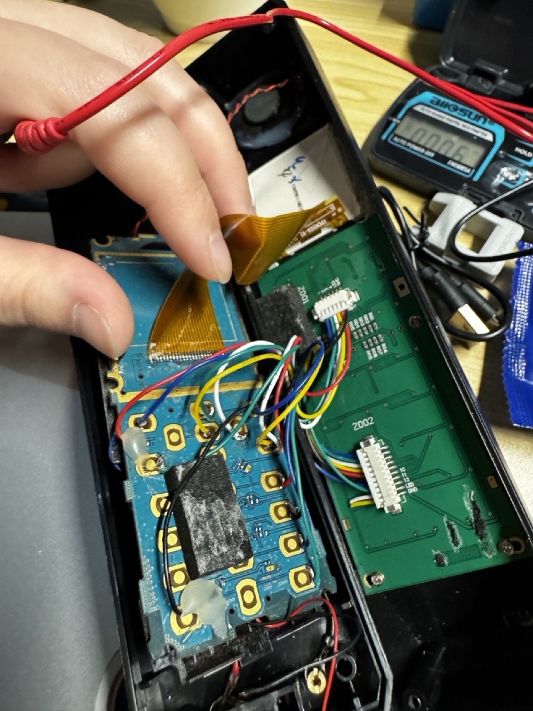

- the main board is a newer phone board, but the body is the original sat phone body

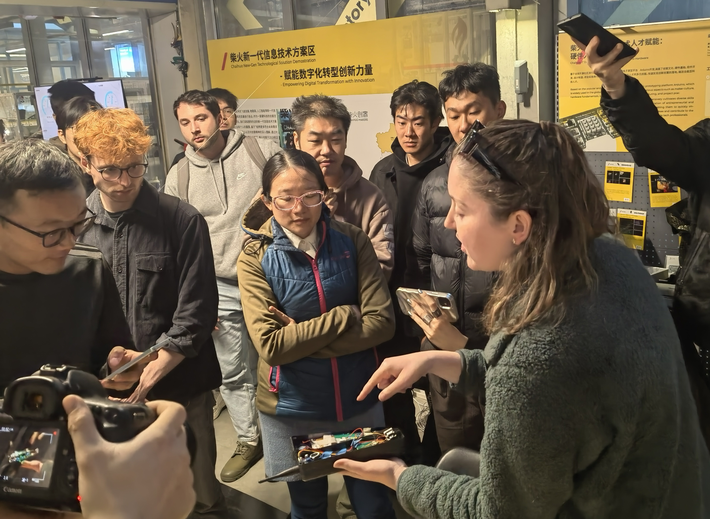

- showing off the idea to the symposium!

## Friends Along the Way
The absolute best part was the community - such a wonderful group of passionate, curious, creative technologists <3 Every single conversation left me beyond inspired. I learned so much from everyone - hearing about HQB from people who've been going for years, meeting professors building tech that makes you think (both critiquing our existing tech patterns and showing new visions for our digital world), researchers pushing what's possible with both tangible and digital materials, and the maker community that's so open to building together and living the open source hardware ethos.

We also had amazing adventures beyond the tech stuff - exploring media arts installations, checking out mega malls and having family-style dinners, meeting some of the crypto community, being proper townies and hitting up a mega spa (and staying there till 3 am), randomly meeting an emerald dealer and getting a tour of the wholesale jewelry market (fun fact: Shenzhen is also China's major jewelry manufacturing hub), exploring the underground club scene, and having endless fascinating discussions. It was the perfect week to kick off the new year, and I can't wait to see everyone again and create together.

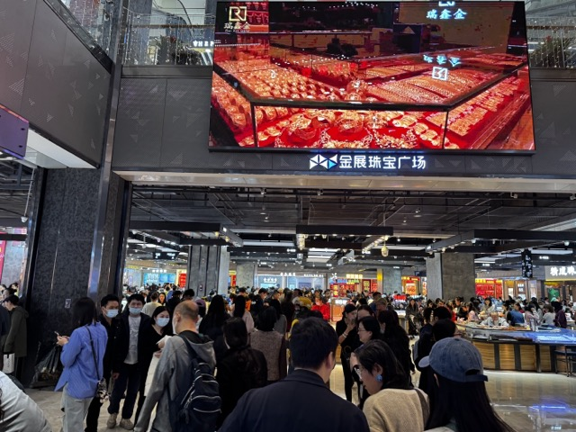

We got a tour from an emerald dealer around Shenzhen's wholesale jewelry market. Shenzhen is not just a tech hub!

Shenzhen is a city built in 30 years. We got a tour of the design district from one of the architects who designed the area.

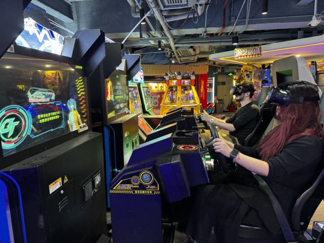

Shenzhen arcades are next level.

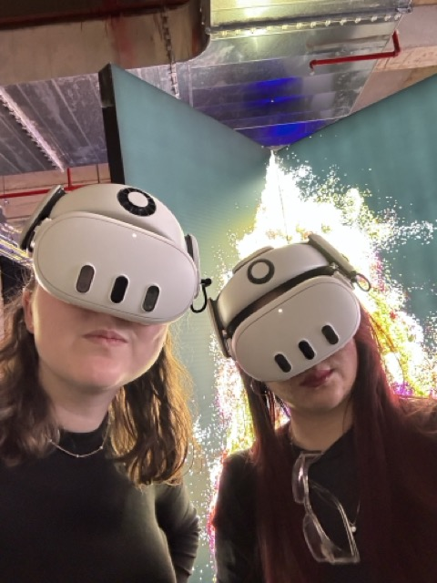

We got to go to many media art installations. My favorie was one where you had to wear a mixed reality headset.

