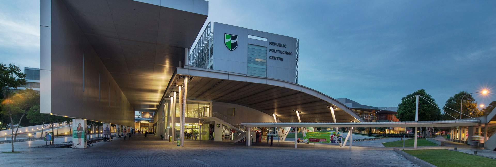

# Maker Camp in SZ-2502: Singapore Republic Polytechnic’s Hands-On Innovation Journey

*We recently host to a group of 20 enthusiastic students from Singapore’s Republic Polytechnic in the Maker Camp in SZ-2502 program, providing students with a holistic view of Shenzhen’s innovation landscape.*

From February 19 to March 19, 2025, twenty students from [**Singapore Republic Polytechnic (RP)**](https://www.rp.edu.sg/) embarked on a journey to Shenzhen for the **Maker Camp in Shenzhen 2502 program**. Designed to bridge the gap between academic knowledge and real-world industry practices, the program provided the participants with a practical, experiential learning experience encompassing AIoT, open-source hardware, agile manufacturing, and cultural exchange.

Both Shenzhen and Singapore are globally recognized as high-tech innovation centers. **Singapore** has established itself as a leader in smart city solutions, fintech, and precision engineering, while **Shenzhen**, often referred to as the “Silicon Valley of Hardware,” has long been a global hub for electronics manufacturing, rapid prototyping and hardware development.

The Maker Camp serves as a bridge between these two ecosystems, offering students not only technical skills but also valuable cross-border connections.

## About Republic Polytechnic

Established in 2002, Republic Polytechnic (RP) is a forward-thinking institution that emphasizes a problem-based learning approach to equip students with the skills required for success in today’s rapidly evolving technological landscape.

To further enrich this learning experience, RP partnered with Seeed Studio’s **Chaihuo Makerspace** to organize the **Maker Camp in Shenzhen 2502**, to expose students to Shenzhen’s dynamic innovation ecosystem, develop practical engineering and design skills through workshops, and encourage cross-cultural collaboration and entrepreneurship.

Source: https://www.rp.edu.sg/home

## Beyond the Classroom

At Chaihuo, the students engaged in workshops on open-source hardware, delving into Arduino platforms, TinyML, and AI integrations using tools like the **Wio Terminal** and **XIAO ESP32S3 Sense**. They also applied their acquired knowledge to develop functional prototypes, fostering teamwork.

Apart from the workshops, the students took a deep dive into the bustling HQB market allowed students to experience firsthand the vast array of electronic components available, understanding the rapid prototyping that Shenzhen is renowned for. Tours to the Seeed Agile Manufacturing Center and Seeed HQ also provided insights into agile manufacturing and the latest AIoT products. 

In addtion, they explored the city’s industrial achievement at the Shenzhen Industrial Exhibition Hall, visited Nantou Ancient City to learn how traditional spaces can be revitalized through innovative solutions.

The Maker Camp in Shenzhen program encourages everyone to actively participate by documenting and sharing their Shenzhen experiences. You can find a vibrant documentation from the RP students on [**Seeed Studio’s GitHub Channel**](https://github.com/Seeed-Studio/MakerCamp) SOON!

