# MIT Research@Scale Fellowship

## Reflections On My Time in Shenzhen

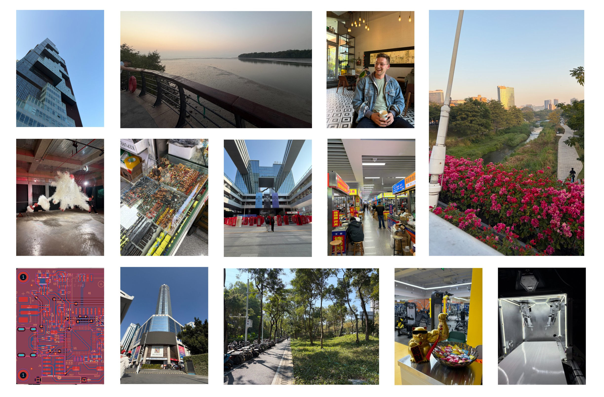

I don’t think it’s an overstatment to say that I will fondly remember this month for the rest of my life. Through participating in the Research@Scale Fellowship, I completed all of my major objectives for my time in Shenzhen:

* I began acquiring the skills and know-how necessary to advance from a hobbiest to a real-deal hardware engineer.
* I rapidly designed (and fabricated) a PCB, leveraging seeed’s expidited PCBA services
* And evaluated housing options for deploying my system in the real world.

Additionally, I made extremely important connections to fellow engineers/makers/designers in the US and in China. I have no doubt in my mind that these connections will prove to be invaluable as time goes on!

## Schematic Design and Development

My first goal this month was to design and fabricate an embedded system with the following capabilities:
* Read in the analog output of two EC5-5 Soil Moisture sensors
* Enter a deep sleep state to optimize power consumption when not actively sensing
* Operate off a small battery
* Communicate over a LoRa-WAN network

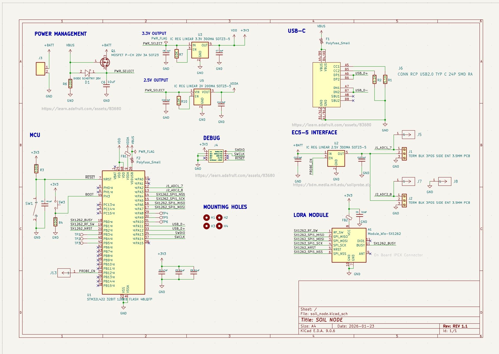

The main components on the schematic above are:
* Microcontroller: STM32L422
* LoRa Module: WIO-SX1262
* LDO's: TLV70233DBVR, TPS7A0320PDBVR, TLV70225DBVR

I did a deep dive into each subsystem of the PCB, evaluating options and ultimately selecting final componentes. (See video below). A lot of my time in the design phase was spent choosing my microcontroller. One of my major objectives this trip was to make the leap from the world of Arduino modules to placing bare-metal MCU's on my own PCBs. Getting an opportunity to do a deep dive into the STM32 family was extremely valuable, both for this design, and in the name of expanding my understanding of the microcontroller selction process.

<video controls width="1000">
    <source src="media/video1.mp4" type="video/mp4">
    Your browser does not support the video tag.
</video>

Shout out to Jake Read for doing a late night schematic review with me! He helped me work through a number of issues that I hadn't spotted previously.

## PCB Routing

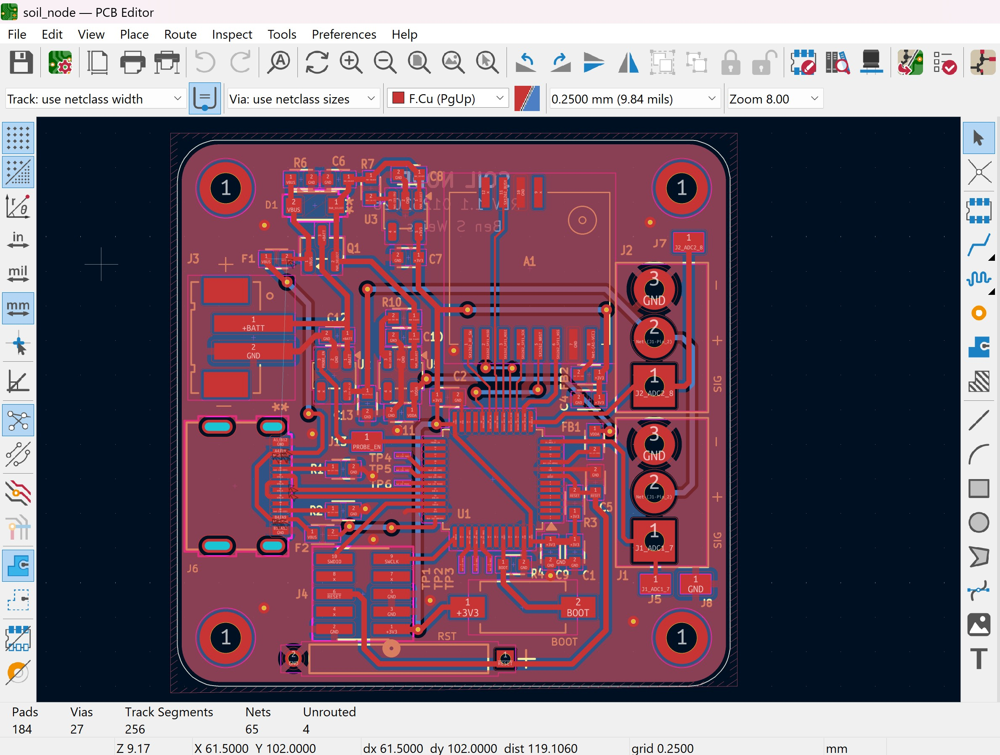

PCB routing is clearly both an art and a science. I spent many hours lost in the act of weaving traces in and out of my board. Given that my only other experience with routing came from taking "How to Make Almost Anything" last semester, I had only ever routed one-sided boards, which I then milled myself (see below). Making the jump to designing a 2-layer board was extremely freeing, now that I was no longer limited by the unique constraints of DIY milled PCBs.

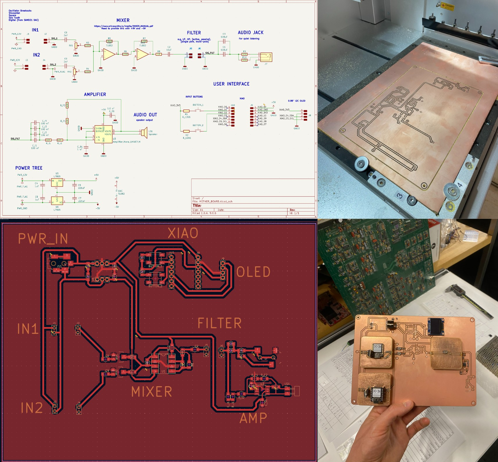

One of the joys of this fellowship is that I was surrounded by people with diverse expertise. As a result, I was able to do multiple rounds of design reviews with different people, each of whom helped me learn something new. Special thanks to Sam Chin, Jake Read, Brian Mayton (on the home front!) and Linus Liao (from Seeed). See below for Linus's markup of my nearly final rev of the PCB.

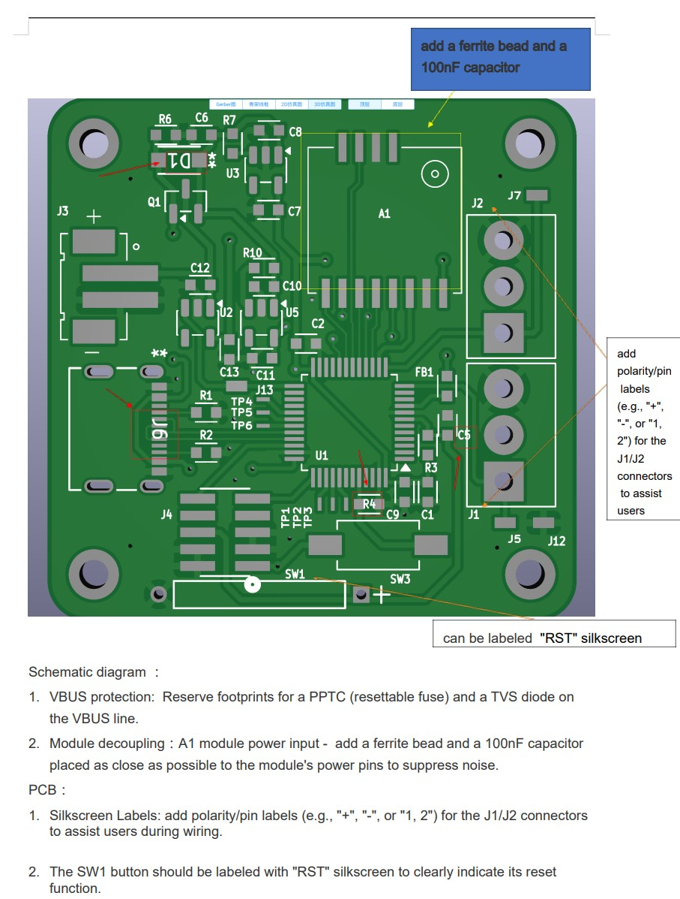

## Prototyping with Tiles

While I was waiting for my PCBs to be assembled, I deicded to explore using Jonathan Fiene's Tiles to build a prototype with only the essential pieces: MCU, Lora Module, and some power management circuitry. I knew Char was doing some work with the LaserPecker to try and get it up and running for making boards in Chaihuo, so I designed a soil_node_mvp board.

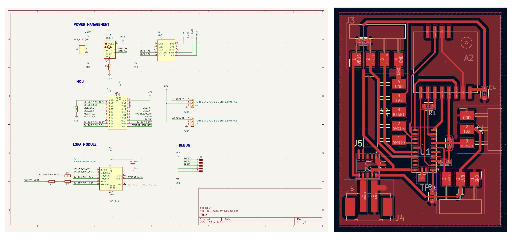

Quick plug for tiles: I think these little boards are destined for big things. They are optimal for makers who are interested in using small pitch components on DIY boards. 

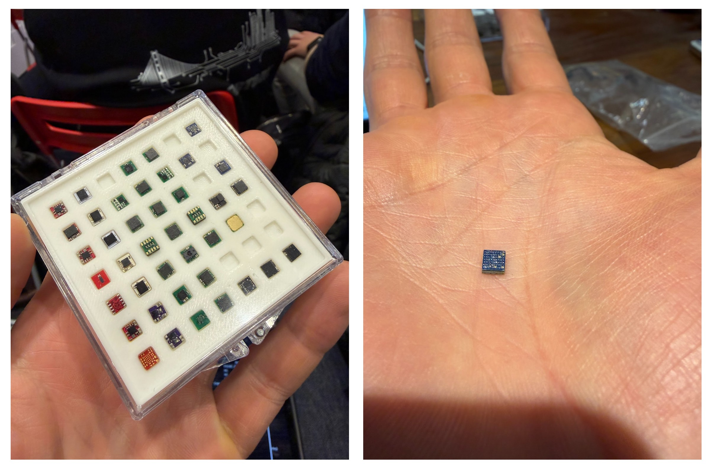

Unfortuately, I did not have much success with the laser engraver we were using. Often it takes quite a bit of time to tune the parameters for these sorts of fabrication processes. Given that my time in Shenzhen was rapidly coming to a close, I decided to pivot and see if there was another way to be able to integrate a tile quickly onto a board for initial firmware testing. Jonathan had just the solution! A little USB PCB which would enable me to drop a U.2 tile in, and connect to it right away.

## PCB Fabrication
Thanks to this fellowship, I had a unique opportunity to go and see my PCB being manufactured in person at the Seeed factory. Given that I had only ordered 10 PCBs, everything was assembled manually. This was a humbling process to witness. Two of Seeed's employees, Jiang Dan and Wang Bing, carefully placed every component by hand.

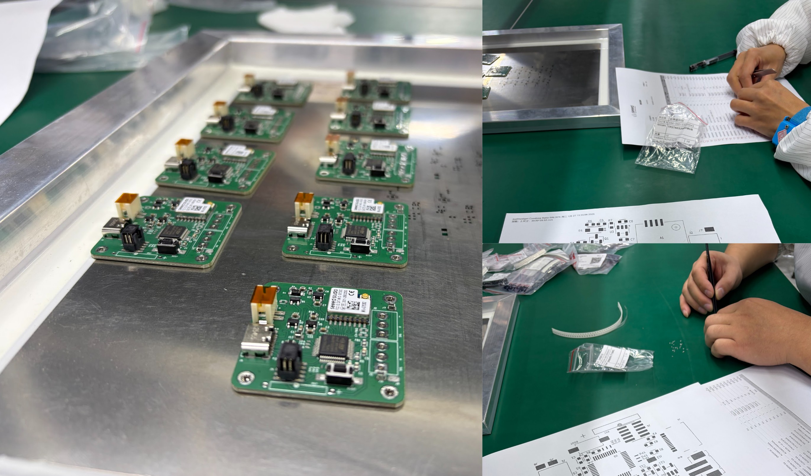

Despite not sharing a common spoken language, we were able to work through questions as they came up. For example, I had forgotten to specify the polarity of the diode on my board. Using google translate, electrical diagrams and hand gestures, were were able to figure everythign out then and there. Normally, this would have resulted in emails going back and forth across a 13 hour time difference, invetably causing delays in production.

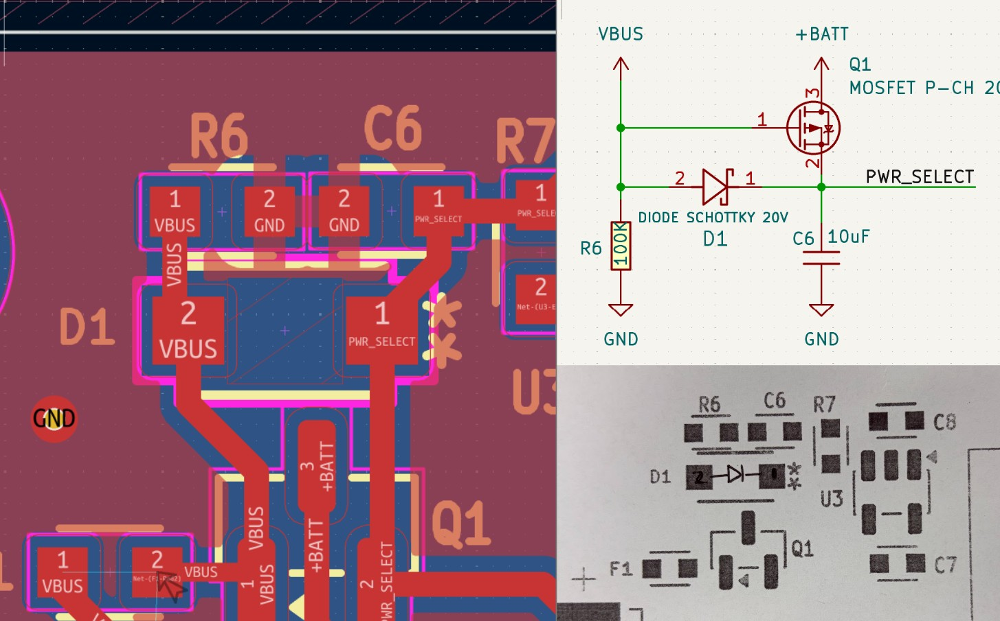

Being able to solve problems in real-time was far more efficient. I also appreciated being able to actually build a connection with the people doing this work, as opposed to this being an anonymous process.

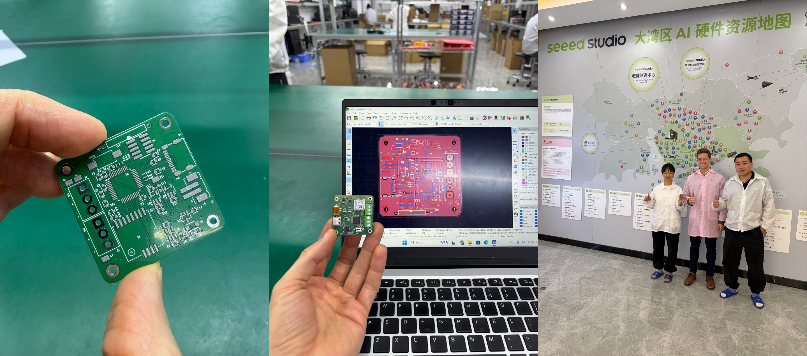

## Future Directions

I am so excited to continue working with Seeed on future projects! There professionalism, efficiency and kindness was unmatched. Next time I come to Shenzhen, I will be able to hit the ground running, now that I have the right connections and a better understanding of how things work. I am particularly excited to work through an entire hardware maturation process in the future from initial prototype to more refined product.

Finally, a huge thank you to Cedric and Ellie for all of your organizational efforts. To Eric and Zinn for funding the fellowship (!!!). And to Phoebe, Dana, Jiang Dan and Wang Bing for helping me get my PCB assembled in record breaking time! See you all soon, I hope.

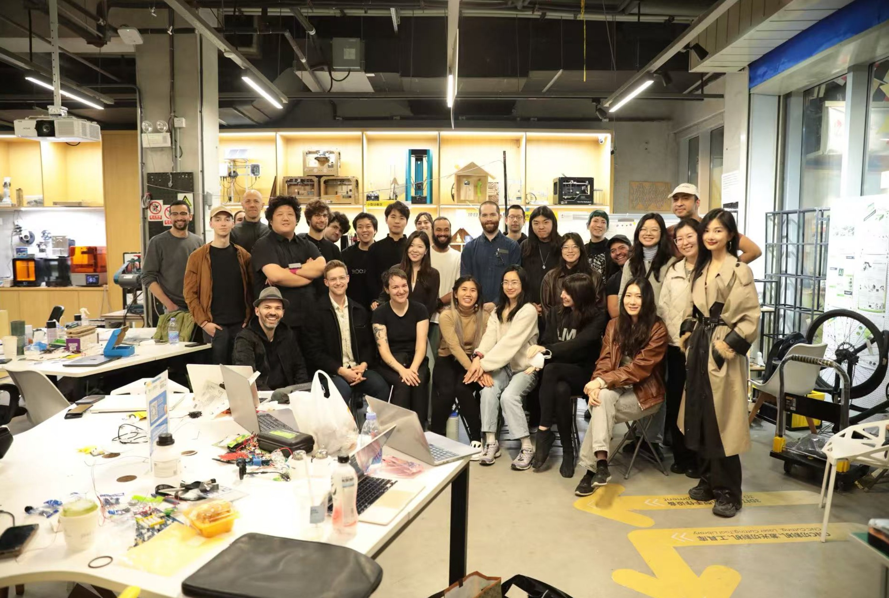
