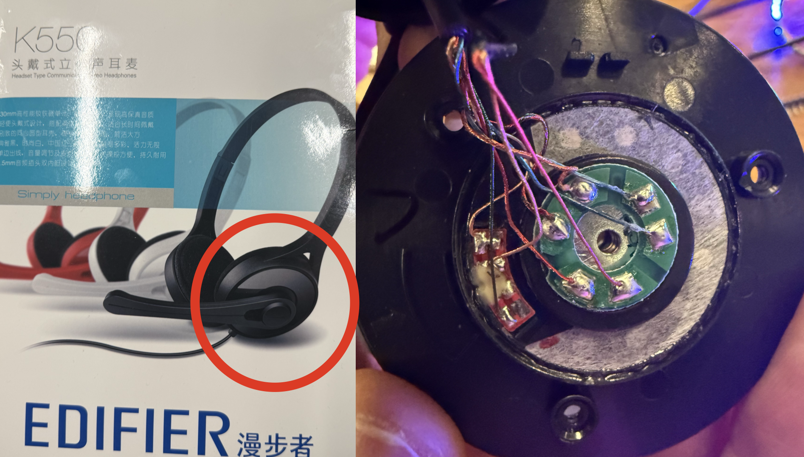
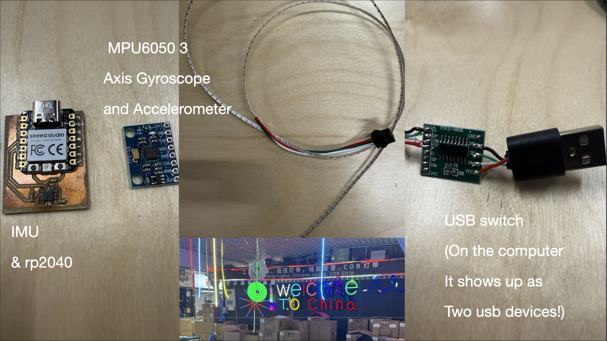
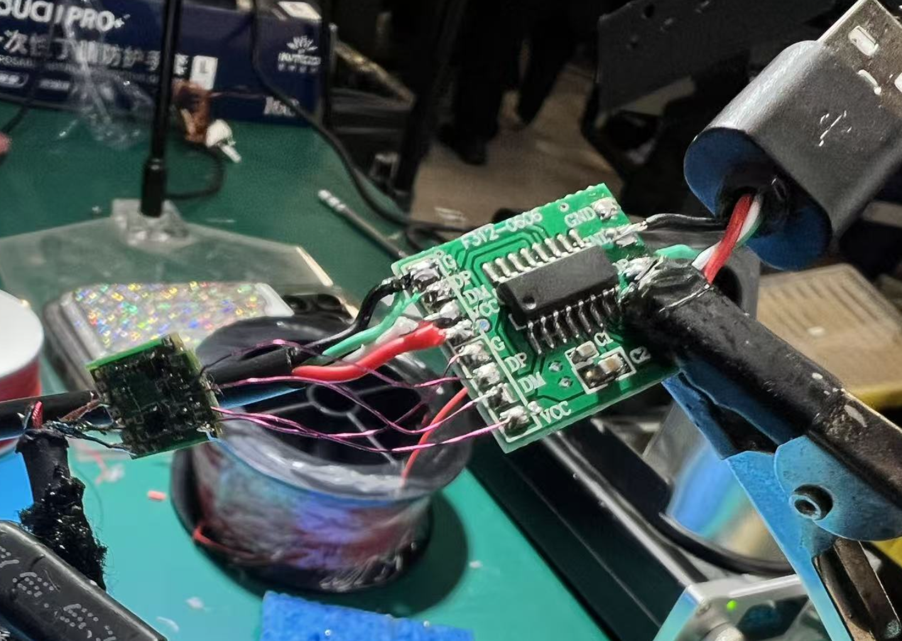
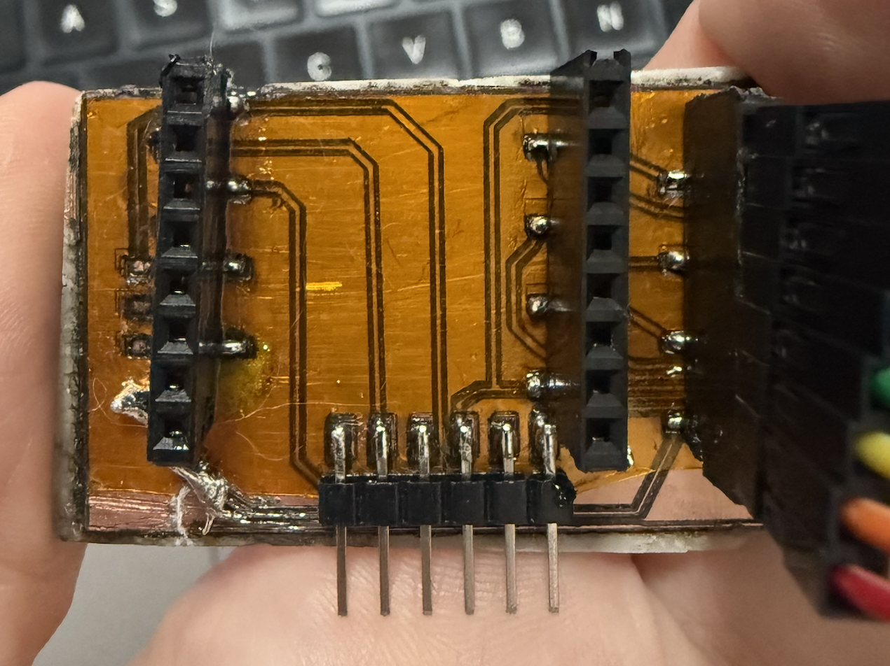

# Char's Projects

## Performance at Shenzhen Robot Theater

I collaborated with [Loay Yari](https://yari4embedded.com) to create custom hardware for a performance at the Shenzhen Robot Theater.

When I send MIDI from my [strudel.cc](https://strudel.cc) music, it lights up the neopixels on the headphones in real-time during the performance.

I bought cheap headphones from Huaqiangbei in Shenzhen and stuffed all the electronics into the right side of the earpiece.

The components include an MPU6050 3-axis IMU & RP2040 microcontroller, axis gyroscope and accelerometer, and a USB switch that makes the device appear as two USB devices on the computer.

The USB switch was super tiny and required careful soldering. I needed to preserve the microphone functionality to do live vocals during the performance. 

## Laser-Cut PCB Manufacturing

Using Cedric's idea, I experimented with laser cutting to manufacture PCB boards. I made about five failed iterations before I finally tuned the laser parameters correctly.

From the PCB's perspective, I made some tests for larger traces.

Here is the board with an ESP32 CAM and a TFT 2.4 inch screen validation!

