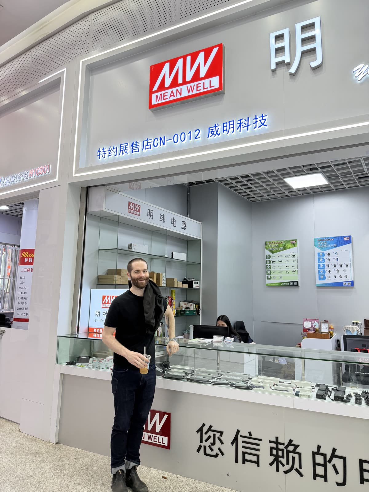
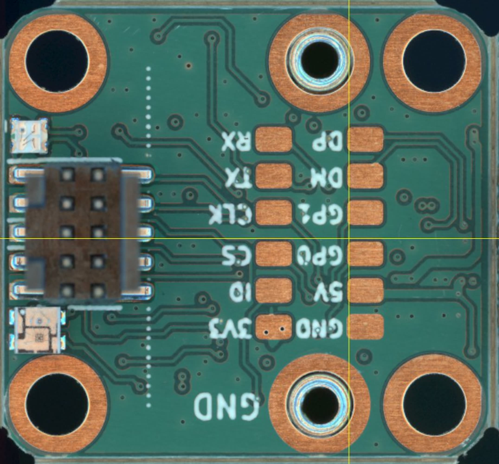
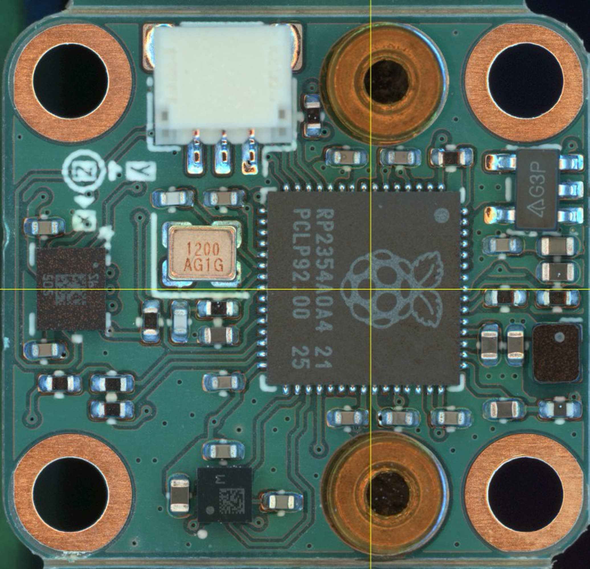
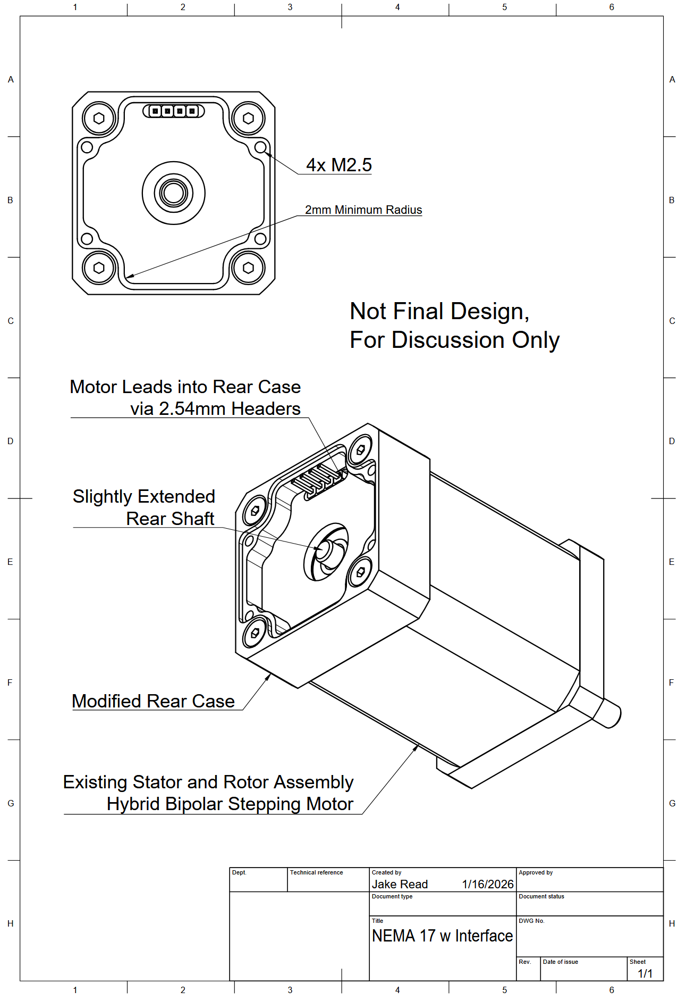
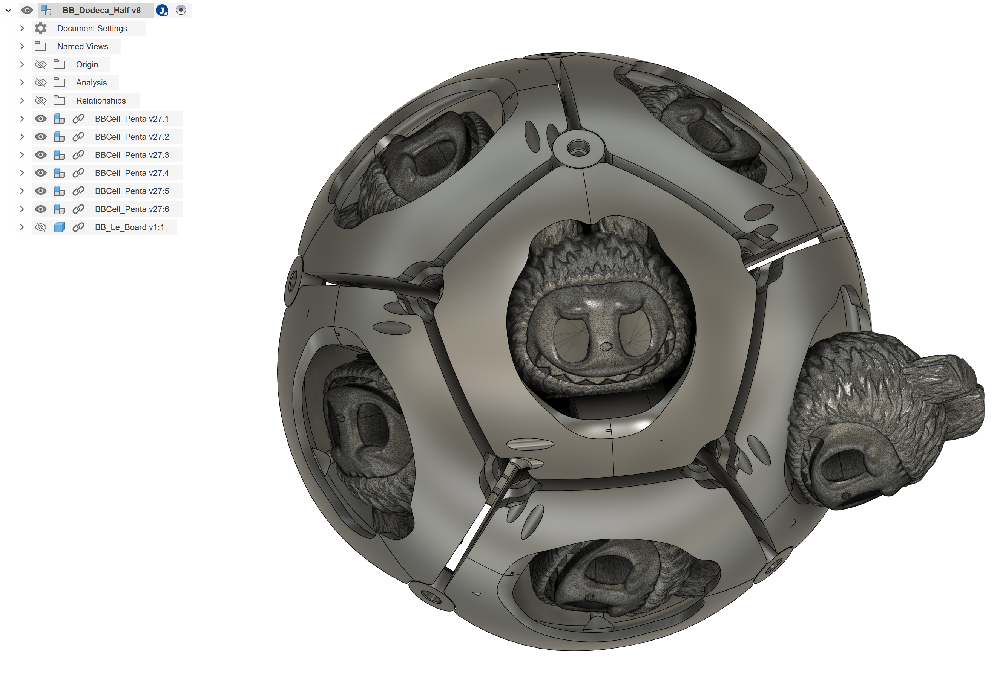
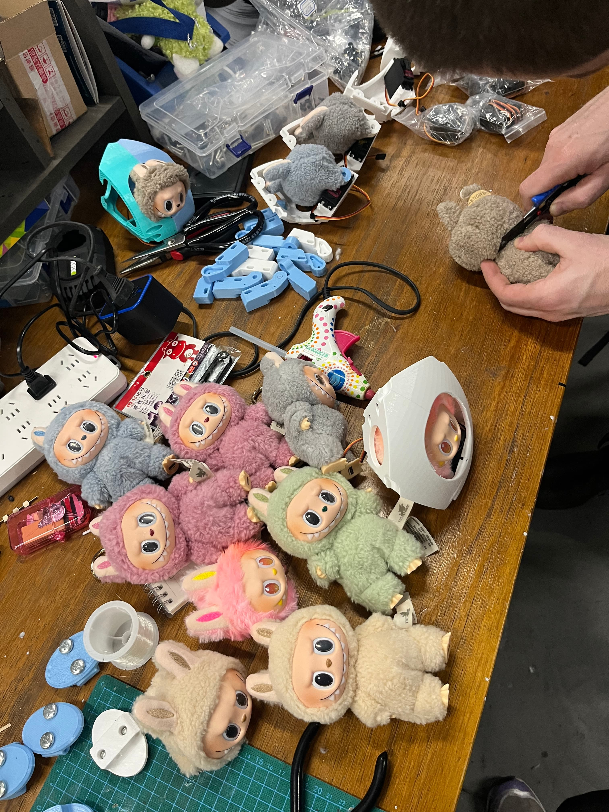
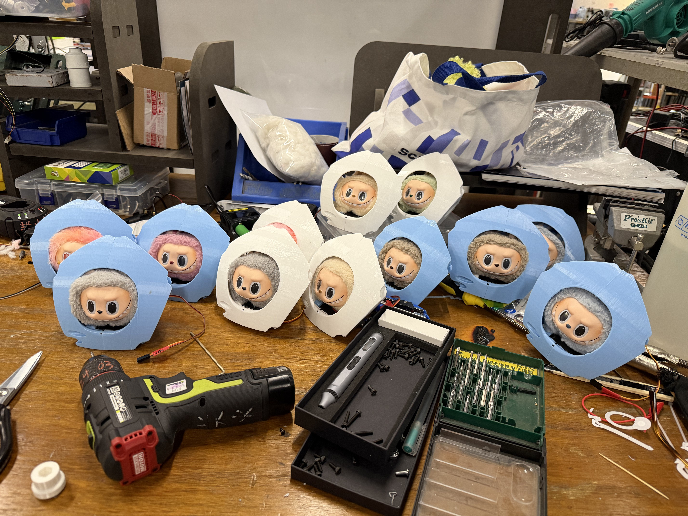

## Jake in Shenzhen ! 

I am two months away from defending [my thesis](https://jakeread.github.io/thesis/) on machine control at the [Center for Bits and Atoms](https://cba.mit.edu/about/index.html). There are about four different projects that I would like to work on once I'm done with the PhD, so I came to Shenzhen in a forwards-looking way, i.e. to learn about where my own hopes might fit into the world's manufacturing ecosystem. 

I absorbed a lot, and am really grateful to Seeed and Cedric for hosting - I wrote much of this down in [this post](https://ekswhyzee.com/2026/01/20/shenzhen.html) on my 16 hour flight home (big thanks to Caffeine for making that possible). 

### Accelerometer PCBA with Seeed Fusion

As part of my thesis work, I needed to finish an [accelerometer module.](https://github.com/jakeread/knuckles-imu-lsm6-lis2-rp2354a) This is part of a [family of modular circuits](https://jakeread.github.io/thesis/04_00_knuckles.html) that I have been cooking up with the goal of enabling *almost anyone* to build or modify their own machine control system.

| | |
| --- | --- |
|  | 

Watching this circuit go together at Seeed was awesome, although I was surprised at the volume required to move from PCBA-by-hand onto the PNP machines. 

I've been able to bring this board online and next week it will be integrated into my machine controllers to help better estimate machine kinematic [models](https://jakeread.github.io/thesis/06_00_models-motion.html) and stiffnesses - and hopefully detect chatter in CNC machining. 

### Motor Manufacturing and Controller Interfaces 

Machine control begins with motor control, and I've been working on [closed loop stepper controllers](https://ekswhyzee.com/2025/03/24/foc-stepper.html) for some time. One pain point with these projects is integrating the motor and the controller, so I cooked up [this interface proposal](https://github.com/jakeread/nema-motor-controller-iface-proposal) as a prototype open spec. 

To get a better sense of how this might work, Seeed hooked me up with a visit to a motor factory. Docs from that visit are [in this post](https://ekswhyzee.com/2026/01/20/shenzhen.html) (about 70% down). It was a joy to see how the motor-sausage is made, and was really valuable for me to understand how to better interact with plants like this in the future. 

### Labubus

A worthy sidequest, I helped Miranda to build the [mf labububot](https://github.com/mirandali707/labububot/tree/main), a twelve-headed monster-ball.

 

