# Jessica in Shenzhen 2026

This month in Shenzhen was several eye-opening and learning curves.
It was my first time in China, so I spent a good amount of time sorting out phone numbers and Didi and WeChat and Alipay and Taobao, along with the metro, how to feed myself as a vegetarian, and the good birdwatching spots.

Here are some good birds I met.

|  |  |
|---|---|
| 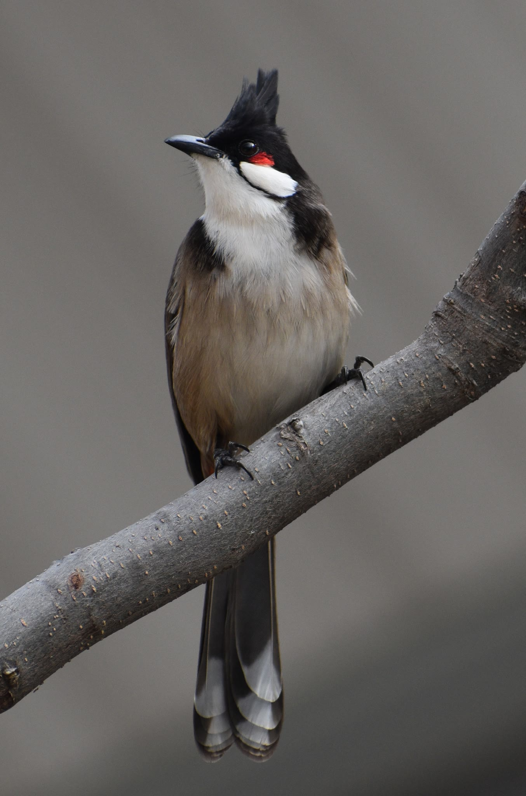 |  |
|   | 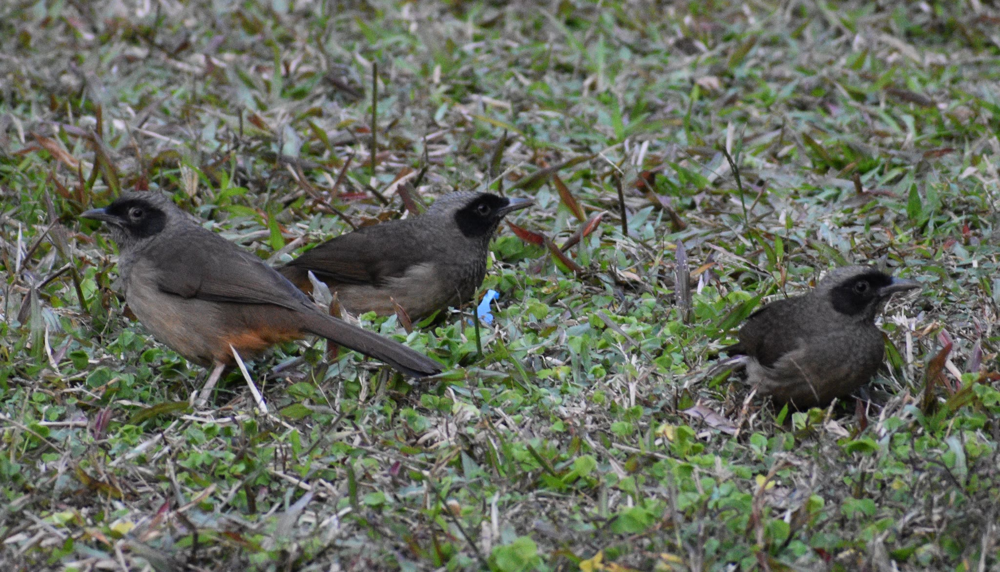 |
| 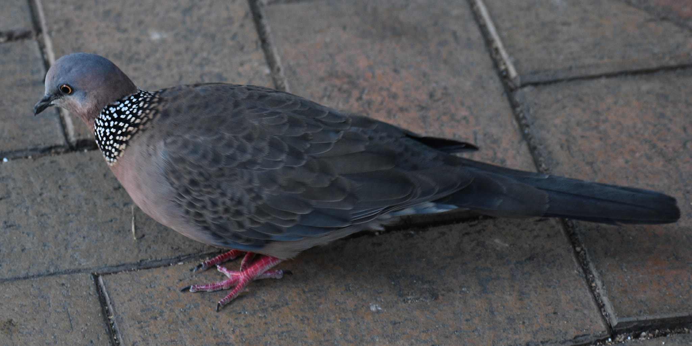 | 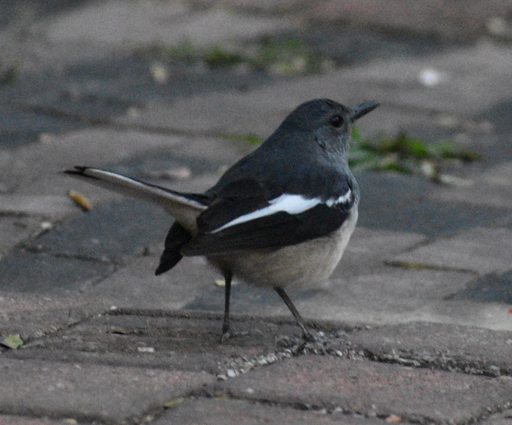 |
|  |  |

The first week was the symposium, which was non-stop, including the essential Shenzhen things, like seeing a factory doing injection molding, visiting Seeed, and an HQB visit.

Also, this year, there was the UABB, a biennale between Hong Kong and Shenzhen around urbanism and architecture. We visited an exhibition, and also visited AiRS about robot research getting turned into art. We also got to see the opening of the Robot theater, a unique theater left unfurnished, with a 30x10m LED screen(!). This will make an appearance later.

Research @ Scale is all about hardware, though I'm primarily a software/art person. I had some vague ideas of either some PCB art or some sort of controller to use while livecoding, so I could switch between typing and using some emotive controller already in the palm of my hand.

## Factory learnings

The initial factory tours were organized with the symposium, which was helpful in seeing what to expect!
It was interesting to learn about how PCB-As work and how the boards get populated.
How they CNC'd the molds for injection molding plastic.

The second factory visit was organized by Lauren to a group that did sculptures. Fascinating! We got to see the process of creating the mold from styrofoam, banging sheets of metal to the right curvature (it reminded me of my never-ending Fusion 360 fight with the morphology of a shape.., and I wished I was creating lovely, reasonable cut surfaces instead of the odd shapes I have..). They welded them together, and then buffed them until they looked like when you drop the aluminum surface on some shape in Fusion.
We moved through a few large warehouses where folks were working on the different stages of sculpture production.

The next factory visit was textiles. They were producing the tops of fancy running shoes, watch straps, and the cloth skin for humanoid robots. They told us that things like gloves could be produced entirely by the machine. Cedric worked out how they were able to knit gloves: the machine knits two sheets at once, and has an instruction to join the two flat shapes together.
It was interesting to see how they carefully corrected the stitch pattern in their programming: they would produce one on a machine, then look for issues (a necessary hole in the wrong place), and correct it stitch-by-stitch. They also showed us the steam room, which was still done by hand.

It was really clear to me how nice it is to develop and manufacture hardware in Shenzhen and China. You can order PCBs within a day or so. You can hop down to HQB and browse a physical selection of buttons (and hold them in your hand! and test how the click feels), and either buy it there, or save some money by ordering it on Taobao. If you're fancier than I, you can have the factory produce the button you need, and work with a factory to set up a manufacturing pipeline for your product. If you've dabbled in hardware and have an opportunity to go, it is worth it!

## Project

Early on, I looked through the materials available in the makerspace and connected some Grove input devices to a Xiao to make the device I wanted: capacitive touch and an accelerometer.

The idea is that it's something I can tuck in the palm of my hand while live coding, and then switch between typing and manipulating. I usually use a MIDI controller with dials for this. (I do not like using a mouse.

(photo credit 天洋)

As a prototype, I crammed this into a palm-shaped model I built last year for the How to Make class. It took a while to fix the geometry, and then it took a while to figure out how I wanted to place everything.

I spent some time revising the 3D model I had in my final project for How to Make Almost Anything, because it already had a pleasing shape to wear in your palm. I hollowed it out again, put in the new devices, and then tried to simplify the shape. My process here is long: I print out one (only an hour), put it in my palm, and try to notice how many things are wrong with it: the pins on the Xiao stuck through too far, so I needed to make room for those. There is an awkward part in the geometry on my palm. Then I revise and print another copy.

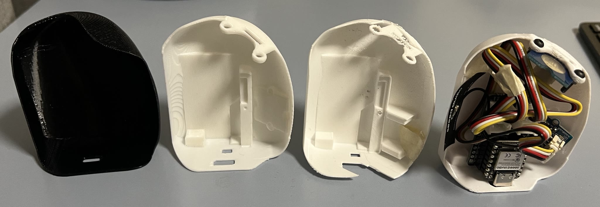

I dislike my model a lot. It doesn't seem to be how Fusion wants me to make it. Lofts don't loft, rails don't help, and splitting objects rarely works because of odd intersections.

I looked at how much of my space was taken up by chunky guys: Grove uses a large connector (which is probably great for environmental sensors) that I was working around.

I could make a little board that skips the connectors and put the sensors all on the same board. But also, there was a Tiles workshop by Jonathan.

I haven't milled or assembled the board yet, but when I'm done, it should be able to fit nicely on a Xiao with plenty of room to spare on the board. Tiles are very cool!

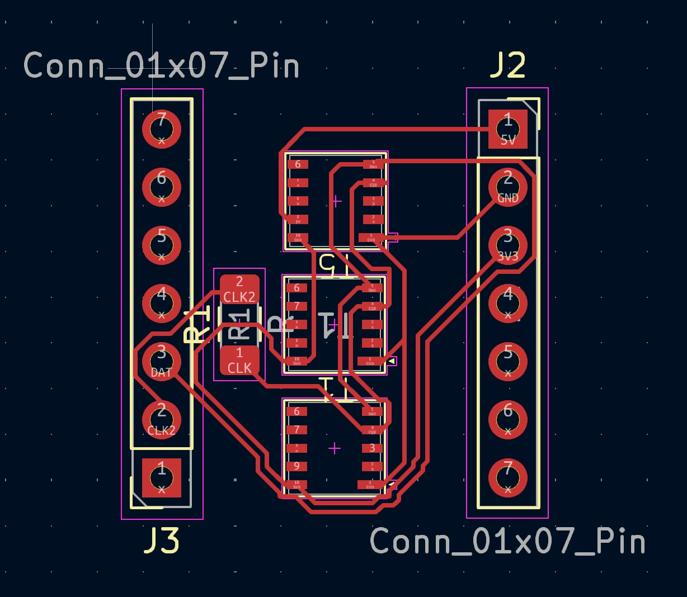

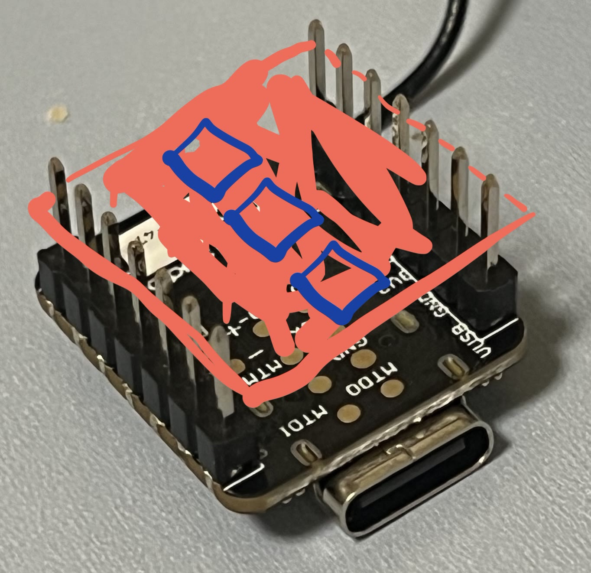

### PCB Art

Meanwhile, I was learning from Darcy about PCB Art. How lucky it was to have that knowledge! I learned about removing the solder mask layers, which turns the board into a diffuser for an LED.

I bit off more than I could chew in trying to design a board that turned my retina cell pattern into a sequencer. And then it was suddenly the last week, and there was not enough time to put in an order while I'm here. Too bad. But looking forward to doing it from the States with my new knowledge.

## Performance

I got to do visuals on the 30x10m LED screen in the robot theater in a really lovely livecode night with s4y, Char Stiles, and Arbor, assisted by Sam.
Since this is my page, I'm going to put pictures of my own visuals, but every performance that night was very special!

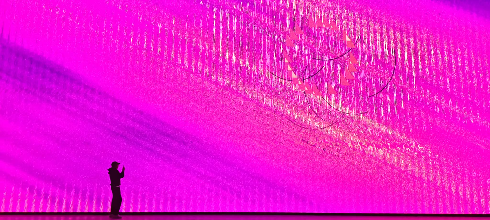
(photo credit Nico!)

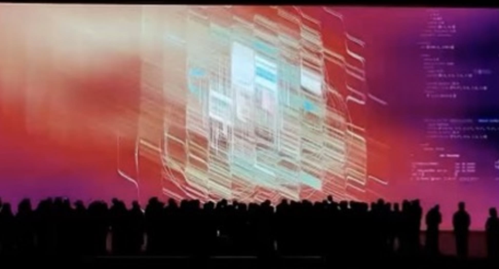
(photo credit 一笑)

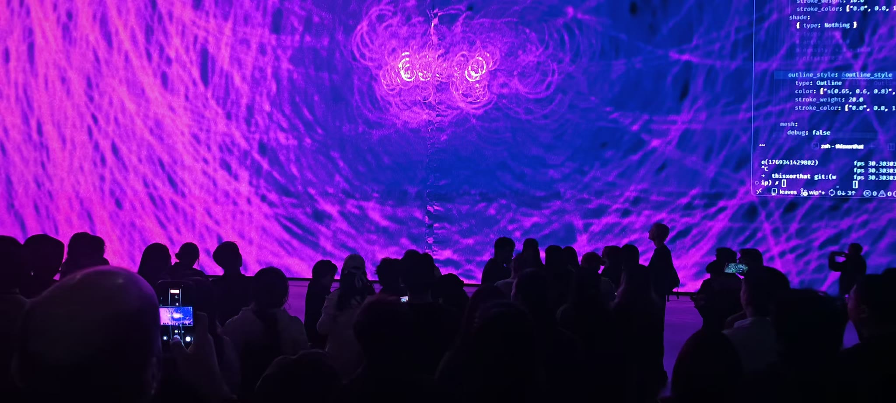
(photo credit Nico!)

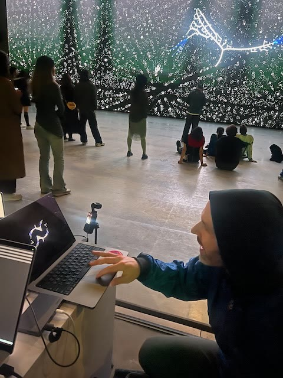

It was an unbelievable venue and a really nice night. Thanks everyone for making it happen!
