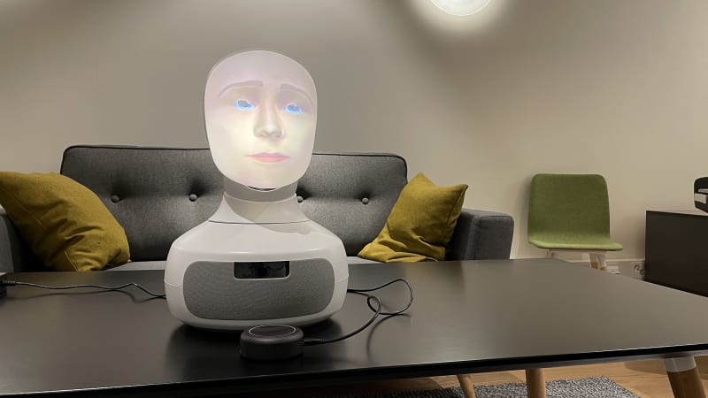

> **If you're a future Research @ Scale resident reading this, scroll to the bottom to see my pro-est pro tips for navigating life in Shenzhen -- I had to do a lot of logistical learning and I'd like to save you, dear reader, the trouble of figuring out the things I figured out along the way!**

Here's what I worked on during my month in Shenzhen, as a part of the Research @ Scale residency.
I am so incredibly grateful to all of the sponsors for giving me the opportunity to experience what has been truly one of best months of my life!
During the first hectic week I had a lot of fun attending the Scalable HCI conference, visiting factories / Huaqiangbei / the UABB Biennale / AIRS, and getting settled into my apartment at Boyu and the makerspace at Chaihuo. I spent the rest of my time in Shenzhen making a whimsical art robot called Labububot, with fellow resident [Jake Read](https://ekswhyzee.com/).

# Labububot
For more information, see [our Github repo](https://github.com/mirandali707/labububot). Please note that Labububot is a work in progress!

Labububot (they/them) is a 12-headed, spherical robot.

TODO
*add video / image of labububot* 
*labububot CAD image*

<!-- Labububot is made from a Seeed XIAO ESP32S3, a 6-DOF IMU, a Seeed Grove PWM driver, 12 servos, powered by two 4V batteries + a Buck converter, and comprised of quite a bit of PETG filament and various nuts and bolts.

With the Labububot web controller you can visualize Labububot's orientation in real time by connecting via BLE. We hope to extend this to enable Labububot to semi-autonomously roll themself around. -->

## Concept
We envision Labububot as a playful critique of social robots and their forms.

<!-- Roboticists claim that the dawn of ubiquitous robots is imminent. -->
Human-robot interaction research frequently begins with the claim that we will soon be surrounded by robots in our everyday lives, and as delivery drones and cleaning robots are already somewhat commonplace in Shenzhen, the claim feels substantial.

If this is true, our world of human cyborgs will soon confront a new, baffling species, neither man nor animal, too agentic to be considered a machine, too mechanical to be considered an organism. From the field of monster theory:

> "Jeffrey Weinstock explains that monsters ‘are things that should not be, but nevertheless are--and their existence raises vexing questions about humanity’s understanding of and place in the universe"
> 
> (Monsters: interdisciplinary explorations in monstrosity, Erle & Hendry 2020)

We claim that social robots can be analyzed as monsters: for example, a disembodied, illuminated face that hides a camera, which blinks its digital eyes at you, records your speech, and metabolizes it through a large language model before playing back a synthesized "speech" waveform arguably "should not be" according to the laws of God or nature, but nevertheless is.

... not to name names.

Labubu is also, famously, a [monster](https://www.popmart.com/us/collection/11/the-monsters). 
Labubu is also a classic example of [baby schema](https://pmc.ncbi.nlm.nih.gov/articles/PMC3260535/).

> Ethologist Konrad Lorenz suggested that certain infant characteristics evoke a positive affective response in the human. He described the **baby schema** (‘Kindchenschema’) as a set of infantile physical features such as the large head, high and protruding forehead, large eyes, chubby cheeks, small nose and mouth, short and thick extremities and plump body shape, that is perceived as cute or cuddly and elicits caretaking behavior from other individuals (Lorenz 1943).
> 
> (Baby Schema in Infant Faces Induces Cuteness Perception and Motivation for Caretaking in Adults, Glocker et al 2012, emphases mine)

Baby schema is commonly employed in robot design to make social robots appear friendly.
By decapitating Labubus and reconstituing a new, less anthropomorphic form, we hope to subvert the aesthetic norms of social robotics and evoke a less straightforward, more confusing set of feelings in the viewer.
We pay homage to Mary Shelley's Frankenstein, which is also a monster comprised of corpses.

By presenting Labububot as an indisputably monstrous social robot we hope to call into question the monstrosity of other social robots, even those which are designed to look [cute and, therefore, trustworthy](https://journals.sagepub.com/doi/10.1177/17298806231168486).
Further, we hope that analyzing social robots through the lens of monster theory will afford interesting insight into not only the design of social robots but also the philsophical question: what does it mean to be human?

## Future work
* Cover Labububot in fur
* Controls: servo actuation -> rolling in a desired movement direction
* Continue inquiry into monster theory, posthumanism, social robotics, refine interactions and submit Labububot to [ICSR Art / Design Competition](https://icsr2026.uk/competition/) or other art / robotics venue

## BOM
* [Seeed Xiao ESP32](https://wiki.seeedstudio.com/xiao_esp32s3_getting_started/)
* [Sparkfun 6-DOF IMU](https://www.sparkfun.com/sparkfun-6dof-imu-breakout-lsm6dsv16x-qwiic.html)
* [Seeed Grove 16 channel PWM Driver](https://wiki.seeedstudio.com/Grove-16-Channel_PWM_Driver-PCA9685/)
* 12 servos
* 12 Labubus (decapitated)
* A lot of PETG filament and access to as many 3D printers as possible :^)

## Logistical advice for future MIT residents
* Begin the VISA process as soon as you can! If you're a US citizen, the nearest Chinese embassy is in New York. The process I went through went like this:
1. Fill out the online form [here](https://consular.mfa.gov.cn/VISA/visa/visaform). I applied for a  L (tourist) visa valid for 120 months (10 years), max duration 90 days, multiple entry. Pro tip: it doesn't cost any extra money to max out the parameters like this on the tourist visa, so you may as well -- that way if you want to come back you won't have to go through this process again! Some people in the program applied for a student visa, using the invitation letter from SUSTech. It seems like either way is fine.
2. Check the status of your application -- it usually takes around 2 days before you are "invited" to bring your passport in (in-person!) to the embassy.
3. Drop off your passport at the NY embassy -- Ben and I went first thing in the morning and the line was very short. They will give you a slip -- DO NOT LOSE IT! Take a picture of it just in case.
4. Wait a few days (depending on if you've gotten express or normal service), then return to the embassy to collect your passport. Or, have someone you trust bring the slip to the embassy, and they can collect your passport for you! You don't have to collect it immediately when it is ready.
* If you're only staying in China you don't need an outlet converter; most outlets are also compatible with US-style plugs.
* You **must** download WeChat. WeChat can be used for everything from ordering at restaurants to calling cabs to messaging, and more.
* Set up WeChat Pay and AliPay before you arrive! Most places will take both.
* I used the [MIT VPN](https://ist.mit.edu/vpn) on my laptop, and got a [trip.com e-SIM](https://www.trip.com/things-to-do/detail/40017785/) which covers both China and Hong Kong (since my flight was out of HK). I'd highly recommend this, it comes with a VPN built in when you use the cellular data, so as long as you get enough data you don't need to fuss with an additional mobile VPN!
* China Mobile has a 2-month, **free** phone plan for getting a +86 phone number; all you need is a vessel for a physical SIM! If I had known, I would have done this as soon as I arrived in China.
	* I still had an e-SIM I was using for data, but having a Chinese phone number is super helpful for many things, including but not limited to creating a Taobao account ;)
* Google Maps doesn't work well, Apple Maps is alright, Amap is best.
* Dianping is the Chinese version of Yelp. I used this to find a salon to dye my hair at :)
* I haven't tried it, but I only recently found out that [hqew.com](https://www.hqew.com/) is a website where you can search for components and find them in the HQB markets. Might be helpful if you're trying to find something specific!
* Visiting Hong Kong is cheap and easy from Shenzhen - you can take high speed rail from Futian or Shenzhenbei to West Kowloon; it's about a 15min train ride and costs less than $20! You can book tickets through trip.com or klook.com, for example. I recommend arriving at the station an hour before your train, *especially on the way back from HK -> SZ* -- there are some airport-esque baggage and customs checks which will take some time! On the SZ -> HK route, the customs happen in West Kowloon after you arrive. **Make sure to bring an outlet converter -- HK uses UK plugs!**
* Calling cars is cheap and easy via Didi - I usually do this from within the WeChat mini-program. *When you get into the car, you will need to confirm the last 4 digits of your phone number with the driver.* If you don't speak Chinese I'd recommend having these written down so you can just show the driver instead.