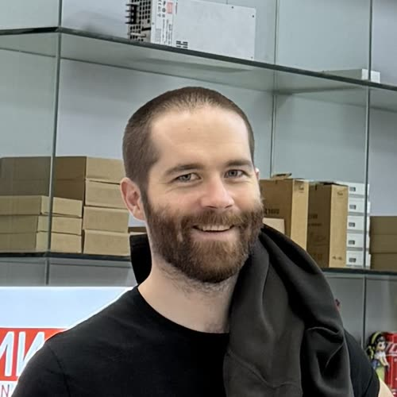
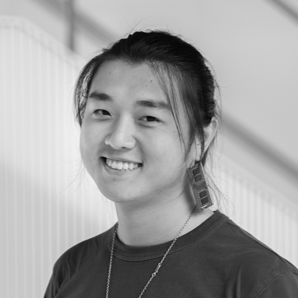

# Jan 2026 - MIT Research At Scale

During the yearly [Research At Scale](https://www.media.mit.edu/posts/research-at-scale) program, Seeed Studio hosted 10 MIT researchers in its MakerCamp, to co-create meaningful and open hardware projects in Shenzhen, explore the tech ecosystem frontier, and join maker networks to experiment with the local scaling power.

The research residency started with the <u><a href="https://scalablehci.com/">Scalable HCI Symposium</a></u>, a 1-week accelerated introduction of the Shenzhen ecosystem, organized in collaboration with <u><a href="https://designschool.sustech.edu.cn/">SUSTech</a></u> and <u><a href="https://airs.cuhk.edu.cn/article/998">AIRS</a></u>.

<!--
Here is a video overview made in collaboration with <u><a href="https://designschool.sustech.edu.cn/">SUSTech</a></u> and <u><a href="https://airs.cuhk.edu.cn/article/998">AIRS</a></u>:

-->

 

## Main cohort reports:

Tips for your documentation:

1. prepare a 120 x 120 pixel photo, then you can:

- either put it in your personal folder and use the URL below...

- or drag and drop it on this file from the github interface, and it will give you an ID (see YourPhotoID below and the examples underneath):

2. Your folders and personal README.md files are already there, you just need to edit them using the examples below (keep it concise, focusing on what you prototyped/built):

 
**[Your Name](https://seeed-studio.github.io/MakerCamp/2025-01-MIT/YourName)**

- **Keywords**: TODO
- [Personal website](TODO)

 
**[Jake Read](https://seeed-studio.github.io/MakerCamp/2026-01-MIT/Jake)**

- **Keywords**: Machine Control, Motor Control, Modular Embedded Systems
- [Personal website](https://ekswhyzee.com/2026/01/20/shenzhen.html)

 
**[Yufeng Zhao](https://seeed-studio.github.io/MakerCamp/2026-01-MIT/Yufeng)**

- **Keywords**: Modular Camera Arrays, Lenticular Printing, 360° OCR
- [Personal website](https://yufengzhao.com)

 

## Example reports from 2025:

 
**[Andy Kong](https://seeed-studio.github.io/MakerCamp/2025-01-MIT/Andy)**

- **Keywords**: Ultra-Low Power Wearables, Interactive Implants
- [Personal website](https://andykong.org)

 
**[Jason Hou](https://seeed-studio.github.io/MakerCamp/2025-01-MIT/Jason)**

- **Keywords**: Bio-Engineering, Ultrasound Imaging, Artistic Exploration
- [Personal website](https://conformabledecoders.media.mit.edu/people/jasonhou.html)

 
**[Lingdong Huang](https://seeed-studio.github.io/MakerCamp/2025-01-MIT/Lingdong)**

- **Keywords**: Creative Technology, Musical Interfaces, Serendipitous Prototyping
- [Personal website](https://lingdong.works)

 
**[Patrick Chwalek](https://seeed-studio.github.io/MakerCamp/2025-01-MIT/Patrick)**

- **Keywords**: Embedded Hardware, Environmental Sensing, Animal Tracking
- [Personal website](https://patrickchwalek.com)

  

## Affiliate cohort reports:

After a decade of MIT-only participation, we experimented with a more open approach, welcoming exceptional participants from other institutions, in academia and industry.

 

Here is an example from 2025:

 
**[Eli Silver](https://seeed-studio.github.io/MakerCamp/2025-01-MIT/affiliates/Eli)** (Brown University)

- **Keywords**: Cable-driven gantry robot, AI camera system, Smart workspace
- [Personal website](https://elisilver.com/)

 

TODO: add new affiliates!

 
**[Ran Zhou](https://seeed-studio.github.io/MakerCamp/2026-01-MIT/affiliates/Ran)** (KTH Royal Institute of Technology)

- **Keywords**: Expressive Robotic Touch, Haptic Design Toolkits, Tangible Interaction
- [Personal website](https://www.ranzhourobot.com/)

   

<!--

-->
