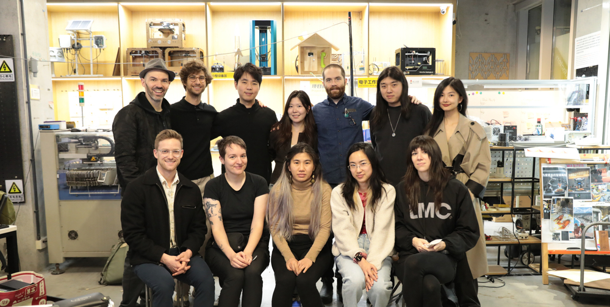
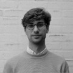
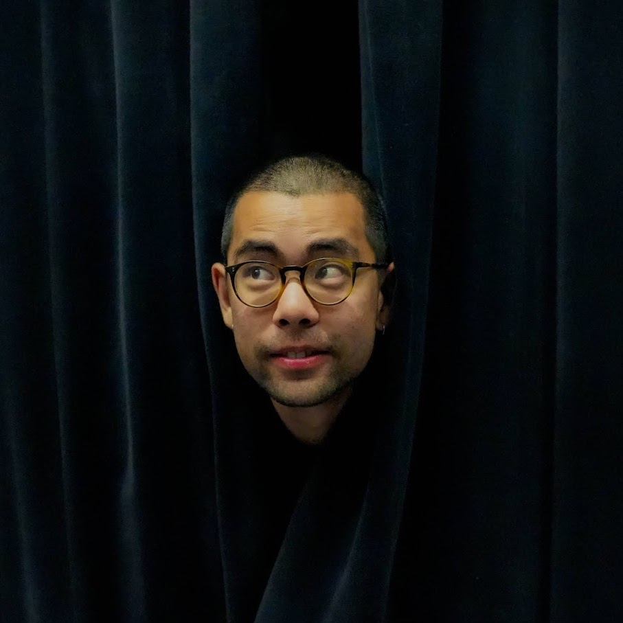
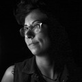
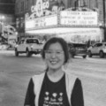
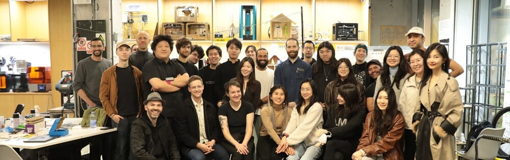

# Jan 2026 - MIT Research At Scale

During the yearly [Research At Scale](https://www.media.mit.edu/posts/research-at-scale) program, Seeed Studio hosted 10 MIT researchers in its MakerCamp, to co-create meaningful and open hardware projects in Shenzhen, explore the tech ecosystem frontier, and join maker networks to experiment with the local scaling power.

The research residency started with the <u><a href="https://scalablehci.com/">Scalable HCI Symposium</a></u>, a 1-week accelerated introduction of the Shenzhen ecosystem, organized in collaboration with <u><a href="https://designschool.sustech.edu.cn/">SUSTech</a></u> and <u><a href="https://airs.cuhk.edu.cn/article/998">AIRS</a></u>.

<!--
Here is a video overview made in collaboration with <u><a href="https://designschool.sustech.edu.cn/">SUSTech</a></u> and <u><a href="https://airs.cuhk.edu.cn/article/998">AIRS</a></u>:

 
-->

## MIT cohort:

  

**[Ben Weiss](https://seeed-studio.github.io/MakerCamp/2026-01-MIT/Ben)**

- **Keywords**: Environmental Sensing, Climate Solutions, Marine Robotics
- [Personal website](https://www.benweiss-portfolio.com/)

 

**[Char Stiles](https://seeed-studio.github.io/MakerCamp/2026-01-MIT/Char)**

- **Keywords**: Laser cutting, DIY PCB, Wearable for performance
- [Personal website](https://charstiles.com)

 

**[Jake Read](https://seeed-studio.github.io/MakerCamp/2026-01-MIT/Jake)**

- **Keywords**: Machine Control, Motor Control, Modular Embedded Systems
- [Personal website](https://ekswhyzee.com/2026/01/20/shenzhen.html)

 

**[Jessica Stringham](https://seeed-studio.github.io/MakerCamp/2026-01-MIT/Jessica)**

- **Keywords**: Realtime Visuals in Rust, Controllers, Birds
- [Personal website](https://thisxorthat.art/)

 

**[Jonny Cohen](https://seeed-studio.github.io/MakerCamp/2026-01-MIT/jonny)**

- **Keywords**: Robotics, HRI, Mobility
- [Personal website ](https://jonny-cohen.com/)

 

**[Minsol Michelle Kim](https://seeed-studio.github.io/MakerCamp/2026-01-MIT/Michelle)**

- **Keywords**: Wearable Sensing for Health and Wellness, HCI, Multimodal AI
- [Personal website](https://www.media.mit.edu/people/minsol/overview/)

 

**[Miranda Li](https://seeed-studio.github.io/MakerCamp/2026-01-MIT/Miranda)**

- **Keywords**: Critical HRI, Monster Theory
- [Personal website (very out of date)](https://mirandali707.github.io/)

 

**[Sam Chin](https://seeed-studio.github.io/MakerCamp/2026-01-MIT/Sam)**

- **Keywords**: Electronics, Interactive Ceramics, Haptics
- [Personal website](https://samch.in)

 

**[Shengtao Shen](https://seeed-studio.github.io/MakerCamp/2026-01-MIT/Shengtao)**

- **Keywords**: Architecture, Generative AI Hardware, Context-Aware
- [Personal website](https://www.shengtao.space/)

 

**[Yufeng Zhao](https://seeed-studio.github.io/MakerCamp/2026-01-MIT/Yufeng)**

- **Keywords**: Modular Camera Arrays, Lenticular Printing, 360° OCR
- [Personal website](https://yufengzhao.com)

  

  

## Affiliate cohort reports:

After a decade of MIT-only participation, we experimented with a more open approach, welcoming exceptional participants from other institutions, in academia and industry:

**[Arbor](https://seeed-studio.github.io/MakerCamp/2026-01-MIT/affiliates/Arbor)**

- **Keywords**: Novel Input + Sensing, Light, Media Art, TouchDesigner, Tools for Creative Expression
- [Personal website](https://derrekchow.com/)

 

**[CJ Pais](https://seeed-studio.github.io/MakerCamp/2026-01-MIT/affiliates/CJ)**

- **Keywords**: Open Source Software, Speech To Text, Maker, Curious
- [Personal website](https://cjpais.com)

 

**[Darcy Neal](https://seeed-studio.github.io/MakerCamp/2026-01-MIT/affiliates/Darcy)**

- **Keywords**: Creative PCB Design, EMF Explorer, Kicad Workshops
- [Personal website](https://darcyneal.com)

 

**[Ran Zhou](https://seeed-studio.github.io/MakerCamp/2026-01-MIT/affiliates/Ran)** (KTH Royal Institute of Technology)

- **Keywords**: Expressive Robotic Touch, Haptic Design Toolkits, Tangible Interaction
- [Personal website](https://www.ranzhourobot.com/)

 

**[Willa Yang](https://seeed-studio.github.io/MakerCamp/2026-01-MIT/affiliates/Willa)** (University of Chicago)

- **Keywords**: Environmental Augmentation, Mid-Air Touch Display, Tangible Interaction
- [Personal website](https://willayang.com)

  

   

