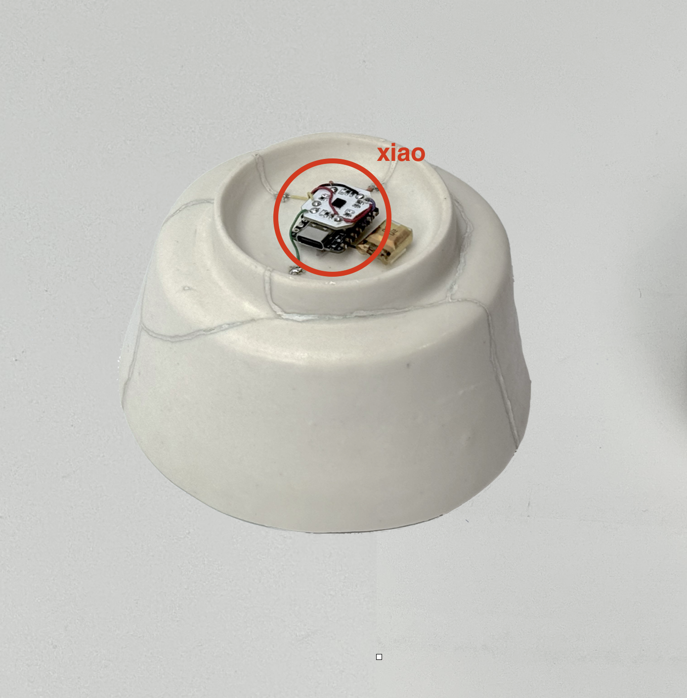
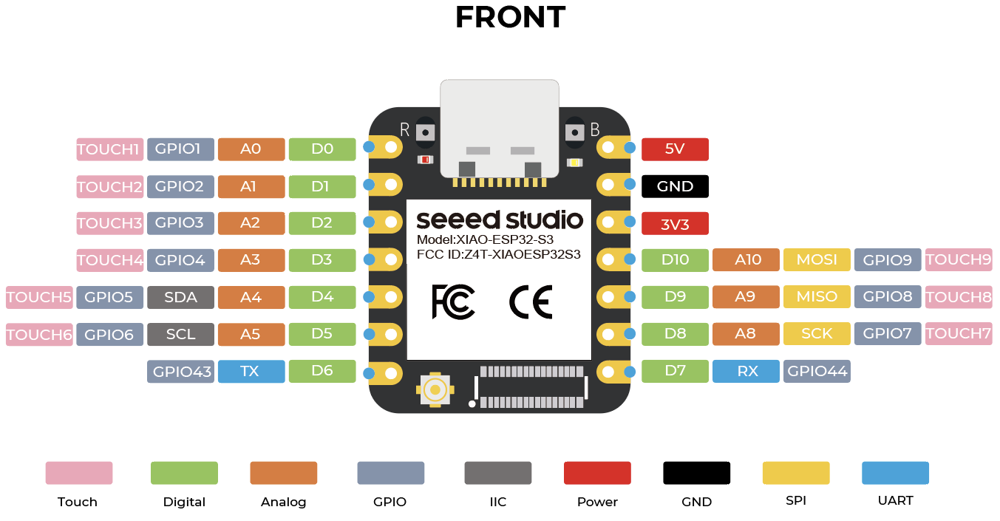
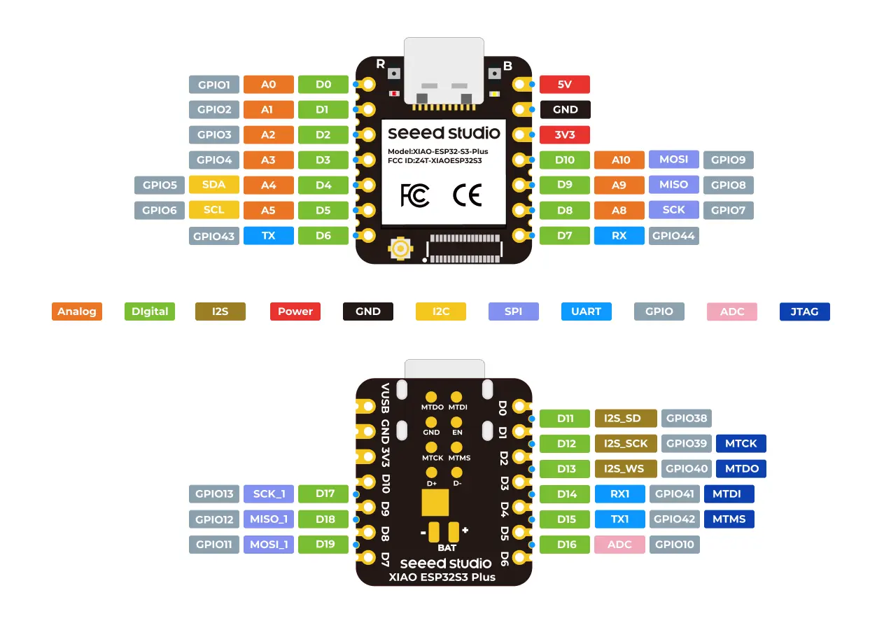

# Making a Xiao

## Acknowledgments

I first want to shout out Phoebe, who has been tirelessly helping me with all of this work.

## Project Context

I've been doing multiple projects this summer: the haptic hearing PCB, ceramic work in Jingdezhen, and Baochip—but I'm going to focus on one project I did entirely in Shenzhen: making a Xiao.

## Background: Baochip and the Chip

Over the summer I worked for a company called Baochip, which has developed a new chip using resistive RAM. It's a RISC-V chip roughly comparable to an RP2350, but it doesn't need flash.

## Existing Xiaos

There are already a bunch of Xiaos that exist—look at this picture I took. I also use Xiaos frequently in my own work!

 

## The Concept: Xiǎobāo

Bunnie made one called the Dǎbāo (打包, "to pack up" or "takeaway" in Chinese), but the word "dǎ" (打) sounds like "dà" (大), which means "big." So I had this idea of making a Xiǎobāo (小包, "small package"), which would be both smaller and in the Xiao form factor.

## Design Evolution

### Initial Plan

Originally, this was supposed to be a straightforward layout project where I just put the Dabao into the Xiao form factor.

 

### Adding Battery Support

But then I realized that to be a proper Xiao, it needed to support battery connection and charging. So I went back to the drawing board and miniaturized components (changing all the 0402s to 0201s, using a different set of voltage regulators borrowed from other Xiao designs) and added battery charging circuitry (borrowed from the RP2350 Xiao).

### S3-Plus Form Factor

Then I had a meeting with Eric, and he suggested I actually make this into the S3-Plus form factor, which has different pinouts. So I went back to schematic capture and added more pins.

 

## Technical Challenges

The CSP package posed an interesting challenge: you can't place two via-in-pads adjacent to each other, so I had to think carefully about how to route everything. I ended up doing some creative work with tri-stating pins to make routing possible. In the end, I think I achieved basically the best theoretical density given the PCB design constraints.

## Design Review

After that, I got to do something fun: I reviewed my design with Linus (he said his English name is after Linus Torvalds, the founder of Linux), the engineer who designed my favorite Xiao—the Xiao ESP32-S3. It was a solid design review, and it was cool to meet the person who designed something I use so frequently in my work.

## Current Status

I'm currently in Japan working on updates based on Linus's feedback. My hope is to come back with a working Xiao.

## PCB Layers

