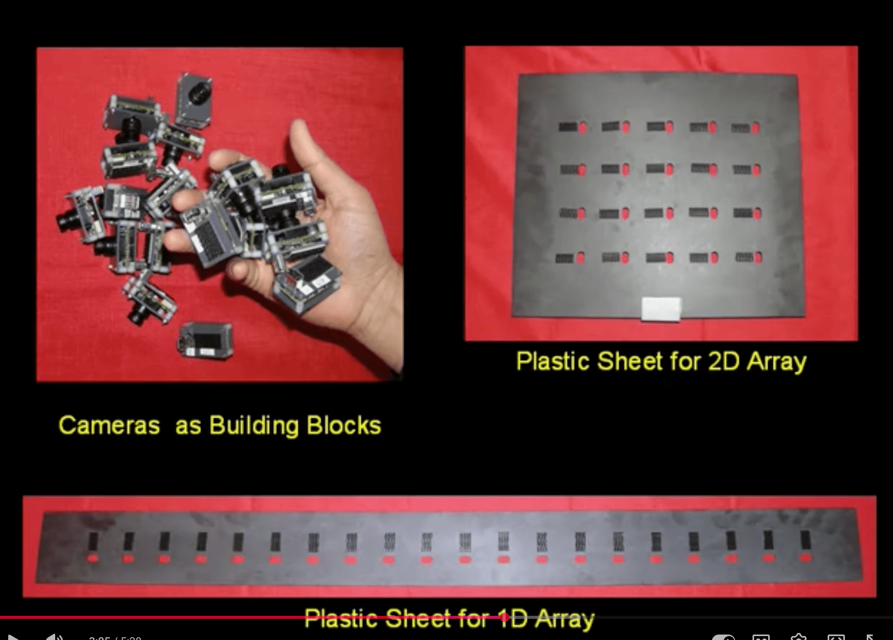
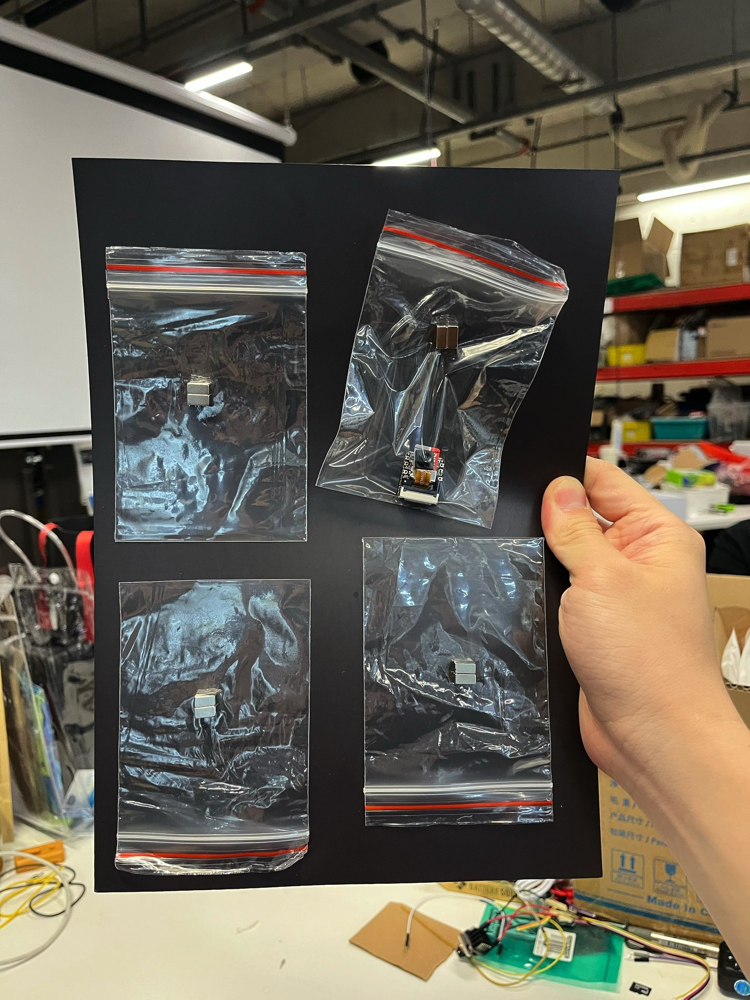
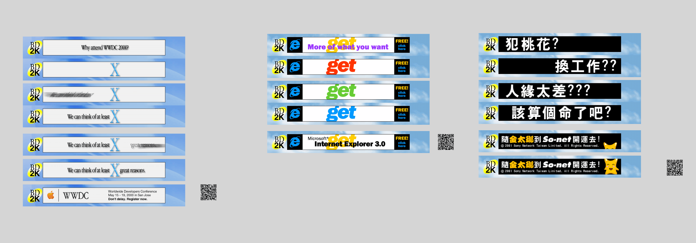
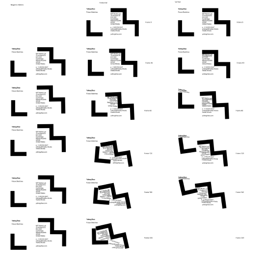

# Yufeng in Shenzhen

I'm Yufeng Zhao, a master's student at MIT Media Lab in the [Future Sketches](https://www.media.mit.edu/groups/future-sketches/overview/) group. My practice sits at the intersection of data, graphics, and interactivity—building tools and experiences that make visible what's otherwise overlooked. I came to Shenzhen to explore hardware possibilities I couldn't access in Brooklyn, and to see Huaqiangbei for myself.

→ [yufengzhao.com](https://yufengzhao.com)

---

## Flexible Camera Array

A modular strip of camera modules that can be bent and flexed while recording synchronized video. Each module is identical, self-contained, and magnetically attaches to a flexible ferrous mat for instant repositioning.

Inspired by [_Scene Collages and Flexible Camera Arrays_](https://www.cs.columbia.edu/CAVE/projects/scene_collage/) (Nomura, Zhang, Nayar — Columbia/Sony, 2007), which used 20 FireWire cameras on bendable plastic sheets to create Hockney-style photo collages. This project reimagines that concept with modern $14 microcontroller camera modules.

|                                                                      |                                                  |
| -------------------------------------------------------------------- | ------------------------------------------------ |
|  |  |

_Images from the original research. See the [demo video](https://www.youtube.com/watch?v=K5lhNkCXhaM)._

### Concept

6× identical XIAO ESP32S3 Sense modules, each with:

- Toggle switch for master/worker mode
- Up/down buttons to set I2C address (shown on local OLED)
- SD card for local MJPEG recording
- Pogo pin connectors for daisy-chain power + I2C sync

The system captures 24fps video from multiple angles simultaneously (<1ms sync accuracy). Footage can be arranged into video collages that reveal depth and spatial relationships a single camera can't.

### What I actually got done

I spent most of my time debugging ESP32-S3 firmware—getting it to record reliably and sync files over WiFi proved harder than expected. Never made it to a custom PCB. But the design crystallized through the process, and I have all the parts spec'd out for a future build.

_Proof of concept: flexible ferrous mat with magnetically attached plastic bags. One bag has a XIAO ESP32S3 inside to prove the magnets are strong enough. Imagine the rest are camera modules too._

### Bill of Materials

| Component        | Part                                                                             | Price      |
| ---------------- | -------------------------------------------------------------------------------- | ---------- |
| Camera module    | [XIAO ESP32S3 Sense](https://www.seeedstudio.com/XIAO-ESP32S3-Sense-p-5639.html) | ~$14       |
| Display          | SSD1306 0.96" OLED (128×64, I2C)                                                 | ~$1–3      |
| Interconnect     | 4-pin magnetic pogo connector                                                    | ~$2–5/pair |
| Mounting surface | Flexible ferrous sheet (A4) (magnets stick to it)                                | ~$2–5      |

### Specs

| Parameter      | Value                         |
| -------------- | ----------------------------- |
| Camera modules | 6× XIAO ESP32S3 Sense         |
| Resolution     | 320×240 (QVGA)                |
| Frame rate     | 24 fps                        |
| Video format   | MJPEG in AVI container        |
| Sync           | I2C at 100 kHz, <1ms accuracy |
| Pogo signals   | VCC, GND, SDA, SCL            |

---

## Lenticular Cards / Stickers

I found a vendor in Shenzhen that can produce custom lenticular prints—optionally with adhesive backing, optionally with transparent backgrounds. Perfect for turning GIFs into physical objects.

### Early Internet Banner Ads

The first batch: animated web banners from the late 90s and early 2000s, sourced from [Banner Depot 2000](https://banner-depot-2000.net/), a project I built with [R.L. Huang](http://lewei.me/). These banners were designed to loop—lenticular animation brings them back to life off-screen.

_Frames extracted from early web banner GIFs_

Each sticker has three elements: the Banner Depot 2000 logo, the banner ad (vertically interlaced for animation), and a QR code linking to the banner's metadata on the site. I made 5 different banners, 100 stickers each.

<video controls width="100%" muted>
  <source src="lenticulars-cards/banner-lenticular.mp4" type="video/mp4">
</video>

_Lenticular stickers in action_

### Media Lab Business Card

An animated business card for MIT Media Lab. The animation is a Box2D physics simulation—logos and text tumbling around—printed as a 12-frame lenticular: 4 frames of vertical motion, 4 static, 4 frames of horizontal motion.

(I'm not showing the full card here—it has my personal contact info and I'd rather not publish that on GitHub forever.)

_12 frames for the lenticular print_

### Vendor Notes

- **Vendor**: [我要定制工艺](https://m.tb.cn/h.7pDUTdy3Hgv9DUy) (Taobao)
- Minimum order: 100 pieces (non-sticker) or 500 pieces (sticker)
- Price: ~0.8 RMB each (non-sticker); sticker pricing varies
- Turnaround: 7 days (non-sticker), 10 days (sticker)
- Sticky back: available (500 piece minimum)
- Transparent background: available

---

## All Text in HQB

A searchable 360° panorama viewer for Huaqiangbei electronics markets. Walk through vendor stalls virtually and search for any text—product names, phone numbers, signage—with precise localization on an interactive map.

I wanted this to be a tangible, spatial extension to [s.hqew.com](https://s.hqew.com/)—the existing online directory for HQB. Instead of browsing listings, you walk through the market.

This also extends [alltext.nyc](https://alltext.nyc), my search engine for NYC streetview text, to Shenzhen.

→ [github.com/yz3440/all-text-hqb](https://github.com/yz3440/all-text-hqb)  
→ [panoocr](https://github.com/yz3440/panoocr) (my OCR pipeline for panoramas)

_[Watch the demo →](https://youtu.be/V8vrtLtZ2C8)_

### Data Collection

I captured 132 spherical images (11K resolution) inside the SEG E-market, mostly on the first floor. Security asked me to stop filming partway through. The raw imagery can't be shared on GitHub due to size and privacy concerns.

### Pipeline

1. **Capture**: Walk through the market with an Insta360 X4 at regular intervals
2. **Reconstruct**: Agisoft Metashape for photogrammetry—the only software I found that handles spherical image alignment out of the box. 132 images, 35k+ tie points.
3. **Export cameras**: Metashape doesn't export to Colmap format, so I extracted camera positions from the project XML manually
4. **OCR**: [panoocr](https://github.com/yz3440/panoocr) with Mac's built-in Vision framework. Fast, but weak on Chinese characters.
5. **Viewer**: React + Three.js web app for search and navigation

_Camera positions and 3D reconstruction in Metashape_

### Web Visualization

The viewer renders three layers:

| Bird's eye map                                                                                 | 360° panorama                                                                                    | 3D model                                                                                           |
| ---------------------------------------------------------------------------------------------- | ------------------------------------------------------------------------------------------------ | -------------------------------------------------------------------------------------------------- |
|  |  |  |
| Search results on floor plan                                                                   | Immersive view with OCR overlay                                                                  | Text labels in 3D space                                                                            |

_Building exterior model for context_

### Known Limitations

- OCR struggles with Chinese characters (Mac Vision framework limitation)
- 3D math for proper streetview-style projection not yet implemented
- Camera alignment is imperfect—people were moving during capture, so the scene wasn't truly stationary

---

## Other Things

There's a lot I did this month that isn't hardware—feel free to chat with me to learn more.

Shenzhen, and China in general, is a great distraction. There's so much you _can_ do here (custom lenticular cards! instant PCB fabrication! any component you can imagine!) that it's easy to get pulled in ten directions at once. I regret nothing.

---

## Acknowledgments

Thanks to Seeed Studio and Cedric for hosting, [Jon Bo](https://jon.bo/) for the HQB project inspiration, and the 2026-01-MIT cohort for the company.
