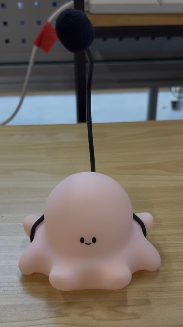
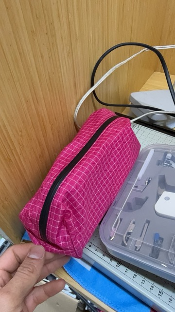

I'm [CJ](https://cjpais.com). I'm an open source developer, working on [Handy](https://handy.computer). My main curiosity coming to Shenzhen was understanding the pipeline from idea to prototype to small-scale production to manufacturing at scale—and how this process can become more accessible to people. I've made a bunch of random things over the years. Surfboards, backpacks, bike bags, garments, software, the list goes on. I was really curious about how things are made in the world especially moving up from the single person make a thing mentality.

## Highlights

- Hardware speech-to-text device (Handy Button prototype)
- First PCB explorations with Tiles
- Sewing machine revival + workshop
- Factory visits: Seeed Studio, textile factory, textile market
- Signs of Shenzhen (a collection)

---

## Projects

### Handy Button — Hardware Speech-to-Text

My main project at the residency was prototyping hardware for a 'handy button'. It would be a dedicated speech-to-text device that you could plug into any computer and have it type for you by speaking.

Basically I've found out through making Handy, software can be hard and annoying so what if you could sidestep the whole thing by putting speech-to-text into a dedicated hardware device? Essentially a voice keyboard. Plug it in, press a button, talk and it types whatever you say.

**Technically speaking this would look like:**

speak -> microphone -> speech to text model -> turn transcription into keypresses with keyboard HID output -> computer

**There basically were 2 main tasks:**
1. What hardware/software combo would provide a good user experience? What even is a good user experience?
2. What form factor would be fun and interesting?

#### Hardware/Software Exploration

For hardware there were a ton of options especially given it's Shenzen, and Taobao is great. I ended with the RK based boards as they have reasonable CPU's with NPU's for acceleration if needed. I used the RADXA boards Zero 3 with RK3566 and ROCK 4 with RK3576.

I experimented with different inference approaches:
- Offline inference
- Online inference
- Streaming inference (what I settled on)
- Sentence-by-sentence inference

I played with maybe 8-10 different speech-to-text models, overall. I have some [benchmarks](https://docs.google.com/spreadsheets/d/1nayGp_ZqYHjiOmNpQ4CQHsOX615it8hmwHWvhtrMw8I/edit?usp=sharing) as well, this was done for offline inference to get ideas of speed and how suitable simulated streaming would be.

#### Form Factor Exploration

TODO

**Form factor exploration:** I didn't want a boring desktop microphone. Found an octopus lamp on Taobao (shoutout Kelin) and turned it into the enclosure. Touch it, start talking, it shows voice activity and types for you.

**Status:** Everything works—talk to it, it types. The only remaining issue is reliable auto-start when plugged in.

**What's next:** Possibly a keyboard form factor with a dedicated push-to-talk button that does all inference on the keyboard itself, using a Compute Module attached to a PCB. And moving the keyboard input through a microcontroller instead of a full Linux machine.

TODO: Add demo videos

---

### Tiles Explorations

After talking with Jonathan about Tiles, I got interested in building small sensor modules for specific use cases. And exploring how to make my own PCB for using the tiles. I'd never touched KiCad so this was fun to learn at least a tiny bit. I look forward to finishing these tile projects sometime.

#### Microphone Recorder Wearable

We discussed a small wearable that continuously records audio and syncs to your phone for transcription later. This would be a playground for experimenting with local, offline speech processing. Basically realizing there are sometimes really amazing conversations that I wish were recorded (assuming consent), but I always forget to pull my phone out. Or you don't know it will be amazing until you're done.

#### Sensor Tile

Basically I love my Garmin watch, but I hate having to click a button to record activities. I want to do the things I love, not have to record them! I want to be present! So I want a wearable that's always recording things, so if I jump in the ocean and start paddling, it should know I'm surfing. If my location pops up at the Nanshan sports complex and my IMU looks like swimming, it should figure that out.

So this might look like using the tile methodology with multiple sensors (IMU, magnetometer, light sensor, barometer) for continuous data collection and post-processing later on. From listening to Jonathan, this seemed almost like an ideal project to me. During this time I also met Andy Kong (Chargerless), and definitely quite inspired there from doing all of this without a charger would be sick + implants!!!

---

### Sewing Machine Revival + Workshop

The makerspace had a sewing machine, but it was in pretty bad shape. I bought some supplies to fix it up—thread, needles, and all the other tools you'd need for a sewing project.

Once it was running, I led a small sewing workshop. The project: a simple zippered bag that teaches the basics—working with zippers and sewing boxed corners. A good intro for anyone who hasn't sewn before.

---

## Factory Visits

Some of the factory tours were incredible:

- **Seeed Studio** — Seeing Poetry Camera assembly was !!!
- **Textile factory** — Really fascinating, s/o Lauren for organizing
- **Textile market with Yee** — THE SILKS WERE INCREDIBLE

---

## Signs of Shenzhen

A collection of signs I liked.

---

So great to meet a wonderful group of people and learn a ton. Huge thanks to Cedric for organizing!

Here's a slightly edited transcript of the audio I used to write this: [transcript.md](transcript.md)
