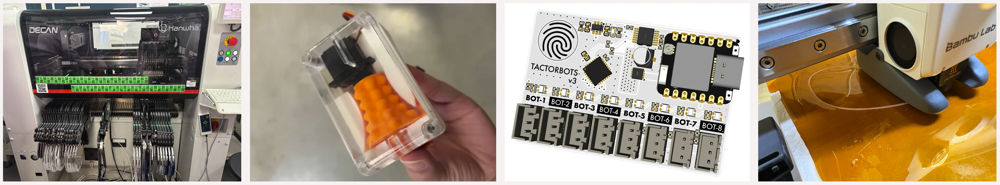
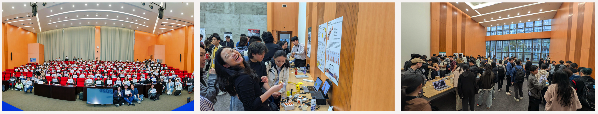
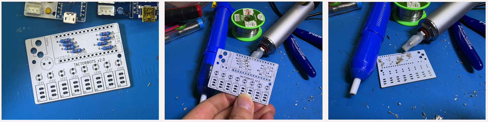

# Ran’s Shenzhen Journey

Hej! I am [Ran Zhou](https://www.ranzhourobot.com/), a designer and researcher interested in tangible interfaces, expressive haptics, design research, and human-robot interaction. I am currently a 6th-year PhD student in the [Interaction Design Team](https://www.kth.se/mid/research/interaction-design/interaction-design-1.921484) at KTH Royal Institute of Technology. 

My research focuses on developing new methodologies, tools, and theories that enable robotic touch to become an expressive design material, engaging the human body in a meaningful and respectful way. During my time in Shenzhen, I experienced firsthand how materials, tools, and services can be remarkably accessible, and how research prototypes can become high-quality research products that are scalable. 

## Highlights

- Scalable HCI 2026: demos, talks, performances, and friends
- Manufacturing visits: factories and Huaqiangbei
- From research prototype to research product: TactorBots (2021–2026)
- Material exploration: heat-sealable films
- Workshops: Art PCBs, Tiles, Sewing

## Scalable HCI

Scalable HCI has clearly become a legitimate conference! With over 200 attendees, inspiring keynotes, demos, and posters, the symposium had a strong energy throughout. I was especially happy to reconnect with friends and meet new people in such a semi-academic vibe.

## Manufacturing Visit

Visiting factories and Huaqiangbei was a unique and eye-opening experience. It was fascinating to see how injection molding and PCBs are made in practice. While I had previously seen SMT processes in videos, watching machines match, pick, and precisely place tiny components onto PCB surfaces in person was still astonishing. The equipment itself was also much more compact than I had imagined. What struck me most was the level of detail involved in every manufacturing process, particularly the rapid steps in testing and verification. This is very different from how we typically create and fabricate research prototypes.

## From Research Prototype to Research Product

Taking the opportunity of the research at scale residency, I aim to optimize my [TactorBots](https://www.ranzhourobot.com/#/tactorbots/) toolkit. TactorBots is an open-sourced haptic toolkit to empower designers to explore emotional robotic touch. It contains eight plug-and-play wearable tactor modules that render a series of social gestures in a machinery way. Our specialized web GUI allows easy control, modification, and storage of tactile patterns to support fast prototyping.

### TactorBots 1.0 - Manually fixed PCB

Although TactorBots was released as an open-source toolkit, the initial TactorBots 1.0 PCB contained several issues, including unconnected pins and incorrect pin ordering for the JST connectors. Due to time constraints, we did not make a revised PCB. Instead, we manually fixed these issues in the toolkits used for the user study. However, these problems remained in the open-source design files, which significantly hindered reproducibility for others attempting to replicate or build upon the toolkit.

### TactorBots 2.0 - White & Yellow PCB

My first task during the residency was to resolve these issues properly. With support from Seeed engineers, we corrected the PCB design errors and produced a revised board. I then ordered both the PCB and the through-hole components and soldered them myself—my first time assembling a PCB independently. In total, I built five working units.

One aspect I’m particularly proud of is the visual redesign. The PCB was produced in white, with yellow highlights, intentionally matching the color palette of the tactor modules. (Actually… the capacitor came in green, so I painted it with acrylic paint. I know it sounds a bit silly 🤣, but it mattered to me, a designer. 

During this process, I also learned a new skill: desoldering. Initially, I used a 68 kΩ resistor, which worked well with the original blue LEDs but made the new yellow LEDs appear too dim. I decided to replace them with 1 kΩ resistors, which meant desoldering 8 resistors (16 solder joints). I was not prepared for how challenging this would be. Thanks to the help from folks at Chaihuo and fellow residents, I learned how to desolder more efficiently, including using automatic vacuum desoldering tools and applying additional solder to improve heat transfer. So much tacit knowledge was embedded in it. 

### TactorBots 3.0 - Xiao Board with SMD

While sharing my progress in Shenzhen on Instagram story, the original electrical engineer, Akshay Baweja, behind TactorBots noticed my posts and jumped in to help further optimize the PCB design. This collaboration led to TactorBots 3.0. This version replaces the Arduino Name with a more miniaturized Xiao ESP32C6, which also supports Bluetooth and wifi communication. We tried to use surface-mounted devices (SMD) and added a touch sensor, allowing users to control the system directly through touch rather than relying solely on the web GUI. At the time the residency ends, the boards are still in production at Seeed Fusion. I’m very much looking forward to seeing the final result, especially since this version includes a TactorBots logo on its back!

### Product Quality Tactor Module

The original TactorBots enclosures were printed in clear PLA using FDM printing on a glass bed. During this residency, I experimented with clear resin printing for the first time, and the results were surprisingly good. This motivated me to push one example module toward true product-level quality. While visiting Huaqiangbei, I discovered a new type of magnet-based watch strap. I ordered straps in orange and white and redesigned the TactorBots case to integrate with the new belt connectors. To maximize quality, I printed the cases using 0.2 mm nozzles on a Bambu A1 Mini, using the highest-quality print settings, and carefully assembled all components. Together, these changes brought the module much closer to a polished, product-like artifact. I consider TactorBots 1.0 to be a highly complete research prototype. Through this process, however, I came to better understand the potential and the additional work required for it to evolve into a scalable research product.

## Material exploration

Another project I have been working on during the residency focused on exploring different materials for prototyping haptic HASEL (Hydraulically Amplified Soft Electrostatic) actuators. Thanks to Ellie Cai, who helped me receive a lot of packages before I arrived at the makerspace, I was able to start experimenting immediately. I explored a range of heat-sealable films, including 8 kg BOPP plastic, elastic, and non-elastic TPU films in various thicknesses.

Within the makerspace, I tried multiple fabrication approaches. These included freehand heat sealing using a soldering iron, as well as heat sealing directly with 3D printer nozzles. I experimented with the fancy Bambu H2C (Thanks, Aaron Rau!) and also with a Bambu A1 Mini, adapting it to work with materials such as Teflon film and Kapton film.

This exploration is still at an early stage, but I tried with unconventional forms, such as face masks that are worn on the ear, which showed potential for producing subtle and intriguing tactile sensations on the face. I will continue my exploration by bringing those materials and lessons back. 

## Workshops

I also attended several workshops conducted by fellow residents, where I learned different perspectives and skills:

- Darcy Neal’s Art PCB workshop was an eye-opening experience that revealed the creative possibilities of PCB design beyond engineering and functionality. It encouraged me to think of circuit boards as a design canvas

- Jonathan Fiene’s Tiles were super impressive. He managed to make a large number of sensors, drivers, and controllers into compact 4.0 × 4.0 cm modules. What surprised me the most was that he created magnetic housings that allow the tiles to be easily swapped for rapid testing. I took an IMU tile with me and plan to continue exploring it within my own projects.

- I also learned an entirely new skill in CJ Pais’s sewing workshop. With his patient guidance, I made my first zippered bag and, more importantly, learned the process well enough to repeat it independently. I even went on to make a second bag using washable paper! 

## Acknowledgements
I would like to sincerely thank Cedric Honnet for organizing such an inspiring residency and for inviting me to take part. My thanks also go to Chaihuo Makerspace for hosting us, and to Ellie Cai for taking such thoughtful care of us throughout our time working there. I am also grateful to Seeed for their technical support and for providing discounts for PCBA production. 

Finally, I would like to thank my supervisor, Madeline Balaam, for her generous support of my residency trip.
My residency was funded by the European Union (ERC, Intimate Touch, 101043637). Views and opinions expressed are however those of the author(s) only and do not necessarily reflect those of the European Union or the European Research Council. Neither the European Union nor the granting authority can be held responsible for them.

Shenzhen, I’ll definitely be back. Hopefully soon!

