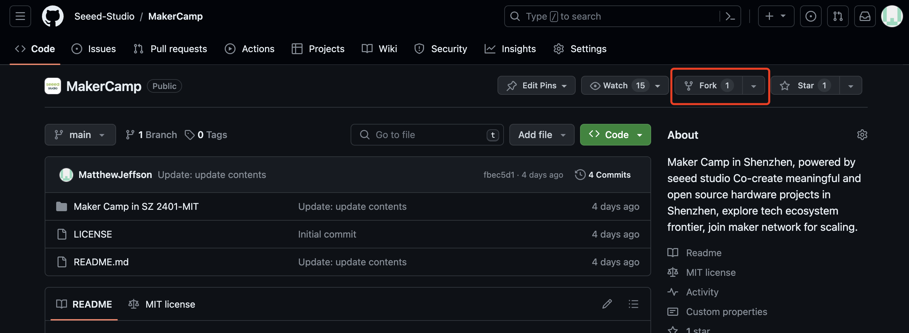
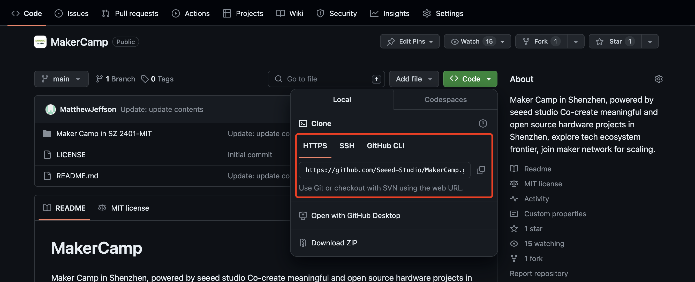
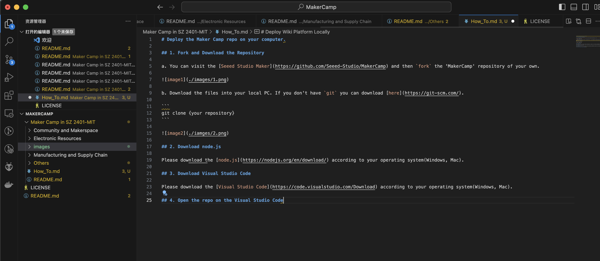
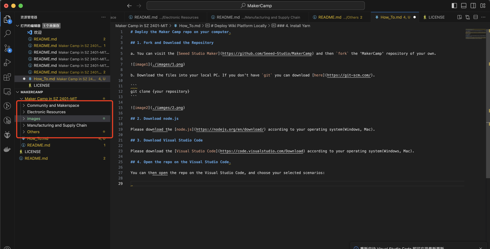
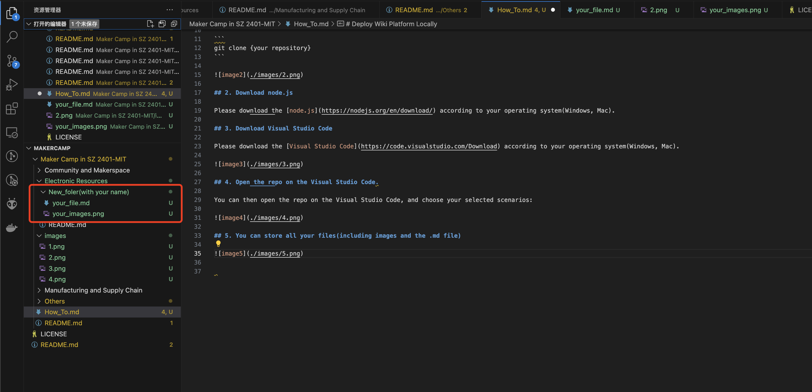
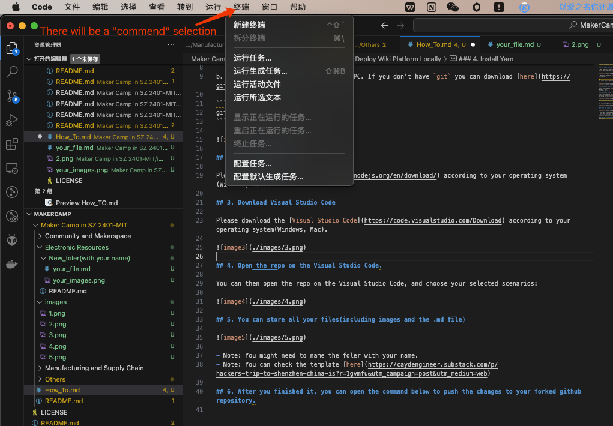

# Deploy the Maker Camp repo on your computer.

This is the file about how you can add more files to this repo. If you want to see the example of the paper you can check [here](./Paper_Example.md).

## 1. Fork and Download the Repository

a. You can visit the [Seeed Studio Maker Camp](https://github.com/Seeed-Studio/MakerCamp) and then `fork` the 'MakerCamp' repository of your own.



b. Download the files into your local PC. If you don't have `git` you can download [here](https://git-scm.com/).

```
git clone {your repository}
```



## 2. Download node.js

Please download the [node.js](https://nodejs.org/en/download/) according to your operating system(Windows, Mac).

## 3. Download Visual Studio Code

Please download the [Visual Studio Code](https://code.visualstudio.com/Download) according to your operating system(Windows, Mac).



## 4. Open the repo on the Visual Studio Code.

You can then open the repo on the Visual Studio Code, and choose your selected scenarios:



## 5. You can store all your files(including images and the .md file)



- Note: You might need to name the foler with your name.
- Note: You can check the template [here](https://caydengineer.substack.com/p/hackers-trip-to-shenzhen-china-is?r=1gvmfu&utm_campaign=post&utm_medium=web)

## 6. After you finished it, you can open the command below to push the changes to your forked github repository.



You can execute the command one by one blow:

```
git add "the files that you changed"
git commit -m "Update：I have updated ..."
git push
```

## 7. Pull request to the Seeed Studio Repository

Once you have pushed the changes to your github repository, there is a column showing up automatically. Click the "Compare & Pull Request" button:


Show us what you have edited and click "creat pull request" button to us.


## Thank you for your contributions!